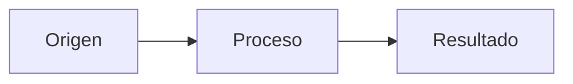

# Purpesec README Structure

## Propósito

Mantener todos los README de Purpesec Academy sobrios, densos, explicativos y consistentes. Aplicar la estructura adecuada según el tipo de documento sin convertir el repositorio en un sitio web ni introducir archivos visuales innecesarios.

Esta skill se aplica a todo el repositorio, pero la migración debe hacerse capítulo por capítulo. No modificar capítulos adicionales si el usuario pide empezar por uno concreto.

## Fuentes de verdad

Antes de editar, leer como mínimo:

1. `README.md` en la raíz.
2. `CONTRIBUTING.md`.
3. `SECURITY.md` cuando haya material ofensivo, vulnerable o sensible.
4. El README de la ruta a la que pertenece el capítulo.
5. El README que se va a modificar.
6. El README anterior y el siguiente cuando existan enlaces de navegación.
7. El README del laboratorio asociado, si existe.

Aplicar esta prioridad normativa:

1. Instrucciones explícitas más recientes del usuario.
2. `SECURITY.md`.
3. `CONTRIBUTING.md`.
4. Esta skill.
5. Convención mayoritaria del repositorio.
6. Estilo de documentos vecinos que no contradiga los puntos anteriores.

La preferencia actual de capítulos exclusivamente teóricos reemplaza las secciones pedagógicas antiguas que todavía puedan existir en otros README.

## Clasificar el README

Identificar el tipo antes de escribir:

| Tipo | Ejemplo | Función |
|---|---|---|
| Catálogo raíz | `/README.md` | Presentar las rutas, el uso responsable y la estructura general. |
| Índice de ruta | `/pentesting-web/README.md` | Ordenar capítulos, duración, nivel, estado y laboratorios. |
| Capítulo teórico | `/pentesting-web/01-*/README.md` | Explicar un tema de forma progresiva, densa y autocontenida. |
| Laboratorio | `/pentesting-web/01-*/lab/README.md` | Documentar una práctica reproducible, validable y segura. |

No aplicar la plantilla de capítulo a un índice ni la plantilla de laboratorio a una lección teórica.

## Reglas globales

- Escribir en español claro y técnico.
- Usar UTF-8, finales de línea LF y una línea final.
- Usar un solo H1 por documento.
- Nombrar carpetas en minúsculas con guiones.
- Numerar capítulos como `NN-tema`.
- Mantener títulos en español con estilo oración.
- Mantener enlaces relativos y navegación coherente.
- Definir un término la primera vez que aparece y resaltar su nombre en negrita.
- Favorecer párrafos explicativos; usar tablas solo para comparaciones reales.
- Usar bloques de código con lenguaje explícito: `http`, `bash`, `sql`, `php`, `json`, `text` o el que corresponda.
- Usar dominios reservados como `example.com`, `app.example.com` o `attacker.example`.
- Usar `127.0.0.1` para servicios locales cuando sea aplicable.
- No incluir secretos, credenciales válidas, datos personales ni objetivos de terceros.
- Marcar el código vulnerable intencional y limitarlo a un entorno controlado.
- No crear HTML, SVG, PNG, GIF ni otros recursos visuales para explicar teoría salvo petición expresa.
- Usar Mermaid como formato visual predeterminado.
- Reservar bloques `text` para árboles de carpetas, salidas de terminal y formatos literales.
- No introducir generadores documentales, dependencias o configuración adicional sin una necesidad concreta.

## Capítulos teóricos

Los README de capítulos son documentos de **teoría con ejemplos y una Cheatsheet final**.

### Estructura canónica

````markdown
# Capítulo NN: Título en estilo oración

[Inicio](../../README.md) | [Ruta](../README.md) | [Anterior: ...](../NN-tema/README.md) | [Siguiente: ...](../NN-tema/README.md)

> [!CAUTION]
> Nota de uso autorizado cuando el contenido sea ofensivo o manipulable.

## Introducción

Definición, contexto y modelo mental del tema.



---

## 1. Primer concepto

### Definición precisa

Teoría, matices y ejemplo mínimo.

---

## 2. Segundo concepto

Teoría, relaciones y ejemplo mínimo.

---

## Cheatsheet

Referencia rápida del capítulo en formato PDF: [cheatsheet.pdf](./cheatsheet.pdf).

---

[Anterior: ...](../NN-tema/README.md) | [Volver al índice](../README.md) | [Siguiente: ...](../NN-tema/README.md)
````

### Contenido permitido

- Definiciones completas y precisas.
- Modelos mentales.
- Explicaciones causales.
- Comparaciones mediante tablas.
- Ejemplos mínimos de protocolo, código o comandos.
- Advertencias técnicas y de seguridad.
- Diagramas Mermaid necesarios para entender relaciones, secuencias o flujos.
- Una única sección final `## Cheatsheet`.
- Navegación al capítulo anterior, índice de ruta y capítulo siguiente.

### Contenido prohibido

No añadir estas secciones ni equivalentes:

- Objetivos de aprendizaje.
- Qué aprenderás.
- Preguntas de reflexión.
- Cuestionario previo o final.
- Autoevaluación.
- Quiz.
- Reto o challenge.
- Ejercicios o actividades dirigidas al estudiante.
- Assignment.
- Entrega o evidencias requeridas.
- Repaso y autoestudio.
- Checklist de finalización.
- Respuestas esperadas de evaluación.
- Línea de metadatos (`Nivel`, `Duración`, `Prerrequisitos`) dentro del capítulo: esos datos viven en la tabla del índice de la ruta.

Evitar preguntas dirigidas al lector. Convertirlas en afirmaciones o criterios técnicos. Los signos `?` son válidos dentro de URLs, query strings y ejemplos de protocolo.

### Densidad y ritmo

- Explicar una idea principal por sección.
- Empezar cada sección con la definición o afirmación central.
- Continuar con funcionamiento, implicaciones y ejemplo.
- Colocar el diagrama inmediatamente después del concepto que representa.
- Usar `---` entre bloques principales cuando mejore la lectura.
- No dividir el capítulo en `ampliacion.md`, `assignment.md` u otros documentos salvo petición expresa.
- No reducir contenido técnico correcto solo para acortar el README; eliminar repetición, no profundidad.
- No repetir en la Cheatsheet explicaciones largas ni introducir conceptos nuevos.

## Cheatsheet

La Cheatsheet es obligatoria en cada capítulo teórico y debe ser la última sección de contenido.

Reglas:

- La sección existe siempre, pero la referencia rápida vive en un PDF externo, no en el README.
- Escribir únicamente una frase breve y un enlace relativo al PDF del capítulo, con la convención `./cheatsheet.pdf`.
- No escribir el contenido de la cheatsheet (tablas, sintaxis o resúmenes) directamente en el README.
- No generar ni crear el PDF: lo mantiene el autor del curso.
- El PDF es un artefacto local ignorado por Git; excluir `cheatsheet.pdf` de la validación de enlaces.

Formato exacto:

```markdown
## Cheatsheet

Referencia rápida del capítulo en formato PDF: [cheatsheet.pdf](./cheatsheet.pdf).
```

## Diagramas Mermaid

### Selección del tipo

| Contenido | Tipo Mermaid |
|---|---|
| Componentes y conexiones | `flowchart LR` |
| Jerarquía o clasificación | `flowchart LR` |
| Mensajes ordenados en el tiempo (DNS, TCP, TLS, login) | `sequenceDiagram` |
| Estados y transiciones | `stateDiagram-v2` |
| Entidades y relaciones | `erDiagram` |

No usar un diagrama para listas que una tabla comunica mejor.

### Reglas de calidad

- Los `flowchart` siempre horizontales: usar `flowchart LR`. No usar `TB`, `TD` ni `BT`, porque apilan los recuadros en vertical y ocupan toda la hoja.
- No dejar abanicos densos: un nodo con más de 4 ramas se simplifica o se convierte en tabla.
- Preferir entre 3 y 9 nodos; dividir diagramas densos cuando pierdan legibilidad.
- Usar nombres cortos y concretos.
- Mantener una dirección de lectura consistente.
- Mostrar respuestas o retornos cuando sean relevantes para el flujo.
- Usar `sequenceDiagram` para DNS, TCP, TLS, autenticación y otras interacciones temporales.
- Usar subgraphs solo cuando representen límites reales, como cliente y servidor.
- No conectar componentes si la relación no se explica en el texto.
- No añadir colores, `classDef`, temas personalizados ni directivas visuales por defecto; conservar el render sobrio de GitHub.
- Evitar caracteres especiales ambiguos en etiquetas. Escribir `HTTP / HTTPS`, no `HTTP(S)` sin comillas.
- Si una etiqueta necesita paréntesis u otros caracteres especiales, simplificarla o encerrarla entre comillas según la sintaxis Mermaid vigente.
- No sustituir Mermaid por capturas, SVG o PNG.
- No usar diagramas ASCII para arquitecturas, secuencias, estados o flujos; `text` solo es válido para árboles, salidas y formatos literales.

### Validación obligatoria

No asumir que un bloque Mermaid es válido porque parece correcto. Renderizar el README completo con Mermaid CLI en un directorio temporal fuera del repositorio:

```powershell
npx -y @mermaid-js/mermaid-cli `
  -i "ruta/al/README.md" `
  -o "$env:TEMP/readme-rendered.md" `
  -b transparent `
  --quiet
```

Si falta el navegador headless:

```powershell
npx -y puppeteer browsers install chrome-headless-shell
```

Después del render:

1. Confirmar que el comando termina sin errores de parseo.
2. Contar que se renderizaron todos los bloques Mermaid.
3. Revisar las etiquetas generadas en los SVG temporales.
4. Confirmar que actores, nodos, flechas y retornos coinciden con el texto.
5. Corregir relaciones ambiguas o técnicamente falsas aunque el parser las acepte.
6. No copiar al repositorio los SVG, PNG o Markdown generados por la validación.

## Índices de ruta

Un índice de ruta debe contener:

1. H1 con el nombre de la ruta.
2. Descripción breve del alcance.
3. Requisitos o entorno general cuando sean compartidos.
4. Tabla de capítulos con número, enlace, descripción, duración, nivel, práctica y estado.
5. Secuencia de estudio o dependencias cuando aporten claridad.
6. Enlaces a laboratorios existentes.
7. Referencias de uso responsable aplicables a toda la ruta.

No duplicar dentro del índice la teoría completa de los capítulos.

Al cambiar el título, duración, laboratorio o alcance de un capítulo, actualizar su fila en el índice de ruta y los enlaces anterior/siguiente adyacentes.

## README raíz

El README raíz debe funcionar como catálogo y punto de entrada:

- Presentar Purpesec Academy y su propósito.
- Enumerar rutas y estado.
- Explicar la estructura del repositorio.
- Enlazar `setup/`, `resources/`, `CONTRIBUTING.md` y `SECURITY.md` cuando corresponda.
- Mantener una guía breve de navegación y uso responsable.

No convertir el README raíz en una lección teórica ni duplicar los índices de las rutas.

## Laboratorios

Los laboratorios son documentos operativos y pueden contener:

1. H1 y navegación al capítulo y a la ruta.
2. Advertencia de aislamiento y autorización.
3. Alcance técnico.
4. Requisitos y versiones.
5. Topología Mermaid cuando sea necesaria.
6. Preparación reproducible.
7. Pasos numerados.
8. Comandos copiables.
9. Resultados esperados observables.
10. Validación técnica y limpieza del entorno.

No usar lenguaje de quiz, reto, assignment o entrega. La validación del laboratorio describe señales técnicas de éxito, no una evaluación pedagógica.

Mantener archivos de apoyo dentro de `lab/`. No duplicar código completo dentro del README si ya existe como archivo.

## Flujo de trabajo

1. Clasificar el README.
2. Leer las fuentes de verdad y documentos adyacentes.
3. Inventariar contenido correcto, duplicado, obsoleto y faltante.
4. Preservar la profundidad técnica correcta.
5. Reordenar el contenido con la plantilla correspondiente.
6. Sustituir recursos visuales nuevos por Mermaid cuando sea posible.
7. Actualizar índices y navegación afectados.
8. Validar enlaces locales.
9. Validar un H1, fences balanceados y ausencia de espacios finales.
10. Renderizar todos los Mermaid.
11. Revisar `git diff --check` y el diff completo.
12. Informar archivos modificados, validaciones ejecutadas y limitaciones reales.

## Comprobaciones finales

Para capítulos teóricos, verificar:

- Un solo H1.
- Número del H1 coincidente con la carpeta `NN-`.
- Navegación válida.
- Introducción seguida de teoría numerada.
- Definiciones y ejemplos suficientes.
- Una única sección `## Cheatsheet` al final que enlace a `./cheatsheet.pdf` y no incluya la referencia inline.
- Ausencia de objetivos, preguntas pedagógicas, cuestionarios, retos, autoestudio y entrega.
- Ninguna imagen nueva.
- Los `flowchart` son horizontales (`LR`) y ningún diagrama es un abanico denso.
- Todos los Mermaid renderizados sin errores.
- Enlaces relativos existentes.
- `git diff --check` sin incidencias.

No declarar el trabajo terminado si un Mermaid no se ha renderizado realmente.
