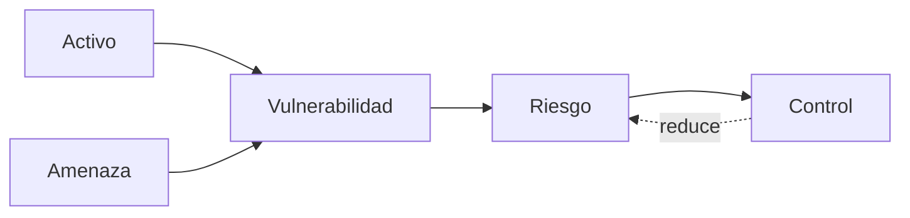
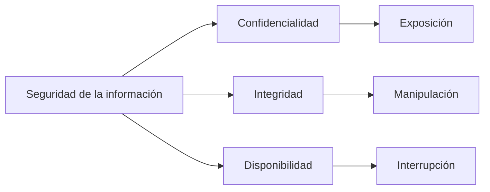
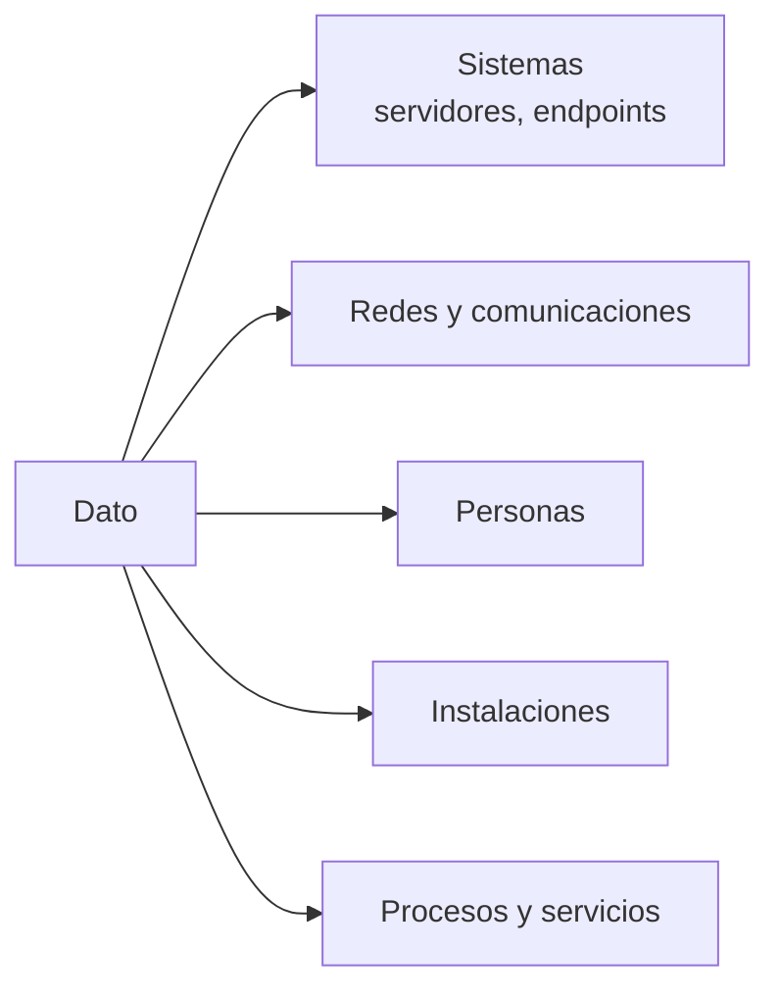
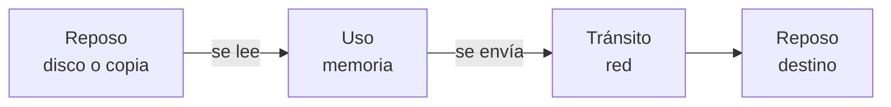
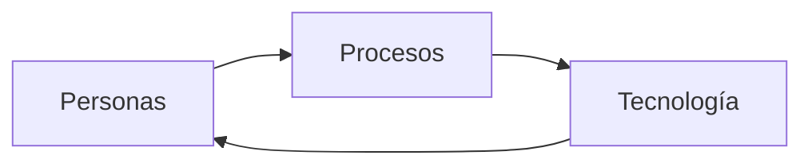
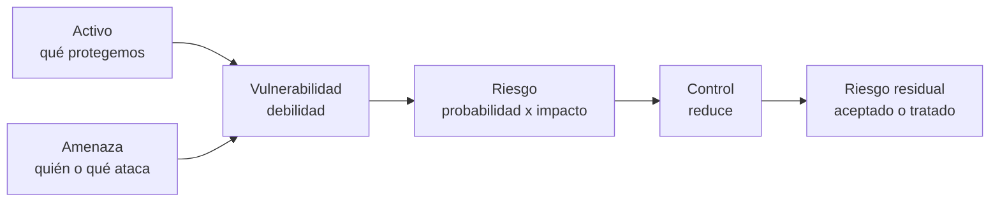
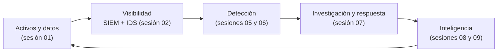

# Sesión 01: Fundamentos de ciberseguridad y riesgo

[Inicio](../../README.md) | [CyberSOC](../README.md) | [Siguiente: Arquitectura SOC y Threat Intelligence](../02-arquitectura-soc/README.md)

> [!CAUTION]
> Este material es educativo. La clasificación y el tratamiento de datos del laboratorio se practican sobre datos sintéticos en un directorio aislado; no uses información personal real ni sistemas de terceros.

## Introducción

La ciberseguridad no es un producto que se instala, sino un **proceso continuo** para proteger información y los sistemas que la tratan. Antes de desplegar un SIEM, una regla de detección o un feed de inteligencia conviene responder tres preguntas:

- ¿Qué protegemos? Son los **activos** y, sobre todo, los **datos** que contienen.
- ¿De qué los protegemos? Son las **amenazas** que aprovechan **vulnerabilidades**.
- ¿Cómo lo hacemos? Con **controles** que reducen el **riesgo** a un nivel aceptable.

Un SOC existe precisamente porque ningún control es perfecto: siempre hay riesgo residual que debe **detectarse, investigarse y responderse**.

> **Idea central:** proteger es gestionar riesgo, y gestionar riesgo empieza por saber qué datos tienes y cuánto valen.

---

## 1. La ciberseguridad como proceso continuo

La seguridad de la información busca preservar tres propiedades de los datos y de los sistemas que los procesan. Estas propiedades se conocen como la **tríada CIA** (por *Confidentiality, Integrity, Availability*):

| Propiedad | Significado | Pregunta que responde |
|---|---|---|
| **Confidencialidad** | Solo accede quien está autorizado. | ¿Quién puede verlo? |
| **Integridad** | El dato es exacto y no fue alterado de forma no autorizada. | ¿Sigue siendo correcto y completo? |
| **Disponibilidad** | El dato y el servicio están accesibles cuando se necesitan. | ¿Podemos usarlo cuando toca? |

La tríada se rompe de tres formas básicas: exposición (confidencialidad), manipulación (integridad) y destrucción o denegación (disponibilidad).

Seguridad no es lo mismo que **cumplimiento**. Una organización puede cumplir una norma y seguir siendo vulnerable; el cumplimiento es un medio, no el objetivo.

---

## 2. Identidad y datos personales

Una **identidad** es el conjunto de atributos que distinguen a una persona. Cuando esos atributos permiten identificarla, directa o indirectamente, se convierten en **datos personales**.

Los datos personales tienen valor propio y, además, habilitan ataques: permiten suplantar, extorsionar, dirigir fraude o escalar accesos. Por eso se clasifican con especial cuidado.

| Categoría | Ejemplos (sintéticos) | Sensibilidad |
|---|---|---|
| Identificadores directos | Nombre completo, número de documento. | Alta |
| Contacto | Correo, teléfono, dirección. | Media |
| Financieros | Número de tarjeta, cuenta bancaria. | Muy alta |
| Autenticación | Contraseñas, tokens, claves. | Crítica |
| Categorías especiales | Salud, biometría, origen, creencias. | Muy alta |

> [!IMPORTANT]
> El **principio de minimización** indica recolectar y conservar solo los datos necesarios para un fin legítimo. Un dato que no existe no puede filtrarse.

Un concepto clave para un SOC es la **autenticación** (verificar la identidad) frente a la **autorización** (decidir qué puede hacer esa identidad). Son controles distintos y su confusión es el origen de muchas brechas.

---

## 3. Datos y activos organizacionales

Un **activo** es cualquier elemento que la organización valora y debe proteger. El dato suele ser el activo más importante, pero se apoya en otros activos físicos y lógicos.

No todos los activos valen lo mismo. La **clasificación** asigna un nivel de sensibilidad para decidir qué controles aplican:

| Nivel | Criterio | Controles típicos |
|---|---|---|
| Público | Divulgación autorizada y sin impacto. | Integridad y disponibilidad básicas. |
| Interno | Uso limitado a la organización. | Control de acceso por rol. |
| Confidencial | Daño si se expone. | Cifrado, registro de accesos, mínimo privilegio. |
| Restringido | Impacto grave legal o financiero. | Cifrado fuerte, segmentación, auditoría estricta. |

Clasificar bien permite invertir donde el impacto es mayor, en lugar de repartir esfuerzo sin criterio.

---

## 4. Los tres estados de los datos

La misma información presenta riesgos distintos según su **estado**, y cada estado exige controles propios:

| Estado | Descripción | Ejemplo | Control principal |
|---|---|---|---|
| **En reposo** | Almacenado. | Base de datos, disco, copia de seguridad. | Cifrado, permisos, respaldo. |
| **En tránsito** | Viajando entre sistemas. | HTTPS, API, sincronización. | Cifrado en canal, autenticación mutua. |
| **En uso** | Mientras se procesa. | Datos cargados en memoria. | Aislamiento, control de procesos, mínimo privilegio. |

**Cifrado** (protege el contenido con una clave) y **codificación** (cambia la representación sin clave) no son equivalentes. Un valor en Base64 sigue siendo legible para quien lo intercepte.

---

## 5. Personas, procesos y tecnología

La seguridad se sostiene en tres pilares que deben estar alineados:

| Pilar | Aporta | Falla cuando |
|---|---|---|
| Personas | Criterio, decisiones y responsabilidad. | Hay falta de formación, exceso de privilegios o errores. |
| Procesos | Consistencia y repetibilidad. | No existen, no se documentan o se ignoran. |
| Tecnología | Escala, automatización y evidencia. | Se despliega sin proceso ni personal que la opere. |

Un SOC es un ejemplo directo de este equilibrio: las **herramientas** generan telemetría, los **procesos** definen qué hacer con ella y las **personas** deciden e investigan. La tecnología sin proceso produce ruido; el proceso sin tecnología no escala.

---

## 6. Amenazas, vulnerabilidades y riesgo

Estos términos se usan a diario y se confunden con facilidad. Conviene precisarlos:

- **Amenaza:** agente o evento con potencial de causar daño. Puede ser natural, accidental o intencionada.
- **Vulnerabilidad:** debilidad que una amenaza puede aprovechar.
- **Riesgo:** probabilidad de que una amenaza explote una vulnerabilidad, ponderada por el impacto.
- **Control (o mitigación):** medida que reduce la probabilidad o el impacto.
- **Riesgo residual:** el que queda después de aplicar controles; nunca es cero.

El riesgo se gestiona con cuatro estrategias: **mitigar** (aplicar controles), **transferir** (seguros o terceros), **evitar** (eliminar la actividad) o **aceptar** (asumir el riesgo residual). Un analista de SOC trabaja sobre todo en la fase de **tratar y verificar** que las decisiones de riesgo se cumplen en la realidad.

### El valor de la evidencia

La detección y la respuesta dependen de la **evidencia**: registros, eventos y artefactos que permiten reconstruir qué ocurrió. Aplicado al modelo anterior, un evento es la huella observable de una amenaza interactuando con una vulnerabilidad.

| Concepto | Enfoque | Ejemplo |
|---|---|---|
| Evento | Hecho puntual registrado. | Un intento de acceso fallido. |
| Alerta | Evento que supera un criterio de detección. | Varios fallos seguidos desde una IP. |
| Incidente | Alerta confirmada con impacto. | Acceso no autorizado consumado. |

---

## 7. Puente hacia la función del SOC

Con los conceptos anteriores ya es posible describir qué hace un SOC y por qué importa:

El SOC recorre este ciclo sin descanso: conoce los activos, construye visibilidad, detecta desviaciones, investiga y responde, y alimenta ese conocimiento con inteligencia de amenazas para priorizar mejor la siguiente vuelta.

La próxima sesión traduce estos fundamentos en una **arquitectura concreta**: un SIEM con Wazuh, un IDS con Suricata y un mecanismo de enriquecimiento con Threat Intelligence.

---

## Cheatsheet

Referencia rápida del capítulo en formato PDF: [cheatsheet.pdf](./cheatsheet.pdf).

---

[Volver al índice de CyberSOC](../README.md) | [Siguiente: Arquitectura SOC y Threat Intelligence](../02-arquitectura-soc/README.md)
