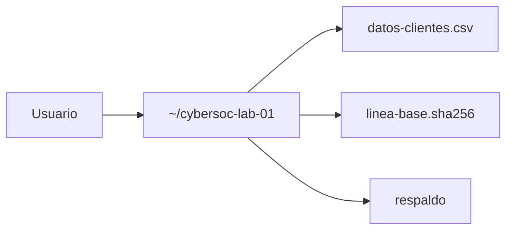

# Laboratorio: clasificación de activos y validación de la tríada CIA

[Capítulo 01](../README.md) | [CyberSOC](../../README.md)

> [!CAUTION]
> Este laboratorio es local y educativo. Trabaja sobre una copia en un directorio aislado y no uses datos personales reales. El archivo `datos-clientes.csv` contiene únicamente valores sintéticos.

## Alcance

El objetivo es relacionar los conceptos de **activo, dato, clasificación y tríada CIA** con operaciones concretas del sistema de archivos. Practicarás:

- Identificar un activo y clasificar su contenido por sensibilidad.
- Aplicar permisos restrictivos como control de **confidencialidad**.
- Establecer una línea base de **integridad** mediante un hash.
- Detectar una alteración comparando hashes.
- Crear y restaurar un respaldo como control de **disponibilidad**.
- Traducir cada paso a un escenario de riesgo con amenaza, vulnerabilidad y control.

No se estudian aquí despliegues de SIEM ni detección de tráfico; eso comienza en la sesión 02.

## Requisitos

- Un sistema Linux con herramientas básicas de línea de comandos.
- `sha256sum`, `chmod`, `ls`, `sed` y `cp` disponibles.
- Permisos de escritura en tu directorio de usuario.

## Topología



## 1. Preparar el directorio aislado

Crea un directorio de trabajo dedicado y copia dentro el activo del laboratorio:

```bash
mkdir -p ~/cybersoc-lab-01
cp datos-clientes.csv ~/cybersoc-lab-01/
cd ~/cybersoc-lab-01
```

Resultado esperado:

```text
(entras en el directorio y no aparece ningún error)
```

## 2. Identificar el activo y su clasificación

Observa el contenido del activo:

```bash
ls -l
cat datos-clientes.csv
```

Identifica en el archivo los campos que corresponden a datos personales y financieros. Clasifica el activo como **Confidencial** o **Restringido** según la tabla de la sesión 01, y anota junto a cada campo por qué eleva la sensibilidad.

El activo principal no es el archivo en sí, sino la **información** que contiene. El archivo es el soporte; el dato es lo que se protege.

## 3. Controlar la confidencialidad con permisos

Restringe el acceso para que solo el propietario pueda leer y escribir:

```bash
chmod 600 datos-clientes.csv
ls -l datos-clientes.csv
```

Resultado esperado, con permisos `-rw-------`:

```text
-rw------- 1 usuario usuario ... datos-clientes.csv
```

Ese `600` significa que el grupo y el resto de usuarios no tienen ningún permiso. Es un control de **mínimo privilegio** aplicado al dato en reposo.

## 4. Establecer la línea base de integridad

Calcula el hash del activo original y guárdalo como referencia:

```bash
sha256sum datos-clientes.csv | tee linea-base.sha256
```

Resultado esperado: una línea con el hash SHA-256 seguido del nombre del archivo. Ese hash representa el estado correcto e íntegro del activo.

## 5. Crear un respaldo del activo

Antes de modificar nada, conserva una copia que permita recuperar el estado bueno:

```bash
cp -p datos-clientes.csv respaldo-datos-clientes.csv
ls -l
```

Resultado esperado: aparecen `datos-clientes.csv` y `respaldo-datos-clientes.csv` con los mismos permisos. El respaldo es el control de **disponibilidad**.

## 6. Provocar una modificación controlada

Simula una alteración no autorizada cambiando un valor del activo:

```bash
sed -i 's/Cliente Demo 03/Cliente Demo XXX/' datos-clientes.csv
```

Comprueba el cambio:

```bash
grep "Demo XXX" datos-clientes.csv
```

Resultado esperado: la fila 1003 ahora muestra `Cliente Demo XXX`.

## 7. Detectar la alteración por integridad

Vuelve a comprobar el hash contra la línea base:

```bash
sha256sum -c linea-base.sha256
```

Resultado esperado:

```text
datos-clientes.csv: FAILED
sha256sum: WARNING: 1 computed checksum did NOT match
```

La verificación falla porque el contenido cambió. Este es el principio de la **detección de integridad**: comparar el estado actual con un estado de referencia confiable.

## 8. Restaurar desde el respaldo

Recupera el activo desde la copia y vuelve a validar:

```bash
cp -p respaldo-datos-clientes.csv datos-clientes.csv
sha256sum -c linea-base.sha256
```

Resultado esperado:

```text
datos-clientes.csv: OK
```

La coincidencia confirma que el activo volvió a su estado íntegro y está disponible de nuevo.

## 9. Traducir el ejercicio a un modelo de riesgo

Relaciona cada paso con los elementos del modelo de riesgo de la sesión 01:

| Elemento | En este laboratorio |
|---|---|
| Activo | `datos-clientes.csv` y su información personal y financiera |
| Amenaza | Alteración o sustracción por un usuario no autorizado |
| Vulnerabilidad | Permisos amplios y ausencia de verificación de integridad |
| Impacto | Datos personales expuestos o manipulados |
| Control | `chmod 600`, hash SHA-256 y respaldo verificado |

El riesgo no desaparece: se **reduce**. Ese riesgo restante es el que un SOC intenta detectar y responder.

## Validación final

Comprueba que puedes explicar y reproducir cada control:

- [ ] El activo quedó restringido a `-rw-------` con `chmod 600`.
- [ ] `sha256sum -c linea-base.sha256` falla tras la modificación.
- [ ] `sha256sum -c linea-base.sha256` devuelve `OK` tras restaurar.
- [ ] Existe un respaldo que permitió recuperar el estado íntegro.
- [ ] Puedes nombrar amenaza, vulnerabilidad, impacto y control del ejercicio.

## Limpieza del entorno

Elimina el directorio de trabajo al terminar:

```bash
rm -rf ~/cybersoc-lab-01
```

Confirma que ya no existe:

```bash
ls ~/cybersoc-lab-01
```

Resultado esperado: un mensaje de directorio inexistente.
