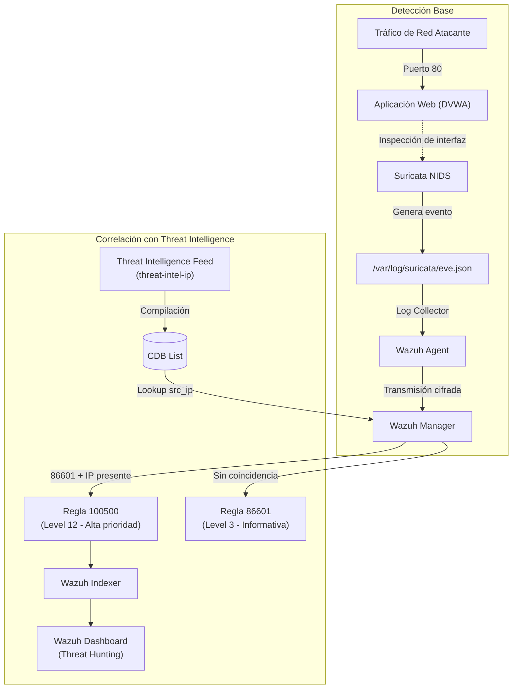

# Sesión 02: Arquitectura SOC y Threat Intelligence con Wazuh CDB Lists

[Inicio](../../README.md) | [CyberSOC](../README.md) | [Anterior: Fundamentos de ciberseguridad y riesgo](../01-fundamentos-ciberseguridad-y-riesgo/README.md) | [Laboratorio Completo](./lab/)

---

## Objetivo

Construir una arquitectura SOC de laboratorio con **Wazuh** como plataforma SIEM/XDR y **Suricata** como IDS de red, validar el recorrido completo de telemetría de eventos EVE JSON y enriquecer las alertas de red mediante feeds locales de **Threat Intelligence** utilizando listas CDB en Wazuh para correlacionar y priorizar IOCs maliciosos.

---

## Resultados de aprendizaje

Al finalizar este capítulo podrás:

- Identificar y desplegar los roles de Wazuh Manager, Indexer, Dashboard y Agent en entornos contenerizados y hosts.
- Explicar cómo Suricata inspecciona interfaces de red y transforma tráfico HTTP en eventos estructurados `eve.json`.
- Configurar el módulo `localfile` del agente de Wazuh para la recolección e ingesta de logs en formato JSON.
- Definir Requerimientos Prioritarios de Inteligencia (PIR) y modelar feeds de indicadores de compromiso (IOCs).
- Crear y registrar una sola lista **CDB (Constant Database)** de IOC maliciosos simulados y comprobar su compilación automática.
- Diseñar una única regla personalizada `100500` de nivel 12, encadenada a `86601`, que consulta `src_ip` con `address_match_key`.
- Validar la lógica de decodificación y filtrado con `wazuh-logtest` antes de procesar eventos reales.
- Investigar y filtrar alertas enriquecidas en **Wazuh Dashboard (Threat Hunting)**.

---

## Fundamentos Técnicos

Un Security Operations Center (SOC) no se limita a recibir alertas aisladas; su valor reside en **contextualizar, enriquecer y priorizar** la telemetría para responder oportunamente ante amenazas reales.

### De la detección a la inteligencia de amenazas
1. **Detección de red (Suricata)**: La firma `1000001` detecta una petición HTTP a `/login.php`. Wazuh reconoce ese evento mediante la regla integrada `86601`, de nivel 3 en esta práctica.
2. **Correlación con Threat Intelligence (Wazuh CDB)**: Si el mismo evento cumple `86601` y `src_ip` está en `threat-intel-ip`, la regla custom `100500` genera una **alerta de alta prioridad (nivel 12)**. La etiqueta `PurpleWolf-C2-high` es contexto educativo: no determina la severidad ni se añade automáticamente a la alerta. Una coincidencia no demuestra un incidente ni una campaña real.

---

## Arquitectura del Laboratorio

| Equipo | Dirección / Subred | Componentes desplegados |
|---|---:|---|
| **VM 1: CyberSOC** | `192.168.56.10` | Wazuh Manager, Indexer y Dashboard (Docker single-node) |
| **VM 2: CyberRange** | `192.168.56.20` | Wazuh Agent, Suricata (host), DVWA (`172.30.0.10`) y Atacante (`172.30.0.20`) |

---

## Laboratorio Práctico

El laboratorio se divide en dos fases secuenciales complementarias:

👉 [**Abrir la guía completa del laboratorio**](./lab/README.md)

1. [**Parte 1: Despliegue de la Infraestructura y Regla Base (Pasos 0 a 13)**](./lab/README.md#0-configuración-rápida-de-ips):
   - Conectividad de red en red aislada Host-Only.
   - Despliegue de Wazuh en VM 1 mediante Docker Compose.
   - Despliegue del CyberRange (DVWA + Attacker) en VM 2.
   - Instalación y configuración de Suricata y del agente de Wazuh.
   - Verificación del pipeline base: `Attacker -> DVWA -> Suricata -> eve.json -> Agent -> Manager -> Dashboard`.
2. [**Parte 2: Threat Intelligence con Wazuh CDB Lists (Pasos 14 a 60)**](./lab/README.md#parte-2-threat-intelligence-con-wazuh-cdb-lists):
   - Definición del PIR y creación del feed de IOCs en `/var/ossec/etc/lists/threat-intel-ip`.
   - Permisos y registro de la lista en `wazuh_manager.conf`.
   - Creación de la única regla TI en `cybersoc_threat_intel.xml`: `100500`, nivel 12, padre `86601` y búsqueda IP `address_match_key`.
   - Validación de lógica con `wazuh-logtest` (Phase 2 Decoding y Phase 3 Rules).
   - Generación de eventos reales, inspección de `alerts.json` y análisis forense en Wazuh Dashboard.

---

## Evidencias requeridas

- Estado de los servicios y contenedores en ambas VMs (`docker compose ps`, `agent_control -lc`).
- Registro EVE JSON local con el SID `1000001`.
- Compilación confirmada de la lista CDB (`threat-intel-ip.cdb`).
- Prueba positiva en `wazuh-logtest` con `100500` / nivel 12 y control negativo con una IP ausente que conserva `86601` / nivel 3.
- Evento nuevo `threatintel=...` presente en `eve.json` y su alerta `100500` / nivel 12 en `alerts.json`, con el mismo identificador; sin truncar el log.
- Captura de la alerta enriquecida en **Wazuh Dashboard (Threat Hunting)** filtrando por `rule.id: 100500` y `data.src_ip: 172.30.0.20`.
- Breve informe analítico explicando por qué un IOC Match no implica automáticamente un compromiso consumado y qué pasos de investigación deben seguirse.

---

## Criterio de finalización

La práctica está completa cuando puedes generar una petición HTTP controlada desde el contenedor atacante y observar cómo Wazuh la correlaciona automáticamente con la base de Threat Intelligence, elevando la severidad de nivel 3 a nivel 12 en el Dashboard.

---

[Anterior: Fundamentos de ciberseguridad y riesgo](../01-fundamentos-ciberseguridad-y-riesgo/README.md) | [Volver a CyberSOC](../README.md) | [Abrir laboratorio](./lab/README.md) | [Inicio](../../README.md)
