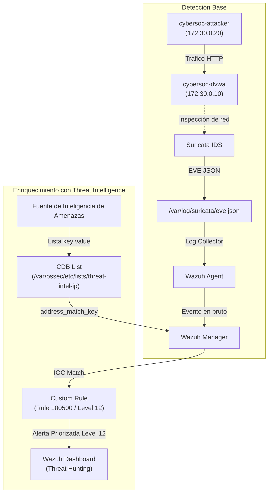
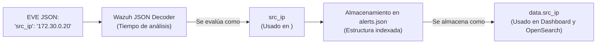
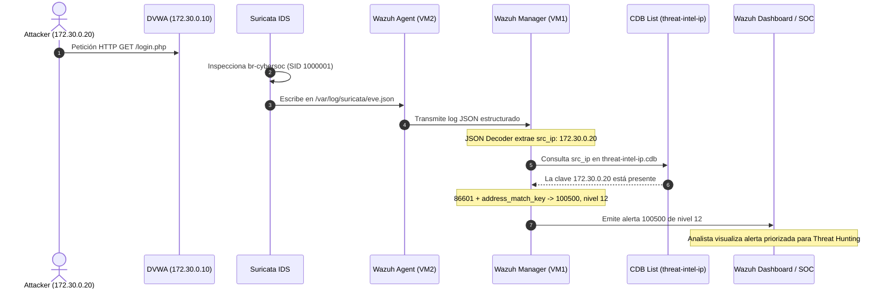

# Laboratorio CyberSOC: Detección NIDS y Threat Intelligence con Wazuh CDB Lists

[Inicio](../../../README.md) | [CyberSOC](../../README.md) | [Capítulo 02](../README.md)

> [!CAUTION]
> Uso exclusivo en un entorno de laboratorio aislado. DVWA no debe publicarse en Internet.

## Objetivo

Desplegar el flujo completo de telemetría y detección: desde una petición web controlada a DVWA e inspección por Suricata NIDS, hasta el enriquecimiento de eventos mediante listas CDB de Threat Intelligence y priorización de alertas de nivel 12 en Wazuh Dashboard.

## Arquitectura

| Equipo | Dirección | Componentes |
|---|---:|---|
| VM 1: CyberSOC | `192.168.56.10` | Wazuh Manager, Indexer y Dashboard |
| VM 2: Cyberrange | `192.168.56.20` | Wazuh Agent, Suricata, DVWA y atacante |
| DVWA | `172.30.0.10` | Aplicación vulnerable |
| Atacante | `172.30.0.20` | Generador de tráfico controlado |

Flujo:

```text
Atacante -> DVWA -> Suricata -> eve.json -> Wazuh Agent
                                                |
Dashboard <- Indexer <- Wazuh Manager <----------+
```

---
## 0. Configuración rápida de IPs

VM1:

```bash
sudo ip addr flush dev ens33 && sudo ip addr add 192.168.56.10/24 dev ens33 && sudo ip link set ens33 up
```

VM2:

```bash
sudo ip addr flush dev ens33 && sudo ip addr add 192.168.56.20/24 dev ens33 && sudo ip link set ens33 up
```

Cambia ens33 por el nombre real de tu interfaz si es distinto.


## 1. Verificación de conectividad

### VM 1

```bash
ip -br address
ping -c 4 192.168.56.20
```

### VM 2

```bash
ip -br address
ping -c 4 192.168.56.10
```

---

## 2. Instalación de Docker

Ejecutar en **VM 1 y VM 2**.

```bash
sudo apt update
sudo apt install -y ca-certificates curl
```

```bash
sudo install -m 0755 -d /etc/apt/keyrings
```

```bash
sudo curl -fsSL https://download.docker.com/linux/ubuntu/gpg \
  -o /etc/apt/keyrings/docker.asc
```

```bash
sudo chmod a+r /etc/apt/keyrings/docker.asc
```

```bash
sudo tee /etc/apt/sources.list.d/docker.sources >/dev/null <<EOF
Types: deb
URIs: https://download.docker.com/linux/ubuntu
Suites: $(. /etc/os-release && echo "${UBUNTU_CODENAME:-$VERSION_CODENAME}")
Components: stable
Architectures: $(dpkg --print-architecture)
Signed-By: /etc/apt/keyrings/docker.asc
EOF
```

```bash
sudo apt update
sudo apt install -y docker-ce docker-ce-cli containerd.io \
  docker-buildx-plugin docker-compose-plugin
```

### Verificación

```bash
sudo systemctl status docker --no-pager
sudo docker compose version
```

---

## VM 1: CyberSOC

## 3. Despliegue de Wazuh

### 3.1 Instalar Git

```bash
sudo apt update
sudo apt install -y git
```

### 3.2 Configurar el requisito de memoria del Indexer

```bash
sudo sysctl -w vm.max_map_count=262144
```

```bash
sudo tee /etc/sysctl.d/99-wazuh.conf >/dev/null <<EOF
vm.max_map_count=262144
EOF
```

### Verificación

```bash
sysctl vm.max_map_count
```

Resultado esperado:

```text
vm.max_map_count = 262144
```

### 3.3 Descargar Wazuh

```bash
cd /opt
sudo git clone https://github.com/wazuh/wazuh-docker.git -b v4.14.7
cd /opt/wazuh-docker/single-node
```

### 3.4 Generar certificados

```bash
sudo docker compose -f generate-indexer-certs.yml run --rm generator
```

### Verificación

```bash
sudo ls config/wazuh_indexer_ssl_certs
```

### 3.5 Levantar Wazuh

```bash
sudo docker compose up -d
```

### Verificación

```bash
sudo docker compose ps
```

Si algún servicio no inicia:

```bash
sudo docker compose logs --tail=100
```

### 3.6 Comprobar el Dashboard

```bash
curl -k -I https://localhost
```

Acceso:

```text
URL:        https://192.168.56.10
Usuario:    admin
Contraseña: SecretPassword
```

---

## VM 2: Cyberrange

## 4. Instalación del Wazuh Agent

### 4.1 Agregar el repositorio de Wazuh

```bash
sudo apt update
sudo apt install -y gnupg apt-transport-https curl
```

```bash
curl -s https://packages.wazuh.com/key/GPG-KEY-WAZUH \
  | sudo gpg --no-default-keyring \
  --keyring gnupg-ring:/usr/share/keyrings/wazuh.gpg --import
```

```bash
sudo chmod 644 /usr/share/keyrings/wazuh.gpg
```

```bash
echo "deb [signed-by=/usr/share/keyrings/wazuh.gpg] https://packages.wazuh.com/4.x/apt/ stable main" \
  | sudo tee /etc/apt/sources.list.d/wazuh.list
```

```bash
sudo apt update
```

### 4.2 Instalar el agente

```bash
sudo env \
  WAZUH_MANAGER="192.168.56.10" \
  WAZUH_REGISTRATION_SERVER="192.168.56.10" \
  WAZUH_AGENT_NAME="cyberrange-suricata" \
  apt-get install -y wazuh-agent
```

### 4.3 Iniciar el agente

```bash
sudo systemctl daemon-reload
sudo systemctl enable --now wazuh-agent
```

### Verificación

```bash
sudo systemctl status wazuh-agent --no-pager
```

```bash
sudo grep -E "Connected to|Unable to connect" \
  /var/ossec/logs/ossec.log | tail
```

Resultado esperado:

```text
Connected to the server
```

### 4.4 Verificar el agente desde VM 1

Ejecutar en **VM 1**:

```bash
cd /opt/wazuh-docker/single-node
```

```bash
sudo docker compose exec wazuh.manager \
  /var/ossec/bin/agent_control -lc
```

Resultado esperado:

```text
cyberrange-suricata    Active
```

---

## 5. Despliegue de DVWA y atacante

Ejecutar en **VM 2**.

### 5.1 Crear el proyecto

```bash
sudo mkdir -p /opt/cybersoc-lab
cd /opt/cybersoc-lab
```

```bash
sudo nano compose.yml
```

Contenido:

```yaml
services:
  dvwa:
    image: vulnerables/web-dvwa:latest
    container_name: cybersoc-dvwa
    restart: unless-stopped
    networks:
      lab:
        ipv4_address: 172.30.0.10
    ports:
      - "127.0.0.1:8080:80"

  attacker:
    image: curlimages/curl:latest
    container_name: cybersoc-attacker
    command: ["sleep", "infinity"]
    restart: unless-stopped
    networks:
      lab:
        ipv4_address: 172.30.0.20
    depends_on:
      - dvwa

networks:
  lab:
    name: cybersoc_lab
    driver: bridge
    driver_opts:
      com.docker.network.bridge.name: br-cybersoc
    ipam:
      config:
        - subnet: 172.30.0.0/24
```

### 5.2 Validar y levantar

```bash
sudo docker compose config
sudo docker compose up -d
```

### Verificación

```bash
sudo docker compose ps
ip link show br-cybersoc
```

### 5.3 Probar DVWA

```bash
sudo docker compose exec attacker \
  curl -I http://dvwa/login.php
```

Resultado esperado:

```text
HTTP/1.1 200 OK
```

---

## 6. Instalación de Suricata

### 6.1 Instalar Suricata

```bash
sudo apt update
sudo apt install -y software-properties-common
sudo add-apt-repository -y ppa:oisf/suricata-stable
```

```bash
sudo apt update
sudo apt install -y suricata jq
```

### Verificación

```bash
suricata --build-info
```

### 6.2 Actualizar las reglas

```bash
sudo suricata-update
```

### Verificación

```bash
sudo ls -lh /var/lib/suricata/rules/suricata.rules
```

---

## 7. Configuración de Suricata

Abrir el archivo principal:

```bash
sudo nano /etc/suricata/suricata.yaml
```

### 7.1 Configurar las variables de red

```yaml
HOME_NET: "[172.30.0.0/24]"
EXTERNAL_NET: "any"
```

### 7.2 Configurar la interfaz de captura

Localizar `af-packet` y configurar el primer bloque:

```yaml
af-packet:
  - interface: br-cybersoc
```

### 7.3 Verificar la salida EVE JSON

Modificar la sección existente, sin duplicarla:

```yaml
- eve-log:
    enabled: yes
    filetype: regular
    filename: eve.json
```

---

## 8. Regla local de Suricata

### 8.1 Crear el archivo

```bash
sudo mkdir -p /etc/suricata/rules
sudo nano /etc/suricata/rules/local.rules
```

Agregar en una sola línea:

```suricata
alert http any any -> $HOME_NET any (msg:"CYBERSOC - Acceso HTTP a DVWA"; flow:established,to_server; http.uri; content:"/login.php"; nocase; sid:1000001; rev:1;)
```

### 8.2 Cargar la regla

Abrir:

```bash
sudo nano /etc/suricata/suricata.yaml
```

Configurar la sección:

```yaml
rule-files:
  - suricata.rules
  - /etc/suricata/rules/local.rules
```

### 8.3 Validar la configuración

```bash
sudo suricata -T \
  -c /etc/suricata/suricata.yaml \
  -i br-cybersoc
```

Resultado esperado:

```text
Configuration provided was successfully loaded
```

---

## 9. Configuración del servicio Suricata

Abrir:

```bash
sudo nano /etc/default/suricata
```

Configurar:

```text
RUN=yes
IFACE=br-cybersoc
```

Iniciar el servicio:

```bash
sudo systemctl enable --now suricata
sudo systemctl restart suricata
```

### Verificación

```bash
sudo systemctl status suricata --no-pager
```

```bash
sudo tail -n 30 /var/log/suricata/suricata.log
```

---

## 10. Prueba local de Suricata

### 10.1 Generar tráfico

```bash
cd /opt/cybersoc-lab
```

```bash
sudo docker compose exec attacker \
  curl -s http://dvwa/login.php >/dev/null
```

### 10.2 Buscar la alerta

```bash
sudo jq -c \
  'select(.event_type=="alert" and .alert.signature_id==1000001)' \
  /var/log/suricata/eve.json | tail
```

Datos esperados:

```text
src_ip:       172.30.0.20
dest_ip:      172.30.0.10
signature_id: 1000001
signature:    CYBERSOC - Acceso HTTP a DVWA
```

---

## 11. Integración Suricata-Wazuh

Ejecutar en **VM 2**.

### 11.1 Configurar la recolección de EVE JSON

```bash
sudo nano /var/ossec/etc/ossec.conf
```

Agregar antes del último `</ossec_config>`:

```xml
  <localfile>
    <log_format>json</log_format>
    <location>/var/log/suricata/eve.json</location>
  </localfile>
```

### 11.2 Validar la configuración

```bash
sudo /var/ossec/bin/wazuh-agentd -t
sudo /var/ossec/bin/wazuh-logcollector -t
```

### 11.3 Reiniciar el agente

```bash
sudo systemctl restart wazuh-agent
```

### Verificación

```bash
sudo systemctl status wazuh-agent --no-pager
```

---

## 12. Prueba final

### 12.1 Generar cinco eventos desde VM 2

```bash
cd /opt/cybersoc-lab
```

```bash
for i in 1 2 3 4 5; do
  sudo docker compose exec -T attacker \
    curl -s "http://dvwa/login.php?prueba=$i" >/dev/null
done
```

### 12.2 Verificar los eventos en Suricata

```bash
sudo jq -c \
  'select(.event_type=="alert" and .alert.signature_id==1000001)' \
  /var/log/suricata/eve.json | tail -5
```

### 12.3 Verificar los eventos en Wazuh Manager

Ejecutar en **VM 1**:

```bash
cd /opt/wazuh-docker/single-node
```

```bash
sudo docker compose exec wazuh.manager sh -c \
  "grep 'CYBERSOC - Acceso HTTP a DVWA' /var/ossec/logs/alerts/alerts.json | tail"
```

### 12.4 Verificar en Wazuh Dashboard

Acceder a:

```text
https://192.168.56.10
```

Ruta:

```text
Threat intelligence > Threat Hunting
```

Consultas:

```text
rule.groups:suricata
```

```text
data.alert.signature_id:1000001
```

---

## 13. Validación intermedia (Despliegue Base)

```text
[ ] VM 1 y VM 2 tienen conectividad
[ ] Wazuh Manager está levantado
[ ] Wazuh Indexer está levantado
[ ] Wazuh Dashboard responde por HTTPS
[ ] El agente cyberrange-suricata está Active
[ ] DVWA responde desde el atacante
[ ] Existe la interfaz br-cybersoc
[ ] Suricata está active (running)
[ ] eve.json contiene el SID 1000001
[ ] Wazuh Manager recibe la alerta
[ ] La alerta aparece en Threat Hunting
```

---

## Parte 2: Threat Intelligence con Wazuh CDB Lists

Continuación directa del laboratorio Wazuh + Suricata + DVWA, con Wazuh Docker **v4.14.7**. Los comandos se ejecutan en las terminales Bash de las VMs indicadas. Instala `jq` en VM 1 (`sudo apt install -y jq`); en VM 2 ya se instaló con Suricata.

**No trunques ni borres `eve.json`**. Conserva el historial y distingue cada ejecución mediante URLs `threatintel=...` y su timestamp. Genera tráfico después de que el agente esté conectado.

## Arquitectura y Componentes de la Práctica

| Componente | Dirección / Ubicación | Rol operativo |
|---|---|---|
| **VM 1: CyberSOC** | `192.168.56.10` | Nodo central SIEM/XDR |
| **Wazuh Manager** | Contenedor Docker en VM 1 | Motor de correlación y análisis de reglas |
| **Wazuh Indexer** | Contenedor Docker en VM 1 | Indexador de eventos y almacenamiento de alertas |
| **Wazuh Dashboard** | Contenedor Docker en VM 1 | Interfaz web HTTPS de gestión y Threat Hunting |
| **VM 2: CyberRange** | `192.168.56.20` | Entorno de simulación de ataque y detección |
| **Wazuh Agent** | Host de VM 2 (`cyberrange-suricata`) | Recolector y transmisor de logs (`eve.json`) |
| **Suricata** | Host de VM 2 | NIDS inspeccionando la interfaz `br-cybersoc` |
| **DVWA** | Contenedor Docker (`172.30.0.10`) | Aplicación web víctima |
| **Attacker** | Contenedor Docker (`172.30.0.20`) | Generador de tráfico malicioso controlado |
| **IOC Principal** | `172.30.0.20` | Indicador a clasificar en la lista de Threat Intel |



---

## 14. Objetivo

Hasta el final de la Parte 1, Wazuh sabe únicamente que Suricata detectó determinada actividad HTTP:
- `src_ip = 172.30.0.20`
- `dest_ip = 172.30.0.10`

Sin embargo, el motor SIEM no posee contexto adicional ni categorización sobre esa IP de origen.

El objetivo de esta segunda fase es transformar una alerta genérica en una **alerta enriquecida y priorizada**:

```text
172.30.0.20
      ↓
Threat Intelligence (CDB List)
      ↓
PurpleWolf-C2-high  ──>  Rule 100500 (Level 12)
```

Así el equipo del SOC no recibe simplemente un evento de severidad baja (Nivel 3), sino una alerta de alta prioridad (Nivel 12) para investigar una coincidencia con un IOC del feed simulado. Esta coincidencia no atribuye por sí sola la actividad a una campaña real.

---

## 15. PIR del laboratorio (Priority Intelligence Requirement)

En operaciones de ciberseguridad, la ingesta de indicadores debe responder a un requerimiento formal de inteligencia. Definimos nuestro PIR:

> [!NOTE]
> **PIR (Priority Intelligence Requirement)**:  
> *¿Existe actividad de red asociada con indicadores previamente clasificados como maliciosos dentro del entorno CyberSOC?*

El ciclo de inteligencia se materializa en el siguiente flujo técnico:

```text
PIR ──> Collection ──> IOC ──> Processing (CDB) ──> Correlation (Wazuh) ──> Analysis ──> Decision
```

---

## 16. Verificar Suricata y Wazuh Agent en VM 2

En **VM 2 (CyberRange)**, valida que los servicios del entorno se encuentren activos:

```bash
# 1. Comprobar estado de Suricata
sudo systemctl status suricata --no-pager

# 2. Comprobar estado del agente de Wazuh
sudo systemctl status wazuh-agent --no-pager
```

Ambos servicios deben responder: `active (running)`.

Comprueba los contenedores del CyberRange:

```bash
cd /opt/cybersoc-lab
sudo docker compose ps
```

Resultado esperado: los contenedores `cybersoc-dvwa` y `cybersoc-attacker` deben estar en estado `Up`.

---

## 17. Verificar comunicación Attacker ──> DVWA

Desde **VM 2**, comprueba que el atacante pueda alcanzar la aplicación web vulnerable:

```bash
cd /opt/cybersoc-lab
sudo docker compose exec -T attacker curl -I http://dvwa/login.php
```

Resultado esperado:
```http
HTTP/1.1 200 OK
```

El flujo de red interno entre `172.30.0.20` y `172.30.0.10` está plenamente operativo.

---

## 18. Verificar que el agente esté registrado en Wazuh

En **VM 1 (CyberSOC)**, valida que el agente de VM 2 mantenga comunicación activa con el Manager:

```bash
cd /opt/wazuh-docker/single-node
sudo docker compose exec -T wazuh.manager /var/ossec/bin/agent_control -lc
```

Resultado esperado:
```text
ID: 000, Name: wazuh.manager, IP: 127.0.0.1, Active/Local
ID: 001, Name: cyberrange-suricata, IP: any, Active
```

> [!IMPORTANT]
> El agente `cyberrange-suricata` debe figurar obligatoriamente como **Active** antes de proceder.

---

## 19. Comprobar recolección de `eve.json`

En **VM 2**, verifica que la configuración del agente lea el archivo de logs de Suricata:

```bash
sudo grep -n -B3 -A5 '/var/log/suricata/eve.json' /var/ossec/etc/ossec.conf
```

Debe existir el bloque:

```xml
<localfile>
  <log_format>json</log_format>
  <location>/var/log/suricata/eve.json</location>
</localfile>
```

Valida la sintaxis del recolector:

```bash
sudo /var/ossec/bin/wazuh-logcollector -t
```

---

## 20. Generar un evento BASE de comprobación

En **VM 2**, genera una petición de línea base:

```bash
cd /opt/cybersoc-lab
sudo docker compose exec -T attacker curl -s "http://dvwa/login.php?baseline=threatintel" >/dev/null
sleep 3
```

Verifica la detección local en Suricata:

```bash
sudo jq -c 'select(.event_type=="alert" and .alert.signature_id==1000001)' /var/log/suricata/eve.json | tail -1
```

Confirmamos que `src_ip = 172.30.0.20` y `signature_id = 1000001`.

---

## 21. Verificar el evento BASE en Wazuh Manager

En **VM 1**, confirma la recepción del evento:

```bash
cd /opt/wazuh-docker/single-node
sudo docker compose exec -T wazuh.manager sh -c "grep 'baseline=threatintel' /var/ossec/logs/alerts/alerts.json | tail -1"
```

En una instalación inicial, antes de añadir TI, el resultado esperado es una alerta estándar con:
- `rule.id = 86601`
- `rule.level = 3`
- `data.src_ip = 172.30.0.20`

Si estás actualizando un laboratorio que ya tiene TI cargada, puede aparecer la regla custom anterior en lugar de `86601`; aquí comprueba la llegada y el timestamp del evento. Después aplica la versión de los pasos siguientes.

Con esto confirmamos la salud del pipeline base:
$$\text{Suricata } \checkmark \quad \longrightarrow \quad \text{eve.json } \checkmark \quad \longrightarrow \quad \text{Wazuh Agent } \checkmark \quad \longrightarrow \quad \text{Wazuh Manager } \checkmark$$

---

## 22. Crear nuestro feed de Threat Intelligence

La CDB almacena pares `clave:valor`. En este laboratorio usamos **una sola lista de IOC maliciosos simulados**:

```text
172.30.0.20:PurpleWolf-C2-high
198.51.100.25:DemoC2-high
203.0.113.44:DemoPhishing-high
```

La clave es la IP; el valor es una etiqueta descriptiva para el alumno. `172.30.0.20` corresponde al atacante del laboratorio. Las otras IP son ejemplos de documentación; no necesitas generar tráfico hacia ellas.

**La pertenencia a la lista activa la detección**. El texto `PurpleWolf-C2-high` no determina el nivel ni se incorpora automáticamente a la alerta: el nivel 12 está definido en la regla. Todas las campañas de este feed son ficticias.

---

## 23. Crear la CDB List en Wazuh Manager

En **VM 1**:

```bash
cd /opt/wazuh-docker/single-node

sudo docker compose exec -T wazuh.manager sh -c 'cat > /var/ossec/etc/lists/threat-intel-ip' <<'EOF'
172.30.0.20:PurpleWolf-C2-high
198.51.100.25:DemoC2-high
203.0.113.44:DemoPhishing-high
EOF
```

Verificar el contenido:

```bash
sudo docker compose exec -T wazuh.manager cat /var/ossec/etc/lists/threat-intel-ip
```

---

## 24. Configurar permisos de la CDB List

Garantizamos que el usuario `wazuh` dentro del contenedor pueda leer la lista y generar su archivo compilado binario (`.cdb`):

```bash
sudo docker compose exec -u 0 -T wazuh.manager sh -c '
chown wazuh:wazuh /var/ossec/etc/lists
chmod 770 /var/ossec/etc/lists

chown wazuh:wazuh /var/ossec/etc/lists/threat-intel-ip
chmod 660 /var/ossec/etc/lists/threat-intel-ip
'
```

Verificar permisos:

```bash
sudo docker compose exec -T wazuh.manager ls -ld /var/ossec/etc/lists
sudo docker compose exec -T wazuh.manager ls -l /var/ossec/etc/lists/threat-intel-ip
```

---

## 25. Verificar capacidad de escritura

```bash
sudo docker compose exec -u wazuh -T wazuh.manager sh -c \
  'touch /var/ossec/etc/lists/.write_test && echo "WRITE OK" && rm /var/ossec/etc/lists/.write_test'
```

Debe devolver: `WRITE OK`.

---

## 26. Registrar la CDB en la configuración de Wazuh

En **VM 1**, edita la configuración persistente del host, que Docker aplica al iniciar el Manager:

```bash
cd /opt/wazuh-docker/single-node
sudo cp -p config/wazuh_cluster/wazuh_manager.conf "config/wazuh_cluster/wazuh_manager.conf.bak-threat-intel-$(date +%s)"
sudo nano config/wazuh_cluster/wazuh_manager.conf
```

Dentro del bloque `<ruleset>` existente, deja **una sola entrada TI de este laboratorio**:

```xml
<list>etc/lists/threat-intel-ip</list>
```

Si ejecutaste una variante anterior, retira las entradas de las listas TI alternativas del laboratorio. Conserva las listas integradas de Wazuh y cualquier configuración ajena a esta práctica. No crees un segundo bloque `<ruleset>`.

## 27. Verificar el registro en la configuración

```bash
grep -n -B5 -A5 "threat-intel-" config/wazuh_cluster/wazuh_manager.conf
```

Comprueba que `<list>etc/lists/threat-intel-ip</list>` aparece una sola vez, dentro de `<ruleset>`. El archivo de texto de esta lista se reemplazó con los tres IOC del paso 23; una lista no registrada ni referenciada por reglas no participa en la detección.

---

## 28. Crear la única regla personalizada de Threat Intelligence

Reemplaza el archivo del laboratorio `/var/ossec/etc/rules/cybersoc_threat_intel.xml` completo con esta única regla. Si ya ejecutaste la versión anterior, guarda antes una copia fuera del directorio de reglas:

```bash
sudo docker compose exec -u 0 -T wazuh.manager sh -c '
if [ -f /var/ossec/etc/rules/cybersoc_threat_intel.xml ]; then
  cp -p /var/ossec/etc/rules/cybersoc_threat_intel.xml /var/ossec/etc/cybersoc_threat_intel.xml.bak-$(date +%s)
fi
'
```

Si copiaste las reglas TI del laboratorio a otro archivo, retira esas copias antes de cargar esta versión; conserva las reglas de otras prácticas. Las copias de seguridad deben permanecer fuera de `/var/ossec/etc/rules/`.

Contenido definitivo:

```bash
sudo docker compose exec -T wazuh.manager sh -c 'cat > /var/ossec/etc/rules/cybersoc_threat_intel.xml' <<'EOF'
<group name="threat_intelligence,">

  <rule id="100500" level="12">
    <if_sid>86601</if_sid>
    <list field="src_ip" lookup="address_match_key">etc/lists/threat-intel-ip</list>
    <description>CYBERSOC - Threat Intelligence IOC detected</description>
    <group>threat_intelligence,malicious_ioc,</group>
  </rule>

</group>
EOF
```

---

## 29. Qué hace la regla 100500

| Elemento | Función |
|---|---|
| `id="100500"` | Identifica la regla personalizada de este laboratorio. |
| `level="12"` | Fija la severidad alta de la alerta cuando se cumplen las condiciones. |
| `<if_sid>86601</if_sid>` | Exige que el mismo evento haya coincidido con la regla integrada de alertas Suricata. No es una correlación temporal entre dos eventos. |
| `field="src_ip"` | Consulta la IP de origen que extrajo el decodificador JSON. |
| `lookup="address_match_key"` | Busca esa dirección IP entre las claves de la CDB. |
| `etc/lists/threat-intel-ip` | Ruta de la única lista TI, relativa a `/var/ossec` y sin extensión `.cdb`. |
| `description` | Define el mensaje visible en la alerta. |
| `group` | Añade categorías para buscar y agrupar las alertas. |

En lenguaje humano: **si el evento coincide con 86601 y su IP origen está en la CDB, genera la alerta 100500 de nivel 12**. La CDB aporta los indicadores; la regla decide qué hacer con la coincidencia.

## 30. Resultado con y sin coincidencia

| Evento de prueba | Resultado esperado |
|---|---|
| Alerta Suricata con `src_ip=172.30.0.20`, incluida en la CDB | `100500`, nivel `12` |
| Misma alerta con `src_ip=192.0.2.15`, ausente de la CDB | Regla base `86601`, nivel `3` |
| Evento que no cumple la regla padre `86601` | No activa esta regla TI aunque contenga una IP listada |

`1000001` es el SID de la firma de Suricata; `86601` es la regla integrada de Wazuh; `100500` es nuestra regla custom. Son identificadores de funciones distintas.

---

## 31. Configurar permisos de las reglas personalizadas

```bash
sudo docker compose exec -u 0 -T wazuh.manager sh -c '
chown wazuh:wazuh /var/ossec/etc/rules/cybersoc_threat_intel.xml
chmod 660 /var/ossec/etc/rules/cybersoc_threat_intel.xml
'
```

Verificar:

```bash
sudo docker compose exec -T wazuh.manager ls -l /var/ossec/etc/rules/cybersoc_threat_intel.xml
sudo docker compose exec -T wazuh.manager cat /var/ossec/etc/rules/cybersoc_threat_intel.xml
```

---

## 32. Aplicar la nueva configuración en Docker

Dado que editamos la configuración montada del manager, recreamos la pila de contenedores:

```bash
cd /opt/wazuh-docker/single-node
sudo docker compose down
sudo docker compose up -d
```

> [!CAUTION]
> **Nunca utilices `docker compose down -v`**, ya que el parámetro `-v` destruiría los volúmenes persistentes con los certificados y la base de datos.

---

## 33. Esperar la inicialización de Wazuh

```bash
sleep 30
sudo docker compose ps
```

Verifica que los tres contenedores principales (`wazuh.manager`, `wazuh.indexer`, `wazuh.dashboard`) estén en estado `Up`.

---

## 34. Verificar `ossec.conf` efectivo en el Manager

Comprobamos que el archivo de configuración interno del contenedor haya absorbido el cambio del host:

```bash
sudo docker compose exec -T wazuh.manager grep -n "threat-intel-ip" /var/ossec/etc/ossec.conf
```

Debe mostrar: `<list>etc/lists/threat-intel-ip</list>`.

---

## 35. Verificar la compilación automática de la CDB

Al iniciar, Wazuh compila las listas de texto en formato binario `.cdb`:

```bash
sudo docker compose exec -T wazuh.manager sh -c 'ls -lah /var/ossec/etc/lists/threat-intel-ip*'
```

Debes observar tanto el archivo plano `threat-intel-ip` como su binario compilado `threat-intel-ip.cdb`.

---

## 36. Validar la configuración del motor de análisis

```bash
sudo docker compose exec -T wazuh.manager /var/ossec/bin/wazuh-analysisd -t
```

**Resultado esperado**: La salida debe finalizar limpiamente sin advertencias de listas inaccesibles ni errores de sintaxis XML.

---

## 37. Reconectar el agente de Wazuh en VM 2

En **VM 2**, reinicia el agente para restablecer la sesión tras el reinicio del Manager:

```bash
sudo systemctl restart wazuh-agent
sleep 3
sudo systemctl status wazuh-agent --no-pager
sudo grep -Ei 'connected|unable|error' /var/ossec/logs/ossec.log | tail -20
```

Confirmamos el mensaje: `Connected to the server`.

---

## 38. Verificar estado del agente desde VM 1

En **VM 1**:

```bash
cd /opt/wazuh-docker/single-node
sudo docker compose exec -T wazuh.manager /var/ossec/bin/agent_control -lc
```

El agente `cyberrange-suricata` debe figurar en estado **Active**. Su ID puede variar. Si solo aparece `000 / Active/Local`, todavía no está conectado: no avances a la prueba TI.

En VM 1, lista también los agentes desconectados:

```bash
sudo docker compose exec -T wazuh.manager /var/ossec/bin/agent_control -l
```

En VM 2, revisa el transporte y la recolección:

```bash
sudo grep -Ei 'connected|unable|error|auth|eve.json|logcollector' /var/ossec/logs/ossec.log | tail -30
sudo /var/ossec/bin/wazuh-logcollector -t
```

Corrige la conectividad o el registro según esos errores y vuelve a verificar `Active`. El estado local `active (running)` del servicio no basta para demostrar la conexión al Manager.

---

## 39. Generar tráfico de prueba para Threat Intelligence

En **VM 2**, generamos una petición con identificador específico de prueba:

```bash
cd /opt/cybersoc-lab
sudo docker compose exec -T attacker curl -s "http://dvwa/login.php?threatintel=ti-test-1" >/dev/null
sleep 2
```

---

## 40. Verificar la captura del evento en Suricata

```bash
sudo jq -c 'select(
    .event_type=="alert"
    and .alert.signature_id==1000001
    and ((.http.url // "") | contains("threatintel=ti-test"))
)' /var/log/suricata/eve.json | tail -1
```

Confirmamos que Suricata registró el evento con `src_ip: 172.30.0.20` y `url: /login.php?threatintel=ti-test-1`.

---

## 41. Generar ráfaga de 5 eventos de prueba

```bash
for i in 1 2 3 4 5; do
  sudo docker compose exec -T attacker curl -s "http://dvwa/login.php?threatintel=ti-$i" >/dev/null
done
sleep 3
```

---

## 42. Visualizar los 5 eventos en `eve.json`

```bash
sudo jq -c 'select(
    .event_type=="alert"
    and .alert.signature_id==1000001
    and ((.http.url // "") | contains("threatintel=ti-"))
)' /var/log/suricata/eve.json | tail -5
```

---

## 43. Formatear los campos clave del evento EVE

```bash
sudo jq -c 'select(
    .event_type=="alert"
    and .alert.signature_id==1000001
    and ((.http.url // "") | contains("threatintel=ti-"))
)' /var/log/suricata/eve.json | tail -1 | jq '{
    timestamp,
    src_ip,
    src_port,
    dest_ip,
    dest_port,
    signature_id: .alert.signature_id,
    signature: .alert.signature,
    severity: .alert.severity,
    url: .http.url
}'
```

---

## 44. Obtener un evento crudo para `wazuh-logtest`

Extrae una línea JSON completa:

```bash
sudo jq -c 'select(
    .event_type=="alert"
    and .alert.signature_id==1000001
    and ((.http.url // "") | contains("threatintel=ti-"))
)' /var/log/suricata/eve.json | tail -1
```

Copia la línea JSON resultante en el portapapeles.

---

## 45. Validar la correlación con `wazuh-logtest`

En **VM 1**, inicia la utilidad interactiva de depuración:

```bash
cd /opt/wazuh-docker/single-node
sudo docker compose exec -it wazuh.manager /var/ossec/bin/wazuh-logtest
```

Pega la línea JSON copiada de VM 2 y presiona Enter.

---

## 46. Analizar Phase 2 (Decoding)

Observa cómo el decodificador nativo JSON procesa el evento:
- `src_ip: '172.30.0.20'`
- `dest_ip: '172.30.0.10'`
- `event_type: 'alert'`
- `alert.signature_id: '1000001'`

Dado que el decodificador genera la variable dinámica `src_ip`, nuestra regla XML utiliza con precisión: `field="src_ip"`.

---

## 47. Analizar Phase 3 (Threat Intelligence Match)

```text
**Phase 3: Completed filtering (rules).
   id: '100500'
   level: '12'
   description: 'CYBERSOC - Threat Intelligence IOC detected'
```

El resultado esperado confirma que el evento cumplió `86601` y que `172.30.0.20` existe como clave en la CDB. La regla **100500** fija el **nivel 12**. Phase 3 muestra la regla final; no necesitas ver primero una salida separada de `86601`.

**`wazuh-logtest` prueba el decodificador y las reglas; no envía el evento por el agente ni escribe una alerta real en `alerts.json`.** La comprobación del transporte se realiza con tráfico nuevo en los pasos siguientes.

Sal de `wazuh-logtest` presionando `Ctrl + C`.

---

## 48. Generar eventos REALES para el flujo completo

Después de validar `100500` con `wazuh-logtest` y confirmar el agente `Active`, genera tráfico nuevo en **VM 2**:

```bash
cd /opt/cybersoc-lab
TI_RUN="real-$(date -u +%Y%m%dT%H%M%S)-$$"
printf 'Identificador de esta ejecución: %s\n' "$TI_RUN"
for i in 1 2 3 4 5; do
  sudo docker compose exec -T attacker \
    curl -sS "http://dvwa/login.php?threatintel=$TI_RUN-$i" >/dev/null
done
sleep 5
```

Conserva el identificador impreso. Usa el mismo valor en VM 1. Si repites la prueba, genera otro identificador; no vacíes `eve.json`.

## 49. Verificar Suricata

En la misma terminal de **VM 2**:

```bash
sudo jq -c --arg marker "threatintel=$TI_RUN-" 'select(
    .event_type=="alert"
    and .alert.signature_id==1000001
    and ((.http.url // "") | contains($marker))
)' /var/log/suricata/eve.json | tail -5
```

Deben aparecer eventos recientes de esta ejecución con `src_ip=172.30.0.20` y `dest_ip=172.30.0.10`. Si no aparecen, revisa Suricata y la generación de tráfico antes de buscar en Wazuh.

## 50. Verificar la llegada al Manager

En **VM 1**, introduce el valor de `TI_RUN` impreso en VM 2 cuando se solicite:

```bash
cd /opt/wazuh-docker/single-node
read -r -p "Pega el identificador TI_RUN de VM 2: " TI_RUN
sudo docker compose exec -T wazuh.manager \
  cat /var/ossec/logs/alerts/alerts.json \
  | jq -c --arg marker "threatintel=$TI_RUN-" 'select(
      .agent.name=="cyberrange-suricata"
      and ((.data.http.url // "") | contains($marker))
    )' | tail -5
```

Primero buscamos por agente y URL, independientemente de la regla. Si solo ves `86601` para esos eventos, el transporte funciona pero la correlación TI requiere revisión. Si ves `100500`, esa es la regla final: no se requiere una segunda alerta independiente `86601` para el mismo evento.

Si Suricata tiene el marcador nuevo pero el Manager no, vuelve al estado del agente y la recolección del paso 38. Revisa timestamps y espera la recepción antes de repetir la consulta; una alerta de otra ejecución no sirve como evidencia.

## 51. Verificar el disparo de la regla 100500

En la misma terminal de **VM 1**, conserva `TI_RUN`:

```bash
sudo docker compose exec -T wazuh.manager \
  cat /var/ossec/logs/alerts/alerts.json \
  | jq -c --arg marker "threatintel=$TI_RUN-" 'select(
      .agent.name=="cyberrange-suricata"
      and ((.data.http.url // "") | contains($marker))
      and .rule.id=="100500"
      and .rule.level==12
    )' | tail -5
```

El resultado esperado es la alerta TI de **esta ejecución**. Una salida vacía todavía no confirma el éxito: comprueba la lista efectiva, los permisos, la regla cargada y `wazuh-analysisd -t`.

## 52. Inspeccionar la última alerta de esta ejecución

```bash
sudo docker compose exec -T wazuh.manager \
  cat /var/ossec/logs/alerts/alerts.json \
  | jq -c --arg marker "threatintel=$TI_RUN-" 'select(
      .agent.name=="cyberrange-suricata"
      and ((.data.http.url // "") | contains($marker))
      and .rule.id=="100500"
      and .rule.level==12
    )' | tail -1 | jq .
```

Comprueba:

- `rule.id`: `100500`.
- `rule.level`: `12`.
- `rule.description`: `CYBERSOC - Threat Intelligence IOC detected`.
- `agent.name`: `cyberrange-suricata`.
- `data.src_ip`: `172.30.0.20`.
- `data.alert.signature_id`: `1000001`.
- `data.http.url`: contiene el identificador `threatintel=$TI_RUN-` con su valor real.
- `timestamp`: corresponde a la ejecución recién realizada.

---

## 53. Distinción técnica: `src_ip` vs. `data.src_ip`

Comprender esta diferencia es crucial para la creación de reglas y paneles:



---

## 54. Verificación en Wazuh Dashboard

1. Abre en tu navegador la URL:
   ```text
   https://192.168.56.10
   ```
2. Navega hasta:
   ```text
   Threat Intelligence  ──>  Threat Hunting
   ```
3. Ajusta el intervalo de tiempo a la ejecución reciente y comprueba `data.http.url` con el marcador utilizado.
4. Aplica los siguientes filtros de búsqueda:
   - `rule.id: 100500`
   - `rule.groups: threat_intelligence`
   - `data.src_ip: 172.30.0.20`

---

## 55. Comparativa: Alerta Base vs. Alerta Enriquecida con Threat Intel

| Dimensión | Detección Base (Suricata) | Enriquecimiento Threat Intelligence (Wazuh CDB) |
|---|---|---|
| **Regla disparada** | `86601` | **`100500`** |
| **Nivel de severidad** | `3` (Baja) | **`12` (Alta prioridad)** |
| **Descripción** | `Suricata: Alert - CYBERSOC - Acceso HTTP a DVWA` | `CYBERSOC - Threat Intelligence IOC detected` |
| **Contexto disponible** | Simple tráfico HTTP hacia el puerto 80 | IP presente en el feed educativo de IOC maliciosos |
| **Acción requerida** | Monitoreo rutinario | Priorizar investigación y contrastar otras evidencias |

> [!IMPORTANT]
> El tráfico de red no cambió. Lo que cambió fue el **contexto previo, la inteligencia de amenazas y la correlación**.

---

## 56. Control negativo: una IP ausente de la lista

En **VM 1**, abre una sesión nueva:

```bash
sudo docker compose exec -it wazuh.manager /var/ossec/bin/wazuh-logtest
```

Pega este evento simulado en una sola línea. `192.0.2.15` no pertenece al feed definido en el paso 22:

```json
{"timestamp":"2026-09-11T12:00:00.000000+0000","event_type":"alert","src_ip":"192.0.2.15","src_port":44444,"dest_ip":"172.30.0.10","dest_port":80,"proto":"TCP","alert":{"action":"allowed","gid":1,"signature_id":1000001,"rev":1,"signature":"CYBERSOC - Acceso HTTP a DVWA","category":"","severity":3}}
```

**Resultado esperado** en este laboratorio:

```text
id: '86601'
level: '3'
description: 'Suricata: Alert - CYBERSOC - Acceso HTTP a DVWA'
```

Esto comprueba que una alerta de Suricata sin coincidencia en la CDB conserva la detección base. Sal con `Ctrl+C`.

---

## 57. Diferencia conceptual: Detección vs. Threat Intelligence

```text
DETECCIÓN PURA (NIDS / Suricata):
Tráfico de red  ──>  Firma o Regla  ──>  Alerta
"¿Qué está ocurriendo técnicamente en la red?"

INTELIGENCIA DE AMENAZAS (Threat Intelligence + SIEM):
Alerta  +  IOC  +  Contexto Histórico  +  Clasificación  ──>  Priorización
"¿Qué sabemos previamente sobre el actor que está detrás de lo que observamos?"
```

---

## 58. Criterio forense: Qué NO podemos concluir a la ligera

A pesar de obtener una coincidencia de IOC y una alerta de Nivel 12:

```text
┌────────────────────────────────────────────────────────────────────────┐
│                        LÍMITES FORENSES DEL SOC                        │
├────────────────────────────────────────────────────────────────────────┤
│                 Alerta           ≠   Incidente                         │
│                 IOC Match        ≠   Compromiso confirmado             │
│                 Intento de ataque ≠   Explotación exitosa              │
└────────────────────────────────────────────────────────────────────────┘
```

La correlación confirma que la IP observada aparece en nuestra lista. En esta práctica el tráfico HTTP y la campaña son simulados. El analista debe **priorizar la investigación y buscar telemetría complementaria** antes de concluir que existe un compromiso o decidir medidas de contención.

---

## 59. Flujo completo consolidado del laboratorio



---

## 60. Validación final del laboratorio

Comprueba que se cumplan todos los requisitos de la práctica:

```text
CHECKLIST OPERATIVO DE THREAT INTELLIGENCE:
[ ] Suricata está active (running) en VM 2
[ ] Wazuh Agent está active (running) en VM 2
[ ] cyberrange-suricata figura en estado Active en agent_control
[ ] DVWA responde a peticiones HTTP desde cybersoc-attacker
[ ] El SID 1000001 se registra en eve.json
[ ] El evento de comprobación llega a alerts.json del Manager
[ ] Una sola lista threat-intel-ip contiene únicamente los tres IOC maliciosos simulados
[ ] El usuario wazuh tiene permisos de lectura y escritura en /var/ossec/etc/lists
[ ] threat-intel-ip está registrado en el bloque <ruleset> de ossec.conf
[ ] cybersoc_threat_intel.xml define únicamente la regla TI 100500 de nivel 12
[ ] wazuh-analysisd -t valida la sintaxis sin errores
[ ] wazuh-logtest confirma 100500 / nivel 12 para la IP listada
[ ] El control negativo con IP ausente conserva 86601 / nivel 3
[ ] Los eventos con threatintel=real-* se registran en Suricata
[ ] Los eventos reales llegan a alerts.json en el Manager
[ ] La misma ejecución TI_RUN aparece en alerts.json con regla 100500 y nivel 12
[ ] eve.json conserva su historial; no fue truncado ni borrado
[ ] La alerta 100500 se visualiza en el Dashboard en Threat Hunting
[ ] data.src_ip muestra 172.30.0.20 en la alerta almacenada
[ ] Se comprende la diferencia metodológica entre alerta e IOC correlacionado
```

### Entrega y conclusión práctica del laboratorio

Entrega el estado `Active` del agente, la lista y la regla aplicadas, las salidas positiva y negativa de `wazuh-logtest`, y el evento EVE junto con su alerta real en `alerts.json` usando el mismo marcador. Añade la captura de Threat Hunting y una explicación de por qué una coincidencia de IOC no prueba un compromiso.

Al completar este procedimiento, se demuestra de forma rigurosa la transformación operativa de un evento:

> *"Suricata detectó actividad HTTP desde `172.30.0.20`. Wazuh recibió el evento y consultó la dirección contra nuestra lista de Threat Intelligence. Se identificó la IP `172.30.0.20` como clave de la lista, disparando la regla 100500 con severidad 12. La alerta ha sido priorizada para iniciar una investigación de Threat Hunting."*

---

## Referencias

- [Wazuh: CDB Lists documentation](https://documentation.wazuh.com/current/user-manual/ruleset/cdb-list.html)
- [Wazuh: Pruebas de decodificadores y reglas](https://documentation.wazuh.com/current/user-manual/ruleset/testing.html)
- [Wazuh: Custom Rules and Decoders](https://documentation.wazuh.com/current/user-manual/ruleset/custom.html)
- [Suricata EVE JSON format](https://docs.suricata.io/en/latest/output/eve/eve-json-format.html)
- [MITRE ATT&CK Framework](https://attack.mitre.org/)

[Volver al capítulo](../README.md) | [Volver a CyberSOC](../../README.md) | [Inicio](../../../README.md)

