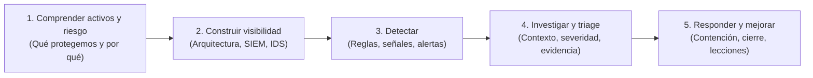
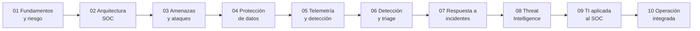

# CyberSOC: Operación de un Centro de Operaciones de Seguridad

[Inicio](../README.md) | [Configurar laboratorio](../setup/README.md)

Ruta técnica y abierta para comprender y operar los componentes de un **Security Operations Center (SOC)**: desde los fundamentos de datos y riesgo hasta la detección, investigación y respuesta ante incidentes con **Wazuh**, **Suricata** y feeds de **Threat Intelligence**.

> [!CAUTION]
> **Alcance y ética**: Todo el material apunta a laboratorios aislados y a sistemas propios o expresamente autorizados. Las técnicas de detección y de generación de tráfico controlado deben practicarse en una red host-only, nunca contra servicios de terceros.

---

## Filosofía de aprendizaje

Un SOC no es una herramienta, sino un proceso que convierte **telemetría dispersa** en **decisiones de seguridad**. Este curso avanza en el mismo sentido en que opera un analista:

Cada sesión cierra un puente con la siguiente: se estudia un concepto y se valida en un laboratorio reproducible.

---

## Roadmap de estudio

---

## Tabla de contenidos

| # | Sesión | Descripción técnica | Duración | Nivel | Laboratorio | Estado |
|---|---|---|---|---:|---|---|
| **01** | [**Fundamentos de ciberseguridad y riesgo**](./01-fundamentos-ciberseguridad-y-riesgo/README.md) | Datos y activos, tríada CIA, estados de los datos, personas-procesos-tecnología y modelo de riesgo con amenazas, vulnerabilidades y controles. | 90 min | Inicial | [Clasificación de activos y tríada CIA](./01-fundamentos-ciberseguridad-y-riesgo/lab/) | **Disponible** |
| **02** | [**Arquitectura SOC y Threat Intelligence**](./02-arquitectura-soc/README.md) | Wazuh (Manager, Indexer, Dashboard, Agent), Suricata y EVE JSON, PIR e IOCs, CDB Lists y reglas de correlación. | 120 min | Inicial - Intermedio | [Wazuh + Suricata + CDB Lists](./02-arquitectura-soc/lab/) | **Disponible** |
| **03** | **Amenazas, actores y técnicas de ataque** | Taxonomía de amenazas, motivaciones y actores, superficie de ataque, cadena de ataque y evidencia observable de cada técnica. | 90 min | Inicial | Reconocimiento de evidencias en tráfico controlado | *Planificado* |
| **04** | **Protección de datos y defensa en profundidad** | Clasificación de información, control de acceso, cifrado, endurecimiento de host y respaldo como controles complementarios. | 90 min | Inicial | Hardening básico y verificación de controles | *Planificado* |
| **05** | **Telemetría y detección de red** | Fuentes de log, normalización, EVE JSON, identificadores de flujo y diseño de firmas de red en Suricata. | 105 min | Intermedio | Análisis de EVE JSON y regla local de red | *Planificado* |
| **06** | **Ingeniería de detección y triage** | Decodificadores y reglas de Wazuh, niveles de severidad, reducción de falsos positivos y triage inicial de alertas. | 105 min | Intermedio | Reglas Wazuh y análisis de una alerta | *Planificado* |
| **07** | **Respuesta a incidentes** | Ciclo de respuesta, clasificación, alcance, línea temporal, preservación de evidencia, contención y recuperación. | 105 min | Intermedio | Línea temporal y contención en laboratorio | *Planificado* |
| **08** | **Fundamentos y ciclo de Threat Intelligence** | PIR, fuentes de inteligencia, recolección, normalización, deduplicación y evaluación de confianza de un indicador. | 90 min | Inicial | Construcción y validación de un feed de IOCs | *Planificado* |
| **09** | **Threat Intelligence aplicada al SOC** | Enriquecimiento de alertas, CDB Lists, priorización por IOC y TTP y búsquedas guiadas por hipótesis. | 105 min | Intermedio | Enriquecimiento y priorización de alertas | *Planificado* |
| **10** | **Operación CyberSOC integrada** | Caso de extremo a extremo: generación de actividad, detección, investigación, respuesta y cierre con reporte técnico. | 120 min | Avanzado | Caso integrador del SOC | *Planificado* |

---

## Prerrequisitos

- Administración básica de Linux y uso de la terminal.
- Fundamentos de TCP/IP, puertos y servicios.
- Un equipo capaz de ejecutar dos máquinas virtuales simultáneamente.

## Entorno compartido

Las sesiones 02 y posteriores reutilizan la misma arquitectura de dos VMs: una con la plataforma Wazuh y otra con el *cyberrange*. Consulta los requisitos específicos en la [guía de configuración](../setup/README.md#entornos-actuales).

| Equipo | Dirección | Componentes |
|---|---:|---|
| VM 1: CyberSOC | `192.168.56.10` | Wazuh Manager, Indexer y Dashboard |
| VM 2: CyberRange | `192.168.56.20` | Wazuh Agent, Suricata, DVWA y contenedor de pruebas |

## Cómo progresar

1. Comienza por la [sesión 01](./01-fundamentos-ciberseguridad-y-riesgo/README.md) para fijar datos, activos y riesgo.
2. Ejecuta el [laboratorio de clasificación y tríada CIA](./01-fundamentos-ciberseguridad-y-riesgo/lab/) cuando termines la teoría.
3. Continúa con la [sesión 02](./02-arquitectura-soc/README.md) y su [laboratorio de Wazuh y Suricata](./02-arquitectura-soc/lab/).
4. Avanza sesión a sesión; cada una asume la arquitectura ya desplegada en la sesión 02.

[Volver al catálogo principal](../README.md)
