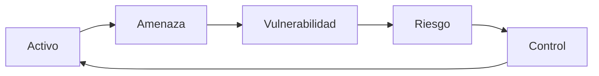
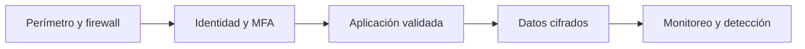
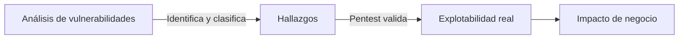
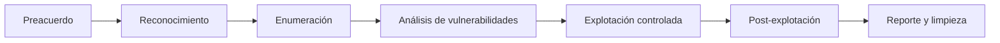
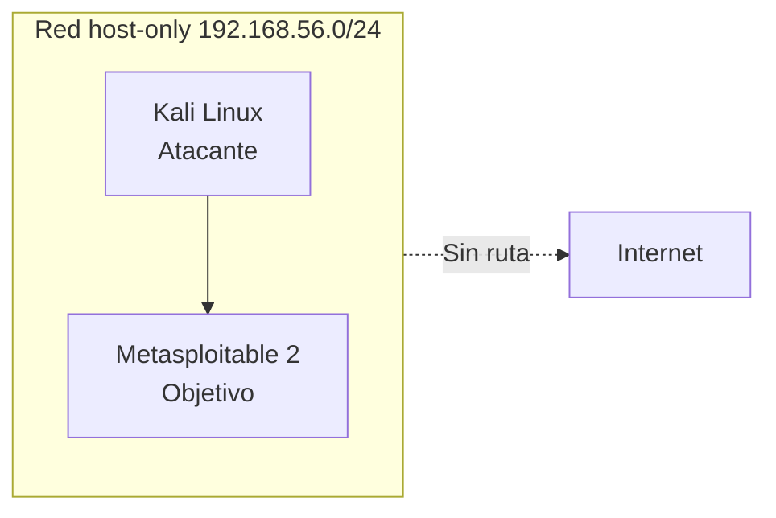

# Sesión 01: Fundamentos, ética y laboratorio

[Inicio](../../README.md) | [Ethical Hacking](../README.md) | [Siguiente: Ingeniería social y OSINT humano](../02-ingenieria-social-y-osint-humano/README.md)

> [!CAUTION]
> Este material es educativo. Todas las técnicas se practican contra sistemas propios o con autorización expresa por escrito. Probar sistemas de terceros sin permiso es ilegal, con independencia de la intención.

## Introducción

La seguridad ofensiva profesional no empieza con un exploit, sino con un acuerdo. Antes de tocar un solo paquete se define **qué** se puede evaluar, **cómo** y **hasta dónde**. Sin ese marco, la misma técnica que aporta valor en un pentest se convierte en un delito.

Esta sesión construye el modelo mental sobre el que se apoyan las cuatro siguientes:



- Un **activo** es algo con valor que debe protegerse.
- Una **amenaza** es un agente o evento capaz de causar daño.
- Una **vulnerabilidad** es una debilidad que la amenaza puede aprovechar.
- El **riesgo** combina probabilidad e impacto sobre el activo.
- Un **control** reduce riesgo y retroalimenta la protección del activo.

> **Idea central:** sin autorización no existe evaluación de seguridad; existe intrusión.

---

## 1. Seguridad de la información y la tríada CIA

La **seguridad de la información** busca proteger la confidencialidad, integridad y disponibilidad de los datos y de los sistemas que los tratan. Estos tres objetivos forman la **tríada CIA**.

| Propiedad | Objetivo | Se rompe cuando... |
|---|---|---|
| **Confidencialidad** | Solo acceden las personas autorizadas. | Se filtra información, credenciales o datos personales. |
| **Integridad** | Los datos no se alteran de forma no autorizada. | Alguien modifica registros, configuraciones o binarios. |
| **Disponibilidad** | Los servicios están accesibles cuando se necesitan. | Un ataque de denegación deja el servicio inoperativo. |

A la tríada clásica suelen añadirse la **autenticidad** (origen verificado) y el **no repudio** (imposibilidad de negar una acción). Un hallazgo de seguridad suele describirse como la ruptura de una o varias de estas propiedades.

### Defensa en profundidad

Ningún control es suficiente por sí solo. La **defensa en profundidad** combina capas independientes para que el fallo de una no comprometa todo el sistema:



---

## 2. Perfiles de actor y terminología

La palabra *hacker* describe una actitud de curiosidad técnica, no una intención. Lo que diferencia a los actores es la **autorización** y el **propósito**.

| Perfil | Autorización | Propósito | Color |
|---|---|---|---|
| **White hat** | Sí, explícita y por escrito | Mejorar la seguridad del cliente | Ético |
| **Black hat** | No | Beneficio propio o daño | Malicioso |
| **Grey hat** | Parcial o posterior | Curiosidad o divulgación sin permiso previo | Ambiguo |

El término **ethical hacker** o **pentester** designa al profesional que aplica técnicas ofensivas dentro de un alcance autorizado, documenta hallazgos y respeta los límites acordados. La diferencia operativa se resume así:

```text
Autorización + alcance + metodología + reporte = pentest
Técnica idéntica sin autorización           = intrusion
```

### Superficie de ataque

La **superficie de ataque** es el conjunto de puntos por los que un atacante puede intentar interactuar con un sistema: servicios expuestos, aplicaciones, usuarios, APIs, dispositivos físicos y el factor humano. Reducir esa superficie es una de las metas permanentes de la defensa.

---

## 3. Tipos de evaluación

No todas las evaluaciones buscan lo mismo. Definir el tipo evita expectativas equivocadas.

| Tipo | Qué evalúa | El evaluador conoce... |
|---|---|---|
| **Black box** | Comportamiento frente a un atacante externo sin información previa. | Nada del interior. |
| **Grey box** | Escenario realista con información parcial. | Credenciales o arquitectura limitada. |
| **White box** | Máxima cobertura del código y la configuración. | Todo el diseño y acceso. |

Una variante habitual es el **análisis de vulnerabilidades** (*vulnerability assessment*), que identifica y clasifica debilidades sin intentar explotarlas hasta el impacto. Un **pentest** va más allá y **valida** que la debilidad es explotable, con el mínimo daño posible.



---

## 4. Metodología de una evaluación de seguridad

Una metodología ordena el trabajo y hace reproducible el resultado. La secuencia de referencia, alineada con marcos como **PTES** y **MITRE ATT&CK**, es:



1. **Preacuerdo**: definir alcance, reglas y contactos de emergencia.
2. **Reconocimiento**: recolectar información pasiva sobre la organización y sus activos.
3. **Enumeración**: descubrir hosts, puertos, servicios y versiones.
4. **Análisis de vulnerabilidades**: cruzar versiones y configuraciones con debilidades conocidas.
5. **Explotación controlada**: validar el impacto con el mínimo privilegio necesario.
6. **Post-explotación**: medir el alcance real del compromiso autorizado.
7. **Reporte y limpieza**: documentar, entregar y restaurar el entorno.

### Regla del mínimo impacto

Toda prueba debe buscar la **mínima acción que demuestre el hallazgo**. Si una prueba de concepto de lectura es suficiente, no se ejecuta una de escritura. Esta regla protege la disponibilidad del sistema y la confianza del cliente.

---

## 5. Alcance, reglas de enfrentamiento y responsabilidad

El documento de **alcance** (*scope*) y las **reglas de enfrentamiento** (*rules of engagement*) convierten una autorización verbal en un límite operativo verificable.

| Elemento | Pregunta que responde | Ejemplo |
|---|---|---|
| Alcance | Qué activos entran. | `192.168.56.0/24` y `app.example.com`. |
| Exclusiones | Qué queda fuera. | Sistemas de producción críticos. |
| Ventana | Cuándo se prueba. | Fuera del horario comercial. |
| Contacto | A quién avisar ante un incidente. | Responsable de TI con teléfono directo. |
| Límites | Qué técnicas están prohibidas. | Sin denegación de servicio ni datos reales. |
| Evidencia | Cómo se maneja la información. | Cifrado y borrado al finalizar. |

> [!IMPORTANT]
> El alcance autorizado es el único territorio donde una técnica ofensiva es ética y legal. Cualquier activo fuera de ese límite se considera hostil, incluso si comparte red.

Un **contrato de autorización por escrito** debe identificar al firmante con capacidad legal para conceder acceso, describir el alcance, fijar fechas y declarar que la actividad está permitida. Las autorizaciones verbales no son defendibles.

---

## 6. El laboratorio aislado

Para practicar sin arriesgar sistemas ajenos, el curso usa un **laboratorio aislado**: un conjunto de máquinas virtuales en una red interna o *host-only* sin salida a Internet.



| Componente | Función | Rol en el curso |
|---|---|---|
| **Kali Linux** | Distribución con herramientas de seguridad preinstaladas. | Plataforma del evaluador. |
| **Metasploitable 2** | Máquina virtual deliberadamente vulnerable. | Objetivo autorizado. |
| **Snapshot** | Estado guardado de una VM. | Punto de restauración antes de cada práctica. |
| **Red host-only** | Red privada entre VMs y el anfitrión. | Contención del tráfico. |

Buenas prácticas del entorno:

- Usa contraseñas únicas y descartables dentro del laboratorio; nunca credenciales reales.
- Mantén los objetivos sin direccionamiento hacia redes corporativas o domésticas.
- Toma un snapshot limpio antes de cada sesión y restáuralo al terminar.
- Borra la evidencia al finalizar y no publiques capturas con datos sensibles.

### Puertas de la evaluación

El salto de un laboratorio a un sistema real cambia el marco legal y ético. La única diferencia legítima entre ambos es la **autorización documentada**:

```text
Laboratorio propio      -> práctica sin restricciones externas
Sistema de un cliente   -> contrato, alcance y ventana definidos
Sistema de un tercero   -> prohibido
```

---

## 7. Puente a la siguiente sesión

Con el marco ético y el entorno definidos, la evaluación puede empezar. El reconocimiento comienza donde suele estar la primera exposición: las personas. La sesión siguiente estudia cómo las organizaciones generan una huella humana que puede ser observada y cómo defenderse frente a ella.

---

## Cheatsheet

Referencia rápida del capítulo en formato PDF: [cheatsheet.pdf](./cheatsheet.pdf).

---

[Volver al índice](../README.md) | [Siguiente: Ingeniería social y OSINT humano](../02-ingenieria-social-y-osint-humano/README.md)
