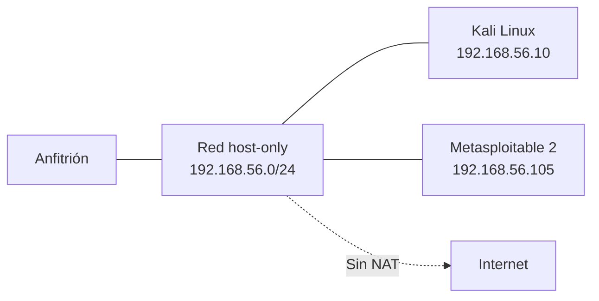

# Laboratorio: construir y validar un entorno aislado

[Inicio](../../../README.md) | [Ethical Hacking](../../README.md) | [Sesión 01](../README.md)

> [!CAUTION]
> Este laboratorio es local y educativo. No conectes las máquinas vulnerables a Internet ni a redes de producción. Trabaja únicamente con VMs propias.

## Alcance

El objetivo es construir un laboratorio reproducible con una atacante y un objetivo, verificar su aislamiento y dejar un estado limpio restaurable. Se practica:

- Crear una red **host-only** en VirtualBox.
- Desplegar **Kali Linux** y **Metasploitable 2** en esa red.
- Confirmar conectividad entre atacante y objetivo.
- Confirmar la ausencia de salida a Internet desde el objetivo.
- Tomar y restaurar un snapshot limpio.

No se realizan escaneos, enumeraciones ni explotación; eso corresponde a las sesiones 03, 04 y 05.

## Requisitos

- VirtualBox 7.x o superior con virtualización habilitada.
- 8 GB de RAM y 80 GB de disco libre como mínimo.
- Imágenes de **Kali Linux** y **Metasploitable 2** descargadas de fuentes oficiales.
- Usuario con permisos de administración en el anfitrión.

## Topología



---

## 1. Crear la red host-only

En VirtualBox:

1. Abre **Herramientas > Red**.
2. Selecciona la pestaña **Redes solo-anfitrión**.
3. Crea una red con estos valores:

```text
IPv4:        192.168.56.0/24
DHCP:        Desactivado
Adaptador:   vboxnet0
```

4. Desactiva el adaptador NAT de las VMs objetivo.

Comprueba en el anfitrión que la interfaz existe:

```bash
ip addr show vboxnet0
```

Resultado esperado: una interfaz con dirección `192.168.56.1/24`.

---

## 2. Desplegar Kali Linux

1. Importa la imagen de Kali en VirtualBox.
2. Configura **un solo adaptador de red**: `vboxnet0` (host-only).
3. Asigna la IP estática `192.168.56.10`:

```bash
sudo ip addr add 192.168.56.10/24 dev eth0
sudo ip link set eth0 up
```

4. Verifica la configuración:

```bash
ip -br address
```

Resultado esperado:

```text
eth0   UP   192.168.56.10/24
```

---

## 3. Desplegar Metasploitable 2

1. Importa la imagen de Metasploitable 2.
2. Configura **un solo adaptador de red**: `vboxnet0` (host-only).
3. Arranca la VM e identifica su IP:

```bash
ifconfig
```

Resultado esperado, con la IP del objetivo:

```text
inet addr:192.168.56.105
```

> [!IMPORTANT]
> Si Metasploitable 2 conserva un adaptador NAT, tendrá salida a Internet. Elimínalo antes de continuar.

---

## 4. Validar la conectividad autorizada

Desde Kali, confirma que el objetivo responde:

```bash
ping -c 2 192.168.56.105
```

Resultado esperado:

```text
2 packets transmitted, 2 received, 0% packet loss
```

Comprueba que la atacante alcanza al objetivo, pero no al revés por rutas externas:

```bash
ip route
```

Resultado esperado: una única ruta por `eth0` dentro de `192.168.56.0/24`, sin *default gateway* hacia Internet.

---

## 5. Confirmar el aislamiento

Desde Metasploitable 2, intenta salir a Internet:

```bash
ping -c 2 8.8.8.8
```

Resultado esperado: sin respuesta, con pérdida del 100%.

```text
2 packets transmitted, 0 received, 100% packet loss
```

Si hay respuesta, la red no está aislada. Detén la práctica y corrige el adaptador antes de continuar.

---

## 6. Crear el snapshot limpio

Con ambas VMs apagadas y sin cambios pendientes:

1. Selecciona cada VM y abre **Instantáneas > Tomar instantánea**.
2. Nombra el estado como `base-limpia`.
3. Añade una descripción con la fecha.

```text
Snapshot: base-limpia
Descripción: red host-only 192.168.56.0/24, sin cambios
```

---

## Validación y resultados esperados

Checklist técnico:

- [ ] La red host-only `192.168.56.0/24` existe y no usa DHCP.
- [ ] Kali responde en `192.168.56.10`.
- [ ] Metasploitable 2 responde en `192.168.56.105`.
- [ ] Hay conectividad entre atacante y objetivo.
- [ ] El objetivo no alcanza `8.8.8.8`.
- [ ] Existe un snapshot `base-limpia` de cada VM.

## Limpieza

1. Apaga ambas VMs.
2. Restaura el snapshot `base-limpia` para dejar el entorno en su estado inicial.
3. Verifica que no queda ninguna captura ni archivo con datos sensibles en el anfitrión.

```bash
sudo poweroff
```

[Volver a la sesión](../README.md) | [Volver a Ethical Hacking](../../README.md) | [Inicio](../../../README.md)
