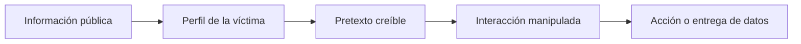
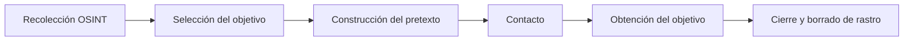
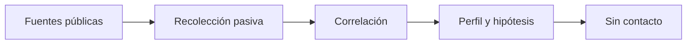

# Sesión 02: Ingeniería social y OSINT humano

[Inicio](../../README.md) | [Ethical Hacking](../README.md) | [Anterior: Fundamentos, ética y laboratorio](../01-fundamentos-etica-y-laboratorio/README.md) | [Siguiente: Reconocimiento y OSINT técnico](../03-reconocimiento-y-osint-tecnico/README.md)

> [!CAUTION]
> La ingeniería social se estudia aquí de forma defensiva y conceptual. No se contacta a personas reales, no se suplantan identidades y no se envían mensajes de prueba. El laboratorio usa datos completamente sintéticos.

## Introducción

La mayoría de los incidentes no empiezan con una vulnerabilidad de software, sino con una decisión humana: abrir un archivo, reutilizar una contraseña, confiar en una llamada. La **ingeniería social** explota esas decisiones manipulando la confianza.



> **Idea central:** la persona es una superficie de ataque tan real como un puerto abierto; se defiende con formación, políticas y verificación, no solo con tecnología.

---

## 1. El factor humano

El **factor humano** agrupa las decisiones, hábitos y emociones que influyen en la seguridad. Los atacantes lo explotan porque es difícil de parchear.

| Sesgo o emoción | Cómo se aprovecha |
|---|---|
| **Autoridad** | Un supuesto directivo o auditor pide una acción urgente. |
| **Urgencia** | Un plazo falso impide verificar con calma. |
| **Reciprocidad** | Un favor previo crea la obligación de devolverlo. |
| **Simpatía** | Un interlocutor agradable reduce la sospecha. |
| **Miedo** | Una supuesta amenaza fuerza una reacción rápida. |
| **Curiosidad** | Un documento llamativo invita a abrirlo. |

La **confianza** es el recurso que se manipula. El atacante no necesita romper un cifrado si consigue que alguien le abra la puerta.

---

## 2. Ciclo de la ingeniería social

La ingeniería social es un proceso, no un evento aislado. Se planifica a partir de información pública.



1. **Recolección**: reunir nombres, roles, proveedores, tecnologías y relaciones.
2. **Selección**: elegir a la persona con acceso y menor resistencia.
3. **Pretexto**: inventar una historia verosímil que justifique el contacto.
4. **Contacto**: iniciar la interacción por el canal más creíble.
5. **Objetivo**: obtener la credencial, el acceso o la acción buscada.
6. **Cierre**: terminar sin levantar sospecha.

### Pretexting

El **pretexting** es la construcción de una identidad o situación ficticia. Su credibilidad depende de que encaje con información real ya obtenida: un nombre correcto, un proveedor conocido o una política interna mencionada con naturalidad.

---

## 3. Técnicas principales

| Técnica | Canal | Descripción |
|---|---|---|
| **Phishing** | Correo electrónico | Mensaje que suplanta a una entidad legítima para robar datos o ejecutar una acción. |
| **Spear phishing** | Correo electrónico | Variante dirigida a una persona o grupo concreto, muy personalizada. |
| **Vishing** | Voz / teléfono | Llamada que suplanta a soporte, banca o un compañero. |
| **Smishing** | SMS | Mensaje de texto con enlaces o peticiones urgentes. |
| **Baiting** | Físico o digital | Dejar un cebo (USB, enlace) que la víctima usa por curiosidad. |
| **Tailgating** | Físico | Acceder a una zona restringida siguiendo a alguien autorizado. |
| **Quid pro quo** | Varios | Ofrecer ayuda o un servicio a cambio de información. |

### Anatomía de un correo de phishing

Aunque el diseño varía, un intento de phishing reúne señales reconocibles:

```text
Remitente:       dominio parecido al legítimo (micros0ft.example)
Enlace:          texto visible distinto del destino real
Tono:            urgencia, amenaza o premio
Adjunto:         archivo que pide habilitar macros o contenido
Petición final:  credenciales, pago o código de verificación
```

Ninguna señal aislada demuestra un fraude; el conjunto sí reduce la confianza del mensaje.

---

## 4. OSINT humano y huella digital

El **OSINT** (inteligencia de fuentes abiertas) es la recolección de información a partir de fuentes públicas. Aplicado a personas, estudia la **huella digital**: el rastro que una persona deja al usar Internet.

| Categoría | Ejemplos | Riesgo |
|---|---|---|
| Redes sociales | Publicaciones, relaciones, ubicaciones. | Ingeniería social y pretextos. |
| Correo y brechas | Filtraciones con contraseñas reutilizadas. | Credential stuffing. |
| Foros y repositorios | Preguntas técnicas, código, CV. | Fingerprinting y confianza. |
| Metadatos | Autoría, software y fechas en documentos. | Enumeración de herramientas internas. |
| Registros públicos | Dominios, empresas, teléfonos. | Contexto para vishing. |

### Recolección pasiva

La recolección **pasiva** observa fuentes públicas sin interactuar con la organización ni contactar a personas. Es la forma más segura de empezar: no genera alertas ni molesta a nadie.



La recolección **activa** implicaría interactuar (llamar, enviar correos, sondear), y por tanto exige autorización explícita y suele quedar fuera del alcance inicial.

---

## 5. Ejemplo de análisis defensivo

Para defenderse conviene razonar como el atacante sin llegar a atacar. El siguiente análisis es puramente conceptual y trabaja con datos ficticios:

```text
Objetivo:     Ana, administradora de sistemas (ficticia)
Fuentes:      redes sociales, foro técnico, web corporativa
Datos:        cargo, proveedor de nube, correo institucional
Pretexto:     "soporte del proveedor" pide validar un acceso
Riesgo:       suplantación y robo de credenciales privilegiadas
```

Este ejercicio muestra por qué la información pública de empleados clave es sensible y por qué conviene limitarla.

---

## 6. Defensa frente a la ingeniería social

La defensa combina personas, procesos y tecnología.

| Control | Función |
|---|---|
| **Concienciación** | Formación periódica con simulaciones internas autorizadas. |
| **Verificación fuera de canal** | Confirmar toda petición sensible por otra vía independiente. |
| **Procedimientos de urgencia** | Evitar decisiones precipitadas bajo presión. |
| **MFA y gestores de contraseñas** | Reducir el impacto de credenciales robadas. |
| **Minimización de datos** | Publicar poca información personal y técnica. |
| **Filtrado de correo** | Detectar suplantaciones y enlaces sospechosos. |
| **Cultura de reporte** | Facilitar que un empleado avise sin miedo a represalias. |

> [!IMPORTANT]
> Verificar por un canal independiente es el control más eficaz. Si una petición llega por correo, se confirma por teléfono con un número conocido; si llega por teléfono, se confirma por un canal interno.

---

## 7. Puente a la siguiente sesión

La recolección pasiva no se limita a las personas. La organización también publica información sobre su infraestructura: dominios, servidores, certificados y servicios. La siguiente sesión convierte esa huella técnica en un inventario de activos que prepara la enumeración de red.

---

## Cheatsheet

Referencia rápida del capítulo en formato PDF: [cheatsheet.pdf](./cheatsheet.pdf).

---

[Anterior: Fundamentos, ética y laboratorio](../01-fundamentos-etica-y-laboratorio/README.md) | [Volver al índice](../README.md) | [Siguiente: Reconocimiento y OSINT técnico](../03-reconocimiento-y-osint-tecnico/README.md)
