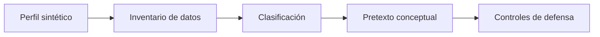

# Laboratorio: análisis de huella digital sobre un perfil sintético

[Inicio](../../../README.md) | [Ethical Hacking](../../README.md) | [Sesión 02](../README.md)

> [!CAUTION]
> Este ejercicio es 100% offline y defensivo. Trabaja solo con el archivo [perfil-sintetico.md](./perfil-sintetico.md). No contactes a personas reales, no busques los datos en Internet y no envíes mensajes de prueba.

## Alcance

El objetivo es razonar como un analista defensivo: a partir de una huella pública ficticia, identificar qué información es sensible, cómo podría usarse en un pretexto y qué controles la reducirían. Se practica:

- Clasificar datos por sensibilidad.
- Correlacionar fuentes para formar una hipótesis.
- Construir un pretexto **conceptual** sin ejecutarlo.
- Proponer controles de concienciación, proceso y tecnología.

No se realiza phishing, vishing, contacto ni recolección real en Internet.

## Requisitos

- Editor de texto o Markdown.
- El archivo [perfil-sintetico.md](./perfil-sintetico.md).
- Ninguna conexión a servicios externos.

## Flujo del análisis



---

## 1. Leer el perfil

Abre [perfil-sintetico.md](./perfil-sintetico.md) y localiza las tres entidades:

```text
Organización: Nébula Logística S.L.
Empleada:     Ana Torres
Proveedor:    NubeNorte
```

Resultado esperado: comprendes que el análisis combina datos de una persona, su empresa y un tercero de confianza.

---

## 2. Inventariar y clasificar datos

Construye una tabla con cada dato ficticio y su impacto. Ejemplo de formato:

```text
DATO                                 FUENTE FICTICIA        SENSIBILIDAD
Cargo de administradora              red social             media
Correo ana.torres@nebula.example     web / filtración        alta
Proveedor NubeNorte                  oferta de empleo        media
Certificaciones de nube              red social             baja
```

Criterio de clasificación:

```text
Alta   -> permite autenticación o acceso directo
Media  -> facilita un pretexto creíble
Baja   -> aporta contexto sin acceso
```

---

## 3. Construir una hipótesis de ataque (conceptual)

Redacta, sin ejecutarlo, un escenario de pretexto coherente con los datos ficticios:

```text
Canal:     llamada telefónica suplantando a NubeNorte
Historia:  "validación urgente de una copia de seguridad"
Objetivo:  obtener un código MFA o acceso al panel
Señal de credibilidad: conocimiento del proveedor real y del cargo
```

Registra por qué el pretexto resulta creíble y qué dato concreto lo sostiene.

---

## 4. Diseñar controles de defensa

Para cada eslabón del escenario, propón un control:

```text
ESLABÓN                       CONTROL PROPUESTO
Datos públicos excesivos      Política de redes sociales y minimización
Pretexto creíble              Verificación fuera de canal con número conocido
Urgencia                      Procedimiento que prohíbe acciones por presión
Código MFA                    No compartir códigos; MFA resistente a phishing
Duda del empleado             Canal interno de reporte sin represalias
```

---

## Validación y resultados esperados

Checklist técnico:

- [ ] El inventario cita cada dato con su fuente ficticia.
- [ ] Cada dato está clasificado como alto, medio o bajo.
- [ ] El pretexto es conceptual y usa solo datos del perfil.
- [ ] Cada eslabón tiene al menos un control asociado.
- [ ] No se contactó a ninguna persona ni servicio real.

## Limpieza

1. Elimina las notas de trabajo que ya no necesites.
2. No publiques el análisis fuera del laboratorio.
3. Confirma que no se envió ningún mensaje ni se consultó a terceros.

[Volver a la sesión](../README.md) | [Volver a Ethical Hacking](../../README.md) | [Inicio](../../../README.md)
