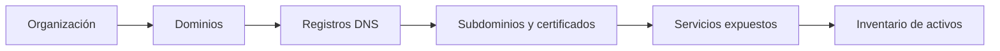
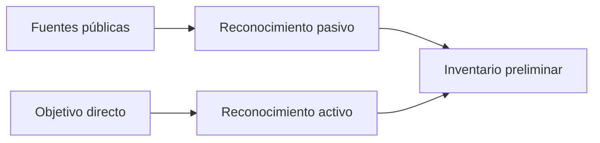
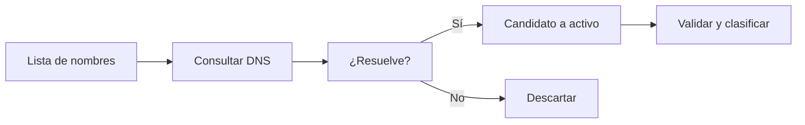
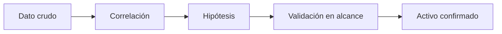

# Sesión 03: Reconocimiento y OSINT técnico

[Inicio](../../README.md) | [Ethical Hacking](../README.md) | [Anterior: Ingeniería social y OSINT humano](../02-ingenieria-social-y-osint-humano/README.md) | [Siguiente: Redes, descubrimiento y enumeración](../04-redes-descubrimiento-y-enumeracion/README.md)

> [!CAUTION]
> El reconocimiento técnico debe limitarse a activos dentro del alcance autorizado. La información pública se consulta sin interactuar con la organización; no se lanzan escaneos ni se contacta a terceros sin permiso.

## Introducción

Antes de tocar la red, el evaluador recolecta información pública sobre la organización: dominios, servidores, certificados y servicios. Este proceso, llamado **footprinting** o **reconocimiento**, convierte datos dispersos en un inventario de activos.



> **Idea central:** el reconocimiento reduce la incertidumbre. Cada hallazgo debe apuntar a un activo concreto y verificable, no a una suposición.

---

## 1. Reconocimiento pasivo y activo

El reconocimiento se clasifica según el nivel de interacción con el objetivo.

| Tipo | Interacción | Ventaja | Riesgo |
|---|---|---|---|
| **Pasivo** | Nula; solo fuentes públicas y terceros. | Indetectable para el objetivo. | Información incompleta o desactualizada. |
| **Activo** | Consulta directa a los sistemas del objetivo. | Datos exactos y actuales. | Deja rastro y requiere autorización. |



La **OSINT** incluye cualquier dato obtenido de fuentes abiertas: registros de dominio, motores de búsqueda, redes sociales, repositorios de código, metadatos y bases de datos de certificados.

---

## 2. WHOIS y registro de dominios

**WHOIS** consulta la información de registro de un dominio o rango IP: titular, fechas, servidores de nombres y contactos administrativos.

```bash
whois nebula.example
```

| Campo | Significado | Interés |
|---|---|---|
| Registrar | Empresa donde se registró el dominio. | Contexto corporativo. |
| Creation / Expiry | Fechas de alta y caducidad. | Antigüedad y posibles dominios abandonados. |
| Name Servers | Servidores DNS autoritativos. | Proveedor de DNS y superficie asociada. |
| Registrant | Titular (a menudo oculto por privacidad). | Relación entre dominios. |
| Abuse Contact | Contacto de abuso. | Canal legítimo de reporte. |

Un **dominio** puede tener múltiples **subdominios** y **hosts**. La relación entre el dominio registrado y sus servicios es el primer mapa de la organización.

---

## 3. DNS y enumeración de nombres

El **Domain Name System** traduce nombres a direcciones y publica distintos tipos de registro. La enumeración de nombres busca hosts y servicios no enlazados públicamente.

| Registro | Contenido | Utilidad |
|---|---|---|
| `A` | Nombre a IPv4. | Identifica servidores. |
| `AAAA` | Nombre a IPv6. | Infraestructura moderna. |
| `MX` | Servidor de correo. | Proveedor de correo y phishing. |
| `TXT` | Texto libre. | Verificaciones, SPF, DKIM. |
| `NS` | Servidores de nombres. | Autoridad DNS. |
| `CNAME` | Alias hacia otro nombre. | Dependencias y servicios externos. |
| `SOA` | Autoridad de la zona. | Administración y serial. |

```bash
dig +short A nebula.example
dig +short MX nebula.example
dig +short TXT nebula.example
```

### Transferencia de zona

Una **transferencia de zona** (`AXFR`) replica la zona completa entre servidores de nombres. Si un servidor la permite a cualquiera, expone todos los nombres internos de una sola consulta:

```bash
dig AXFR nebula.example @ns1.nebula.example
```

Es una mala configuración clásica y de alto impacto.

### Fuerza bruta de subdominios

Cuando la transferencia no es posible, se prueban nombres comunes contra el DNS autoritativo. La idea es pedir muchos candidatos y conservar los que resuelven:

```bash
for sub in www mail vpn dev staging admin; do
  dig +short "$sub.nebula.example"
done
```



---

## 4. Certificados y transparencia

Los certificados TLS se registran en **logs de transparencia** (Certificate Transparency). Estos registros son públicos y permiten descubrir nombres que una organización obtuvo, incluso subdominios no publicados.

| Dato del certificado | Ejemplo | Interés |
|---|---|---|
| `Subject` | `CN=vpn.nebula.example` | Nombre del host. |
| `SAN` | Varios nombres alternativos. | Subdominios asociados. |
| Emisor | CA que firmó. | Proveedor y confianza. |
| Vigencia | Desde / hasta. | Certificados caducados o recientes. |

```bash
openssl s_client -connect nebula.example:443 -servername nebula.example </dev/null \
  | openssl x509 -noout -subject -ext subjectAltName
```

Un certificado de **comodín** (`*.nebula.example`) cubre todos los subdominios de un nivel y amplía la exposición si se compromete su clave.

---

## 5. Motores de búsqueda y Google dorks

Los **dorks** son búsquedas avanzadas que combinan operadores para localizar información indexada: documentos, paneles, listados de directorios o credenciales expuestas.

| Operador | Función | Ejemplo |
|---|---|---|
| `site:` | Limita al dominio. | `site:nebula.example` |
| `filetype:` | Filtra por tipo de archivo. | `filetype:pdf` |
| `inurl:` | Busca texto en la URL. | `inurl:admin` |
| `intitle:` | Busca texto en el título. | `intitle:"index of"` |
| `-` | Excluye un término. | `-site:shop.nebula.example` |
| `cache:` | Copia en caché. | `cache:nebula.example` |

Los dorks son reconocimiento **pasivo**: el buscador sirve resultados ya indexados sin tocar el objetivo.

> [!IMPORTANT]
> La información indexada puede estar obsoleta o corresponder a entornos de demostración. Cada resultado debe confirmarse dentro del alcance antes de tratarse como activo.

---

## 6. Exposición de servicios con Shodan

**Shodan** es un motor de búsqueda de dispositivos y servicios conectados a Internet. Escanea Internet de forma continua y publica los *banners* que recibe.

| Filtro | Busca | Ejemplo |
|---|---|---|
| `hostname:` | Nombre del host. | `hostname:nebula.example` |
| `org:` | Organización. | `org:"Nebula Logistica"` |
| `port:` | Puerto. | `port:3389` |
| `product:` | Software. | `product:nginx` |
| `country:` | País. | `country:ES` |

Un **banner** es la respuesta que un servicio devuelve al conectarse: versión, software y a veces información interna. Es la misma información que un escaneo activo de versiones, pero obtenida de forma pasiva.

---

## 7. Metadatos y huella documental

Los documentos publicados suelen conservar **metadatos**: autor, software, plantilla, fechas y rutas internas. Son una fuente de información sobre herramientas y estructura de la organización.

```bash
exiftool documento.pdf
```

| Metadato | Puede revelar |
|---|---|
| `Author` / `Creator` | Usuarios y software interno. |
| `Producer` | Versión de la herramienta. |
| `Company` | Nombre legal o filial. |
| Rutas internas | Nombres de servidores y unidades. |

---

## 8. Del dato al activo

La información aislada tiene poco valor. El reconocimiento produce un **inventario de activos** donde cada entrada incluye origen, evidencia y estado de validación.

| Activo | Tipo | Fuente | Estado |
|---|---|---|---|
| `nebula.example` | Dominio | WHOIS | Confirmado |
| `vpn.nebula.example` | Subdominio | Certificado | Probable |
| `mail.nebula.example` | Correo | Registro MX | Confirmado |
| `203.0.113.10` | IP | DNS | Confirmado |



> Usa direcciones reservadas como `203.0.113.0/24` y `198.51.100.0/24` en los ejemplos para no señalar infraestructura real.

---

## 9. Puente a la siguiente sesión

El inventario resultante apunta a nombres, direcciones y servicios, pero todavía no dice qué está realmente activo ni qué versión se ejecuta. La siguiente sesión valida esos activos en la red aislada mediante descubrimiento de hosts, escaneo de puertos y enumeración de servicios.

---

## Cheatsheet

Referencia rápida del capítulo en formato PDF: [cheatsheet.pdf](./cheatsheet.pdf).

---

[Anterior: Ingeniería social y OSINT humano](../02-ingenieria-social-y-osint-humano/README.md) | [Volver al índice](../README.md) | [Siguiente: Redes, descubrimiento y enumeración](../04-redes-descubrimiento-y-enumeracion/README.md)
