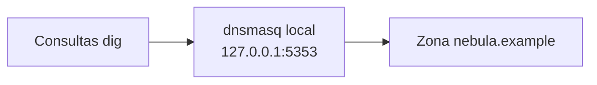

# Laboratorio: huella técnica sobre un dominio sintético

[Inicio](../../../README.md) | [Ethical Hacking](../../README.md) | [Sesión 03](../README.md)

> [!CAUTION]
> Todo el laboratorio es local. El dominio `nebula.example` es ficticio y se resuelve contra un servidor DNS propio en `127.0.0.1:5353`. No consultes dominios de terceros ni uses buscadores con datos reales.

## Alcance

El objetivo es reproducir el reconocimiento técnico en un entorno controlado: consultar tipos de registro DNS, enumerar subdominios, inspeccionar un certificado y analizar banners ficticios hasta construir un inventario de activos. Se practica:

- Instalar y operar un servidor DNS local con una zona ficticia.
- Consultar registros `A`, `MX`, `TXT` y alias.
- Enumerar subdominios por fuerza bruta controlada.
- Inspeccionar un certificado TLS local.
- Analizar banners pasivos y clasificar activos.

No se escanea ningún host de la red ni se consulta infraestructura real.

## Requisitos

- Kali Linux en la red aislada de la sesión 01.
- Paquetes `dnsutils` y `dnsmasq`.
- Archivos de apoyo: [hosts-nebula](./hosts-nebula), [subdominios.txt](./subdominios.txt), [banners-ficticios.txt](./banners-ficticios.txt).

## Topología



---

## 1. Preparar el DNS local

Instala las herramientas:

```bash
sudo apt update
sudo apt install -y dnsutils dnsmasq
```

Arranca dnsmasq en modo aislado (sin reenviar consultas externas):

```bash
sudo dnsmasq --no-daemon --port=5353 --no-resolv --no-hosts \
  --local=/nebula.example/ --domain=nebula.example --expand-hosts \
  --addn-hosts=hosts-nebula \
  --mx-host=nebula.example,mail.nebula.example \
  --txt-record=nebula.example,"v=spf1 include:_spf.example -all" \
  --cname=blog.nebula.example,www.nebula.example
```

Mantén el proceso abierto y trabaja en otra terminal desde esta carpeta (`lab/`).

---

## 2. Consultar tipos de registro

```bash
dig +short @127.0.0.1 -p 5353 A nebula.example
dig +short @127.0.0.1 -p 5353 A www.nebula.example
dig +short @127.0.0.1 -p 5353 MX nebula.example
dig +short @127.0.0.1 -p 5353 TXT nebula.example
dig +short @127.0.0.1 -p 5353 CNAME blog.nebula.example
```

Resultados esperados:

```text
192.168.56.105
192.168.56.105
10 mail.nebula.example.
"v=spf1 include:_spf.example -all"
www.nebula.example.
```

Interpreta cada respuesta y anota qué activo representa.

---

## 3. Enumerar subdominios

Recorre la lista de candidatos y conserva los que resuelven:

```bash
while read sub; do
  ip=$(dig +short @127.0.0.1 -p 5353 "$sub.nebula.example")
  [ -n "$ip" ] && echo "$sub.nebula.example -> $ip"
done < subdominios.txt
```

Resultado esperado:

```text
www.nebula.example -> 192.168.56.105
mail.nebula.example -> 192.168.56.105
vpn.nebula.example -> 192.168.56.105
dev.nebula.example -> 192.168.56.105
staging.nebula.example -> 192.168.56.105
portal.nebula.example -> 192.168.56.105
```

Los nombres ausentes de [hosts-nebula](./hosts-nebula) no devuelven dirección.

> [!IMPORTANT]
> La fuerza bruta de subdominios es reconocimiento activo contra el DNS. Aquí se ejecuta contra un servidor propio; nunca contra un dominio de terceros.

---

## 4. Inspeccionar un certificado local

Genera un certificado autofirmado y revisa sus nombres:

```bash
openssl req -x509 -newkey rsa:2048 -nodes -days 1 \
  -keyout nebula.key -out nebula.crt \
  -subj "/CN=www.nebula.example" \
  -addext "subjectAltName=DNS:www.nebula.example,DNS:portal.nebula.example"
```

```bash
openssl x509 -in nebula.crt -noout -subject -ext subjectAltName
```

Resultado esperado:

```text
subject=CN = www.nebula.example
X509v3 Subject Alternative Name:
    DNS:www.nebula.example, DNS:portal.nebula.example
```

Anota los nombres que el certificado revela.

---

## 5. Analizar banners ficticios

Abre [banners-ficticios.txt](./banners-ficticios.txt) y para cada entrada registra:

```text
IP                PUERTO   PRODUCTO              SEÑAL                       RIESGO
203.0.113.10      22       OpenSSH 7.4           Versión antigua             Alto
203.0.113.10      80       Apache 2.4.29         SO expuesto                 Medio
203.0.113.11      3306     MySQL 5.5.62          BD en Internet              Crítico
203.0.113.12      3389     RDP                   Nombre interno filtrado     Alto
```

---

## 6. Construir el inventario de activos

Reúne todo lo obtenido en una sola tabla con origen y estado:

```text
ACTIVO                     TIPO          FUENTE            ESTADO
nebula.example             Dominio       DNS A             Confirmado
www.nebula.example         Subdominio    DNS A             Confirmado
portal.nebula.example      Subdominio    Certificado       Probable
mail.nebula.example        Correo        DNS MX            Confirmado
203.0.113.11               IP            Banner            Confirmado
```

---

## Validación y resultados esperados

Checklist técnico:

- [ ] `dnsmasq` responde solo para `nebula.example`.
- [ ] Se obtuvieron registros `A`, `MX`, `TXT` y `CNAME`.
- [ ] La enumeración distingue nombres presentes de ausentes.
- [ ] El certificado revela al menos dos nombres.
- [ ] Cada activo del inventario tiene fuente y estado.
- [ ] No se consultó ningún dominio ni servicio real.

## Limpieza

1. Detén `dnsmasq` con `Ctrl+C`.
2. Elimina los artefactos del certificado:

```bash
rm -f nebula.key nebula.crt
```

3. Borra las notas que contengan datos temporales.

[Volver a la sesión](../README.md) | [Volver a Ethical Hacking](../../README.md) | [Inicio](../../../README.md)
