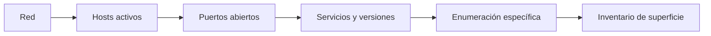
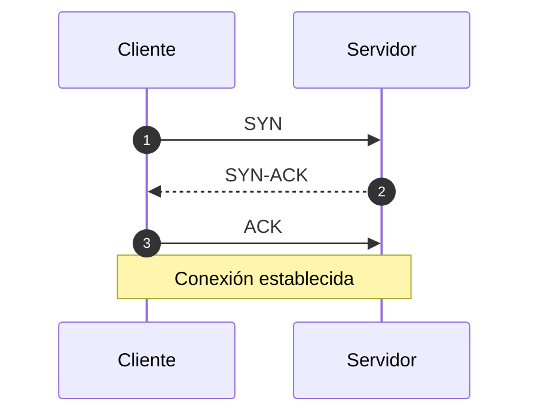
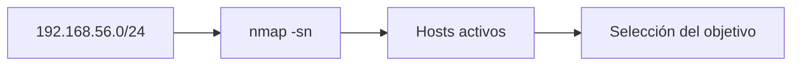
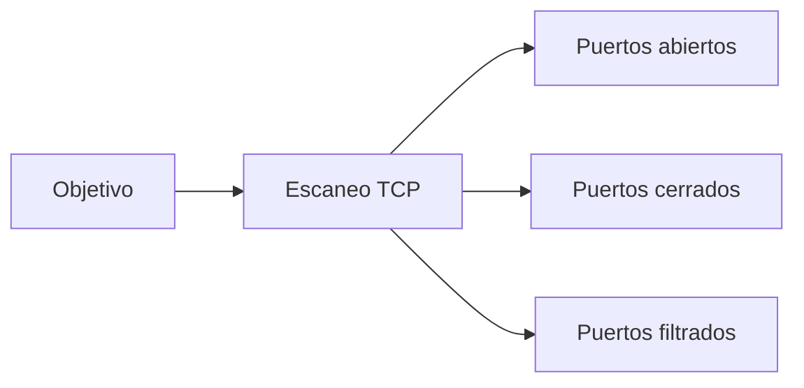
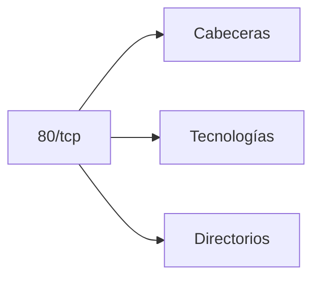

# Sesión 04: Redes, descubrimiento y enumeración

[Inicio](../../README.md) | [Ethical Hacking](../README.md) | [Anterior: Reconocimiento y OSINT técnico](../03-reconocimiento-y-osint-tecnico/README.md) | [Siguiente: Explotación controlada y reportes](../05-explotacion-controlada-y-reportes/README.md)

> [!CAUTION]
> El escaneo y la enumeración son reconocimiento activo: generan tráfico y dejan rastro. Ejecútalos únicamente contra la red aislada del laboratorio y los activos autorizados.

## Introducción

El reconocimiento técnico de la sesión anterior produjo nombres y activos probables. Esta sesión los valida en la red: qué hosts están activos, qué puertos responden, qué servicios los escuchan y qué información exponen.



> **Idea central:** un puerto abierto no es una vulnerabilidad. Es una observación que gana significado cuando se identifica el servicio, su versión y su configuración.

---

## 1. Modelo TCP/IP y puertos

La comunicación en red se organiza en capas. Para el reconocimiento interesa principalmente la capa de transporte, donde viven **TCP** y **UDP**, y los **puertos** que identifican servicios.

| Característica | TCP | UDP |
|---|---|---|
| Conexión | Orientado a conexión (handshake). | Sin conexión. |
| Fiabilidad | Confirmaciones y retransmisión. | Sin garantías. |
| Uso típico | Web, SSH, SMB. | DNS, SNMP, DHCP. |
| Detección | Fiable y clara. | Lenta e incierta. |

Un **puerto** es un número de 16 bits que identifica un proceso dentro de un host. El rango se divide en:

| Rango | Nombre | Ejemplos |
|---|---|---|
| 0 - 1023 | Bien conocidos | 22 SSH, 80 HTTP, 443 HTTPS |
| 1024 - 49151 | Registrados | 3306 MySQL, 8080 HTTP alterno |
| 49152 - 65535 | Efímeros | Puertos temporales de cliente |

### Three-way handshake

TCP establece la conexión con tres mensajes antes de transferir datos:



Un escaneo **connect** completa este handshake; un escaneo **SYN** lo interrumpe tras la respuesta para ser más sigiloso.

---

## 2. Estados de puerto y tipos de escaneo

Nmap clasifica cada puerto según su respuesta.

| Estado | Significado |
|---|---|
| `open` | Un servicio escucha y acepta conexiones. |
| `closed` | Responde con `RST`; no hay servicio. |
| `filtered` | Sin respuesta o bloqueado por un filtro. |
| `unfiltered` | Responde, pero no se puede determinar el estado. |
| `open|filtered` | UDP ambiguo: abierto o filtrado. |

| Técnica | Opción | Descripción |
|---|---|---|
| TCP connect | `-sT` | Handshake completo; no requiere privilegios. |
| TCP SYN | `-sS` | Half-open; rápido y sigiloso. |
| UDP | `-sU` | Sondea servicios sin conexión. |
| Detección de versión | `-sV` | Identifica software y versión. |
| Detección de SO | `-O` | Infiere el sistema operativo. |

---

## 3. Descubrimiento de hosts

Antes de escanear puertos conviene saber qué hosts responden. `-sn` realiza un *ping sweep* sin escanear puertos.

```bash
sudo nmap -sn 192.168.56.0/24
```



Resultado esperado:

```text
Nmap scan report for 192.168.56.10
Host is up.
Nmap scan report for 192.168.56.105
Host is up.
```

> En una red local, Nmap usa ARP, que es fiable y rápido. En redes enrutadas puede depender de ICMP y TCP.

---

## 4. Escaneo de puertos

El escaneo básico revisa los 1000 puertos más comunes. Para mayor cobertura se amplía el rango.

```bash
nmap 192.168.56.105
nmap -p- 192.168.56.105
```

| Opción | Efecto |
|---|---|
| `-p-` | Todos los puertos TCP (`1-65535`). |
| `-p 21,22,80` | Solo los puertos indicados. |
| `--top-ports 100` | Los 100 más frecuentes. |
| `-Pn` | No usar ping; asumir host activo. |



---

## 5. Detección de servicios y versiones

Un puerto abierto no dice qué software corre detrás. `-sV` envía sondas y compara las respuestas con su base de datos.

```bash
nmap -sV 192.168.56.105
```

Resultado esperado:

```text
21/tcp   open  ftp     vsftpd 2.3.4
22/tcp   open  ssh     OpenSSH 4.7p1
80/tcp   open  http    Apache httpd 2.2.8
445/tcp  open  netbios-ssn Samba smbd 3.X
```

La combinación **servicio + versión** es lo que permite buscar debilidades conocidas. Una versión exacta es una hipótesis; confirmarla requiere enumeración específica.

### Scripts NSE

El **Nmap Scripting Engine** automatiza comprobaciones concretas:

```bash
nmap -p21 --script ftp-anon 192.168.56.105
nmap -p139,445 --script smb-enum-shares 192.168.56.105
```

---

## 6. Enumeración de servicios

La **enumeración** consulta cada servicio para extraer usuarios, recursos, rutas o configuraciones. Es más profunda que el escaneo y específica de cada protocolo.

### FTP

Busca acceso anónimo y contenido expuesto:

```bash
nmap -p21 -sV 192.168.56.105
ftp 192.168.56.105
```

Al conectar, se comprueba si acepta credenciales anónimas:

```text
Name: anonymous
Password: (vacío)
```

Si el acceso anónimo está habilitado, un `ls` muestra archivos accesibles sin credenciales.

### SMB

Lista recursos compartidos y usuarios:

```bash
smbclient -L //192.168.56.105 -N
nmap -p139,445 --script smb-enum-shares 192.168.56.105
```

Un recurso compartido con permisos de escritura es una vía de carga de archivos.

### HTTP

Identifica tecnologías y rutas:

```bash
curl -I http://192.168.56.105
whatweb http://192.168.56.105
gobuster dir -u http://192.168.56.105 -w /usr/share/wordlists/dirb/common.txt
```



### RPC y NFS

RPC publica servicios registrados y NFS exporta directorios:

```bash
rpcinfo -p 192.168.56.105
showmount -e 192.168.56.105
```

Resultado esperado:

```text
Export list for 192.168.56.105:
/ *
```

Un *export* abierto a `*` permite montar el directorio desde el atacante.

| Servicio | Herramienta | Qué revela |
|---|---|---|
| FTP | `ftp`, `ftp-anon` | Acceso anónimo, archivos. |
| SMB | `smbclient`, NSE | Recursos compartidos, usuarios. |
| HTTP | `curl`, WhatWeb, Gobuster | Tecnología, rutas. |
| RPC | `rpcinfo` | Servicios registrados. |
| NFS | `showmount` | Directorios exportados. |
| SSH | `ssh`, NSE | Banner, métodos de autenticación. |

---

## 7. Del servicio al hallazgo

Cada resultado se registra con una disciplina clara:


- **Observación**: `vsftpd 2.3.4` escucha en el puerto 21.
- **Contexto**: es una versión antigua con debilidades documentadas.
- **Hipótesis**: podría permitir una puerta trasera conocida.
- **Validación**: se comprueba de forma controlada en la sesión 05.
- **Hallazgo**: solo entonces se confirma y se documenta con evidencia.

> [!IMPORTANT]
> Escribir "FTP inseguro" sin versión ni configuración no es un hallazgo. Un buen inventario separa siempre lo observado de lo interpretado.

---

## 8. Puente a la siguiente sesión

La enumeración produce un inventario de servicios y versiones, pero no confirma explotabilidad. La sesión final valida de forma controlada un hallazgo concreto, mide su impacto, documenta la evidencia y cierra el trabajo con un reporte.

---

## Cheatsheet

Referencia rápida del capítulo en formato PDF: [cheatsheet.pdf](./cheatsheet.pdf).

---

[Anterior: Reconocimiento y OSINT técnico](../03-reconocimiento-y-osint-tecnico/README.md) | [Volver al índice](../README.md) | [Siguiente: Explotación controlada y reportes](../05-explotacion-controlada-y-reportes/README.md)
