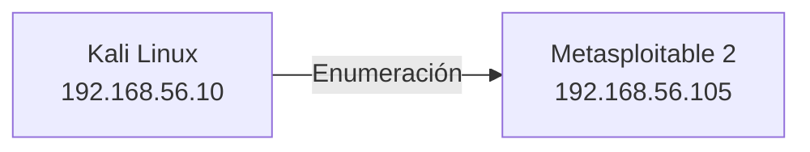
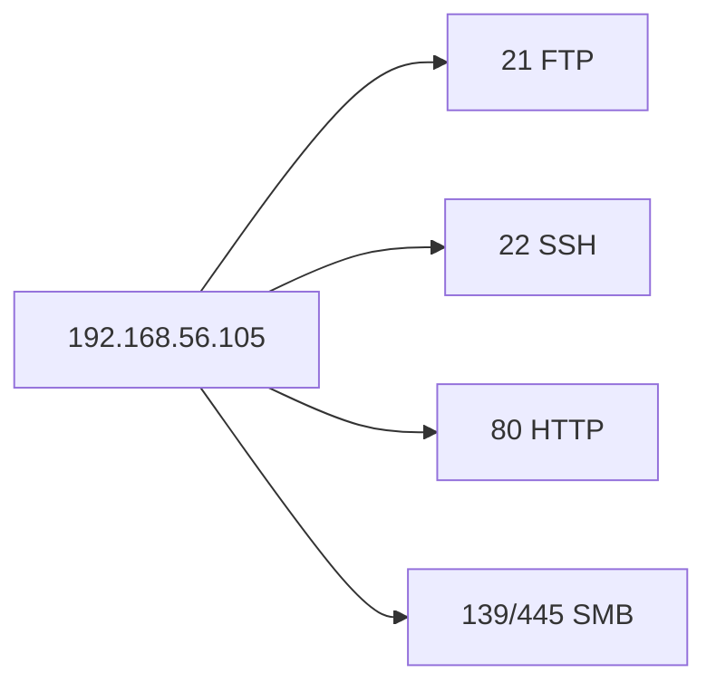
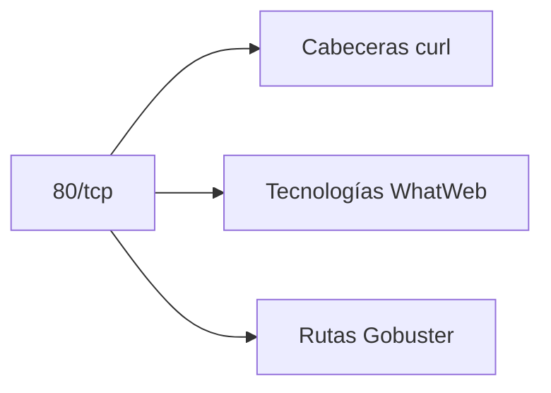
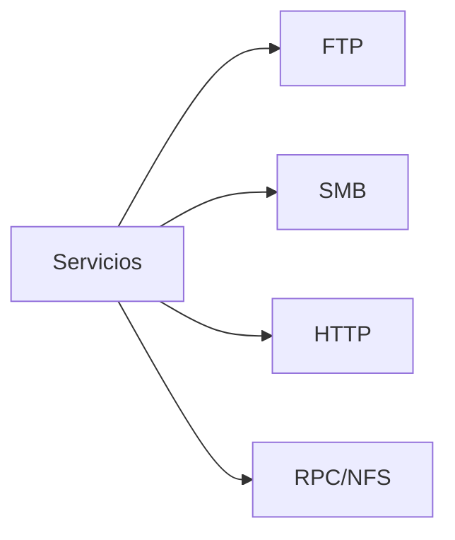

# Laboratorio: reconocimiento y enumeración con Metasploitable 2

[Inicio](../../../README.md) | [Ethical Hacking](../../README.md) | [Sesión 04](../README.md)

> [!CAUTION]
> Ejecuta estos comandos únicamente contra la VM Metasploitable 2 de la red aislada de la sesión 01. No lances escaneos contra redes domésticas, corporativas ni de terceros.

## Alcance

El objetivo es pasar de una red desconocida a un inventario verificable de hosts, puertos, servicios y versiones, y después enumerar cada servicio encontrado. Se practica:

- Identificar la red local y descubrir hosts activos.
- Escanear puertos y detectar servicios y versiones.
- Enumerar FTP, SMB, HTTP, RPC y NFS con herramientas específicas.
- Distinguir observación, hipótesis y hallazgo.

No se realiza explotación; esa validación corresponde a la sesión 05.

## Requisitos

- Kali Linux y Metasploitable 2 en la red host-only `192.168.56.0/24`.
- Herramientas: `nmap`, `ftp`, `smbclient`, `curl`, `whatweb`, `gobuster`, `rpcinfo`, `showmount`.
- Snapshot `base-limpia` de ambas VMs.
- Autorización sobre todos los sistemas del alcance.

Instala lo que falte:

```bash
sudo apt update
sudo apt install -y nmap ftp smbclient curl whatweb gobuster rpcbind nfs-common
```

## Topología



---

## 1. Identificar la red

```bash
ip -br address
```

Resultado esperado:

```text
eth0   UP   192.168.56.10/24
```

Anota la red y la IP de la atacante:

```text
Red:       192.168.56.0/24
Atacante:  192.168.56.10
```

---

## 2. Descubrir hosts activos

```bash
sudo nmap -sn 192.168.56.0/24
```

Resultado esperado:

```text
Nmap scan report for 192.168.56.10
Host is up.
Nmap scan report for 192.168.56.105
Host is up.
```

Selecciona el objetivo y guárdalo en una variable:

```bash
IP=192.168.56.105
echo $IP
```

---

## 3. Escanear puertos

Escaneo común:

```bash
nmap $IP
```

Cobertura completa de TCP:

```bash
nmap -p- $IP
```

Resultado esperado (extracto):

```text
PORT     STATE SERVICE
21/tcp   open  ftp
22/tcp   open  ssh
23/tcp   open  telnet
25/tcp   open  smtp
80/tcp   open  http
139/tcp  open  netbios-ssn
445/tcp  open  microsoft-ds
```



---

## 4. Detectar servicios y versiones

```bash
nmap -sV $IP
```

Resultado esperado:

```text
21/tcp   open  ftp     vsftpd 2.3.4
22/tcp   open  ssh     OpenSSH 4.7p1
80/tcp   open  http    Apache httpd 2.2.8
445/tcp  open  netbios-ssn Samba smbd 3.X
```

Interpreta cada línea:

```text
puerto   -> dónde escucha
servicio -> qué protocolo
software -> qué producto
versión  -> qué edición concreta
```

---

## 5. Enumerar FTP

Confirma el servicio y prueba acceso anónimo:

```bash
nmap -p21 -sV $IP
nmap -p21 --script ftp-anon $IP
```

Conexión manual:

```bash
ftp $IP
```

Dentro de la sesión:

```text
Name: anonymous
Password: (vacío)
```

```bash
pwd
ls
bye
```

Resultado esperado: si el acceso anónimo está habilitado, se listan archivos sin credenciales.

---

## 6. Enumerar SMB

```bash
nmap -p139,445 -sV $IP
smbclient -L //$IP -N
nmap -p139,445 --script smb-enum-shares $IP
```

Resultado esperado: una lista de recursos compartidos, algunos accesibles sin contraseña.

```text
Sharename       Type      Comment
---------       ----      -------
print$          Disk      Printer Drivers
tmp             Disk      oh noes!
opt             Disk
```

---

## 7. Enumerar HTTP

```bash
nmap -p80 -sV $IP
curl -I http://$IP
whatweb http://$IP
gobuster dir -u http://$IP -w /usr/share/wordlists/dirb/common.txt
```

Resultado esperado: cabeceras con el servidor, tecnologías identificadas y rutas como:

```text
/admin
/images
/uploads
/dvwa
/phpMyAdmin
```



---

## 8. Enumerar RPC y NFS

```bash
rpcinfo -p $IP
nmap -p2049 -sV $IP
showmount -e $IP
```

Resultado esperado:

```text
Export list for 192.168.56.105:
/ *
```

Un export abierto a `*` permite montar el directorio:

```bash
sudo mkdir -p /mnt/nfs
sudo mount -t nfs $IP:/ /mnt/nfs
ls /mnt/nfs
sudo umount /mnt/nfs
```

---

## 9. Construir el inventario

Reúne las observaciones en una tabla con evidencia y siguiente comprobación:

```text
PUERTO   SERVICIO   VERSIÓN            EVIDENCIA              SIGUIENTE COMPROBACIÓN
21       FTP        vsftpd 2.3.4       nmap -sV               Acceso anónimo
22       SSH        OpenSSH 4.7p1      nmap -sV               Métodos de autenticación
80       HTTP       Apache 2.2.8       curl -I / whatweb      Rutas y aplicaciones
139/445  SMB        Samba 3.X          smbclient -L           Recursos y permisos
111      RPC        rpcbind            rpcinfo -p             Servicios registrados
2049     NFS        —                  showmount -e           Export accesible
```



---

## Validación y resultados esperados

Checklist técnico:

- [ ] La red y el objetivo están documentados.
- [ ] Se revisaron todos los puertos TCP.
- [ ] Cada servicio incluye versión cuando fue posible.
- [ ] FTP, SMB, HTTP, RPC y NFS se enumeraron por separado.
- [ ] El inventario distingue observaciones de vulnerabilidades confirmadas.
- [ ] No se realizó explotación.

## Limpieza

1. Desmonta NFS si quedó montado:

```bash
sudo umount /mnt/nfs 2>/dev/null
```

2. Cierra cualquier sesión `ftp` abierta.
3. Elimina las notas temporales con datos del entorno.
4. Restaura el snapshot `base-limpia` al terminar la práctica.

[Volver a la sesión](../README.md) | [Volver a Ethical Hacking](../../README.md) | [Inicio](../../../README.md)
