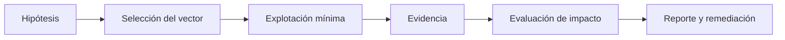
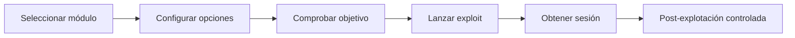
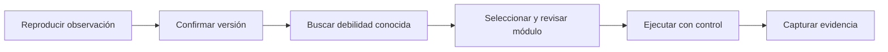
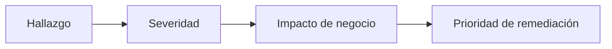
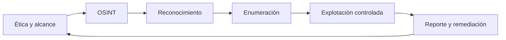

# Sesión 05: Explotación controlada y reportes

[Inicio](../../README.md) | [Ethical Hacking](../README.md) | [Anterior: Redes, descubrimiento y enumeración](../04-redes-descubrimiento-y-enumeracion/README.md)

> [!CAUTION]
> La explotación solo es legítima dentro de un alcance autorizado y con el mínimo impacto necesario. Este material se practica exclusivamente contra las VMs aisladas del laboratorio.

## Introducción

La enumeración dejó un inventario de servicios y versiones con hipótesis de debilidad. Esta sesión demuestra el ciclo que convierte una hipótesis en un hallazgo verificable, y después en un entregable para el cliente.



> **Idea central:** el valor de un pentest no está en conseguir acceso, sino en demostrar el riesgo de forma medible, segura y documentada.

---

## 1. Vocabulario de explotación

| Término | Definición |
|---|---|
| **Vulnerabilidad** | Debilidad concreta en código, configuración o diseño. |
| **Exploit** | Técnica o código que aprovecha una vulnerabilidad. |
| **Payload** | Acción que se ejecuta tras explotar (comando, shell, meterpreter). |
| **Vector** | Camino concreto de ataque (servicio, aplicación, usuario). |
| **PoC** | Prueba de concepto mínima que demuestra la debilidad. |

Una **prueba de concepto** debe ser la acción más pequeña que demuestre el hallazgo. Si leer un archivo demuestra el fallo, no se escribe en él.

---

## 2. Metasploit Framework

**Metasploit** es un marco de trabajo que reúne exploits, módulos auxiliares, payloads y una consola unificada.

| Componente | Función |
|---|---|
| `msfconsole` | Consola interactiva principal. |
| **Exploit** | Ejecuta la vulnerabilidad contra un objetivo. |
| **Auxiliary** | Escaneo, enumeración y comprobaciones sin exploit. |
| **Payload** | Código que se ejecuta tras el exploit. |
| **Encoder** | Transforma el payload para evitar filtros. |
| **Post** | Acciones tras obtener acceso (recolección, pivoting). |



Flujo típico en consola:

```text
msf6 > search vsftpd
msf6 > use exploit/unix/ftp/vsftpd_234_backdoor
msf6 exploit(...) > show options
msf6 exploit(...) > set RHOSTS 192.168.56.105
msf6 exploit(...) > run
```

---

## 3. Criterios de validación

No toda debilidad necesita explotación. Antes de lanzar un módulo, decide si es necesario.

| Pregunta | Decisión |
|---|---|
| ¿El hallazgo ya es demostrable sin explotar? | Documentar sin explotar. |
| ¿La explotación puede afectar la disponibilidad? | Escalar y pedir autorización. |
| ¿Existe un módulo de comprobación no destructivo? | Usarlo en lugar del exploit. |
| ¿El impacto justifica la acción? | Explotación mínima y reversible. |

> [!IMPORTANT]
> La explotación de un servicio inestable puede provocar una caída. La regla es: **mínimo privilegio, mínima acción, máxima documentación**.

---

## 4. Ciclo de una explotación controlada



1. **Reproducir** la observación de la sesión 04.
2. **Confirmar** que la versión es exactamente la vulnerable.
3. **Buscar** la debilidad documentada (`searchsploit`, CVE, avisos del fabricante).
4. **Revisar** el módulo antes de ejecutarlo; nunca lanzar a ciegas.
5. **Ejecutar** con el mínimo impacto y una ventana acordada.
6. **Capturar** la prueba y anotar hora, objetivo y resultado.

### Verificar antes de explotar

`check` comprueba si el objetivo es vulnerable sin lanzar el payload, cuando el módulo lo soporta:

```text
msf6 exploit(...) > check
[+] 192.168.56.105:21 - The target is vulnerable.
```

---

## 5. Sesiones y post-explotación limitada

Tras una explotación exitosa, Metasploit crea una **sesión**. La post-explotación debe limitarse a demostrar el impacto acordado.

```text
msf6 > sessions -l
msf6 > sessions -i 1
meterpreter > getuid
meterpreter > sysinfo
meterpreter > exit
```

Buenas prácticas durante la post-explotación:

- Demostrar identidad y privilegio (`whoami`, `getuid`), no recorrer datos personales.
- No exfiltrar información real ni modificar configuraciones.
- Anotar cada comando ejecutado y su salida.
- Cerrar la sesión en cuanto la evidencia sea suficiente.

---

## 6. Recolección de evidencia

La evidencia debe ser **reproducible, verificable y suficiente**. Un hallazgo sin evidencia no es defendible.

| Evidencia | Contenido |
|---|---|
| Comando | La orden exacta ejecutada. |
| Salida | Resultado literal, sin editar. |
| Hora | Marca temporal del ensayo. |
| Objetivo | IP, host y servicio afectados. |
| Impacto | Qué se obtuvo y con qué privilegio. |
| Captura | Imagen de la sesión o del panel. |

> Guarda solo lo necesario. Las capturas con datos sensibles se tratan como material confidencial.

---

## 7. Reporte técnico y ejecutivo

El reporte es el producto final. Se adapta a dos audiencias.

| Documento | Audiencia | Contenido |
|---|---|---|
| **Ejecutivo** | Dirección, no técnica. | Riesgo de negocio, impacto, prioridades. |
| **Técnico** | Equipos de TI y seguridad. | Detalle, evidencia, reproducción, remediación. |

Un hallazgo técnico se redacta con una estructura estable:

```text
Título:        Acceso remoto mediante backdoor en vsftpd 2.3.4
Severidad:     Crítica
Activo:        192.168.56.105:21 (FTP)
Descripción:   La versión incluye una puerta trasera conocida.
Evidencia:     Salida de Metasploit y comando de validación.
Impacto:       Ejecución de comandos con el privilegio del servicio.
Remediación:   Actualizar vsftpd y restringir el acceso al servicio.
Referencias:   CVE correspondiente y aviso del fabricante.
```

### Escala de severidad

| Nivel | Criterio orientativo |
|---|---|
| **Crítica** | Compromiso total o acceso remoto sin autenticación. |
| **Alta** | Acceso con privilegios o datos sensibles expuestos. |
| **Media** | Requiere condiciones o aporta información relevante. |
| **Baja** | Impacto limitado o difícil de explotar. |
| **Informativa** | Observación sin impacto directo. |



---

## 8. Remediación y cierre

Cada hallazgo incluye una recomendación concreta y verificable.

| Hallazgo | Remediación |
|---|---|
| Software vulnerable | Actualizar o reemplazar la versión. |
| Servicio expuesto | Restringir por firewall y segmentar. |
| Credenciales débiles | Rotar, exigir robustez y habilitar MFA. |
| Configuración insegura | Endurecer por defecto y revisar permisos. |

El cierre de la evaluación incluye:

1. Restaurar los sistemas al estado previo (snapshots).
2. Eliminar artefactos y datos temporales.
3. Entregar el reporte con evidencias.
4. Acordar la revisión de las remediaciones aplicadas.

---

## 9. Cierre de la ruta

La ruta completa forma un ciclo profesional:



Cada fase existe para la siguiente. El reconocimiento alimenta la enumeración, la enumeración orienta la explotación y la explotación solo tiene valor si se comunica con evidencia y se traduce en remediación.

---

## Cheatsheet

Referencia rápida del capítulo en formato PDF: [cheatsheet.pdf](./cheatsheet.pdf).

---

[Anterior: Redes, descubrimiento y enumeración](../04-redes-descubrimiento-y-enumeracion/README.md) | [Volver al índice](../README.md)
