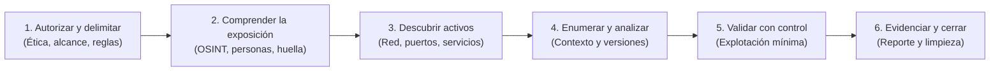
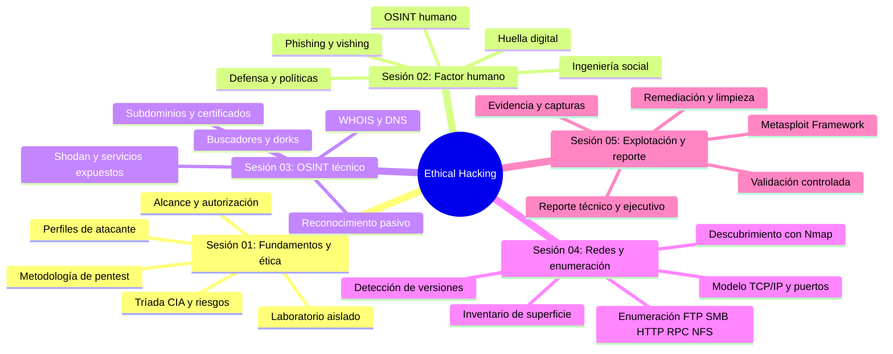
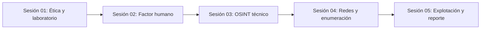
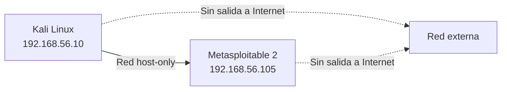

# Ethical Hacking: Metodología, Reconocimiento y Explotación Controlada

[Inicio](../README.md) | [Configurar laboratorio](../setup/README.md)

Ruta técnica y progresiva para comprender la metodología de una evaluación de seguridad, desde el marco ético y autorizado hasta el reconocimiento, la enumeración, la validación controlada de hallazgos y la entrega de un reporte profesional.

> [!CAUTION]
> **Alcance y ética**: Todo el material se practica exclusivamente contra máquinas virtuales aisladas o sistemas para los que exista autorización expresa por escrito. Ninguna técnica debe aplicarse contra infraestructura de terceros.

---

## Prólogo y Filosofía de Aprendizaje

Una evaluación de seguridad no empieza ejecutando exploits ni termina obteniendo una shell. Empieza delimitando un alcance autorizado, continúa comprendiendo qué expone una organización y solo después valida, con el mínimo impacto posible, si una debilidad es un riesgo real.

Este curso se estructura bajo la metodología:



El hilo conductor es una regla constante: **la observación no es una vulnerabilidad**. Cada dato recolectado se registra como evidencia y se valida antes de convertirse en un hallazgo.

---

## Roadmap de Estudio



---

## Tabla de Sesiones

| # | Sesión | Descripción técnica | Duración | Nivel | Práctica / Lab | Estado |
|---|---|---|---|---|---|---|
| **01** | [**Fundamentos, ética y laboratorio**](./01-fundamentos-etica-y-laboratorio/README.md) | Tríada CIA, tipos de atacantes, ethical hacking, metodología de evaluación, alcance, autorización y construcción de un entorno aislado reproducible. | 2 h | Inicial | [Laboratorio de entorno aislado](./01-fundamentos-etica-y-laboratorio/lab/) | **Disponible** |
| **02** | [**Ingeniería social y OSINT humano**](./02-ingenieria-social-y-osint-humano/README.md) | Factor humano, técnicas de persuasión, phishing, vishing y pretexting, huella digital, enumeración pasiva de personas y controles de defensa. | 2 h | Inicial | [Laboratorio de perfil sintético](./02-ingenieria-social-y-osint-humano/lab/) | **Disponible** |
| **03** | [**Reconocimiento y OSINT técnico**](./03-reconocimiento-y-osint-tecnico/README.md) | Reconocimiento pasivo y activo, WHOIS, registros DNS, subdominios, certificados, dorks en buscadores y exposición de servicios con Shodan. | 2 h | Inicial - Intermedio | [Laboratorio de huella técnica](./03-reconocimiento-y-osint-tecnico/lab/) | **Disponible** |
| **04** | [**Redes, descubrimiento y enumeración**](./04-redes-descubrimiento-y-enumeracion/README.md) | Modelo TCP/IP, estados de puerto, descubrimiento de hosts, escaneo, detección de versiones y enumeración de FTP, SMB, HTTP, RPC y NFS. | 3 h | Intermedio | [Laboratorio con Metasploitable 2](./04-redes-descubrimiento-y-enumeracion/lab/) | **Disponible** |
| **05** | [**Explotación controlada y reportes**](./05-explotacion-controlada-y-reportes/README.md) | Metasploit Framework, criterios de validación, explotación mínima, contención, recolección de evidencia y redacción de reporte técnico y ejecutivo. | 3 h | Intermedio - Avanzado | [Laboratorio de validación y reporte](./05-explotacion-controlada-y-reportes/lab/) | **Disponible** |

---

## Estructura de una Sesión

```text
NN-tema/
|-- README.md          # Teoría, diagramas Mermaid y Cheatsheet
`-- lab/
    |-- README.md       # Pasos, resultados y evidencias
    `-- archivos-de-apoyo
```

Empieza por la [Sesión 01](./01-fundamentos-etica-y-laboratorio/README.md) y ejecuta el [laboratorio](./01-fundamentos-etica-y-laboratorio/lab/) cuando llegues a la práctica.

---

## Dependencias entre Sesiones



Cada sesión asume las anteriores. El reconocimiento de la sesión 03 alimenta el inventario de activos que la sesión 04 valida en red, y ambas sostienen los hallazgos que la sesión 05 explota de forma controlada.

---

## Matriz de Cobertura de Estándares

| Estándar | Identificador | Nombre | Sesión cubierta |
|---|---|---|---|
| **MITRE ATT&CK** | T1595 | Active Scanning | [Sesión 04](./04-redes-descubrimiento-y-enumeracion/README.md) |
| **MITRE ATT&CK** | T1590 | Gather Victim Network Information | [Sesión 03](./03-reconocimiento-y-osint-tecnico/README.md) |
| **MITRE ATT&CK** | T1589 | Gather Victim Identity Information | [Sesión 02](./02-ingenieria-social-y-osint-humano/README.md) |
| **MITRE ATT&CK** | T1566 | Phishing | [Sesión 02](./02-ingenieria-social-y-osint-humano/README.md) |
| **PTES** | — | Pre-engagement Interactions | [Sesión 01](./01-fundamentos-etica-y-laboratorio/README.md) |
| **PTES** | — | Intelligence Gathering | [Sesión 03](./03-reconocimiento-y-osint-tecnico/README.md) |
| **PTES** | — | Vulnerability Analysis | [Sesión 04](./04-redes-descubrimiento-y-enumeracion/README.md) |
| **PTES** | — | Exploitation | [Sesión 05](./05-explotacion-controlada-y-reportes/README.md) |
| **PTES** | — | Reporting | [Sesión 05](./05-explotacion-controlada-y-reportes/README.md) |
| **OWASP WSTG** | WSTG-INFO | Information Gathering | [Sesión 03](./03-reconocimiento-y-osint-tecnico/README.md) |
| **CWE** | CWE-200 | Exposure of Sensitive Information to an Unauthorized Actor | [Sesión 03](./03-reconocimiento-y-osint-tecnico/README.md) |

---

## Preparación del Entorno de Prácticas

Antes de empezar:

1. Revisa la [Guía de Configuración del Laboratorio](../setup/README.md).
2. Utiliza una máquina virtual **Kali Linux** como plataforma de trabajo.
3. Configura una red **host-only** (por ejemplo `192.168.56.0/24`) sin acceso a Internet para los objetivos.
4. Para la sesión 04 y 05, despliega **Metasploitable 2** como objetivo autorizado.
5. Toma un snapshot limpio de cada VM antes de iniciar la práctica.



---

## Cómo Progresar

1. Estudia las sesiones en orden secuencial comenzando por la [Sesión 01](./01-fundamentos-etica-y-laboratorio/README.md).
2. Lee la teoría, interpreta los diagramas y consulta la Cheatsheet de cada sesión.
3. Ejecuta cada laboratorio dentro de la red aislada y conserva las evidencias.
4. Termina la ruta con el [reporte técnico de la sesión 05](./05-explotacion-controlada-y-reportes/lab/README.md).

[Volver al Catálogo Principal del Repositorio](../README.md)
