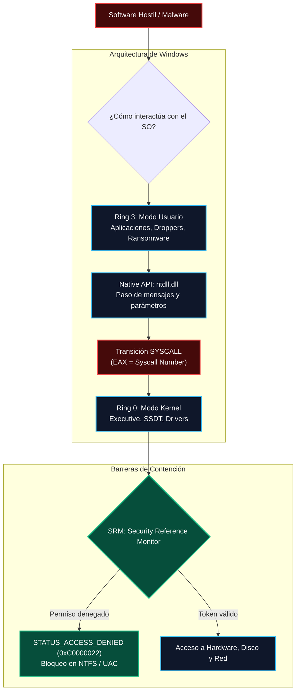
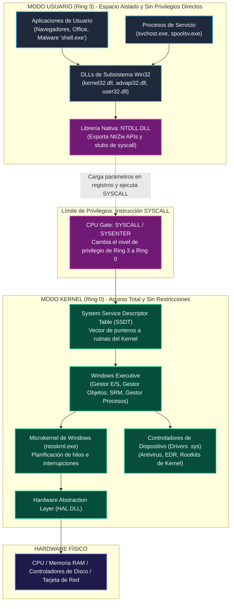
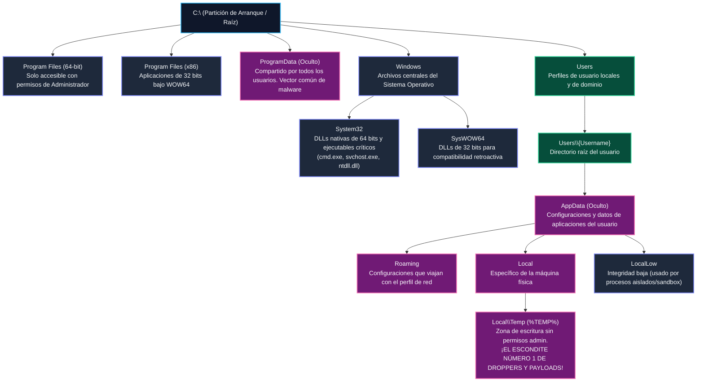
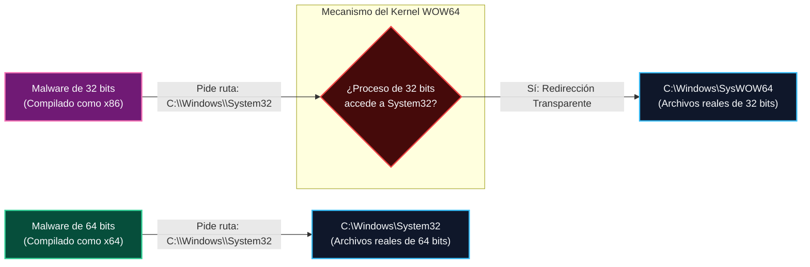
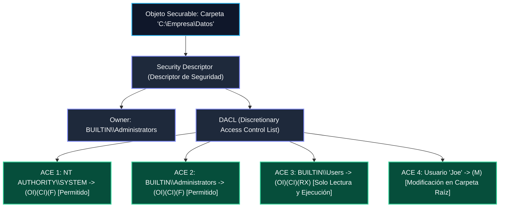
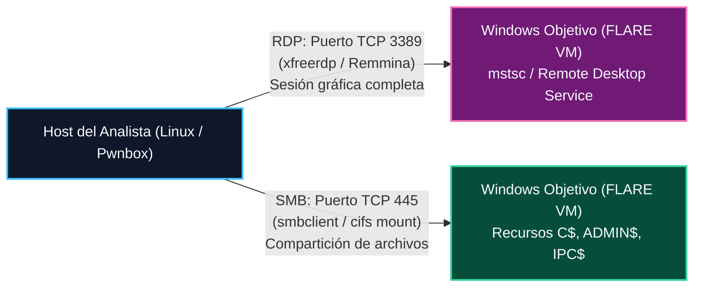

# Capítulo 01: Arquitectura de Windows, Directorios y Permisos NTFS

[Inicio](../../README.md) | [Análisis de Malware](../README.md) | [Siguiente: Procesos, Servicios y Cuentas](../02-procesos-servicios-y-cuentas/README.md)

> [!CAUTION]
> **Enfoque de Seguridad**: El conocimiento de la arquitectura de Windows es indispensable tanto para la defensa forense como para entender cómo el malware se oculta, persiste y evade restricciones de seguridad. Las prácticas deben ejecutarse en una máquina virtual Windows de pruebas.

---

## 1. Introducción: ¿Por qué Windows es el Objetivo Principal?

En el análisis de malware y la respuesta a incidentes (DFIR), más del **70% de los incidentes en terminales (*endpoints*)** corporativos y personales involucran sistemas operativos Microsoft Windows. Esta prevalencia no obedece a un defecto intrínseco de diseño, sino a dos factores de economía del cibercrimen:

1. **Superficie de Ataque y Valor del Objetivo**: Windows es el estándar hegemónico en estaciones de trabajo y redes corporativas organizadas mediante Active Directory. Para un atacante o desarrollador de malware, invertir tiempo en explotar Windows garantiza el mayor retorno de inversión (*ROI*).
2. **Compatibilidad Histórica hacia Atrás**: Para permitir que aplicaciones empresariales desarrolladas hace décadas sigan funcionando, Windows mantiene subsistemas, APIs heredadas (Win32), protocolos de red compartida (SMB) y mecanismos de compatibilidad que los actores maliciosos explotan con frecuencia.



---

## 2. Arquitectura de Windows: Modo Usuario vs. Modo Kernel

Los procesadores modernos de arquitectura x86/x64 implementan anillos de protección de hardware (*privilege rings*). Windows organiza toda la ejecución del software en dos anillos principales:



### 2.1. Modo Usuario (Ring 3)
* **Aislamiento de Memoria**: Cada proceso en Modo Usuario tiene su propio **Espacio de Direcciones Virtuales (VAS - *Virtual Address Space*)**. Un programa normal no puede leer ni escribir en la memoria de otro proceso a menos que solicite permisos específicos al kernel.
* **Sin Acceso Directo al Hardware**: Ninguna aplicación en Modo Usuario puede escribir directamente en el disco duro, acceder a la tarjeta de red o modificar registros de control del CPU. Todo debe canalizarse a través de la API de Windows.
* **Estabilidad del Sistema**: Si un programa en Ring 3 falla (por ejemplo, una excepción de puntero nulo), el sistema operativo simplemente finaliza ese proceso sin comprometer la estabilidad del resto del sistema.

### 2.2. Modo Kernel (Ring 0)
* **Privilegios Absolutos**: El código en Ring 0 tiene control irrestricto sobre la memoria física, las instrucciones privilegiadas del CPU y todos los periféricos.
* **Componentes Clave**:
  * **Executive (`ntoskrnl.exe`)**: Aloja los subsistemas de soporte (I/O Manager para archivos y red, Object Manager para gestionar handles, y Security Reference Monitor - SRM para validar tokens y permisos).
  * **SSDT (*System Service Descriptor Table*)**: Tabla interna que indexa cada número de syscall con la dirección de memoria de la función que la ejecuta en el kernel.
  * **Drivers de Dispositivo (`.sys`)**: Módulos que interactúan directamente con hardware o software de seguridad (los agentes EDR y antivirus operan mediante drivers de minifiltro para interceptar lectura y escritura en disco).
* **Riesgo Crítico**: Un fallo o excepción no controlada en Ring 0 provoca un colapso completo del sistema (*Blue Screen of Death* - BSoD). El malware sofisticado que logra cargar un driver no firmado (rootkits de kernel) obtiene control absoluto y se vuelve invisible para herramientas de usuario.

---

## 3. Anatomía del Flujo de una Llamada a la API de Windows

Cuando un malware intenta escribir un ejecutable secundario en disco (técnica conocida como *Dropper*), no escribe los bytes directamente en el disco. Sigue una cadena jerárquica estricta:

```mermaid
sequenceDiagram
    autonumber
    actor Malware as Malware (shell.exe - Ring 3)
    participant Kernel32 as kernel32.dll (Win32 API)
    participant NTDLL as ntdll.dll (Native API)
    participant CPU as CPU Register State
    participant Kernel as Executive / SSDT (Ring 0)
    participant SRM as Security Ref. Monitor (SRM)
    participant Driver as NTFS Driver (ntfs.sys)

    Note over Malware,Kernel32: 1. Llamada a API documentada
    Malware->>Kernel32: CreateFileA("C:\\Users\\...\\payload.exe", GENERIC_WRITE...)
    Note over Kernel32: Convierte ANSI a Unicode y valida parámetros
    Kernel32->>NTDLL: NtCreateFile(&FileHandle, DesiredAccess, ObjectAttributes...)
    
    Note over NTDLL,CPU: 2. Preparación de Syscall
    NTDLL->>CPU: Carga el número de syscall en EAX (ej. 0x0055)
    NTDLL->>CPU: Carga puntero de argumentos en R10 / RDX
    NTDLL->>Kernel: Ejecuta instrucción SYSCALL (Salto a Ring 0)

    rect rgb(15, 23, 42)
        Note over Kernel,Driver: 3. Ejecución segura en Modo Kernel
        Kernel->>Kernel: Consulta SSDT usando el índice en EAX
        Kernel->>SRM: Validar Token de Seguridad del Proceso vs DACL del directorio
        alt Token no autorizado o UAC denegado
            SRM-->>Kernel: Permiso Denegado
            Kernel-->>NTDLL: STATUS_ACCESS_DENIED (0xC0000022)
            NTDLL-->>Kernel32: Traduce a ERROR_ACCESS_DENIED (5)
            Kernel32-->>Malware: Retorna INVALID_HANDLE_VALUE (-1)
        else Permiso Concedido
            SRM-->>Kernel: Acceso Aprobado
            Kernel->>Driver: Crea IRP (I/O Request Packet) hacia ntfs.sys
            Driver-->>Kernel: Handle asignado en la Object Table del proceso
            Kernel-->>NTDLL: Retorna STATUS_SUCCESS (0x00000000)
            NTDLL-->>Kernel32: Retorna Handle
            Kernel32-->>Malware: Retorna Handle válido (ej. 0x000000F4)
        end
    end
```



### Explicación Quirúrgica del Flujo
1. **Llamada Documentada (`kernel32.dll`)**: `CreateFileA` es la interfaz estándar que aprenden los programadores de software legítimo y creadores de malware. La letra `A` indica que recibe cadenas en formato ANSI (1 byte por carácter). Esta función se encarga de convertir la ruta a Unicode UTF-16LE y redirigir la llamada.
2. **Librería Nativa (`ntdll.dll`)**: Traduce la llamada de conveniencia a `NtCreateFile`, que es la API nativa no documentada de bajo nivel de Windows. Aquí reside el código ensamblador que prepara los registros del CPU.
3. **Instrucción `syscall`**: Cambia el modo del procesador de Ring 3 a Ring 0. El procesador salta a una dirección de memoria fija administrada por el kernel (`KiSystemCall64`), pasando el control a `ntoskrnl.exe`.
4. **Validación del SRM**: Antes de escribir un solo bit en disco, el Security Reference Monitor comprueba el **Token de Acceso** del proceso contra la **DACL** del directorio de destino. Si el usuario no tiene permisos de escritura, la operación se cancela en seco.

---

## 4. Estructura de Directorios del Sistema Windows

Para un analista de malware, el sistema de archivos de Windows no es una simple jerarquía de carpetas: es un mapa de escondites, puntos de persistencia y zonas con diferentes restricciones de ejecución.



### Tabla Anatómica de Rutas Críticas

| Directorio | Variable de Entorno | Permiso de Escritura Estándar | Relevancia en Análisis de Malware |
|---|---|---|---|
| `C:\Program Files` | `%ProgramFiles%` | Requiere Administrador / UAC | Binarios legítimos de 64 bits. El malware suele usar DLL Hijacking en aplicaciones vulnerables aquí instaladas. |
| `C:\Program Files (x86)` | `%ProgramFiles(x86)%` | Requiere Administrador / UAC | Binarios de 32 bits. |
| `C:\ProgramData` | `%ProgramData%` | **Lectura/Escritura para usuarios** | Carpeta oculta compartida. El malware deposita aquí ejecutables, scripts maliciosos o archivos de configuración cifrados para que cualquier usuario los ejecute. |
| `C:\Windows\System32` | `%SystemRoot%\System32` | Requiere `NT SERVICE\TrustedInstaller` | Contiene los ejecutables vitales (`svchost.exe`, `lsass.exe`, `cmd.exe`). El malware intenta camuflarse (*Masquerading*) usando nombres idénticos o colocar DLLs falsificadas. |
| `C:\Windows\SysWOW64` | N/A | Requiere `TrustedInstaller` | Contiene binarios de 32 bits en sistemas de 64 bits. |
| `C:\Users\<User>\AppData\Local\Temp` | `%TEMP%` o `%TMP%` | **Total Control para el usuario local** | **Punto de impacto inicial**. Más del 80% de los droppers, macros maliciosas y exploits descargan y ejecutan sus ejecutables de etapa 2 (`svchost.exe`, `update.exe`) aquí porque no requiere privilegios elevados. |
| `C:\Users\<User>\AppData\Roaming` | `%APPDATA%` | **Total Control para el usuario local** | Persistencia a nivel de usuario. Muchos infostealers y minadores se instalan aquí y modifican la clave `HKCU\Software\Microsoft\Windows\CurrentVersion\Run`. |

---

## 5. El Fenómeno WOW64 y la Redirección del Sistema de Archivos

Una de las mayores fuentes de confusión para los analistas principiantes es la coexistencia de código de 32 y 64 bits en Windows x64:

> [!IMPORTANT]
> **Paradoja de nombres en Windows**:
> * `C:\Windows\System32`: Contiene binarios y DLLs **nativas de 64 bits**.
> * `C:\Windows\SysWOW64`: Contiene binarios y DLLs **de 32 bits** (*Windows 32-bit on Windows 64-bit*).



### ¿Por qué importa en Análisis Forense?
Si analizas un malware de 32 bits y en su código desensamblado ves que intenta cargar `C:\Windows\System32\kernel32.dll`, el sistema operativo intercepta la llamada de forma transparente y le entrega `C:\Windows\SysWOW64\kernel32.dll`. Si buscas el archivo en Procmon o en el depurador, debes saber que el proceso fue redirigido a `SysWOW64`.

---

## 6. Sistema de Archivos: NTFS vs. FAT32

Windows admite varios sistemas de archivos, pero en entornos modernos el estándar indiscutible es **NTFS (New Technology File System)**:

| Característica | FAT32 | NTFS | Impacto en Seguridad y Análisis |
|---|---|---|---|
| **Límite de tamaño de archivo** | 4 GB | 16 TB (práctico) | Archivos grandes (como dumps de RAM `.raw` de 16 GB) no pueden guardarse en particiones FAT32. |
| **Journaling ($LogFile)** | No | **Sí** | NTFS registra todas las transacciones de archivos en un registro por adelantado. Si el sistema se apaga durante un ataque de ransomware, el sistema de archivos no se corrompe. |
| **Listas de Control de Acceso (ACL)** | No | **Sí** | Permite asignar permisos granulares por usuario y grupo a cada archivo y subcarpeta. FAT32 permite acceso total a cualquiera con acceso físico. |
| **Flujos de Datos Alternativos (ADS)** | No | **Sí (`file.exe:stream`)** | Los atacantes pueden ocultar código malicioso en flujos alternativos invisibles para el comando `dir` estándar. |

---

## 7. Permisos NTFS y Control Granular con `icacls`

La seguridad del sistema de archivos en Windows se implementa mediante **Descriptores de Seguridad** compuestos por una **DACL (Discretionary Access Control List)**. Cada entrada de la lista es una **ACE (Access Control Entry)** que especifica qué tiene permitido o denegado un usuario o grupo.



### 7.1. Banderas de Herencia en `icacls`
Al administrar o auditar permisos con la herramienta de consola `icacls`, es vital entender cada flag:

* **`(OI)` - Object Inherit**: Los archivos que se creen dentro de esta carpeta heredarán este permiso automáticamente.
* **`(CI)` - Container Inherit**: Las subcarpetas que se creen dentro de esta carpeta heredarán este permiso.
* **`(IO)` - Inherit Only**: El permiso no se aplica a la carpeta actual; únicamente a los archivos o carpetas que contenga.
* **`(I)` - Inherited**: El permiso no fue configurado directamente en este objeto, sino que proviene de una carpeta superior.

### 7.2. Banderas de Permiso
* **`(F)` - Full Access**: Control total (leer, escribir, modificar, eliminar y **cambiar permisos y propietario**).
* **`(M)` - Modify Access**: Lectura, ejecución, escritura y eliminación de archivos. No permite cambiar la propiedad ni la DACL.
* **`(RX)` - Read and Execute**: Leer contenido y ejecutar programas binarios o scripts.
* **`(R)` - Read-only**: Ver el contenido del archivo o listar los nombres de la carpeta.
* **`(W)` - Write-only**: Crear nuevos archivos o añadir datos sin permiso de lectura.
* **`(D)` - Delete**: Permiso específico para borrar el objeto.

### 7.3. Disección de Comandos Prácticos con `icacls`

```cmd
C:\> icacls "C:\Herramientas" /grant "analista:(OI)(CI)(RX)"
```
* `/grant`: Añade una nueva ACE de permiso permitido a la DACL existente.
* `analista`: La entidad de seguridad (usuario local o del dominio).
* `(OI)(CI)`: Hace que tanto los archivos nuevos como las subcarpetas hereden los permisos.
* `(RX)`: Concede lectura y ejecución.

```cmd
C:\> icacls "C:\Herramientas\Privado" /inheritance:d
```
* `/inheritance:d`: **Rompe la herencia** de la carpeta padre y copia los permisos heredados como permisos explícitos para que puedan editarse o eliminarse de forma independiente.

---

## 8. Acceso Remoto al Sistema: RDP (Puerto 3389) y SMB (Puerto 445)

En los laboratorios forenses y en incidentes reales, el analista opera habitualmente de forma remota contra la máquina de análisis:



### 8.1. Remote Desktop Protocol (RDP)
* Escucha por defecto en el puerto lógico **TCP 3389**.
* Permite interactuar con la GUI de Windows exactamente como si se estuviera sentado frente al monitor físico.
* En Linux, la herramienta estándar de conexión en entornos de prueba es `xfreerdp`:
  ```bash
  xfreerdp /v:192.168.100.20 /u:analista /p:'PurpeSec_2026!' /dynamic-resolution +clipboard
  ```
  * `/v:`: Dirección IP del objetivo.
  * `/u:` y `/p:`: Credenciales de usuario.
  * `/dynamic-resolution`: Ajusta automáticamente el escritorio remoto al tamaño de la ventana.
  * `+clipboard`: Habilita portapapeles compartido (usar con cautela; en detonación de malware debe deshabilitarse `-clipboard`).

### 8.2. Server Message Block (SMB)
* Protocolo para compartir archivos e impresoras a través de la red (puerto **TCP 445**).
* **Recursos Administrativos Ocultos**: Windows crea por defecto recursos compartidos terminados en `$`, como `C$` (toda la partición raíz) y `ADMIN$` (`C:\Windows`). Cualquier cuenta con privilegios de Administrador local puede conectarse a `\\IP\C$` y extraer o depositar archivos.
* **El caso de WannaCry y EternalBlue (MS17-010)**: El ransomware WannaCry utilizó un exploit contra la versión antigua del protocolo SMB (`SMBv1`) para propagarse de máquina en máquina a través del puerto 445 de forma completamente autónoma (comportamiento de gusano / *worm*), sin requerir interacción de ningún usuario.

---

## 9. Cheatsheet de Comandos Esenciales

| Comando | Intérprete | Propósito Forense |
|---|---|---|
| `dir C:\ /a` | CMD | Lista todos los archivos del directorio raíz, incluyendo archivos ocultos (`h`) y de sistema (`s`). |
| `tree C:\Users /f \| more` | CMD | Visualiza gráficamente la estructura completa de carpetas y archivos pantalla por pantalla. |
| `icacls "C:\ruta"` | CMD | Muestra la lista de control de acceso (DACL) completa y permisos de una carpeta. |
| `icacls "C:\ruta" /grant User:(OI)(CI)(M)` | CMD | Otorga permisos de modificación heredables a un usuario. |
| `icacls "C:\ruta" /inheritance:d` | CMD | Deshabilita la herencia de permisos y convierte los permisos heredados en explícitos. |
| `whoami /user` | CMD / PS | Muestra el nombre del usuario actual y su Identificador de Seguridad único (**SID**). |
| `whoami /priv` | CMD / PS | Enumera todos los privilegios asignados al token de seguridad actual (ej. `SeDebugPrivilege`). |
| `Get-ChildItem -Path Env:` | PowerShell | Lista todas las variables de entorno del sistema (incluyendo `%TEMP%` y `%APPDATA%`). |
| `Get-Acl -Path "C:\Windows" \| fl` | PowerShell | Muestra el descriptor de seguridad detallado y la cadena SDDL de una ruta. |

---

## 10. Laboratorio Práctico Asociado

Para consolidar estos conceptos de forma interactiva y verificable, continúa con la práctica oficial:

👉 [**Ir al Laboratorio: Auditoría de Rutas del Sistema y Permisos NTFS**](./lab/README.md)

En este laboratorio:
1. Realizarás una auditoría forense de directorios ocultos y rutas de impacto de malware (`%TEMP%`, `%PROGRAMDATA%`).
2. Romperás la herencia de permisos y configurarás reglas restrictivas con `icacls`.
3. Validarás la redirección WOW64 ejecutando herramientas de 32 y 64 bits.
4. Responderás los checkpoints de verificación técnica.
