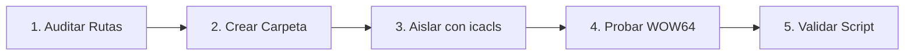

# Laboratorio 01: Auditoría de Arquitectura, Directorios Críticos y Permisos NTFS

[Volver a la teoría del Capítulo 01](../README.md) | [Análisis de Malware](../../README.md)

> [!IMPORTANT]
> **Propósito Pedagógico**: Este laboratorio te permite experimentar de forma práctica cómo Windows protege el sistema de archivos, cómo se organizan las rutas donde el malware busca ocultarse y cómo aislar un directorio de análisis manipulando listas de control de acceso (DACL) con `icacls`.

---

## 1. Escenario Operativo

Has sido asignado para acondicionar una estación de trabajo de análisis forense. Para garantizar que los artefactos maliciosos bajo investigación no puedan ser ejecutados accidentalmente por otros usuarios de la máquina ni transmitidos a carpetas públicas, debes:

1. Auditar las rutas del sistema comúnmente atacadas por malware (`%TEMP%`, `%APPDATA%`, `%PROGRAMDATA%`).
2. Crear un directorio seguro de contención en `C:\Purpesec_Lab\Muestras`.
3. Romper la herencia de permisos de la partición raíz `C:\` y restringir el acceso únicamente a los analistas acreditados.
4. Experimentar y documentar el fenómeno de redirección del sistema de archivos **WOW64**.
5. Validar la configuración ejecutando el script interactivo de auditoría `verificar_permisos.ps1`.

---

## 2. Diagrama de Flujo del Laboratorio



---

## 3. Guía de Ejecución Paso a Paso

### Paso 1: Exploración de Directorios Ocultos y Variables de Entorno

Abre una terminal de **PowerShell o Símbolo del sistema (CMD)** como Administrador.

1. Inspecciona la partición de arranque `C:\` incluyendo carpetas ocultas y protegidas del sistema:
   ```cmd
   dir C:\ /a
   ```
   *Observación*: Observa la presencia de carpetas como `$Recycle.Bin`, `ProgramData` (oculta con atributo `H`) y `System Volume Information`.

2. Consulta el valor de las variables de entorno donde el malware suele escribir sus ejecutables secundarios (*payloads*):
   ```powershell
   Get-ChildItem env:TEMP, env:APPDATA, env:ProgramData
   ```
   *Salida esperada*:
   * `TEMP`: Suele apuntar a `C:\Users\<TuUsuario>\AppData\Local\Temp`.
   * `APPDATA`: Apunta a `C:\Users\<TuUsuario>\AppData\Roaming`.
   * `ProgramData`: Apunta a `C:\ProgramData`.

---

### Paso 2: Creación y Aislamiento de la Carpeta de Muestras con `icacls`

1. Crea la carpeta de trabajo:
   ```powershell
   New-Item -ItemType Directory -Path "C:\Purpesec_Lab\Muestras" -Force
   ```

2. Inspecciona los permisos iniciales que la carpeta heredó automáticamente de `C:\`:
   ```cmd
   icacls "C:\Purpesec_Lab\Muestras"
   ```
   *Observación*: Verás que grupos como `BUILTIN\Users:(OI)(CI)(RX)` o `Everyone` tienen permisos de lectura y ejecución concedidos por herencia `(I)`.

3. **Rompe la herencia de permisos**:
   ```cmd
   icacls "C:\Purpesec_Lab\Muestras" /inheritance:d
   ```
   *Explicación*: El modificador `/inheritance:d` desvincula la carpeta de la partición raíz `C:\` y convierte las reglas heredadas en reglas explícitas locales.

4. **Elimina el acceso al grupo general de usuarios (`Users`)**:
   ```cmd
   icacls "C:\Purpesec_Lab\Muestras" /remove "BUILTIN\Users"
   ```

5. **Garantiza control total exclusivo a los Administradores con herencia para subcarpetas y archivos**:
   ```cmd
   icacls "C:\Purpesec_Lab\Muestras" /grant "BUILTIN\Administrators:(OI)(CI)(F)"
   ```
   *Desglose del comando*:
   * `BUILTIN\Administrators`: El grupo de administradores locales.
   * `(OI)`: *Object Inherit* (los archivos heredarán control total).
   * `(CI)`: *Container Inherit* (las subcarpetas heredarán control total).
   * `(F)`: *Full Control*.

6. Verifica la nueva lista de control de acceso:
   ```cmd
   icacls "C:\Purpesec_Lab\Muestras"
   ```
   *Resultado esperado*: Solo `BUILTIN\Administrators` y `NT AUTHORITY\SYSTEM` deben figurar con permisos `(F)`.

---

### Paso 3: Demostración Experimental de la Redirección WOW64

Para comprobar cómo el kernel de Windows engaña a los programas de 32 bits redirigiéndolos de `System32` a `SysWOW64`:

1. Abre la consola nativa de **PowerShell de 64 bits** (la habitual de Windows) y consulta la arquitectura del proceso:
   ```powershell
   [Environment]::Is64BitProcess
   ```
   *Debe responder*: `True`.

2. Ahora inicia la versión de **32 bits de PowerShell** ejecutando:
   ```cmd
   C:\Windows\SysWOW64\WindowsPowerShell\v1.0\powershell.exe
   ```
3. En la nueva ventana que se abre, consulta el mismo comando:
   ```powershell
   [Environment]::Is64BitProcess
   ```
   *Debe responder*: `False`.

4. Desde esta ventana de 32 bits, lista el contenido de `C:\Windows\System32`:
   ```powershell
   Test-Path "C:\Windows\System32\cmd.exe"
   ```
   *Análisis Forense*: Aunque solicitaste la ruta `System32`, el kernel de Windows transparentemente redirigió la petición a `C:\Windows\SysWOW64`. Los analistas de malware deben recordar siempre esta redirección cuando analicen ejecutables compilados en 32 bits que intenten manipular DLLs del sistema.
5. Cierra la consola de 32 bits escribiendo `exit`.

---

### Paso 4: Ejecución del Script de Verificación Automática

Ubícate en la carpeta donde se encuentra este laboratorio y ejecuta el script de validación:

```powershell
Set-ExecutionPolicy Bypass -Scope Process -Force
.\verificar_permisos.ps1 -RutaMuestras "C:\Purpesec_Lab\Muestras"
```

El script evaluará:
* Si el sistema operativo es de 64 bits.
* La accesibilidad de las 4 rutas críticas de malware.
* La propiedad y el estado de la DACL en la carpeta de muestras.
* Si la herencia de permisos fue deshabilitada con éxito.

---

## 4. Checkpoints de Verificación Técnica

Responde a las siguientes preguntas para comprobar tu asimilación de los conceptos:

### Checkpoint 1
**¿Por qué los creadores de malware eligen casi siempre `%TEMP%` o `%APPDATA%` para descargar sus cargas útiles en lugar de `C:\Program Files`?**
> **Respuesta**: Porque `C:\Program Files` requiere privilegios administrativos y dispararía una alerta de UAC (*User Account Control*), mientras que `%TEMP%` y `%APPDATA%` otorgan control total y permisos de escritura al usuario estándar sin necesidad de elevar privilegios.

### Checkpoint 2
**Si aplicas el comando `icacls C:\Muestras /grant analista:F` omitiendo `(OI)(CI)`, ¿qué ocurre cuando creas un archivo dentro de esa carpeta?**
> **Respuesta**: El usuario `analista` tendrá acceso a la carpeta raíz `C:\Muestras`, pero el archivo nuevo **no heredará** el permiso, impidiendo que el analista pueda abrirlo o editarlo sin volver a conceder permisos manualmente.

### Checkpoint 3
**En un sistema Windows de 64 bits, ¿qué arquitectura tienen los ejecutables almacenados en `C:\Windows\System32`?**
> **Respuesta**: Tienen arquitectura nativa de **64 bits**. Los ejecutables de 32 bits se encuentran en `C:\Windows\SysWOW64`.

---

[Avanzar al Capítulo 02: Procesos, Servicios del Sistema y Cuentas de Acceso](../02-procesos-servicios-y-cuentas/README.md)
