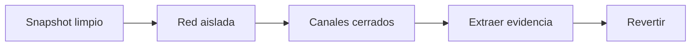
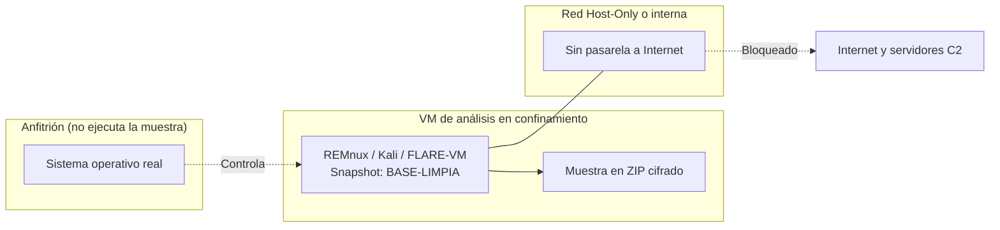
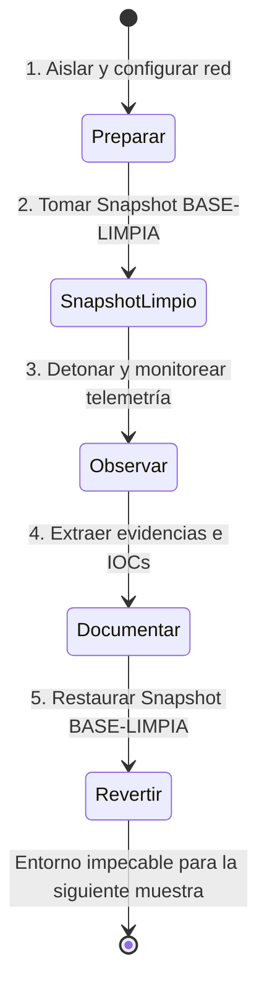

# Capítulo 02: Entornos de análisis seguros y manejo de muestras

[Inicio](../../README.md) | [Análisis de Malware](../README.md) | [Anterior: Fundamentos del malware](../01-fundamentos-y-taxonomia/README.md) | [Siguiente: Análisis estático inicial](../03-analisis-estatico-inicial/README.md)

> [!CAUTION]
> Ningún análisis justifica exponer el equipo anfitrión, la red local o terceros. Un error de aislamiento puede propagar una muestra real. Trabaja siempre en una máquina virtual descartable y sin salida a Internet.

## Introducción

El análisis de malware empieza por la contención. Antes de formular una hipótesis sobre un binario, el analista debe garantizar que ese binario no puede alcanzar el sistema anfitrión ni la red.



Este capítulo describe el confinamiento, los modos de red, la disciplina de instantáneas y el manejo seguro de muestras. El laboratorio asociado verifica de forma determinista que el aislamiento es real.

---

## 1. El protocolo de contención: antes de tocar una muestra

La regla más crítica en el ejercicio del análisis de malware es la **seguridad operativa (OPSEC) y la contención de daños**. Un fallo de procedimiento puede provocar la infección accidental de la máquina anfitriona (*host*), la fuga de artefactos hacia la red corporativa o la comunicación involuntaria con servidores de comando y control (C2) de cibercriminales en activo.

1. **Autorización:** confirma el objetivo educativo o el alcance formal por escrito.
2. **Dedicación:** utiliza siempre una VM aislada; jamás el equipo real.
3. **Canales:** desactiva carpetas compartidas, portapapeles, arrastrar y soltar y USB.
4. **Topología:** configura red Host-Only o interna; el modo Bridge queda prohibido.
5. **Reversión:** captura un snapshot limpio antes de introducir la muestra.
6. **Evidencias:** define qué datos extraerás antes de revertir la máquina.



### Canales de escape del hipervisor a desactivar obligatoriamente

Los hipervisores modernos (VirtualBox, VMware Workstation, Hyper-V) incorporan características de conveniencia para transferir archivos y texto entre el sistema invitado y el anfitrión. En un laboratorio de malware, **estas características son vectores de fuga inaceptables**:

1. **Carpetas Compartidas (*Shared Folders*)**: Desactivadas permanentemente. Si un malware de tipo ransomware cifra unidades mapeadas, podría alcanzar los directorios del host.
2. **Portapapeles Compartido (*Shared Clipboard*)**: Configurado en `Desactivado` (*Disabled*). Evita que scripts maliciosos manipulen el contenido del portapapeles del anfitrión.
3. **Arrastrar y Soltar (*Drag and Drop*)**: Configurado en `Desactivado`.
4. **Dispositivos USB Compartidos**: Desmontar filtros automáticos de captura de pendrives USB.

---

## 2. Modos de red en máquinas virtuales y riesgos asociados

La configuración del adaptador de red virtual determina si el malware puede comunicarse con el exterior, propagarse por la red local física o quedar estrictamente contenido:

| Modo de Red | Comportamiento técnico | Nivel de Peligro | ¿Admisible en Análisis de Malware? |
|---|---|---|---|
| **Bridged (Puente)** | La VM obtiene una dirección IP de la red local física real y es accesible por otros dispositivos de la LAN. | **EXTREMO** | **ABSOLUTAMENTE PROHIBIDO**. Un gusano de red (como WannaCry) podría infectar el resto de ordenadores de tu casa u oficina. |
| **NAT (Network Address Translation)** | La VM comparte la conexión a Internet del anfitrión. El anfitrión actúa como router. | **ALTO** | **NO RECOMENDADO**. La muestra puede comunicarse con su C2 en Internet, descargar payloads adicionales o participar en ataques DDoS. |
| **Host-Only (Solo-Anfitrión)** | Se crea una red privada virtual donde solo pueden comunicarse las VMs conectadas y el host (sin salida a Internet). | **BAJO** | **ADMISIBLE**. Permite conectar una VM de análisis con otra VM que simule servicios de red (ej. INetSim). |
| **Internal Network (Red Interna)** | Las VMs solo pueden comunicarse entre sí. El host anfitrión ni siquiera tiene interfaz IP en ese segmento. | **MÍNIMO** | **RECOMENDADO / ESTÁNDAR**. Aislamiento total frente a la red exterior y frente al anfitrión. |

> [!CAUTION]
> Durante la fase de análisis estático y dinámico inicial, la regla es categórica: **Sin Bridge, sin NAT y sin pasarela por defecto hacia Internet**.

---

## 3. La disciplina de Snapshots y el Ciclo Limpio de Trabajo

Una máquina virtual contaminada con residuos de una detonación previa invalida cualquier conclusión analítica posterior. Si ejecutas una muestra en una VM donde previamente corriste otro malware, no podrás saber qué archivo o clave de registro pertenece a qué amenaza.



### El Snapshot `BASE-LIMPIA`
1. Instala el sistema operativo de análisis con todas las herramientas requeridas (desensambladores, editores hexadecimales, monitores de sistema).
2. Desactiva Windows Defender o el antivirus interno de la VM (para evitar que elimine las muestras durante el laboratorio).
3. Apaga completamente la máquina virtual o déjala en el escritorio sin procesos activos.
4. Toma una instantánea denominada **`BASE-LIMPIA`**.
5. **Regla de oro**: Tras cada análisis, **revierte la máquina virtual a `BASE-LIMPIA`**. Jamás guardes el estado de una VM infectada para continuar trabajando al día siguiente sobre esa misma base.

---

## 4. Almacenamiento y transporte seguro de muestras

Para manipular binarios maliciosos sin activar alertas accidentales en el sistema operativo anfitrión ni permitir ejecuciones involuntarias por doble clic:

```text
CONTENEDOR DE TRANSPORTE SEGURO:
[ Archivo comprimido .ZIP con cifrado de cabeceras ]
  ├── Contraseña estándar convenida: "infected" o "velvet"
  ├── Contenido interno: muestra.exe (o renombrado a muestra.bin / muestra.malware)
```

1. **Cifrado con contraseña**: La contraseña impide que los motores antivirus residentes en el anfitrión o filtros de correo analicen y eliminen el archivo en tránsito.
2. **Convención de contraseñas**: La comunidad de ciberseguridad utiliza de forma unánime la clave `infected` (o `velvet` en ciertos entornos) para señalar claramente que el archivo contiene código potencialmente dañino.
3. **Desmitificación**: *Ponerle contraseña a un archivo ZIP reduce aperturas involuntarias por parte del usuario; no neutraliza la peligrosidad de la muestra cuando se extrae.*
4. **Nunca dejes ejecutables sueltos**: Las muestras solo se descomprimen dentro de la VM aislada, en una carpeta temporal designada, inmediatamente antes de analizarlas.

---

## 5. Plataformas y distribuciones especializadas

El analista de malware dispone de dos grandes ecosistemas de trabajo:

### 5.1 Entornos basados en Linux (Triage y Análisis Estático)
- **REMnux (Reverse Engineering Malware Linux)**:
  - Distribución mantenida por Lenny Zeltser basada en Ubuntu, optimizada para ingeniería inversa de ejecutables, análisis de documentos ofuscados (PDF, Office) y simulación de redes.
  - Incluye herramientas preconfiguradas: `floss`, `yara`, `ssdeep`, `pecheck`, `oledump`, `pdfid`, `radare2`, `ghidra`, `inetsim`.
- **Kali Linux**:
  - Distribución generalista de ciberseguridad que incluye herramientas esenciales de análisis estático (`file`, `strings`, `binutils`, `wireshark`, `nasm`).

### 5.2 Entornos basados en Windows (Análisis Dinámico y Formato PE)
- **FLARE-VM (Mandiant)**:
  - Conjunto de scripts de PowerShell que transforma un Windows 10/11 limpio en una estación de análisis de malware de nivel profesional.
  - Integra suites de telemetría: **Sysinternals Suite** (`Process Explorer`, `Procmon`), **Regshot**, **Detect It Easy (DIE)**, **PEStudio**, **PE-bear**, **x64dbg**, **Ghidra**, **FakeNet-NG**.

---

## 6. Fuentes de entrenamiento y riesgos de OPSEC en servicios cloud

### ¿Dónde obtener material seguro para practicar?
1. **Muestras sintéticas y educativas**: Código en C compilado por uno mismo (como el binario del Capítulo 03) para entrenar la extracción de strings y cabeceras sin peligro.
2. **El archivo estándar EICAR**: Cadena ASCII inofensiva de 68 caracteres diseñada para comprobar si un software antivirus está activo y responde a firmas sin utilizar código malicioso real.
3. **Malware-Traffic-Analysis.net**: Repositorio de capturas de red (PCAP) e informes forenses de infecciones reales sin ejecutables vivos.
4. **Repositorios de malware vivo (Solo en entornos de investigación avanzados)**: *theZoo*, *VirusShare*, *MalwareBazaar*. Requieren autorización explícita y experiencia consolidada en confinamiento.

### Advertencia crítica sobre servicios en la nube (VirusTotal, ANY.RUN, Hybrid Analysis)

```text
┌────────────────────────────────────────────────────────────────────────┐
│                        ALERTA DE SEGURIDAD OPSEC                       │
├────────────────────────────────────────────────────────────────────────┤
│ Servicios como VirusTotal o ANY.RUN son plataformas PÚBLICAS.           │
│ Cualquier muestra que subas a VirusTotal:                             │
│ 1. Se comparte inmediatamente con cientos de empresas de seguridad.   │
│ 2. Puede ser descargada por cualquier usuario con cuenta de pago.      │
│ 3. Si la muestra contiene contraseñas internas, URLs de servidores     │
│    privados o datos de tu organización, habrás provocado una FUGA DE   │
│    INFORMACIÓN (Data Leak) irreversible.                               │
│ NUNCA subas artefactos de un incidente real a la nube sin autorización.│
└────────────────────────────────────────────────────────────────────────┘
```

---

## Cheatsheet

Referencia rápida del capítulo en formato PDF: [cheatsheet.pdf](./cheatsheet.pdf).

---

[Anterior: Fundamentos del malware](../01-fundamentos-y-taxonomia/README.md) | [Volver al índice](../README.md) | [Siguiente: Análisis estático inicial](../03-analisis-estatico-inicial/README.md)
