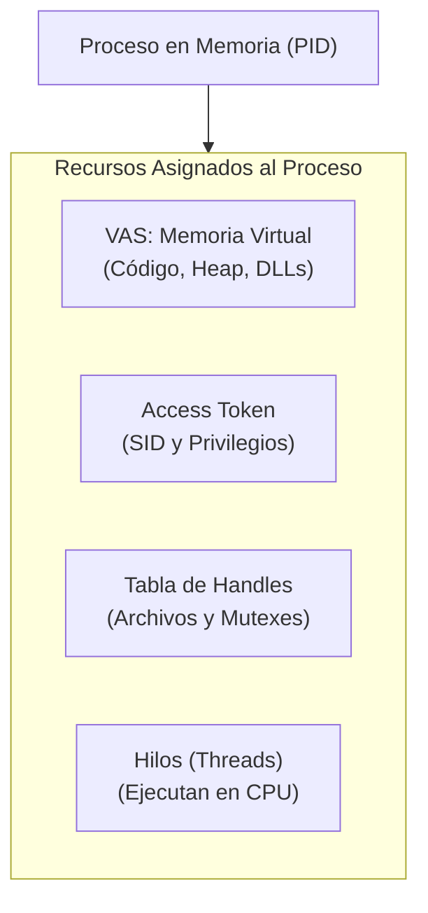
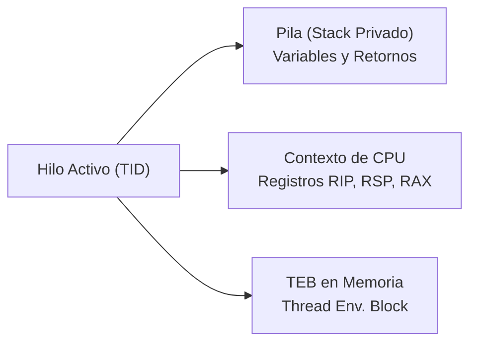
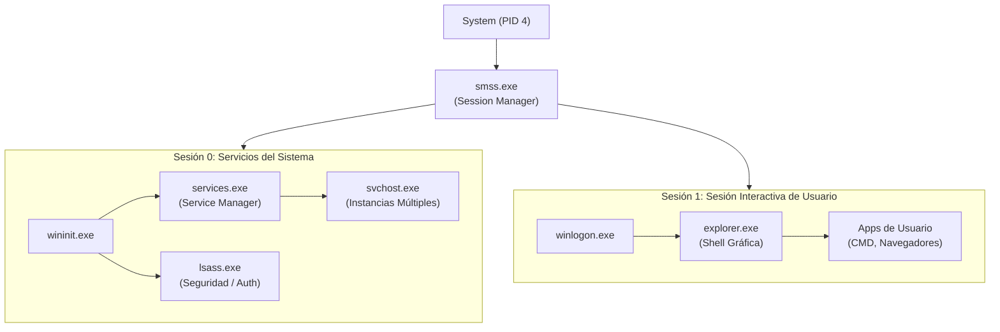
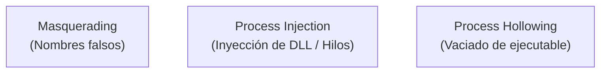
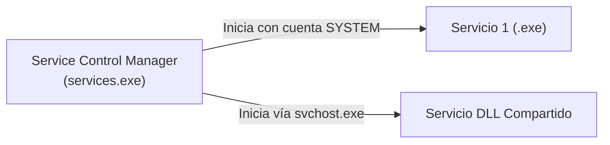
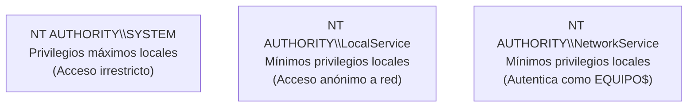

# Capítulo 02: Procesos, Hilos, Servicios del Sistema y Cuentas de Acceso

[Inicio](../../README.md) | [Análisis de Malware](../README.md) | [Capítulo 01: Arquitectura y Permisos](../01-arquitectura-windows-directorios-y-permisos/README.md) | [Capítulo 03: Registro y UAC](../03-registro-uac-seguridad-y-powershell/README.md)

Para un analista forense y de malware, los procesos y servicios de Windows son el escenario donde ocurre la ejecución del código hostil. El malware raramente opera como un programa convencional: manipula el espacio de memoria de otros programas, usurpa identidades de procesos legítimos, inyecta hilos en ejecutables del sistema o se instala como servicio persistente para ejecutarse con los privilegios más altos del sistema operativo.

> [!IMPORTANT]
> **Axioma del Analista**: "Un proceso no es el archivo en disco; es una instancia viva en memoria". Dos archivos idénticos en disco pueden comportarse de forma radicalmente distinta en memoria si uno de ellos ha sufrido manipulación de tokens, inyección de DLLs o secuestro de hilos (*Thread Hijacking*).

---

## 1. Anatomía de un Proceso en Windows

En Windows, un **proceso** no ejecuta código directamente. Un proceso es un **contenedor de recursos** aislado que el sistema operativo crea para proporcionar el entorno necesario donde uno o varios **hilos (threads)** ejecutan las instrucciones en el CPU.



### Componentes Vitales de un Proceso

1. **PID (Process Identifier)**: Identificador numérico único asignado por el kernel al crear el proceso. Los PIDs son múltiplos de 4 en Windows moderno.
2. **VAS (Virtual Address Space - Espacio de Direcciones Virtuales)**:
   * En sistemas de 64 bits (x64), cada proceso dispone de un espacio de memoria virtual privado de **128 Terabytes**.
   * El proceso cree tener acceso exclusivo a toda la memoria; el Administrador de Memoria del kernel traduce estas direcciones virtuales a direcciones físicas de memoria RAM mediante tablas de páginas (*Page Tables*).
3. **Tabla de Handles (Punteros a Objetos del Kernel)**:
   * Los procesos en Modo Usuario no pueden acceder directamente a estructuras del kernel.
   * Cuando un malware abre un archivo (`CreateFile`), un proceso víctima (`OpenProcess`) o una clave de registro (`RegOpenKey`), el kernel le devuelve un valor numérico indirecto llamado **Handle**.
4. **Token de Acceso (Access Token)**:
   * La "tarjeta de identidad" del proceso. Contiene el SID del usuario propietario, la lista de grupos a los que pertenece y los **Privilegios de Seguridad** habilitados (por ejemplo, `SeDebugPrivilege` o `SeShutdownPrivilege`).
5. **Estructuras Internas: EPROCESS vs. PEB**:

| Estructura | Ubicación en Memoria | Accesible por | Importancia en Análisis de Malware |
|---|---|---|---|
| **`EPROCESS`** | Modo Kernel (Ring 0) | Kernel / Drivers | Estructura interna del kernel que define el proceso. Contiene punteros al PID, proceso padre, lista de hilos y el directorio de páginas de memoria (CR3). Si un rootkit altera la lista doblemente enlazada de `EPROCESS`, puede hacer que un proceso sea invisible para el Administrador de Tareas (*DKOM - Direct Kernel Object Manipulation*). |
| **`PEB` (Process Environment Block)** | Modo Usuario (Ring 3) | Proceso / Analista | Estructura ubicada en el espacio de usuario del propio proceso. Contiene información crítica que el malware consulta activamente: el flag `BeingDebugged` (técnica anti-depuración), la lista `InMemoryOrderModuleList` (módulos cargados en memoria para buscar APIs sin llamar a `GetProcAddress`), y los argumentos de línea de comandos. |

---

## 2. Hilos (Threads) y Contexto de Ejecución

Si el proceso es el contenedor de recursos, el **hilo (thread)** es la entidad que ejecuta las instrucciones en el procesador.



* **TID (Thread Identifier)**: Identificador único de cada hilo.
* **Stack (Pila de Ejecución)**: Región de memoria privada de cada hilo que almacena parámetros de funciones, direcciones de retorno y variables locales.
* **Contexto de Registros**: Cuando el programador del kernel (*Scheduler*) conmuta la ejecución entre diferentes hilos, guarda el estado exacto de los registros del CPU (`RIP`, `RSP`, `RAX`, etc.) para reanudar la ejecución sin pérdida de datos.
* **Abuso por Malware**: Un malware puede crear hilos dentro de un proceso legítimo ajeno mediante la API `CreateRemoteThread`. Esto le permite ejecutar código malicioso dentro de un proceso de confianza como `svchost.exe` o `notepad.exe` para evadir la detección de antivirus y firewalls locales.

---

## 3. El Árbol de Procesos Legítimo de Windows (*Baseline*)

Para identificar procesos maliciosos camuflados, el analista debe dominar la jerarquía estándar con la que Windows arranca sus procesos esenciales. Cualquier desviación en la ruta, el proceso padre o la cuenta de usuario es un **indicador de compromiso (IoC)** de alta fidelidad.



### Tabla Anatómica de Procesos Críticos del Sistema

| Proceso | Ruta Canónica | Proceso Padre Legítimo | Cuenta de Ejecución | Instancias | ¿Qué hace y cómo lo abusa el malware? |
|---|---|---|---|---|---|
| **`System`** | `N/A` (Memoria Kernel) | Ninguno | `NT AUTHORITY\SYSTEM` | 1 | Contenedor de hilos de drivers en modo kernel. Tiene siempre **PID 4**. El malware no puede reemplazarlo directamente, pero rootkits instalan drivers maliciosos que ejecutan hilos dentro de él. |
| **`smss.exe`** | `C:\Windows\System32\` | `System` | `NT AUTHORITY\SYSTEM` | 1 (Maestro) | Session Manager. Crea la Sesión 0 (servicios) y la Sesión 1 (usuario). Si se ejecuta fuera de `System32`, es malware. |
| **`csrss.exe`** | `C:\Windows\System32\` | `smss.exe` | `NT AUTHORITY\SYSTEM` | 2 o más | Client/Server Runtime Subsystem. Gestiona ventanas de consola y finalización de procesos. Es un proceso crítico; si se mata, Windows genera BSoD. |
| **`wininit.exe`** | `C:\Windows\System32\` | `smss.exe` | `NT AUTHORITY\SYSTEM` | 1 | Inicializa el subsistema de seguridad en Sesión 0 e inicia `services.exe` y `lsass.exe`. |
| **`services.exe`** | `C:\Windows\System32\` | `wininit.exe` | `NT AUTHORITY\SYSTEM` | 1 | **Service Control Manager (SCM)**. Inicia, detiene y supervisa todos los servicios y drivers. Es el único padre legítimo de `svchost.exe`. |
| **`lsass.exe`** | `C:\Windows\System32\` | `wininit.exe` | `NT AUTHORITY\SYSTEM` | 1 | **Local Security Authority**. Aplica directivas de seguridad, genera tokens de acceso y almacena credenciales en memoria (hashes NTLM, tickets Kerberos). **Objetivo #1 de los atacantes**: utilizan herramientas como Mimikatz o volcados de memoria (`MiniDumpWriteDump`) para extraer credenciales en texto claro. |
| **`svchost.exe`** | `C:\Windows\System32\` | `services.exe` | `SYSTEM`, `NetworkService`, `LocalService` | Múltiples (10 - 80+) | Host de servicios DLL compartidos. **Objetivo preferido de camuflaje**: el malware crea nombres falsos como `svch0st.exe`, `scvhost.exe`, o se ejecuta desde `%TEMP%` con un padre incorrecto (como `cmd.exe`). |
| **`explorer.exe`** | `C:\Windows\` | No tiene padre activo (iniciado por `userinit.exe`) | `<Usuario Autenticado>` | 1 por usuario | Proporciona la barra de tareas, escritorio y explorador de archivos. Es el padre legítimo de todos los programas que el usuario ejecuta haciendo doble clic. |

---

## 4. Técnicas de Evasión y Camuflaje en Procesos

Los atacantes emplean diversas técnicas para ocultar sus procesos a los ojos del analista:



1. **Masquerading (T1036)**:
   * Alteración tipográfica: nombrar el ejecutable malicioso `svch0st.exe`, `lsas.exe` o `taskmngr.exe`.
   * Rutas incorrectas: ejecutar `svchost.exe` desde `C:\Users\analista\AppData\Local\Temp\` en lugar de `C:\Windows\System32\`.
2. **Process Injection (T1055)**:
   * El malware no corre como un proceso nuevo. Abre un proceso legítimo en ejecución (`OpenProcess`), reserva memoria en él (`VirtualAllocEx`), escribe su shellcode (`WriteProcessMemory`) y fuerza la ejecución con un nuevo hilo (`CreateRemoteThread`).
3. **Process Hollowing (T1055.012)**:
   * El malware inicia un proceso legítimo en estado suspendido (`CreateProcess` con `CREATE_SUSPENDED`), vacía su código original de la memoria (`NtUnmapViewOfSection`), escribe el código malicioso en esa base de memoria y reanuda el hilo (`ResumeThread`). Para Process Explorer, parece un proceso legítimo firmado.

---

## 5. Servicios de Windows y el Service Control Manager (SCM)

Un **servicio de Windows** es una aplicación diseñada para ejecutarse en segundo plano sin intervención humana y sin necesidad de que un usuario inicie una sesión interactiva en el sistema.



### 5.1. Tipos de Inicio de un Servicio

* **Automático (`auto`)**: El servicio se inicia durante el arranque del sistema operativo, antes de que cualquier usuario inicie sesión.
* **Automático Demorado (`delayed-auto`)**: Se inicia poco después del arranque para priorizar servicios críticos.
* **Manual / Por Demanda (`demand`)**: Se inicia solo cuando una aplicación o el usuario lo solicita explícitamente.
* **Deshabilitado (`disabled`)**: El servicio no puede ser iniciado bajo ninguna circunstancia.

### 5.2. Cuentas de Servicio de Windows

Cada servicio se ejecuta bajo una identidad de seguridad concreta:



* **`NT AUTHORITY\SYSTEM` (LocalSystem)**: Máxima autoridad en la máquina local. Posee control absoluto sobre el registro, archivos protegidos y memoria. El malware busca instalar servicios bajo esta cuenta para conseguir persistencia con privilegios totales.
* **`NT AUTHORITY\LocalService`**: Diseñada para servicios que requieren mínimos privilegios locales. Si un atacante compromete un servicio en esta cuenta, queda restringido y no puede acceder a recursos de otros usuarios.
* **`NT AUTHORITY\NetworkService`**: Privilegios locales reducidos similares a LocalService, pero cuando accede a recursos de red en un dominio, se presenta con la identidad de la máquina (`NOMBRE_HOST$`).

---

## 6. Comandos Forenses para Inspección de Procesos y Servicios

### 6.1. Enumeración desde PowerShell

```powershell
# 1. Listar procesos con PID, Nombre, Ruta y Propietario
Get-Process | Select-Object Id, ProcessName, Path, Company | Sort-Object Id

# 2. Detectar procesos ejecutándose fuera de C:\Windows o C:\Program Files
Get-Process | Where-Object { $_.Path -and $_.Path -notmatch "^C:\\Windows" -and $_.Path -notmatch "^C:\\Program Files" } | Select-Object Id, ProcessName, Path

# 3. Listar servicios activos con su ruta ejecutable y cuenta de servicio
Get-CimInstance Win32_Service | Select-Object Name, State, StartMode, StartName, PathName | Format-Table -AutoSize
```

### 6.2. Comandos Clásicos con `tasklist`, `wmic` y `sc.exe`

```cmd
:: 1. Listar procesos con detalles del usuario ejecutor
tasklist /v /fo table

:: 2. Identificar la línea de comandos completa con la que se inició un proceso sospechoso
wmic process where "name='svchost.exe'" get ProcessId, ParentProcessId, CommandLine

:: 3. Consultar la configuración exacta de un servicio en el SCM
sc.exe qc LanmanServer
```

---

## 7. Cheatsheet Rápido de Detección de Anomalías

| Indicador Sospechoso | Causa Común | Verificación Inmediata |
|---|---|---|
| `svchost.exe` con padre distinto a `services.exe` | Inyección o ejecutable falso (*Masquerading*) | `Get-CimInstance Win32_Process -Filter "Name='svchost.exe'" \| Select-Object ProcessId, ParentProcessId` |
| Proceso del sistema ejecutándose desde `%TEMP%` o `%APPDATA%` | Dropper o payload de malware | Revisar `Path` con Process Explorer o PowerShell |
| Servicio nuevo con tipo de inicio `auto` apuntando a ruta de usuario | Persistencia de malware instalada | `Get-CimInstance Win32_Service \| Where-Object { $_.PathName -match "AppData" }` |
| Proceso con firma digital inválida o sin firmar en `System32` | Binario modificado o falso | Menú *Verify Signatures* en Process Explorer |
| Conexión de red saliente iniciada por `cmd.exe` o `powershell.exe` | Reverse shell o balizamiento C2 | `Get-NetTCPConnection -OwningProcess <PID>` |

---

## Próximos Pasos

Avanza al [Laboratorio Práctico del Capítulo 02](./lab/README.md) para auditar procesos, simular un servicio malicioso en un entorno seguro y verificar tus hallazgos con el script automatizado.
