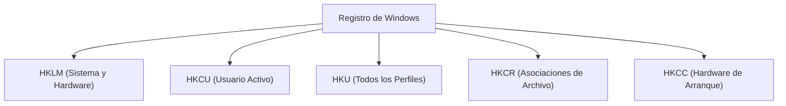
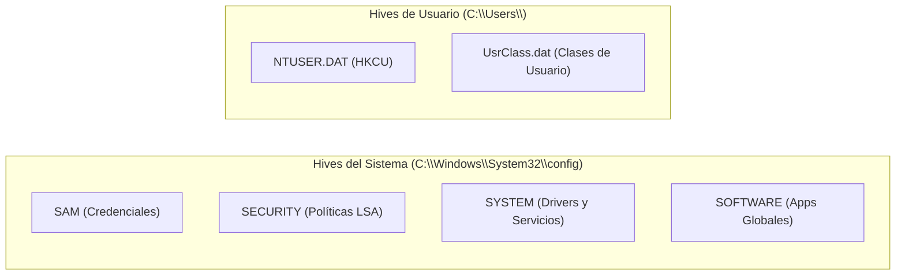
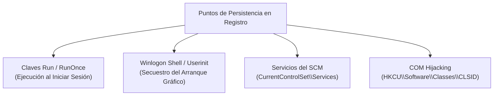
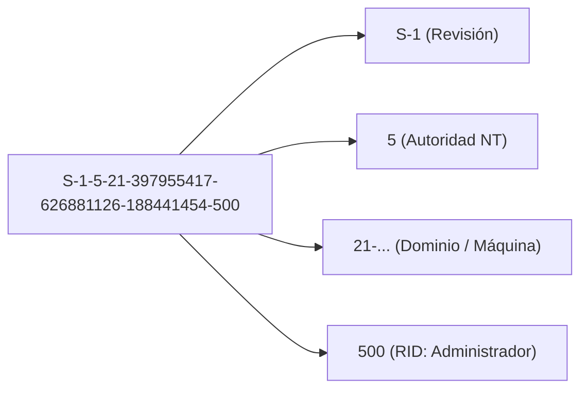
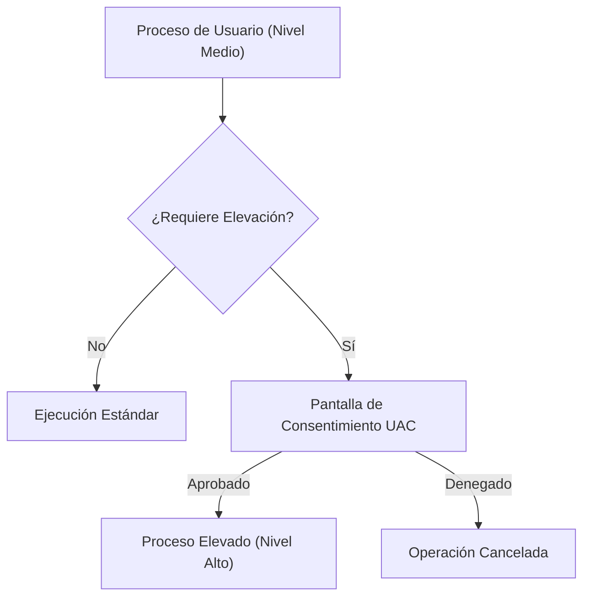
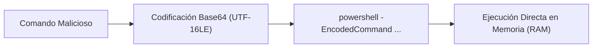

# Capítulo 03: El Registro de Windows, UAC, Seguridad del Host y PowerShell

[Inicio](../../README.md) | [Análisis de Malware](../README.md) | [Capítulo 02: Procesos y Servicios](../02-procesos-servicios-y-cuentas/README.md) | [Capítulo 04: Entornos Seguros y Laboratorio](../04-laboratorio-flarevm-remnux-inetsim/README.md)

Para un analista de malware, el Registro de Windows y PowerShell son dos de los vectores más explotados del sistema operativo. El Registro almacena la configuración de persistencia del malware, mientras que PowerShell y WMI son las herramientas nativas que los atacantes utilizan para ejecutar código sin tocar el disco (*Living off the Land* o ataques *Fileless*).

---

## 1. El Registro de Windows: Anatomía y Almacenamiento

El **Registro de Windows** es una base de datos jerárquica centralizada donde el sistema operativo, los controladores y las aplicaciones almacenan sus parámetros de configuración globales y de usuario.



### 1.1. Las 5 Colmenas Raíz (*Root Keys*)

* **`HKEY_LOCAL_MACHINE` (`HKLM`)**: Parámetros que aplican a todo el equipo, independientemente del usuario que inicie sesión. Requiere privilegios administrativos para su modificación.
* **`HKEY_CURRENT_USER` (`HKCU`)**: Parámetros específicos del usuario interactivo que tiene la sesión abierta. Es un enlace simbólico a la colmena del usuario dentro de `HKU\<SID_USUARIO>`. Puede ser modificado por usuarios estándar sin privilegios.
* **`HKEY_USERS` (`HKU`)**: Contiene las colmenas individuales de todos los perfiles cargados en el sistema (incluyendo cuentas especiales como `SYSTEM` y `LocalService`).
* **`HKEY_CLASSES_ROOT` (`HKCR`)**: Almacena las extensiones de archivos (`.exe`, `.pdf`, `.docx`), los manejadores de protocolos (`http`, `ms-settings`) y los identificadores de componentes COM (`CLSID`). Es una vista unificada de `HKLM\Software\Classes` y `HKCU\Software\Classes`.
* **`HKEY_CURRENT_CONFIG` (`HKCC`)**: Puntero a la configuración actual del hardware detectado al arrancar (`HKLM\SYSTEM\CurrentControlSet\Hardware Profiles\Current`).

---

### 1.2. Almacenamiento Físico en Disco (*Hive Files*)

En disco, el registro no es un único archivo grande. Se compone de varios archivos binarios especiales llamados **Hives (Colmenas)**, que carecen de extensión:



> [!IMPORTANT]
> **Bloqueo Exclusivo del Kernel**: Los archivos `SAM`, `SECURITY` y `SYSTEM` permanecen bloqueados en modo exclusivo por el kernel mientras Windows está encendido. Si intentas copiarlos con `copy C:\Windows\System32\config\SAM`, el sistema devolverá error de acceso denegado. Para extraerlos en investigaciones forenses o auditorías de seguridad, se utilizan instantáneas de volumen (*Volume Shadow Copies* - VSS) o el comando nativo `reg save`:
> ```cmd
> reg.exe save HKLM\SAM C:\Temp\sam.bak
> reg.exe save HKLM\SYSTEM C:\Temp\system.bak
> ```

---

### 1.3. Tipos de Datos en el Registro

| Tipo de Valor | Descripción | Uso Típico del Malware |
|---|---|---|
| **`REG_SZ`** | Cadena de texto Unicode de longitud fija. | Rutas de ejecutables para persistencia (`Run`). |
| **`REG_EXPAND_SZ`** | Cadena de texto que contiene variables de entorno expandibles (`%SystemRoot%`, `%TEMP%`). | Comandos que buscan ofuscar rutas absolutas. |
| **`REG_DWORD`** | Entero de 32 bits (4 bytes). | Deshabilitar antivirus o UAC (`EnableLUA = 0`). |
| **`REG_QWORD`** | Entero de 64 bits (8 bytes). | Parámetros numéricos de 64 bits. |
| **`REG_BINARY`** | Datos binarios arbitrarios en bytes hexadecimales. | Almacenamiento de shellcode o configuración cifrada. |
| **`REG_MULTI_SZ`** | Lista ordenada de múltiples cadenas de texto separadas por nulos. | Listas de controladores de arranque y filtros. |

---

## 2. Persistencia en el Registro: Mecanismos Abusados por Malware

Los atacantes modifican claves estratégicas del registro para garantizar que su payload se ejecute tras un reinicio del sistema:



### 2.1. Claves `Run` y `RunOnce`

* **Nivel Máquina (Requiere Admin)**:
  `HKLM\Software\Microsoft\Windows\CurrentVersion\Run`
* **Nivel Usuario (Sin privilegios, alta frecuencia de abuso)**:
  `HKCU\Software\Microsoft\Windows\CurrentVersion\Run`

Cualquier valor `REG_SZ` agregado en estas claves apuntando a un archivo ejecutable causará que Windows lo ejecute automáticamente cuando el usuario inicie sesión.

### 2.2. Modificación de `Winlogon`

Ubicación: `HKLM\Software\Microsoft\Windows NT\CurrentVersion\Winlogon`
* **`Userinit`**: Por defecto es `C:\Windows\System32\userinit.exe,`. El malware suele agregar su ejecutable al final de la coma.
* **`Shell`**: Por defecto es `explorer.exe`. Ransomware o troyanos de bloqueo reemplazan este valor para impedir que cargue el escritorio normal.

---

## 3. Identificadores de Seguridad (SIDs) y Niveles de Integridad

Windows identifica a cada usuario, grupo y equipo mediante un **SID (Security Identifier)**:



* **S-1-5-18**: `NT AUTHORITY\SYSTEM` (Privilegios máximos locales).
* **S-1-5-19**: `NT AUTHORITY\LocalService`.
* **S-1-5-20**: `NT AUTHORITY\NetworkService`.
* **RID 500**: Cuenta `Administrator` integrada.
* **RID 501**: Cuenta `Guest`.
* **RID 1000+**: Primeros usuarios creados en el sistema.

---

## 4. Control de Cuentas de Usuario (UAC) y Evasión (*UAC Bypass*)

**UAC (User Account Control)** es una tecnología de seguridad que impide que aplicaciones no autorizadas realicen cambios con privilegios administrativos sin la aprobación expresa del usuario.



### Niveles de Integridad (*Integrity Levels*)

1. **Untrusted**: Procesos aislados (pestañas de navegación en modo incógnito).
2. **Low**: Software con acceso muy restringido (sandbox de navegadores).
3. **Medium**: Ejecución estándar de cualquier aplicación ejecutada por un usuario.
4. **High**: Aplicaciones elevadas con privilegios de Administrador (confirmadas vía UAC).
5. **System**: Procesos del kernel y servicios ejecutados como `LocalSystem`.

### Técnicas de UAC Bypass (T1548.002)

Un **UAC Bypass** es una técnica que permite a un proceso en nivel *Medium* elevarse a *High* sin mostrar la ventana de advertencia al usuario.
* El malware abusa de binarios legítimos de Windows configurados con la propiedad interna `autoElevate = true` (por ejemplo, `fodhelper.exe`, `computerdefaults.exe` o `eventvwr.exe`).
* Al ejecutarse, estos binarios consultan claves del registro en el perfil del usuario actual (`HKCU\Software\Classes\ms-settings\Shell\Open\command`) antes que las globales.
* El atacante escribe la ruta de su payload en esa clave de registro de usuario y luego ejecuta `fodhelper.exe`. El binario de Windows se auto-eleva sin diálogo y ejecuta el payload con nivel de integridad **High**.

---

## 5. PowerShell y Técnicas de Ejecución en Memoria (*LotL*)

PowerShell es el entorno de automatización preferido en Windows. Debido a su potente acceso al framework .NET y a las APIs de Windows, los atacantes lo utilizan para ejecutar código sin escribir archivos en disco.



### 5.1. Directivas de Ejecución (*Execution Policies*)

La Directiva de Ejecución determina si se permite cargar archivos de script `.ps1`:

* **`Restricted`**: Configuración predeterminada en Windows cliente. No permite ejecutar ningún script; solo comandos individuales en la consola.
* **`RemoteSigned`**: Permite ejecutar scripts locales; los descargados de Internet deben estar firmados digitalmente por un editor de confianza.
* **`Unrestricted`**: Ejecuta todos los scripts; advierte sobre archivos descargados de Internet.
* **`Bypass`**: Nada se bloquea y no se muestran advertencias.

> [!CAUTION]
> **Mito de Seguridad**: La Directiva de Ejecución **no es una barrera de seguridad** diseñada para detener malware. Un atacante simplemente pasa el flag `-ExecutionPolicy Bypass` en la línea de comandos para evadir cualquier restricción sin necesidad de modificar la política del sistema.

### 5.2. Anatomía de Comandos Ofuscados con `-EncodedCommand`

El malware suele ejecutar scripts codificados en Base64 para ocultar cadenas y evadir filtros de texto plano:

```powershell
powershell.exe -WindowStyle Hidden -NoProfile -ExecutionPolicy Bypass -EncodedCommand VwByAGkAdABlAC0ASABvAHMAdAAgACIASQBPACIA
```

* `-WindowStyle Hidden`: Oculta la ventana de la consola para no alertar al usuario.
* `-NoProfile`: Omite la carga del perfil del usuario para acelerar la ejecución y no dejar rastros.
* `-EncodedCommand`: Recibe una cadena codificada en **Unicode UTF-16LE** convertida a Base64.

Para decodificar forensemente este comando:

```powershell
$b64 = "VwByAGkAdABlAC0ASABvAHMAdAAgACIASQBPACIA"
[System.Text.Encoding]::Unicode.GetString([System.Convert]::FromBase64String($b64))
# Salida decodificada: Write-Host "IOC"
```

---

## 6. Comandos Forenses para Inspección de Registro y Políticas

```cmd
:: 1. Consultar una clave Run de persistencia
reg.exe query "HKCU\Software\Microsoft\Windows\CurrentVersion\Run"

:: 2. Buscar valores en el registro que contengan la palabra "powershell"
reg.exe query HKLM /f "powershell.exe" /s

:: 3. Exportar una clave de registro a un archivo .reg
reg.exe export "HKLM\System\CurrentControlSet\Services" C:\Temp\servicios.reg
```

```powershell
# 4. Consultar claves de registro mediante PowerShell
Get-ItemProperty -Path "HKCU:\Software\Microsoft\Windows\CurrentVersion\Run"

# 5. Obtener la política de ejecución efectiva de PowerShell
Get-ExecutionPolicy -List
```

---

## Próximos Pasos

Avanza al [Laboratorio Práctico del Capítulo 03](./lab/README.md) para auditar persistencias en el Registro, decodificar comandos PowerShell ofuscados y verificar tus resultados con el script automatizado.
