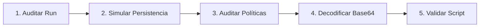

# Laboratorio Práctico: Análisis Forense de Registro y Decodificación de PowerShell

[Volver a la teoría del Capítulo 03](../README.md) | [Análisis de Malware](../../README.md)

En este laboratorio aprenderás a inspeccionar claves de persistencia en el Registro de Windows, simular un punto de arranque automático en un entorno controlado y decodificar artefactos de comandos PowerShell ofuscados.

---

## 1. Objetivos del Laboratorio

1. Inspeccionar la clave de inicio automático `HKCU:\Software\Microsoft\Windows\CurrentVersion\Run`.
2. Simular un valor de persistencia inofensivo denominado `PurpeSecMonitor`.
3. Auditar las directivas de ejecución de PowerShell en los distintos alcances (*Scopes*).
4. Decodificar una cadena maliciosa simulada en Base64 (formato UTF-16LE) y extraer el IOC contenido en ella.
5. Ejecutar el script automatizado `verificar_registro_uac.ps1` para validar la práctica.

---

## 2. Diagrama de Flujo del Laboratorio



---

## 3. Guía de Ejecución Paso a Paso

### Paso 1: Consultar la Clave `Run` del Usuario Actual

Abre una terminal de **PowerShell** y ejecuta:

```powershell
# Listar todos los valores de inicio automatico configurados en HKCU
Get-ItemProperty -Path "HKCU:\Software\Microsoft\Windows\CurrentVersion\Run"
```

---

### Paso 2: Simular un Punto de Persistencia en el Registro

Para entender cómo el malware se ancla en el registro, crea un valor de prueba llamado `PurpeSecMonitor` apuntando a la calculadora de Windows (`calc.exe`):

```powershell
Set-ItemProperty -Path "HKCU:\Software\Microsoft\Windows\CurrentVersion\Run" -Name "PurpeSecMonitor" -Value "C:\Windows\System32\calc.exe"
```

Comprueba que el valor quedó registrado:

```powershell
Get-ItemProperty -Path "HKCU:\Software\Microsoft\Windows\CurrentVersion\Run" -Name "PurpeSecMonitor"
```

---

### Paso 3: Inspeccionar las Directivas de Ejecución de PowerShell

Consulta el estado de las políticas de ejecución en todos los niveles del sistema:

```powershell
Get-ExecutionPolicy -List
```

> [!NOTE]
> Observa que el alcance `Process` tiene precedencia sobre `LocalMachine` y `CurrentUser`. Por ello, `-ExecutionPolicy Bypass` invalida las restricciones locales para el proceso en curso.

---

### Paso 4: Decodificar un Comando PowerShell Ofuscado

Durante una investigación forense se recuperó el siguiente comando malicioso ejecutado por un dropper:

```cmd
powershell.exe -NoP -W Hidden -Enc VwByAGkAdABlAC0ASABvAHMAdAAgACIAWwBJAE8AQwBdACAAQwAyADoAIAAxADkAMgAuADEANgA4AC4AMQAwADAALgA1ADAAIgA=
```

Para revelar la instrucción en texto claro, ejecuta el siguiente decodificador en PowerShell:

```powershell
$encoded = "VwByAGkAdABlAC0ASABvAHMAdAAgACIAWwBJAE8AQwBdACAAQwAyADoAIAAxADkAMgAuADEANgA4AC4AMQAwADAALgA1ADAAIgA="
$bytes = [System.Convert]::FromBase64String($encoded)
$decodedText = [System.Text.Encoding]::Unicode.GetString($bytes)

Write-Host "Comando recuperado: $decodedText" -ForegroundColor Cyan
```

---

### Paso 5: Validación Automatizada

Ejecuta el script interactivo de comprobación:

```powershell
Set-ExecutionPolicy -Scope Process -ExecutionPolicy Bypass
.\verificar_registro_uac.ps1
```

---

### Paso 6: Limpieza del Entorno

Una vez validado el laboratorio, elimina el valor de prueba del registro:

```powershell
Remove-ItemProperty -Path "HKCU:\Software\Microsoft\Windows\CurrentVersion\Run" -Name "PurpeSecMonitor" -ErrorAction SilentlyContinue
```
