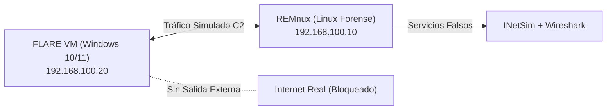
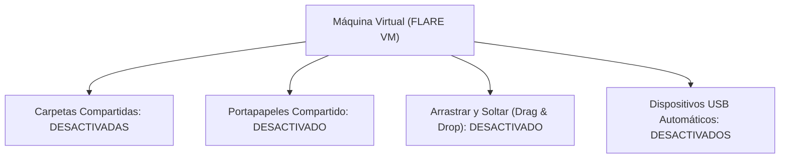
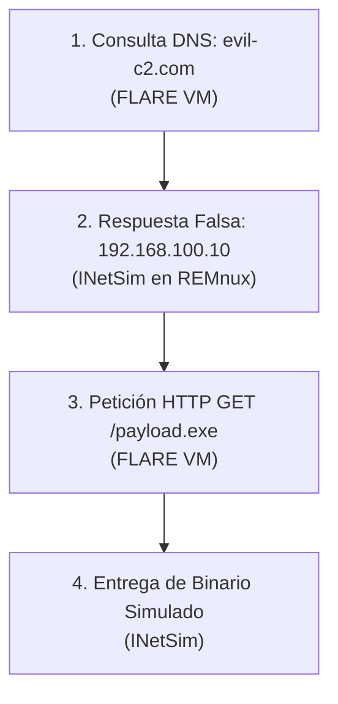
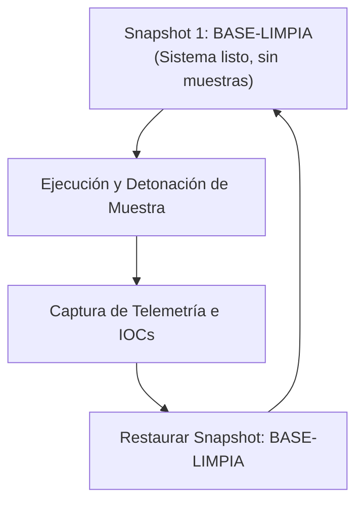

# Capítulo 04: Despliegue del Laboratorio Confinado: FLARE VM, REMnux e INetSim

[Inicio](../../README.md) | [Análisis de Malware](../README.md) | [Capítulo 03: Registro y UAC](../03-registro-uac-seguridad-y-powershell/README.md) | [Capítulo 05: Fundamentos y Hashes](../05-fundamentos-malware-adquisicion-y-hashes/README.md)

El análisis seguro de malware exige una regla infranqueable: **contención absoluta**. Ninguna muestra hostil debe manipularse en una máquina de producción ni en un entorno con salida directa a Internet. Este capítulo detalla la arquitectura de red aislada (*Host-Only*), la estación de análisis **FLARE VM**, la simulación de servicios de red con **REMnux/INetSim** y la disciplina de instantáneas (*snapshots*).

---

## 1. Arquitectura de Red del Laboratorio Forense

La topología estándar para análisis seguro consta de dos máquinas virtuales interconectadas en una red privada virtual de tipo **Host-Only** o **Red Interna** sin pasarela por defecto (*Default Gateway*) hacia Internet:



### Roles de las Máquinas Virtuales

1. **FLARE VM (Víctima y Estación Forense)**:
   * Sistema operativo Windows 10/11 x64 acondicionado como laboratorio por Mandiant.
   * Ejecuta las herramientas de triaje estático, telemetría dinámica (Procmon, Noriben) y desensambladores/depuradores (Ghidra, x64dbg).
   * Es el entorno controlado donde se detona la muestra.
2. **REMnux (Sumidero de Red y Simulación C2)**:
   * Distribución Linux especializada en ingeniería inversa de malware.
   * Ejecuta el software **INetSim** (*Internet Simulator*), que responde a peticiones de red comunes (DNS, HTTP, HTTPS, SMTP, FTP) simulando ser Internet.
   * Intercepta y registra todo el tráfico mediante `tcpdump` o Wireshark para analizar balizamientos (*beacons*) del malware sin riesgo de fuga.

---

## 2. Prevención de Escape del Hipervisor (*VM Escape*)

Aunque los escapes de máquinas virtuales son excepcionales y requieren vulnerabilidades complejas en el hipervisor, deben neutralizarse todos los canales de interacción compartidos:



* **Carpetas Compartidas**: Si una muestra de ransomware cifra la unidad virtual y encuentra un recurso compartido hacia el disco real del host, el malware cifrará los archivos de la máquina física.
* **Portapapeles Compartido**: El malware con capacidades de infostealer o secuestro de portapapeles (*ClipBanker*) puede leer o alterar contraseñas y direcciones de criptomonedas del equipo real.

---

## 3. Acondicionamiento de Windows y Despliegue de FLARE VM

FLARE VM es un script de instalación automatizado de Mandiant basado en el gestor de paquetes Chocolatey que transforma un Windows estándar en un entorno forense completo.

### 3.1. Preparación de la Máquina Virtual Windows

Antes de instalar FLARE VM o analizar muestras, es necesario deshabilitar los mecanismos de seguridad internos de Windows que eliminarían las muestras o interferirían con las herramientas de ingeniería inversa:

```powershell
# 1. Deshabilitar Windows Defender en tiempo real
Set-MpPreference -DisableRealtimeMonitoring $true
Set-MpPreference -DisableBehaviorMonitoring $true
Set-MpPreference -DisableScriptScanning $true
Set-MpPreference -DisableBlockAtFirstSeen $true

# 2. Deshabilitar actualizaciones automáticas de Windows para evitar reinicios inesperados
Stop-Service wuauserv
Set-Service wuauserv -StartupType Disabled
```

> [!CAUTION]
> En Windows 10/11 moderno, debes desactivar manualmente la **Protección contra Alteraciones (*Tamper Protection*)** desde `Configuración > Seguridad de Windows > Protección contra virus y amenazas > Configuración de protección`, ya que esta función impide que PowerShell desactive el antivirus.

---

### 3.2. Catálogo de Herramientas de FLARE VM

Una vez completada la instalación, FLARE VM incluye las herramientas esenciales clasificadas por especialidad:

| Categoría | Herramientas Principales | Función en el Laboratorio |
|---|---|---|
| **Triaje e Inspección PE** | CFF Explorer, PeStudio, Detect It Easy (DIE), Exeinfo PE | Extraer cabeceras PE, secciones, librerías importadas (IAT) y detectar packers. |
| **Cadenas y Desempaquetado** | FLOSS, Strings, UPX | Extraer cadenas ofuscadas en memoria y desempacar binarios protegidos. |
| **Monitoreo y Telemetría** | Process Monitor (Procmon), Process Explorer, Regshot, Noriben | Grabar en tiempo real la creación de procesos, accesos al registro y modificaciones en el sistema de archivos. |
| **Ingeniería Inversa** | Ghidra, IDA Free, Cutter | Desensamblar y decompilar código máquina x86/x64 a código pseudocódigo en C. |
| **Depuración Dinámica** | x64dbg (x32dbg y x64dbg) | Ejecutar el binario paso a paso, colocar breakpoints e inspeccionar registros y memoria en runtime. |
| **Análisis de Red** | Wireshark, FakeNet-NG, NetworkMiner | Capturar e inspeccionar paquetes de red locales. |

---

## 4. Simulación de Red con INetSim en REMnux

Cuando un malware se ejecuta, generalmente realiza una consulta DNS para localizar su servidor de Comando y Control (C2) y luego intenta descargar una carga útil secundaria mediante HTTP/HTTPS. Si no obtiene respuesta, muchos malwares se autodestruyen o entran en estado latente (*sleep*).



### Configuración en REMnux:

1. Iniciar INetSim como servicio:
   ```bash
   sudo inetsim
   ```
2. INetSim comenzará a escuchar en todos los puertos estándar:
   * **DNS (Puerto 53 UDP/TCP)**: Responderá a cualquier consulta de dominio con la dirección IP propia de REMnux (`192.168.100.10`).
   * **HTTP (Puerto 80 TCP)** y **HTTPS (Puerto 443 TCP)**: Servirá páginas HTML por defecto o archivos binarios genéricos.
   * **SMTP (Puerto 25 TCP)**: Recibirá correos electrónicos salientes de spambots sin reenviarlos a Internet.

---

## 5. La Disciplina de Instantáneas (*Snapshots*)

El análisis de malware es una ciencia destructiva. Un análisis previo altera el Registro, instala servicios y contamina el sistema de archivos.



1. **Estado `BASE-LIMPIA`**:
   * Se captura inmediatamente después de instalar las herramientas, configurar las IPs y deshabilitar Defender.
   * La máquina debe estar libre de cualquier muestra o residuo previo.
2. **Ciclo de Reversión**:
   * Al finalizar la investigación y extraer los reportes, se apaga la VM y se restaura el snapshot `BASE-LIMPIA`.
   * Esto garantiza que cada análisis sea determinista, reproducible y que los resultados pertenezcan exclusivamente a la muestra examinada.

---

## 6. Manejo Seguro de Muestras (*Sample Handling*)

Para evitar infecciones accidentales por doble clic en la máquina anfitriona:

1. **Cifrado Estándar**: Almacena y transfiere muestras siempre en archivos comprimidos (`.zip` o `.7z`) protegidos con la contraseña universal del sector:
   * Contraseña: `infected` o `malware`.
2. **Defanging de Extensiones**: Renombra archivos ejecutables hostiles:
   * `trojan.exe` $\rightarrow$ `trojan.bin` o `trojan.malz`.
3. **Defanging de Indicadores en Reportes**: Nunca escribas URLs o dominios activos de forma navegable:
   * `http://evil.com/payload.exe` $\rightarrow$ `hxxp://evil[.]com/payload[.]exe`.

---

## Próximos Pasos

Avanza al [Laboratorio Práctico del Capítulo 04](./lab/README.md) para verificar la contención de red, comprobar el aislamiento frente a Internet y auditar el entorno con el script automatizado.
