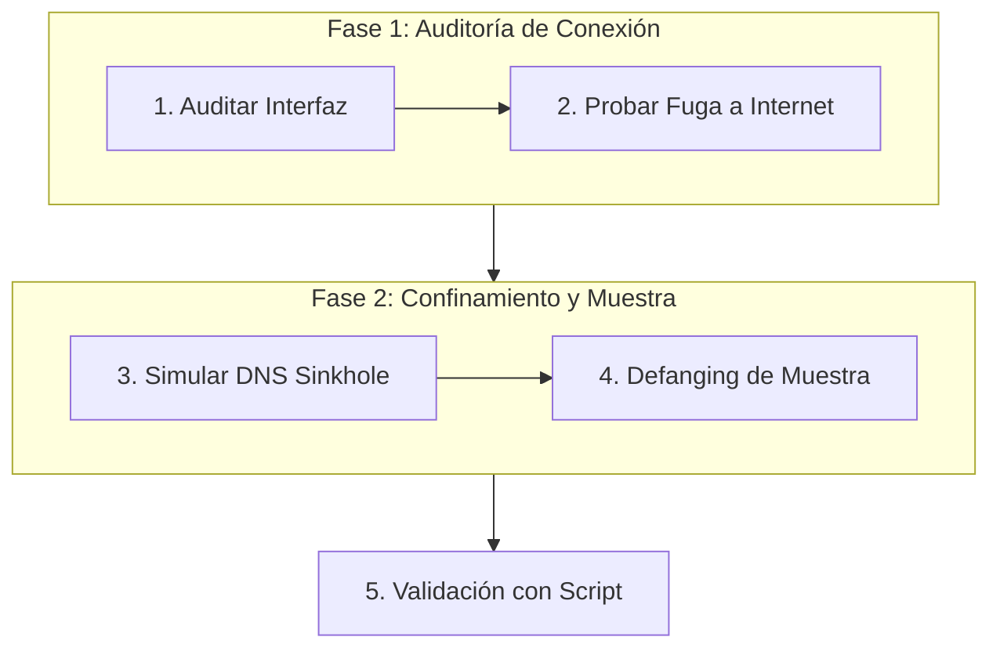

# Laboratorio Práctico: Validación del Aislamiento y Manejo Seguro de Muestras

[Volver a la teoría del Capítulo 04](../README.md) | [Análisis de Malware](../../README.md)

Este laboratorio te enseña a auditar la seguridad operativa de tu estación de análisis, validar que no existan fugas hacia Internet y aplicar procedimientos estándar de *defanging* y empaquetado de artefactos hostiles.

---

## 1. Objetivos del Laboratorio

1. Comprobar el aislamiento de la interfaz de red frente a la Internet pública.
2. Simular un sumidero DNS local (*DNS Sinkhole*) mediante el archivo de mapeo del sistema (`hosts`).
3. Practicar el procedimiento de *defanging* (renombrado de extensiones y compresión protegida con contraseña).
4. Ejecutar el script automatizado `verificar_laboratorio.ps1` para calificar el entorno.

---

## 2. Diagrama de Flujo del Laboratorio



---

## 3. Guía de Ejecución Paso a Paso

### Paso 1: Auditoría de Direcciones IP y Pasarelas

Abre una terminal de **PowerShell** y comprueba los adaptadores de red activos:

```powershell
Get-NetIPConfiguration | Select-Object InterfaceAlias, IPv4Address, IPv4DefaultGateway
```

> [!NOTE]
> En una máquina virtual de análisis con aislamiento estricto (Host-Only o Red Interna), el campo `IPv4DefaultGateway` debe estar **vacío** para impedir que el tráfico salga hacia routers físicos o Internet.

---

### Paso 2: Validación de Bloqueo hacia Internet Real

Comprueba que las consultas hacia servicios externos no puedan completarse:

```powershell
# Intentar resolver un dominio publico con tiempo de espera corto
Resolve-DnsName -Name "google.com" -ErrorAction SilentlyContinue
```

---

### Paso 3: Simular Resolución hacia un Sumidero Local (Sinkhole)

Cuando no se tiene una máquina REMnux encendida, se puede simular el comportamiento de INetSim redirigiendo dominios de prueba hacia `127.0.0.1` en el archivo de nombres local `C:\Windows\System32\drivers\etc\hosts`:

Abre PowerShell como **Administrador** y agrega una entrada de prueba:

```powershell
Add-Content -Path "$env:SystemRoot\System32\drivers\etc\hosts" -Value "`n127.0.0.1 purpesec-c2-sinkhole.local"
```

Verifica que el dominio falso resuelva hacia la máquina local:

```powershell
Resolve-DnsName -Name "purpesec-c2-sinkhole.local"
```

---

### Paso 4: Procedimiento de Defanging y Manejo de Artefactos

Crea una muestra inofensiva de prueba en el directorio temporal para practicar el protocolo de contención:

```powershell
# 1. Crear carpeta de contencion
New-Item -ItemType Directory -Path "C:\Purpesec_Lab\Staging" -Force

# 2. Generar archivo ejecutable simulado
Set-Content -Path "C:\Purpesec_Lab\Staging\payload_dropper.exe" -Value "MZ_SIMULATED_MALWARE_BYTECODE"

# 3. Aplicar defanging (cambiar extension para evitar doble clic accidental)
Rename-Item -Path "C:\Purpesec_Lab\Staging\payload_dropper.exe" -NewName "payload_dropper.bin"
```

Comprueba que el archivo fue renombrado:

```powershell
Get-ChildItem -Path "C:\Purpesec_Lab\Staging"
```

---

### Paso 5: Validación Automatizada

Ejecuta el script interactivo de comprobación:

```powershell
Set-ExecutionPolicy -Scope Process -ExecutionPolicy Bypass
.\verificar_laboratorio.ps1
```

---

### Paso 6: Limpieza del Entorno

Una vez validado el laboratorio, limpia los artefactos temporales:

```powershell
# Eliminar carpeta de prueba
Remove-Item -Path "C:\Purpesec_Lab\Staging" -Recurse -Force -ErrorAction SilentlyContinue

# Limpiar entrada en el archivo hosts
$hostsPath = "$env:SystemRoot\System32\drivers\etc\hosts"
$hostsContent = Get-Content $hostsPath | Where-Object { $_ -notmatch "purpesec-c2-sinkhole.local" }
Set-Content -Path $hostsPath -Value $hostsContent
```
