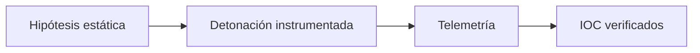
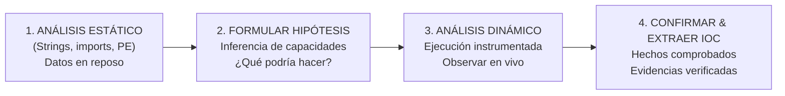
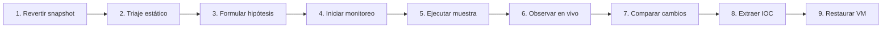
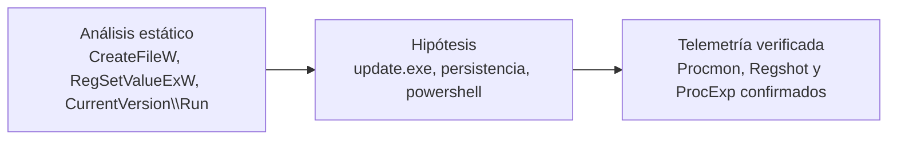

# Capítulo 05: Análisis dinámico, telemetría y extracción de IOC

[Inicio](../../README.md) | [Análisis de Malware](../README.md) | [Anterior: Formato PE y capacidades](../04-formato-pe-y-capacidades/README.md)

> [!CAUTION]
> La detonación solo se realiza en una VM aislada, con snapshot limpio y sin salida a Internet. Nunca ejecutes una muestra fuera de ese entorno.

## Introducción

El análisis dinámico ejecuta la muestra en un entorno confinado e instrumentado para observar qué hace realmente. Responde con hechos las preguntas que el análisis estático dejó como hipótesis.

Este capítulo cubre la telemetría de procesos, archivos, registro y red, la metodología de detonación y la formalización de indicadores. El laboratorio asociado reproduce el ciclo completo con una muestra sintética.

---

## 1. Fundamentos del análisis dinámico: de la hipótesis al hecho

El **análisis dinámico** (también conocido como análisis conductual o *behavioral analysis*) consiste en ejecutar la muestra sospechosa dentro de un entorno confinado, instrumentado y descartable (*sandbox*) para registrar, correlacionar y analizar su comportamiento en tiempo real.

### La sinergia indispensable entre estático y dinámico
- El análisis estático genera las **preguntas e hipótesis de riesgo** a partir de los datos observables en disco (ej. APIs detectadas, cadenas sospechosas).
- El análisis dinámico aporta las **respuestas con hechos**: comprueba si esas hipótesis se materializan, captura los archivos secundarios que se descargan o crean, y registra las claves exactas donde el malware se afianza.

---

## 2. Los cuatro pilares de telemetría del sistema

Durante la detonación de una muestra, el analista monitoriza cuatro dimensiones fundamentales del sistema operativo:

| Pilar | Eventos observados | Herramientas |
|---|---|---|
| Procesos y memoria | Subprocesos (`cmd.exe`, `powershell.exe`), inyección de DLL, hilos. | ProcExp, Procmon |
| Sistema de archivos | Archivos soltados en `%TEMP%` o `C:\Users\Public`, scripts temporales. | Procmon, Explorer |
| Registro de Windows | Claves `Run`/`RunOnce`, servicios, políticas UAC. | Regshot, Procmon |
| Red y comunicaciones | Consultas DNS, conexiones HTTP salientes, balizas hacia C2. | FakeNet-NG, INetSim, Wireshark |

---

## 3. Herramientas esenciales de monitoreo dinámico (FLARE-VM)

Para instrumentar el sistema operativo Windows durante la detonación, se emplean herramientas especializadas:

| Herramienta | Función principal |
|---|---|
| **Process Explorer (ProcExp)** | Árbol de procesos en vivo con líneas de comando, DLLs y handles. |
| **Process Monitor (Procmon)** | Captura de llamadas al kernel; requiere filtrado por proceso e intereses. |
| **Regshot** | Comparativa diferencial del registro y del disco entre dos instantáneas. |
| **FakeNet-NG / INetSim** | Simulación local de DNS, HTTP y TLS sin salida real a Internet. |

### 3.1 Process Monitor (Procmon - Sysinternals)
Captura en tiempo real todas las llamadas al kernel de Windows relacionadas con el sistema de archivos, el registro, procesos y subprocesos.
- **El reto**: Procmon captura fácilmente más de 100,000 eventos por segundo de la actividad normal del sistema. **Saber filtrar es la habilidad esencial del analista**.
- **Filtros indispensables**:
  1. `Process Name is sample.exe -> Include` (acota los eventos al binario detonado).
  2. `Operation is Process Create -> Include` (detecta si la muestra invoca comandos ocultos o consolas).
  3. `Operation is RegSetValue -> Include` (identifica valores escritos en el registro para persistencia).
  4. `Operation is CreateFile -> Include` (identifica archivos creados en disco).

### 3.2 Process Explorer (ProcExp - Sysinternals)
Proporciona un Administrador de Tareas avanzado con visualización jerárquica en árbol:
- Muestra las relaciones **padre $\rightarrow$ hijo** (ejemplo: si `sample.exe` engendra un proceso `cmd.exe /c powershell.exe -enc...`).
- Resalta procesos nuevos en verde y procesos que terminan en rojo.
- Permite examinar las cadenas de texto del proceso **directamente desde la memoria RAM** (descartando empaquetadores como UPX que ya se hayan desempaquetado).

### 3.3 Regshot: La técnica diferencial del Registro
Muchas muestras añaden claves de persistencia en el Registro de Windows en cuestión de milisegundos. Regshot permite capturar este cambio con precisión quirúrgica:
1. **1st shot**: Toma una foto completa del estado limpio del registro y del sistema de archivos.
2. **Detonación**: Se ejecuta la muestra y se le permite actuar durante 2 a 5 minutos.
3. **2nd shot**: Toma una segunda foto del estado tras la infección.
4. **Compare**: Compara ambos estados y genera un informe de texto que lista exactamente qué claves, valores y archivos fueron agregados, modificados o eliminados.

### 3.4 Simulación de red con FakeNet-NG
Si un malware no detecta conectividad a Internet, puede suspender su ejecución o no desplegar sus capacidades finales. Sin embargo, no podemos conectarlo a Internet real por seguridad.
- **FakeNet-NG** intercepta todo el tráfico de red de la máquina virtual local y responde de forma simulada:
  - Si el malware solicita una resolución DNS para `c2-malicioso.com`, FakeNet responde con `127.0.0.1`.
  - Si realiza una petición `HTTP GET /payload.exe`, FakeNet devuelve un archivo ejecutable sintético inofensivo.
  - Registra todos los dominios, URLs y cabeceras solicitadas en un archivo de log.

---

## 4. El flujo metodológico de 9 pasos para el análisis dinámico

Para obtener resultados reproducibles y garantizar la integridad del laboratorio, el analista sigue rigurosamente esta secuencia:

---

## 5. Ejemplo práctico: De la hipótesis al hallazgo verificado

Veamos cómo se articulan las fases en un escenario analítico real:

> [!TIP]
> **Conclusión del caso**: El análisis dinámico transformó las sospechas e hipótesis estáticas en **evidencias confirmadas e Indicadores de Compromiso (IOCs) reproducibles y accionables**.

---

## 6. Formalización y documentación de Indicadores de Compromiso (IOC)

El entregable primordial de un analista de malware para el equipo de respuesta a incidentes y el SOC es la **Ficha de Indicadores de Compromiso (IOC)**:

| Tipo de IOC | Valor técnico | Contexto |
|---|---|---|
| Hash SHA-256 | `a3f5b8c9d1e2f3...` | Muestra principal entregada por phishing |
| Hash SHA-256 | `e7c19d4b8a2f0e...` | Archivo auxiliar `update.exe` soltado en disco |
| Ruta | `C:\Users\Public\update.exe` | Archivo persistente en disco |
| Registro | `HKCU\Software\Microsoft\Windows\CurrentVersion\Run\Updater` | Clave de inicio automático |
| Red (dominio) | `update.example.com` (443/TCP) | Dominio de C2 |
| Red (IP) | `198.51.100.42` | Servidor de comando y control |
| Proceso | `powershell.exe -ExecutionPolicy Bypass -enc ...` | Ejecución de carga codificada |

---

## Cheatsheet

Referencia rápida del capítulo en formato PDF: [cheatsheet.pdf](./cheatsheet.pdf).

La práctica asociada reproduce el ciclo de detonación instrumentada y la ficha de IOC: [laboratorio de análisis dinámico](./lab/).

---

[Anterior: Formato PE y capacidades](../04-formato-pe-y-capacidades/README.md) | [Volver al índice](../README.md) | [Siguiente: Fundamentos de ensamblador (planificado)](../README.md)
