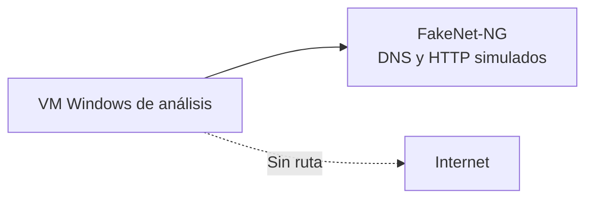

# Laboratorio: detonación instrumentada y extracción de IOC

[Capítulo 05](../README.md) | [Análisis de Malware](../../README.md)

> [!CAUTION]
> Detona solo en una VM Windows aislada, con snapshot `BASE-LIMPIA` y red Host-Only. La muestra modifica el registro y escribe archivos de forma intencional; revierte el snapshot al terminar.

## Alcance

El objetivo es completar el ciclo hipótesis → detonación → telemetría → IOC con una muestra sintética. Se practica:

- Preparar la línea base con Regshot.
- Capturar eventos de archivo, registro, proceso y red.
- Correlacionar la telemetría con las hipótesis estáticas.
- Formalizar una ficha de IOC y revertir el entorno.

## Requisitos

- VM Windows 10/11 con FLARE-VM o, como mínimo: Process Monitor, Process Explorer y Regshot.
- Compilador MinGW-w64 dentro de la VM, o un binario compilado en otra máquina y transferido por un canal controlado.
- FakeNet-NG (opcional) para simular la respuesta de red.
- Snapshot limpio y red Host-Only o interna.

## Topología



## 1. Restaurar la línea base

1. Revierte la VM al snapshot `BASE-LIMPIA`.
2. Comprueba que no hay salida a Internet.
3. Abre Regshot y pulsa **1st shot**.
4. Abre Process Monitor, limpia el búfer con `Ctrl+X` y activa la captura con `Ctrl+E`.
5. Abre Process Explorer en paralelo.

## 2. Hipótesis previas

Antes de ejecutar, registra lo que esperas observar a partir de una inspección estática del binario. Ejemplos:

- Creación de un archivo en `C:\Users\Public`.
- Escritura en `HKCU\...\CurrentVersion\Run`.
- Aparición de un subproceso `cmd.exe`.
- Consulta a `update.curso.local`.

## 3. Compilar la muestra

Dentro de la VM aislada:

```bash
x86_64-w64-mingw32-gcc -O1 -o muestra-dinamica.exe muestra_dinamica.c -lwininet
```

Opcional: empaqueta una copia con `upx -q muestra-dinamica.exe` para comparar telemetría.

## 4. Detonar y observar

1. Ejecuta `muestra-dinamica.exe`.
2. En Process Explorer, observa el árbol de procesos y el `cmd.exe` hijo.
3. En Procmon, filtra por `Process Name is muestra-dinamica.exe` y revisa `CreateFile` y `RegSetValueEx`.
4. Espera de 2 a 5 minutos para dar margen a la actividad de red.

## 5. Captura diferencial

1. En Regshot, pulsa **2nd shot**.
2. Pulsa **Compare**.
3. Busca la clave `...\CurrentVersion\Run\Updater` y el archivo `C:\Users\Public\update.txt`.

## 6. Formalizar IOC

Completa la plantilla [`ficha_ioc.csv`](./ficha_ioc.csv) con la evidencia observada.

## Resultados esperados

| Pilar | Evento esperado |
|---|---|
| Archivos | `CreateFile C:\Users\Public\update.txt` |
| Registro | `HKCU\...\Run\Updater = C:\Users\Public\update.txt` |
| Procesos | `cmd.exe /c echo telemetria` como hijo |
| Red | Consulta DNS a `update.curso.local` (capturada por FakeNet) |

## Validación final

- [ ] Revertí el snapshot antes de detonar.
- [ ] Tomé el 1st shot antes de ejecutar.
- [ ] Filtré Procmon por el proceso objetivo.
- [ ] Identifiqué la ruta y la clave de registro exactas.
- [ ] Registré al menos un indicador por cada pilar de telemetría.
- [ ] Revertí la VM a `BASE-LIMPIA` tras documentar.

## Limpieza

```powershell
Remove-Item -LiteralPath "C:\Users\Public\update.txt" -ErrorAction SilentlyContinue
Remove-ItemProperty -Path "HKCU:\Software\Microsoft\Windows\CurrentVersion\Run" `
  -Name "Updater" -ErrorAction SilentlyContinue
```

Confirma la limpieza revirtiendo además al snapshot `BASE-LIMPIA`.

---

[Volver al capítulo](../README.md) | [Volver al índice](../../README.md)
