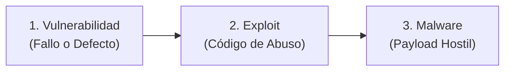
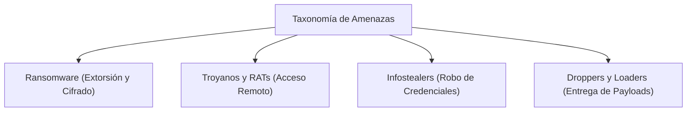
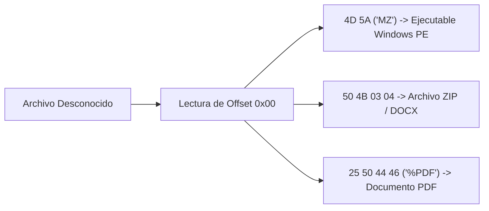
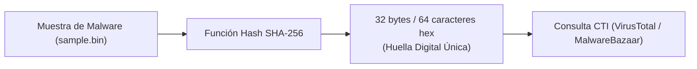

# Capítulo 05: Fundamentos del Malware, Adquisición Forense y Hashes Criptográficos

[Inicio](../../README.md) | [Análisis de Malware](../README.md) | [Capítulo 04: Laboratorio Confinado](../04-laboratorio-flarevm-remnux-inetsim/README.md) | [Capítulo 06: Formato PE e IMPHASH](../06-formato-pe-e-imphash/README.md)

El triaje inicial es la primera línea de respuesta ante un archivo sospechoso. Antes de desensamblar código o detonar un binario en una sandbox, el analista debe clasificar la amenaza, verificar su integridad criptográfica mediante **hashes**, comprobar sus **Magic Bytes** para desarticular engaños de extensión y correlacionar sus identificadores con bases de datos de **Cyber Threat Intelligence (CTI)**.

---

## 1. La Tríada Conceptual: Vulnerabilidad $\neq$ Exploit $\neq$ Malware

En incidentes de seguridad es común confundir estos tres términos. Un analista forense debe utilizarlos con precisión quirúrgica:



| Concepto | Definición Técnica | Rol en el Incidente | Ejemplo Canónico (WannaCry) |
|---|---|---|---|
| **Vulnerabilidad** | La debilidad, defecto de diseño o fallo en el código de una aplicación o sistema operativo. | La "puerta abierta" o cerradura rota. | **CVE-2017-0144**: Fallo de desbordamiento de búfer en el protocolo SMBv1 en Windows. |
| **Exploit** | Fragmento de código diseñado específicamente para aprovechar la vulnerabilidad y forzar una condición anómala. | La herramienta que fuerza la cerradura para entrar. | **EternalBlue**: Código exploit que inyecta paquetes SMB maliciosos para lograr RCE. |
| **Malware** | Programa autónomo que se ejecuta tras la intrusión para cumplir los objetivos del atacante. | El intruso que entra y roba o destruye. | **WannaCry.exe**: Binario que cifra los archivos locales y exige rescate económico. |

---

## 2. Taxonomía del Malware

El malware se clasifica según sus capacidades principales y objetivos operativos:



1. **Ransomware**: Cifra los archivos de valor de la víctima mediante algoritmos criptográficos asimétricos y simétricos (RSA + AES) y exige un rescate en criptomonedas.
2. **RAT (Remote Access Trojan)**: Proporciona al atacante una puerta trasera gráfica o de consola completa sobre la máquina infectada (captura de pantalla, webcam, reverse shell).
3. **Infostealer**: Diseñado para sustraer silenciosamente contraseñas guardadas en navegadores, carteras de criptomonedas, tokens de sesión de Discord/Telegram y cookies de autenticación.
4. **Droppers y Loaders**: Binarios de primera etapa (*Stage 1*) cuyo único propósito es descargar o descifrar en memoria el payload hostil principal (*Stage 2*) para evadir motores de detección inicial.

---

## 3. Identificación de Archivos y Magic Bytes

Los atacantes intentan habitualmente engañar al usuario asignando extensiones falsas a los binarios ejecutables (por ejemplo, nombrar un ejecutable como `factura_abril.pdf.exe` o `imagen.jpg`).

> [!IMPORTANT]
> **Axioma Forense**: "La extensión de un archivo es irrelevante para el sistema de ejecución; lo que determina su formato real son sus **Magic Bytes**".

Los **Magic Bytes** (firmas de archivo) son secuencias fijas de bytes hexadecimales situadas al inicio de la cabecera (offset `0x00`):



### Tabla Anatómica de Firmas Hexadecimales

| Formato de Archivo | Magic Bytes (Hexadecimal) | Representación ASCII | Significado Forense |
|---|---|---|---|
| **Windows Executable (PE)** | `4D 5A` | `MZ` | Cabecera DOS obligatoria en todos los archivos `.exe`, `.dll`, `.sys`. |
| **Linux Executable (ELF)** | `7F 45 4C 46` | `\x7fELF` | Binario ejecutable para sistemas Unix/Linux. |
| **Archivo Comprimido (ZIP)** | `50 4B 03 04` | `PK..` | Archivos `.zip`, documentos de Office modernos (`.docx`, `.xlsx`). |
| **Documento PDF** | `25 50 44 46` | `%PDF` | Documento Portable Document Format. |
| **Script PowerShell / Batch** | `FF FE` o `EF BB BF` | BOM UTF | Archivos de texto o scripts codificados con marca de orden de bytes. |

---

## 4. Hashes Criptográficos en Análisis Forense

Una **función hash criptográfica** transforma una entrada de datos de cualquier tamaño en una cadena de caracteres alfanuméricos de longitud fija. Es **determinista** (el mismo archivo genera exactamente el mismo hash) y **resistente a colisiones**.



### 4.1. Algoritmos Estándar de la Industria

* **MD5 (128 bits / 32 caracteres hex)**: Rápido de calcular, pero criptográficamente obsoleto debido a ataques de colisión conocidos. Se mantiene como identificador histórico en motores antiguos.
* **SHA-1 (160 bits / 40 caracteres hex)**: Retirado por motivos de seguridad criptográfica, pero utilizado en catálogos de software legítimo.
* **SHA-256 (256 bits / 64 caracteres hex)**: **El estándar absoluto en Cyber Threat Intelligence (CTI)**. No se conocen colisiones prácticas y es el identificador universal para compartir Indicadores de Compromiso (IoCs).

### 4.2. La Limitación del Hash Criptográfico

Cualquier cambio en un solo bit del archivo original altera por completo el hash resultante (efecto avalancha). Si el desarrollador de malware añade un byte nulo (`0x00`) al final del ejecutable (*hash padding*), el hash SHA-256 cambia radicalmente, burlando listas negras basadas en hashes rígidos.

Por esta razón, en capítulos posteriores estudiaremos algoritmos de hash difuso (*fuzzy hashing*) como **SSDEEP** e **IMPHASH**.

---

## 5. Búsqueda y Correlación en Cyber Threat Intelligence (CTI)

Cuando obtienes el hash SHA-256 de una muestra, el primer paso antes de iniciar el análisis profundo es verificar si la comunidad ya ha catalogado la amenaza:

1. **VirusTotal**:
   * Permite consultar hashes sin necesidad de subir la muestra física (protege la confidencialidad de incidentes privados).
   * Muestra la tasa de detección de más de 70 motores antivirus.
   * Proporciona nombres de familias maliciosas (`Trojan.Generic`, `Ransom.LockBit`).
2. **MalwareBazaar (Abuse.ch)**:
   * Repositorio abierto para descargar muestras de malware conocidas y consultar firmas asociadas.
3. **Hybrid Analysis**:
   * Proporciona reportes detallados de detonación previa en sandboxes públicas.

---

## 6. Comandos Forenses para Hashes y Magic Bytes

### 6.1. En Windows con PowerShell

```powershell
# 1. Calcular el hash SHA-256 de un archivo
Get-FileHash -Algorithm SHA256 "C:\Muestras\sample.bin"

# 2. Calcular los tres hashes principales (MD5, SHA1, SHA256)
"MD5", "SHA1", "SHA256" | ForEach-Object { Get-FileHash -Algorithm $_ "C:\Muestras\sample.bin" }

# 3. Leer los primeros 4 bytes (Magic Bytes) en formato hexadecimal
$bytes = Get-Content -Path "C:\Muestras\sample.bin" -Encoding Byte -TotalCount 4
($bytes | ForEach-Object { "{0:X2}" -f $_ }) -join " "
# Si devuelve "4D 5A", es un ejecutable PE de Windows.
```

### 6.2. En Linux con REMnux

```bash
# 1. Identificar el tipo real de archivo mediante Magic Bytes
file sample.bin

# 2. Obtener hash SHA-256
sha256sum sample.bin

# 3. Ver cabecera hexadecimal directa
hexdump -C -n 16 sample.bin
```

---

## Próximos Pasos

Avanza al [Laboratorio Práctico del Capítulo 05](./lab/README.md) para calcular hashes criptográficos, inspeccionar cabeceras binarias y validar la identidad de muestras mediante el script automatizado.
