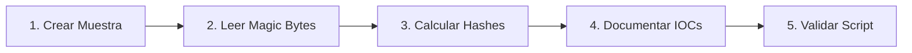

# Laboratorio Práctico: Triaje Estático, Magic Bytes y Hashes Forenses

[Volver a la teoría del Capítulo 05](../README.md) | [Análisis de Malware](../../README.md)

En este laboratorio aprenderás a realizar el triaje inicial de un archivo sospechoso: descubrirás su tipo real inspeccionando sus **Magic Bytes** (desarmando un ataque de extensión falsa) y calcularás sus huellas criptográficas (**MD5**, **SHA-1** y **SHA-256**) para documentación forense.

---

## 1. Objetivos del Laboratorio

1. Generar un artefacto de prueba simulando un ejecutable camuflado con extensión `.pdf`.
2. Inspeccionar la cabecera hexadecimal a bajo nivel para identificar la firma `4D 5A` (`MZ`).
3. Calcular los hashes criptográficos del artefacto utilizando PowerShell.
4. Ejecutar el script automatizado `verificar_hashes.ps1` para validar la práctica.

---

## 2. Diagrama de Flujo del Laboratorio



---

## 3. Guía de Ejecución Paso a Paso

### Paso 1: Generar la Muestra de Prueba con Extensión Engañosa

Abre una terminal de **PowerShell** y crea el directorio de trabajo del laboratorio con un artefacto que contiene los Magic Bytes de un ejecutable PE pero con extensión de documento PDF:

```powershell
# 1. Crear directorio de trabajo seguro
New-Item -ItemType Directory -Path "C:\Purpesec_Lab\Triaje" -Force

# 2. Escribir los bytes MZ obligatorios de un binario PE al inicio del archivo
$peBytes = [byte[]](0x4D, 0x5A, 0x90, 0x00, 0x03, 0x00, 0x00, 0x00, 0x04, 0x00, 0x00, 0x00)
[System.IO.File]::WriteAllBytes("C:\Purpesec_Lab\Triaje\factura_marzo.pdf", $peBytes)
```

---

### Paso 2: Detección Forense de Magic Bytes

Un usuario descuidado intentaría abrir el archivo con Adobe Reader. Como analista forense, comprueba la cabecera hexadecimal real:

```powershell
# Leer los primeros 2 bytes del archivo
$bytes = [System.IO.File]::ReadAllBytes("C:\Purpesec_Lab\Triaje\factura_marzo.pdf")[0..1]
$hexHeader = ($bytes | ForEach-Object { "{0:X2}" -f $_ }) -join " "
$asciiHeader = [System.Text.Encoding]::ASCII.GetString($bytes)

Write-Host "Magic Bytes (Hex): $hexHeader" -ForegroundColor Cyan
Write-Host "Magic Bytes (ASCII): $asciiHeader" -ForegroundColor Cyan
```

> [!NOTE]
> La salida `4D 5A` y `MZ` confirma inequívocamente que el archivo es un **ejecutable PE de Windows**, a pesar de tener la extensión `.pdf`.

---

### Paso 3: Cálculo de Huellas Criptográficas

Calcula los hashes SHA-256, SHA-1 y MD5 del artefacto:

```powershell
$samplePath = "C:\Purpesec_Lab\Triaje\factura_marzo.pdf"

# Hash SHA-256 (Estandar CTI)
$sha256 = (Get-FileHash -Path $samplePath -Algorithm SHA256).Hash
Write-Host "SHA-256: $sha256" -ForegroundColor Green

# Hash MD5
$md5 = (Get-FileHash -Path $samplePath -Algorithm MD5).Hash
Write-Host "MD5:     $md5" -ForegroundColor Yellow

# Hash SHA-1
$sha1 = (Get-FileHash -Path $samplePath -Algorithm SHA1).Hash
Write-Host "SHA-1:   $sha1" -ForegroundColor Gray
```

---

### Paso 4: Validación Automatizada

Ejecuta el script interactivo de comprobación:

```powershell
Set-ExecutionPolicy -Scope Process -ExecutionPolicy Bypass
.\verificar_hashes.ps1
```

---

### Paso 5: Limpieza del Entorno

Una vez validado el ejercicio, elimina la carpeta de triaje:

```powershell
Remove-Item -Path "C:\Purpesec_Lab\Triaje" -Recurse -Force -ErrorAction SilentlyContinue
```
