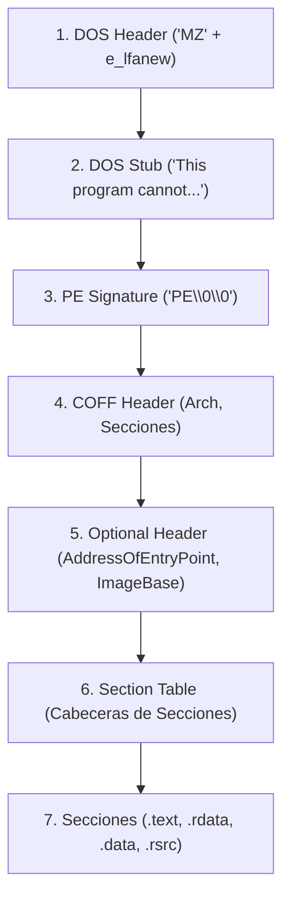
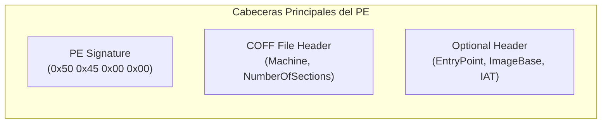
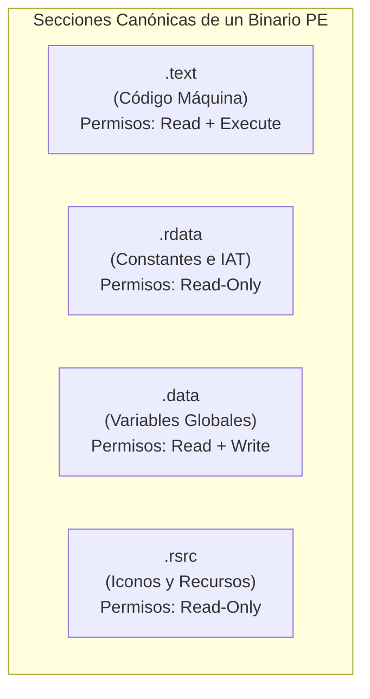
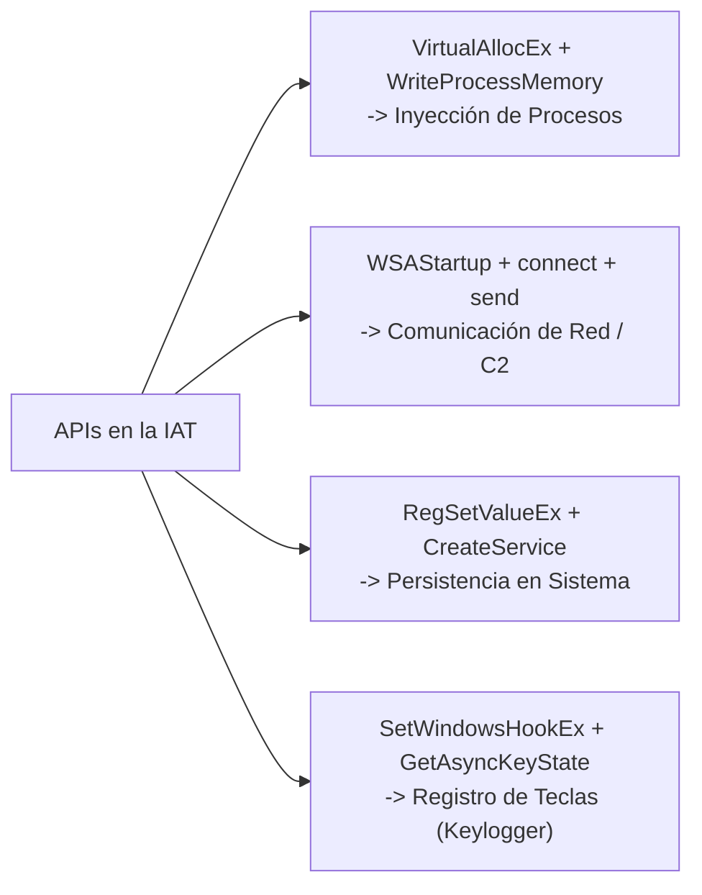
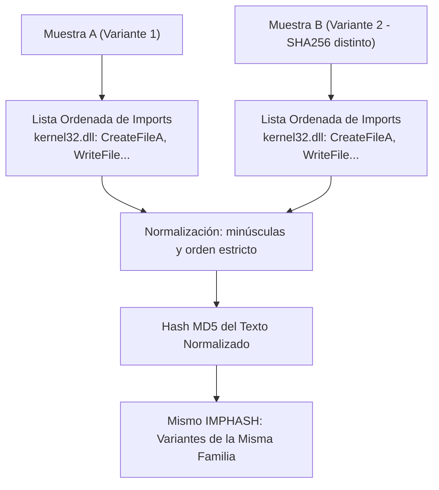

# Capítulo 06: Formato Portable Executable (PE) y Hashing Estructural Avanzado

[Inicio](../../README.md) | [Análisis de Malware](../README.md) | [Capítulo 05: Fundamentos y Hashes](../05-fundamentos-malware-adquisicion-y-hashes/README.md) | [Capítulo 07: Cadenas y Packers UPX](../07-strings-floss-y-packers-upx/README.md)

El formato **PE (Portable Executable)** es el plano arquitectónico de los archivos ejecutables, bibliotecas de enlace dinámico y controladores en Windows. Dominar su estructura interna permite al analista inferir las capacidades hostiles de un binario antes de ejecutarlo, detectar anomalías de empaquetado y correlacionar variantes mediante técnicas avanzadas de hashing estructural como **IMPHASH** y **SSDEEP**.

---

## 1. Anatomía Arquitectónica del Formato PE

Un archivo PE no es una masa arbitraria de bytes; es un mapa estructurado que instruye al cargador del sistema operativo (*Windows Loader*) sobre cómo proyectar el binario en la memoria virtual del proceso.



### 1.1. DOS Header y Desplazamiento `e_lfanew`

* **`e_magic` (Offset `0x00`)**: Ocupa los 2 primeros bytes. Siempre contiene `4D 5A` (cadena ASCII `MZ`). Si falta esta firma, Windows rechaza el archivo inmediatamente.
* **`e_lfanew` (Offset `0x3C`)**: Campo de 4 bytes (DWORD) situado exactamente en el offset `0x3C`. Contiene el **desplazamiento físico (*offset*)** donde comienza la cabecera PE real. El analista o las herramientas leen este valor para saltar directamente a la firma `PE\0\0`, ignorando el DOS Stub.

---

### 1.2. PE Signature, COFF Header y Optional Header



1. **PE Signature**: Cadena de 4 bytes `PE\0\0` (`0x50 0x45 0x00 0x00`) que valida la compatibilidad con el subsistema NT.
2. **COFF File Header**:
   * `Machine`: Arquitectura del binario (`0x014C` para x86 de 32 bits; `0x8664` para x64 de 64 bits).
   * `NumberOfSections`: Cantidad de secciones físicas que componen el binario (habitualmente entre 3 y 7 en software legítimo).
   * `TimeDateStamp`: Marca de tiempo Unix de compilación. Puede ser falsificada por los atacantes (*Timestomping*).
3. **Optional Header (Obligatorio en ejecutables)**:
   * **`AddressOfEntryPoint`**: Dirección Virtual Relativa (RVA) donde el procesador comenzará la ejecución tras mapear el binario.
   * **`ImageBase`**: Dirección de memoria virtual preferida donde el binario desea ser cargado (`0x00400000` en 32 bits, `0x140000000` en 64 bits).
   * **`DataDirectory[16]`**: Tabla de 16 descriptores que apuntan a estructuras vitales del binario, destacando el **Directorio de Importaciones (Import Directory)** y el **Directorio de Recursos (Resource Directory)**.

---

## 2. Secciones del PE y Permisos de Memoria

Las secciones agrupan datos e instrucciones según su función y tienen directivas estrictas de protección de memoria (*Characteristics*):



### Tabla de Secciones y Banderas de Seguridad

| Sección | Contenido | Permisos Normales | Bandera de Seguridad | Indicador de Anomalía Maliciosa |
|---|---|---|---|---|
| **`.text`** | Opcodes e instrucciones CPU ejecutables. | `R-X` (*Read + Execute*) | `IMAGE_SCN_MEM_EXECUTE \| IMAGE_SCN_MEM_READ` | Si tiene permiso de escritura (`W`), indica código automodificable (*Self-modifying code*) o desempaquetado en memoria. |
| **`.rdata`** | Cadenas constantes, tablas virtuales e IAT. | `R--` (*Read-Only*) | `IMAGE_SCN_MEM_READ` | La modificación de esta sección en runtime suele ser síntoma de hooking de APIs. |
| **`.data`** | Variables globales modificables. | `RW-` (*Read + Write*) | `IMAGE_SCN_MEM_READ \| IMAGE_SCN_MEM_WRITE` | Debe contener datos, no código ejecutable. |
| **`.rsrc`** | Recursos gráficos, diálogos, manifiestos. | `R--` (*Read-Only*) | `IMAGE_SCN_MEM_READ` | Tamaño desproporcionadamente grande: el malware suele esconder payloads secundarios (`.exe` o `.dll` cifrados) en sus recursos para extraerlos y ejecutarlos (*Dropper*). |

> [!CAUTION]
> **La Anomalía W+X (Write + Execute)**: Los sistemas operativos modernos implementan la política **DEP/NX (Data Execution Prevention / No-Execute)**. Una sección que posea simultáneamente permisos de **Escritura y Ejecución (`RWX`)** es una anomalía crítica que se asocia a packers (como UPX), inyectores o shellcodes polimórficos.

---

## 3. La Import Address Table (IAT) e Inferencia de Capacidades

La **IAT (Import Address Table)** lista las funciones de la API de Windows que el binario solicita a librerías externas (`.dll`). Al auditar la IAT, el analista puede inferir la intención del malware sin haberlo ejecutado:



### Clústeres de APIs Indicadoras de Amenazas

1. **Inyección en Memoria y Manipulación de Procesos**:
   * `OpenProcess` $\rightarrow$ `VirtualAllocEx` $\rightarrow$ `WriteProcessMemory` $\rightarrow$ `CreateRemoteThread`.
   * Indica claramente inyección de shellcode en un proceso legítimo ajeno.
2. **Evasión de Análisis y Anti-Debugging**:
   * `IsDebuggerPresent`, `CheckRemoteDebuggerPresent`, `OutputDebugStringA`.
   * El binario comprueba si está bajo supervisión de un depurador para alterar su comportamiento.
3. **Persistencia y Ejecución Silenciosa**:
   * `CreateProcessA`, `ShellExecuteA`, `WinExec`.
   * `RegCreateKeyExA`, `RegSetValueExA`, `CreateServiceA`.
4. **Exfiltración y Comunicaciones C2**:
   * `InternetOpenA`, `InternetConnectA`, `HttpOpenRequestA`, `HttpSendRequestA`.
   * `URLDownloadToFileA` (API típica de droppers para descargar ejecutables secundarios).

---

## 4. Hashing Estructural: El Poder de IMPHASH

Como vimos en el capítulo anterior, el hash SHA-256 cambia por completo ante la alteración de un solo byte (*efecto avalancha*). Los autores de malware alteran marcas de tiempo o añaden bytes basura (*padding*) para cambiar su SHA-256 diariamente y evadir firmas antivirus.

Para resolver este problema, Mandiant introdujo el concepto de **IMPHASH (Import Hash)**:



### ¿Cómo se calcula el IMPHASH?
1. Se extraen todas las librerías DLL y nombres de funciones importadas del binario.
2. Se convierten a minúsculas en el formato `libreria.funcion` (por ejemplo: `kernel32.createfilea`).
3. Se ordenan según la estructura de la IAT y se separan por comas.
4. Se calcula el hash MD5 de la cadena resultante.

> [!IMPORTANT]
> **Correlación de Familias**: Si dos muestras de malware tienen diferente SHA-256 pero **el mismo IMPHASH**, ambas fueron compiladas con el mismo conjunto y orden de librerías. Esto permite rastrear campañas de grupos APT (como Lazarus o APT29) aunque muten sus binarios continuamente.

---

## 5. Hashing de Secciones y Fuzzy Hashing (SSDEEP)

1. **Section Hashing**:
   * Consiste en calcular el hash SHA-256 de forma individual para cada sección (`.text`, `.rsrc`, `.data`).
   * Si un atacante actualiza un archivo de configuración embebido en `.rsrc`, el hash global del archivo cambia, pero el hash de la sección `.text` (el código máquina) se mantiene intacto, probando que el ejecutable es el mismo.
2. **SSDEEP (Context Triggered Piecewise Hashing)**:
   * Calcula un hash difuso dividiendo el archivo en bloques y evaluando similitudes mediante distancias de edición.
   * Permite comparar dos muestras y obtener un porcentaje de coincidencia directa (por ejemplo, *94% de similitud de código*).

---

## 6. Comandos Forenses para Análisis de Formato PE e IMPHASH

### 6.1. Extracción de IMPHASH con Python (`pefile`)

```python
import pefile
import sys

pe = pefile.PE("sample.exe")
imphash = pe.get_imphash()
print(f"[*] IMPHASH: {imphash}")

for section in pe.sections:
    name = section.Name.decode('utf-8').strip('\x00')
    vsize = hex(section.Misc_VirtualSize)
    rsize = hex(section.SizeOfRawData)
    print(f"    -> Seccion: {name:8} VirtualSize: {vsize:10} RawSize: {rsize:10}")
```

### 6.2. Inspección de Cabeceras PE con PowerShell

```powershell
# Leer offset e_lfanew (offset 0x3C)
$bytes = [System.IO.File]::ReadAllBytes("sample.exe")
$peOffset = [System.BitConverter]::ToInt32($bytes, 0x3C)
Write-Host "[*] Cabecera PE ubicada en offset físico: 0x$($peOffset.ToString('X2'))"
```

---

## Próximos Pasos

Avanza al [Laboratorio Práctico del Capítulo 06](./lab/README.md) para diseccionar la estructura PE de binarios reales, auditar permisos de secciones y calcular el IMPHASH mediante scripts interactivos.
