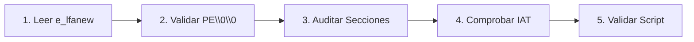

# Laboratorio Práctico: Disección de Cabeceras PE y Cálculo de IMPHASH

[Volver a la teoría del Capítulo 06](../README.md) | [Análisis de Malware](../../README.md)

En este laboratorio realizarás una disección forense de un binario PE a bajo nivel. Navegarás por sus estructuras internas, extraerás el desplazamiento `e_lfanew`, validarás la firma `PE\0\0`, inspeccionarás el punto de entrada (*Entry Point*) y auditarás los permisos de sus secciones.

---

## 1. Objetivos del Laboratorio

1. Extraer el puntero `e_lfanew` situado en el offset `0x3C` del DOS Header.
2. Validar la presencia física de la firma de 4 bytes `PE\0\0` (`0x50 0x45 0x00 0x00`).
3. Inspeccionar el `AddressOfEntryPoint` y el número de secciones registradas en el COFF Header.
4. Auditar las características de las secciones para verificar la ausencia de permisos anómalos `W+X`.
5. Ejecutar el script automatizado `verificar_pe_imphash.ps1` para validar la práctica.

---

## 2. Diagrama de Flujo del Laboratorio



---

## 3. Guía de Ejecución Paso a Paso

Utilizaremos como objeto de análisis un binario PE del sistema (`C:\Windows\System32\notepad.exe`) o una muestra de prueba para verificar las estructuras canónicas.

### Paso 1: Leer el Puntero `e_lfanew`

Abre una terminal de **PowerShell** y ejecuta:

```powershell
$target = "C:\Windows\System32\notepad.exe"
$bytes = [System.IO.File]::ReadAllBytes($target)

# El offset 0x3C contiene el entero de 32 bits que apunta a la cabecera PE
$e_lfanew = [System.BitConverter]::ToInt32($bytes, 0x3C)
Write-Host "[*] Desplazamiento e_lfanew: 0x$($e_lfanew.ToString('X2')) ($e_lfanew bytes)" -ForegroundColor Cyan
```

---

### Paso 2: Validar la Firma `PE\0\0`

Navega hasta la dirección indicada por `e_lfanew` y comprueba los 4 bytes de la firma PE:

```powershell
$peSigBytes = $bytes[$e_lfanew..($e_lfanew + 3)]
$peSigHex = ($peSigBytes | ForEach-Object { "{0:X2}" -f $_ }) -join " "
$peSigAscii = [System.Text.Encoding]::ASCII.GetString($peSigBytes)

Write-Host "Firma PE (Hex):   $peSigHex" -ForegroundColor Green
Write-Host "Firma PE (ASCII): $peSigAscii" -ForegroundColor Green
```

> [!NOTE]
> La secuencia `50 45 00 00` confirma que el cargador de Windows reconoce este archivo como un binario Portable Executable válido.

---

### Paso 3: Inspeccionar Arquitectura y Número de Secciones

Inmediatamente después de la firma `PE\0\0` (offset `$e_lfanew + 4`) comienza el **COFF File Header**:

```powershell
# Machine Type (2 bytes)
$machine = [System.BitConverter]::ToUInt16($bytes, $e_lfanew + 4)
# NumberOfSections (2 bytes en offset +6)
$numSections = [System.BitConverter]::ToUInt16($bytes, $e_lfanew + 6)

Write-Host "[*] Machine Type:        0x$($machine.ToString('X4')) (0x8664 = x64, 0x014C = x86)" -ForegroundColor Cyan
Write-Host "[*] Numero de secciones: $numSections" -ForegroundColor Cyan
```

---

### Paso 4: Auditar Secciones Canónicas

Verifica las secciones registradas en el binario buscando nombres canónicos (`.text`, `.rdata`, `.data`):

```powershell
# El Optional Header mide 240 bytes en x64 (PE32+) y 224 en x86 (PE32)
$optHeaderSize = [System.BitConverter]::ToUInt16($bytes, $e_lfanew + 20)
$sectionTableOffset = $e_lfanew + 24 + $optHeaderSize

Write-Host "[*] Tabla de Secciones inicia en offset: 0x$($sectionTableOffset.ToString('X2'))" -ForegroundColor Yellow

for ($i = 0; $i -lt $numSections; $i++) {
    $currentOffset = $sectionTableOffset + ($i * 40)
    $secNameBytes = $bytes[$currentOffset..($currentOffset + 7)]
    $secName = [System.Text.Encoding]::ASCII.GetString($secNameBytes).Trim("`0")
    $vSize = [System.BitConverter]::ToUInt32($bytes, $currentOffset + 8)
    $rSize = [System.BitConverter]::ToUInt32($bytes, $currentOffset + 16)
    
    Write-Host "    -> Seccion $i: $($secName.PadRight(8)) | VirtualSize: 0x$($vSize.ToString('X6')) | RawSize: 0x$($rSize.ToString('X6'))" -ForegroundColor DarkGray
}
```

---

### Paso 5: Validación Automatizada

Ejecuta el script interactivo de comprobación para calificar tus conocimientos:

```powershell
Set-ExecutionPolicy -Scope Process -ExecutionPolicy Bypass
.\verificar_pe_imphash.ps1
```
