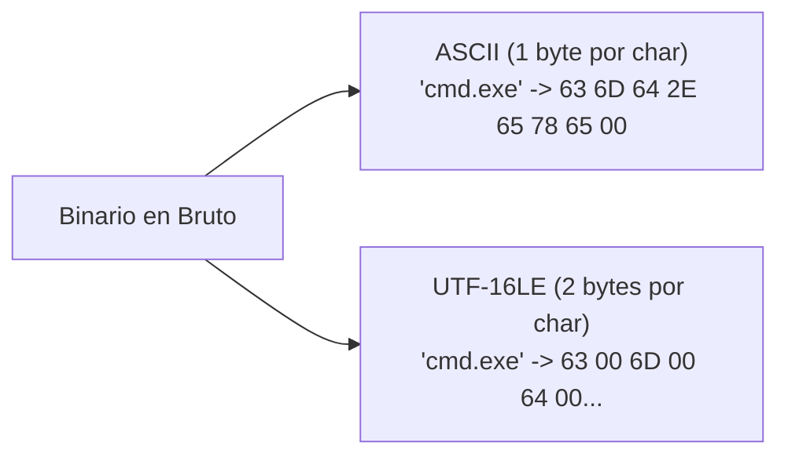
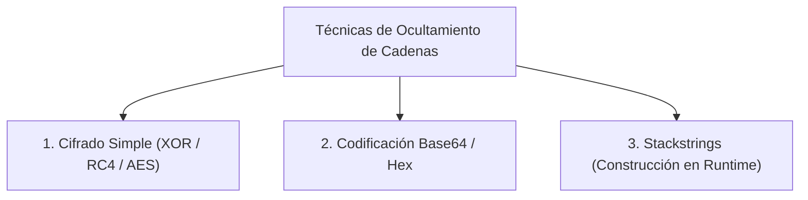
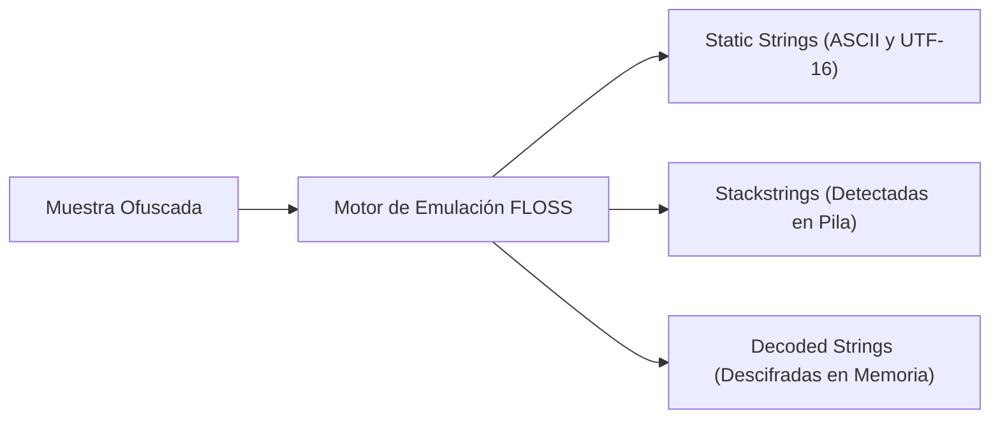
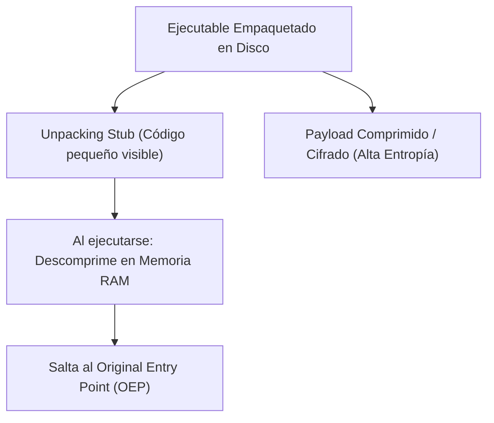
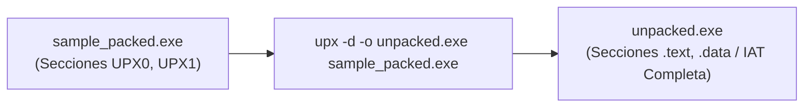

# Capítulo 07: Análisis de Cadenas, Desofuscación con FLOSS y Packers (UPX)

[Inicio](../../README.md) | [Análisis de Malware](../README.md) | [Capítulo 06: Formato PE e IMPHASH](../06-formato-pe-e-imphash/README.md) | [Capítulo 08: Análisis Dinámico y Procmon](../08-analisis-dinamico-procmon-noriben/README.md)

El análisis de cadenas (*strings*) es una de las técnicas de triaje más veloces para extraer indicadores de compromiso: servidores C2, claves de registro, mensajes de rescate y rutas de compilación PDB. Sin embargo, los autores de malware ocultan deliberadamente estas cadenas mediante cifrado, *stackstrings* y empaquetadores (*packers*). Este capítulo enseña a extraer texto plano, desofuscar con **FLOSS**, medir la **entropía de Shannon** y revertir binarios empaquetados con **UPX**.

---

## 1. Análisis de Cadenas: ASCII vs. Unicode (UTF-16LE)

Una cadena de texto (*string*) en un binario ejecutable es una secuencia contigua de caracteres legibles terminada en un byte nulo (`0x00`).



* **Cadenas ASCII**: 1 byte por carácter. Habituales en código heredado, bibliotecas en C y URLs.
* **Cadenas UTF-16LE (Unicode de Windows)**: 2 bytes por carácter. Como el alfabeto latino utiliza solo el primer byte, el segundo byte es un nulo (`0x00`).
* **Falso Negativo de Principiante**: Si ejecutas el comando `strings` tradicional sin parámetros, solo buscará cadenas ASCII de 1 byte, ignorando todas las cadenas Unicode de Windows (como nombres de servicios o rutas del sistema).

### ¿Qué buscar en las cadenas?

1. **Direcciones IP y Dominios C2**: `http://192.168.100.50/gate.php`, `update-microsoft.com`.
2. **Comandos de Sistema**: `cmd.exe /c powershell -enc`, `vssadmin delete shadows /all /quiet`.
3. **Puntos de Persistencia**: `Software\Microsoft\Windows\CurrentVersion\Run`.
4. **Rutas PDB (*Program Database*)**:
   * Rutas de depuración generadas por Visual Studio que se incrustan en el binario:
     `C:\Users\dev_ivan\Projects\Trojan_RAT\Release\client.pdb`
   * Revelan el nombre original del proyecto, la versión y el nombre de usuario del autor hostil.

---

## 2. Ofuscación de Cadenas y Stackstrings

Para evitar que herramientas automáticas detecten sus intenciones, el malware evita almacenar cadenas legibles en texto plano:



### ¿Qué es una *Stackstring*?

En lugar de almacenar `"cmd.exe"` en la sección de datos, el malware escribe instrucciones de ensamblador que colocan cada carácter individualmente en la pila (*stack*) justo antes de usarlo:

```asm
mov byte ptr [ebp-8], 'c'   ; 0x63
mov byte ptr [ebp-7], 'm'   ; 0x6D
mov byte ptr [ebp-6], 'd'   ; 0x64
mov byte ptr [ebp-5], '.'   ; 0x2E
mov byte ptr [ebp-4], 'e'   ; 0x65
mov byte ptr [ebp-3], 'x'   ; 0x78
mov byte ptr [ebp-2], 'e'   ; 0x65
mov byte ptr [ebp-1], 0     ; Byte nulo terminador
```

El comando `strings` convencional no encuentra ninguna secuencia de caracteres en disco porque los bytes están separados por los códigos de operación (`mov`).

---

## 3. Desofuscación Automatizada con FLOSS

**FLOSS (FLARE Obfuscated String Solver)** de Mandiant revoluciona el análisis estático. A diferencia de `strings`, FLOSS utiliza un motor de emulación de CPU para ejecutar fragmentos de código máquina de forma aislada, interceptar las rutinas de descifrado y extraer las cadenas reconstruidas:



```bash
# Extraer cadenas estáticas y stackstrings con FLOSS
floss sample.exe

# Omitir cadenas estáticas y buscar únicamente cadenas descifradas y stackstrings
floss --no-static-strings sample.exe
```

---

## 4. Empaquetadores (*Packers*) y Entropía de Shannon

Un **Packer** es un software diseñado originalmente para comprimir ejecutables legítimos, pero adoptado masivamente por los desarrolladores de malware para ocultar su código hostil frente a firmas antivirus.



### 4.1. Entropía de Shannon (Medida de Aleatoriedad)

La entropía cuantifica la aleatoriedad de los bytes de un archivo en una escala de **0.0 a 8.0**:

* **Entropía Baja (0.0 - 4.5)**: Archivos de texto plano, código máquina normal sin empaquetar, ejecutables con muchas secuencias de ceros.
* **Entropía Alta (7.0 - 8.0)**: Datos fuertemente comprimidos, cifrados con claves robustas o empaquetados. Una sección `.text` con entropía superior a 7.2 es un indicador casi seguro de empaquetamiento o cifrado.

### 4.2. Huellas Físicas de un Binario Empaquetado

1. **Nombres de Secciones Inusuales**: Nombres como `UPX0`, `UPX1`, `.aspack` o `.themida`.
2. **Discrepancia de Tamaños**:
   * `SizeOfRawData` en disco es extremadamente pequeño (o 0).
   * `VirtualSize` en memoria es enorme (se reserva espacio para expandir el código).
3. **Sección con Permisos `RWX`**: El *stub* necesita escribir el código descifrado (`Write`) y luego ejecutarlo (`Execute`).
4. **IAT Casi Vacía**: Solo importa 2 funciones de `kernel32.dll`: `LoadLibraryA` y `GetProcAddress` (para resolver APIs en caliente).

---

## 5. Desempaquetado de Binarios con UPX

**UPX (Ultimate Packer for eXecutables)** es el empaquetador de código abierto más popular.



### Comandos de Inspección y Desempaquetado

```cmd
:: 1. Comprobar si el archivo está empaquetado con UPX
upx -l sample.exe

:: 2. Desempaquetar el binario para análisis estático
upx -d -o sample_unpacked.exe sample.exe
```

Al desempaquetar el binario:
* Las secciones originales recuperan sus tamaños reales.
* La entropía de la sección de código desciende a valores normales (< 6.5).
* La IAT completa y todas las cadenas en texto plano quedan expuestas para su análisis.

---

## 6. Comandos Forenses de Cadenas

```powershell
# Extraer cadenas ASCII de longitud mínima 8 caracteres con PowerShell
Select-String -Path "sample.exe" -Pattern '[\x20-\x7E]{8,}' -AllMatches | 
    ForEach-Object { $_.Matches.Value }

# Buscar patrones específicos de URLs o IPs
Select-String -Path "sample.exe" -Pattern '(http|https)://[^\s]+' -AllMatches | 
    ForEach-Object { $_.Matches.Value }
```

---

## Próximos Pasos

Avanza al [Laboratorio Práctico del Capítulo 07](./lab/README.md) para empaquetar y desempaquetar muestras con UPX, medir variaciones de entropía y extraer cadenas ocultas mediante scripts interactivos.
