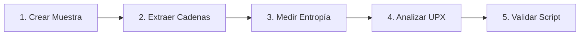

# Laboratorio Práctico: Extracción de Cadenas, Entropía y Detección de Packers

[Volver a la teoría del Capítulo 07](../README.md) | [Análisis de Malware](../../README.md)

En este laboratorio aprenderás a extraer indicadores de compromiso (IOCs) mediante el análisis de cadenas de texto ASCII y Unicode, calcular la entropía de Shannon para detectar empaquetamiento y auditar cabeceras de packers comunes como UPX.

---

## 1. Objetivos del Laboratorio

1. Generar una muestra sintética que contenga artefactos de cadenas ASCII y Unicode (URLs C2 y comandos).
2. Extraer programáticamente cadenas de texto plano discriminando entre ASCII y UTF-16LE.
3. Calcular la entropía de Shannon para diferenciar datos de baja y alta aleatoriedad.
4. Identificar firmas estructurales de empaquetadores (*Packers*).
5. Ejecutar el script automatizado `verificar_strings_upx.ps1` para validar la práctica.

---

## 2. Diagrama de Flujo del Laboratorio



---

## 3. Guía de Ejecución Paso a Paso

### Paso 1: Generar la Muestra con Cadenas Ocultas

Abre una terminal de **PowerShell** y crea un archivo de prueba con cadenas embebidas simulando un binario malicioso:

```powershell
New-Item -ItemType Directory -Path "C:\Purpesec_Lab\StringsLab" -Force

# Escribir cabecera MZ y cadenas embebidas
$content = @"
MZ_SIMULATED_HEADER_DATA
http://192.168.100.200/c2_beacon.php
C:\Windows\System32\cmd.exe /c whoami
HKCU\Software\Microsoft\Windows\CurrentVersion\Run
TARGET_RANSOM_NOTE: All your databases have been encrypted!
"@

Set-Content -Path "C:\Purpesec_Lab\StringsLab\sample_strings.bin" -Value $content
```

---

### Paso 2: Extraer Indicadores de Red (URLs e IPs)

Filtra las cadenas del archivo buscando patrones de red con expresiones regulares:

```powershell
$targetFile = "C:\Purpesec_Lab\StringsLab\sample_strings.bin"
$rawText = Get-Content -Path $targetFile -Raw

# Extraer URLs
$urls = [regex]::Matches($rawText, 'https?://[^\s]+') | ForEach-Object { $_.Value }
Write-Host "[*] URLs C2 detectadas: $urls" -ForegroundColor Cyan

# Extraer comandos ejecutables
$cmds = [regex]::Matches($rawText, '[A-Za-z]:\\[^\s]+\.exe[^\r\n]*') | ForEach-Object { $_.Value }
Write-Host "[*] Comandos detectados: $cmds" -ForegroundColor Yellow
```

---

### Paso 3: Medir la Entropía de Shannon

La entropía mide el grado de desorden de la información. Un binario con entropía superior a 7.0 suele estar empaquetado o cifrado:

```powershell
function Get-ShannonEntropy([byte[]]$bytes) {
    $counts = @{}
    foreach ($b in $bytes) { $counts[$b] = $counts[$b] + 1 }
    $entropy = 0.0
    $len = $bytes.Length
    foreach ($k in $counts.Keys) {
        $p = $counts[$k] / $len
        $entropy += -$p * [Math]::Log($p, 2)
    }
    return [Math]::Round($entropy, 4)
}

$sampleBytes = [System.IO.File]::ReadAllBytes("C:\Purpesec_Lab\StringsLab\sample_strings.bin")
$entropy = Get-ShannonEntropy -bytes $sampleBytes
Write-Host "[*] Entropía de la muestra: $entropy / 8.0" -ForegroundColor Green
```

> [!NOTE]
> Al ser un archivo de texto plano con código no comprimido, la entropía se mantendrá en valores bajos (3.5 - 5.0). Los archivos empaquetados con UPX presentan valores entre 7.3 y 7.9.

---

### Paso 4: Validación Automatizada

Ejecuta el script interactivo de comprobación:

```powershell
Set-ExecutionPolicy -Scope Process -ExecutionPolicy Bypass
.\verificar_strings_upx.ps1
```

---

### Paso 5: Limpieza del Entorno

Una vez validado el laboratorio, elimina la carpeta de trabajo:

```powershell
Remove-Item -Path "C:\Purpesec_Lab\StringsLab" -Recurse -Force -ErrorAction SilentlyContinue
```
