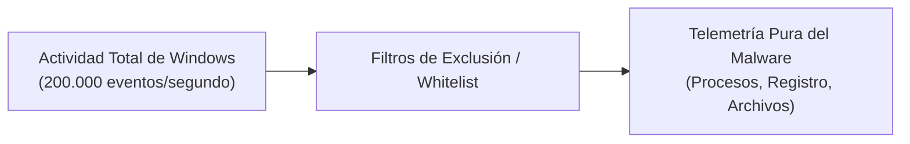
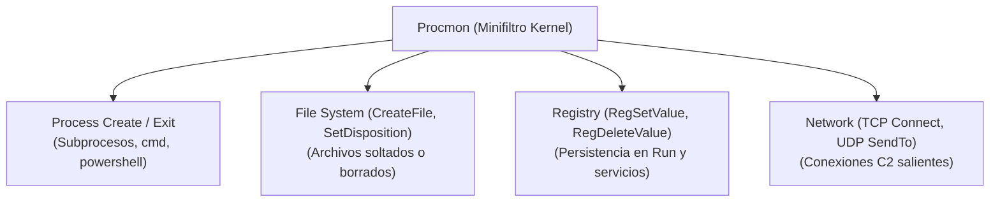
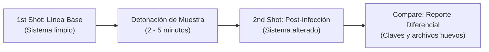
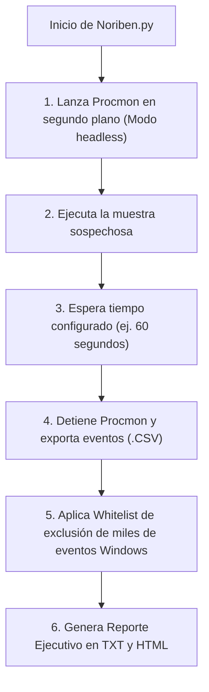

# Capítulo 08: Análisis Dinámico, Telemetría de Host y Automatización con Noriben

[Inicio](../../README.md) | [Análisis de Malware](../README.md) | [Capítulo 07: Cadenas y Packers UPX](../07-strings-floss-y-packers-upx/README.md) | [Capítulo 09: Simulación de Red y Sysmon](../09-red-c2-wireshark-y-sysmon/README.md)

El **análisis dinámico** (o análisis conductual) consiste en ejecutar la muestra en una máquina virtual confinada e instrumentada para observar y correlacionar sus acciones en tiempo real. En este capítulo dominarás la captura de llamadas al kernel con **Process Monitor (Procmon)**, el análisis diferencial de cambios con **Regshot** y la automatización forense con **Noriben** para generar reportes ejecutivos de host en segundos.

---

## 1. El Reto de la Telemetría de Host: Separar Señal de Ruido

Windows es un sistema operativo extraordinariamente activo en segundo plano. Un sistema en reposo genera entre **50.000 y 200.000 eventos por segundo** (actualizaciones, sondeos de servicios, índices de búsqueda, comprobaciones de red).



> [!IMPORTANT]
> **Axioma del Analista**: "En análisis dinámico, saber filtrar es tan importante como saber detonar". Sin filtros adecuados, la evidencia de una persistencia en el registro o de un archivo secundario soltado en `%TEMP%` quedará sepultada bajo gigabytes de logs irrelevantes.

---

## 2. Process Monitor (Procmon) y la Lógica de Minifiltros

Procmon (de Sysinternals) opera mediante un controlador de minifiltro de kernel (`PROCMON24.SYS`) que intercepta todas las operaciones del subsistema I/O de Windows:



### 2.1. Filtros Indispensables para Contener la Muestra

Al abrir Procmon (`Ctrl + L` para abrir la ventana de filtros), configura las siguientes reglas:

1. **Aislar el Proceso**:
   * `Process Name is sample.exe -> Include`
2. **Detectar Creación de Subprocesos (Droppers y Consolas)**:
   * `Operation is Process Create -> Include`
   * Revela si el malware ejecuta comandos como `cmd.exe /c whoami` o `powershell.exe -enc`.
3. **Detectar Escritura en Registro (Persistencia)**:
   * `Operation is RegSetValue -> Include`
   * Filtra las claves donde el malware ancla su arranque.
4. **Detectar Archivos Nuevos en Disco**:
   * `Operation is CreateFile` y `Detail contains Open -> Exclude` (dejar solo creación física).
   * Permite capturar la ruta exacta del payload de segunda etapa (*Stage 2*).

---

## 3. Regshot: La Técnica Diferencial de Estado

Regshot es una herramienta visual ligera que compara el estado completo del Registro de Windows y del sistema de archivos antes y después de la detonación:



1. **1st Shot**: Se toma con el sistema limpio antes de abrir el malware.
2. **Detonación**: Se ejecuta la muestra con privilegios de usuario y/o administrador.
3. **2nd Shot**: Se captura tras varios minutos de actividad.
4. **Compare**: Genera un archivo de texto (`~res.txt`) que lista de forma resumida y legible:
   * Claves agregadas y modificadas.
   * Archivos creados, renombrados o eliminados.

---

## 4. Automatización con Noriben

**Noriben** (desarrollado por Brian Baskin) es el estándar indiscutible para automatizar Procmon en laboratorios de análisis de malware. En lugar de lidiar manualmente con interfaces gráficas y filtros complejos, Noriben automatiza todo el ciclo de detonación:



### Ventajas Operativas de Noriben

1. **Lista Blanca Extensiva**: Incorpora reglas para omitir automáticamente la actividad de telemetría normal de Windows, navegadores y servicios del sistema.
2. **Generación de Reportes Estructurados**: Produce un informe claro con:
   * Procesos creados y sus líneas de comandos completas.
   * Archivos soltados en disco (*Dropped Files*) y sus hashes SHA-256 calculados automáticamente.
   * Modificaciones en el registro.
   * Conexiones de red intentadas.
3. **Reglas YARA Automáticas**: Genera borradores de reglas YARA basados en las rutas y nombres de los archivos depositados por el malware.

---

## 5. Comandos Forenses para Automatización de Procmon y Noriben

### 5.1. Control de Procmon desde Consola

```cmd
:: Iniciar captura silenciosa de Procmon guardando eventos en archivo binario PML
procmon.exe /BackingFile C:\Logs\detonacion.pml /Quiet /Minimized

:: Detener la captura de Procmon en caliente
procmon.exe /Terminate

:: Convertir el archivo PML a CSV para análisis automatizado con scripts
procmon.exe /OpenLog C:\Logs\detonacion.pml /SaveAs C:\Logs\detonacion.csv
```

### 5.2. Ejecución de Noriben en FLARE VM

```cmd
:: Ejecutar Noriben con tiempo de observación de 60 segundos y detonación directa
python Noriben.py -t 60 --cmd "C:\Muestras\sample.exe"

:: Ejecutar Noriben en modo manual (espera a que el analista interactúe con la muestra)
python Noriben.py
```

---

## Próximos Pasos

Avanza al [Laboratorio Práctico del Capítulo 08](./lab/README.md) para ejecutar una sesión de telemetría dinámica instrumentada, aplicar filtros de Procmon y analizar el reporte diferencial de eventos.
