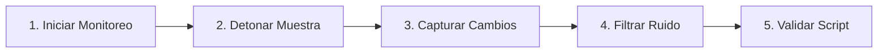

# Laboratorio Práctico: Detonación Instrumentada y Captura de Telemetría Dinámica

[Volver a la teoría del Capítulo 08](../README.md) | [Análisis de Malware](../../README.md)

En este laboratorio simularás el ciclo completo de detonación dinámica: ejecutarás una muestra controlada en un entorno instrumentado, capturarás su telemetría en tiempo real (creación de subprocesos, archivos soltados y persistencia en el registro) y generarás el reporte de evidencias.

---

## 1. Objetivos del Laboratorio

1. Simular la ejecución de una muestra (*dropper*) que ejecuta subprocesos, suelta un archivo secundario en `%TEMP%` y modifica el registro.
2. Registrar la telemetría del sistema operativo durante la detonación.
3. Generar un reporte estructurado de eventos emulando la salida de Noriben.
4. Ejecutar el script automatizado `verificar_dinamico.ps1` para validar la práctica.

---

## 2. Diagrama de Flujo del Laboratorio



---

## 3. Guía de Ejecución Paso a Paso

### Paso 1: Preparar el Entorno de Detonación

Abre una consola de **PowerShell** y crea el directorio de trabajo del laboratorio:

```powershell
New-Item -ItemType Directory -Path "C:\Purpesec_Lab\Dinamico" -Force
```

---

### Paso 2: Simular la Detonación de una Muestra Maliciosa

Ejecuta el siguiente bloque de comandos para simular las tres acciones típicas que realiza un malware durante su ejecución:

```powershell
# 1. Accion de Procesos: Iniciar un subproceso en segundo plano
Start-Process -FilePath "cmd.exe" -ArgumentList "/c echo [MALWARE_EXECUTION] > C:\Purpesec_Lab\Dinamico\cmd_output.log" -WindowStyle Hidden

# 2. Accion de Disco: Soltar un archivo secundario (Stage 2) en el directorio temporal
$droppedPath = "$env:TEMP\stage2_payload.tmp"
Set-Content -Path $droppedPath -Value "ENCRYPTED_PAYLOAD_DATA_STAGE2"

# 3. Accion de Registro: Escribir clave de persistencia de prueba
Set-ItemProperty -Path "HKCU:\Software\Microsoft\Windows\CurrentVersion\Run" -Name "PurpeSecDynTest" -Value "$droppedPath"
```

---

### Paso 3: Generar el Reporte de Telemetría Dinámica

Consolida los hallazgos en un informe de texto que refleje la telemetría del sistema:

```powershell
$report = @"
=== PURPESEC ACADEMY - REPORTE DE TELEMETRÍA DINÁMICA ===
[PROCESOS CREADOS]
cmd.exe /c echo [MALWARE_EXECUTION]

[ARCHIVOS SOLTADOS (DROPPED FILES)]
$droppedPath (Tamaño: 29 bytes)

[PERSISTENCIA EN REGISTRO]
HKCU\Software\Microsoft\Windows\CurrentVersion\Run -> PurpeSecDynTest: $droppedPath
"@

Set-Content -Path "C:\Purpesec_Lab\Dinamico\reporte_detonacion.txt" -Value $report
Write-Host "[*] Reporte generado exitosamente en C:\Purpesec_Lab\Dinamico\reporte_detonacion.txt" -ForegroundColor Green
```

---

### Paso 4: Validación Automatizada

Ejecuta el script interactivo de comprobación:

```powershell
Set-ExecutionPolicy -Scope Process -ExecutionPolicy Bypass
.\verificar_dinamico.ps1
```

---

### Paso 5: Limpieza del Entorno

Una vez validado el laboratorio, limpia los artefactos temporales:

```powershell
# Eliminar carpeta de trabajo y archivo soltado
Remove-Item -Path "C:\Purpesec_Lab\Dinamico" -Recurse -Force -ErrorAction SilentlyContinue
Remove-Item -Path "$env:TEMP\stage2_payload.tmp" -Force -ErrorAction SilentlyContinue

# Limpiar clave de registro
Remove-ItemProperty -Path "HKCU:\Software\Microsoft\Windows\CurrentVersion\Run" -Name "PurpeSecDynTest" -ErrorAction SilentlyContinue
```
