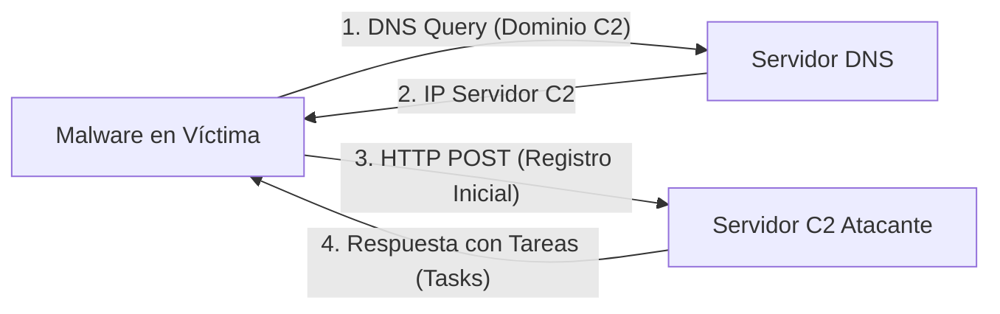
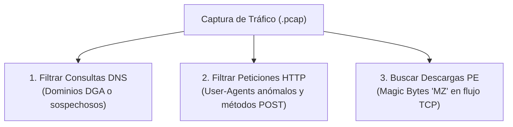
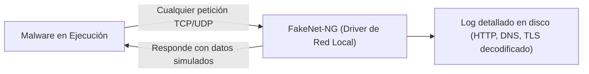
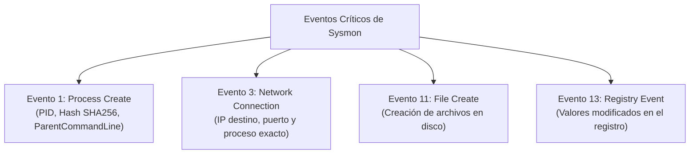

# Capítulo 09: Simulación de Red, Wireshark, Protocolos C2 y Auditoría con Sysmon

[Inicio](../../README.md) | [Análisis de Malware](../README.md) | [Capítulo 08: Análisis Dinámico y Noriben](../08-analisis-dinamico-procmon-noriben/README.md) | [Capítulo 10: Ensamblador e IDA/Ghidra](../10-ensamblador-reversing-ida-ghidra/README.md)

Cuando una muestra hostil se ejecuta en el host, su siguiente paso crítico es comunicarse con su infraestructura de **Comando y Control (C2)** para reportar la infección, recibir instrucciones o exfiltrar credenciales. En este capítulo dominarás la intercepción de tráfico de red con **Wireshark**, la detección de balizamiento (*beaconing*), la simulación de servicios con **FakeNet-NG/INetSim** y la correlación de eventos de host y red mediante **Sysmon**.

---

## 1. Anatomía de las Comunicaciones de Comando y Control (C2)

El canal C2 es la línea de vida del atacante. Un malware sin comunicación queda aislado y solo puede cumplir funciones preprogramadas.



### Técnicas Comunes de Comunicación C2

1. **Balizamiento (*Beaconing*)**:
   * El malware envía pulsos periódicos de conexión (por ejemplo, cada 60 segundos) para notificar que sigue activo.
   * **Jitter**: Para evadir detección por periodicidad fija en firewalls, los atacantes añaden un porcentaje aleatorio de variación en el tiempo de espera (ejemplo: 60s $\pm$ 20%).
2. **Canales Encubiertos**:
   * **DNS Tunneling**: Codificación de datos exfiltrados dentro de subdominios (`exfil_data.attacker-domain.com`).
   * **Servicios Legítimos en la Nube**: Uso de APIs públicas de Telegram, Discord o GitHub como servidores de comando para camuflar el tráfico en conexiones HTTPS legítimas.

---

## 2. Inspección de Tráfico y Análisis de PCAP con Wireshark

Al capturar tráfico de detonación en archivos `.pcap`, el analista busca patrones anómalos en los paquetes:



### Filtros de Visualización Indispensables en Wireshark

| Filtro Wireshark | Objetivo Forense |
|---|---|
| `dns.flags.response == 0` | Muestra todas las consultas DNS salientes realizadas por la muestra. |
| `http.request.method == "POST"` | Identifica transmisiones de telemetría de la víctima hacia el C2. |
| `http.user_agent` | Inspecciona cadenas de identificación del navegador (suelen estar desactualizadas o contener errores tipográficos). |
| `tcp.flags.syn == 1 and tcp.flags.ack == 0` | Detecta intentos de apertura de conexión TCP hacia puertos inusuales (como `4444`, `8080`, `1337`). |
| `frame contains "MZ"` | Localiza transferencias en texto claro de ejecutables secundarios descargados por la red. |

---

## 3. Simulación de Red Local con FakeNet-NG

Cuando no se dispone de una máquina REMnux dedicada, **FakeNet-NG** (desarrollado por Mandiant) se ejecuta directamente en la máquina Windows:



* Intercepta y desvía todas las conexiones de red de la máquina virtual hacia sus propios servidores locales integrados.
* Responde dinámicamente: genera respuestas DNS válidas para cualquier consulta y sirve páginas web o binarios genéricos.
* Descifra tráfico SSL/TLS en caliente mediante certificados simulados, permitiendo leer el contenido de balizamientos HTTPS sin necesidad de proxies externos.

---

## 4. Auditoría Integral del Host con Sysmon

**Sysmon (System Monitor)** de Sysinternals es un servicio y controlador de dispositivo de Windows que permanece residente para monitorizar y registrar en el Visor de Eventos (`Microsoft-Windows-Sysmon/Operational`) toda la actividad de procesos, red y disco con máxima fidelidad.



### 4.1. Evento 1: Creación de Procesos (*Process Creation*)
* Registra el **hash SHA-256 exacto** del binario ejecutado.
* Captura la línea de comandos completa con argumentos ofuscados.
* Registra el proceso padre (`ParentProcessId`, `ParentImage`), lo que permite descubrir de inmediato si un `svchost.exe` fue iniciado de forma fraudulenta por `cmd.exe`.

### 4.2. Evento 3: Conexión de Red (*Network Connect*)
* Vincula de forma inequívoca una dirección IP y puerto remoto con el **nombre y PID del proceso responsable**.
* Permite confirmar si una conexión hacia una IP maliciosa fue iniciada por el navegador legítimo o por un binario hostil camuflado.

---

## 5. Comandos Forenses para Análisis de Red y Sysmon

### 5.1. Consulta de Conexiones Activas con PowerShell

```powershell
# Listar conexiones TCP activas con el PID y nombre del proceso responsable
Get-NetTCPConnection -State Established | Select-Object LocalAddress, LocalPort, RemoteAddress, RemotePort, OwningProcess | 
    ForEach-Object {
        $pName = (Get-Process -Id $_.OwningProcess -ErrorAction SilentlyContinue).ProcessName
        [PSCustomObject]@{
            LocalPort     = $_.LocalPort
            RemoteAddress = $_.RemoteAddress
            RemotePort    = $_.RemotePort
            PID           = $_.OwningProcess
            ProcessName   = $pName
        }
    } | Format-Table -AutoSize
```

### 5.2. Consulta de Eventos de Sysmon con PowerShell

```powershell
# Consultar las ultimas 5 conexiones de red registradas por Sysmon (Evento 3)
Get-WinEvent -FilterHashtable @{LogName='Microsoft-Windows-Sysmon/Operational'; Id=3} -MaxEvents 5 | 
    ForEach-Object { $_.Message }
```

---

## Próximos Pasos

Avanza al [Laboratorio Práctico del Capítulo 09](./lab/README.md) para simular balizamiento C2, capturar paquetes de red e inspeccionar conexiones sospechosas mediante scripts interactivos.
