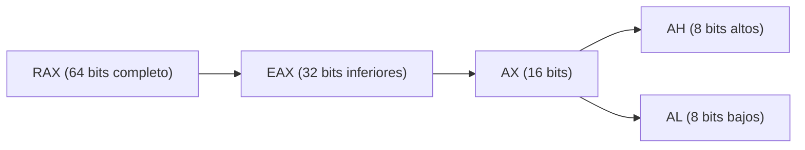
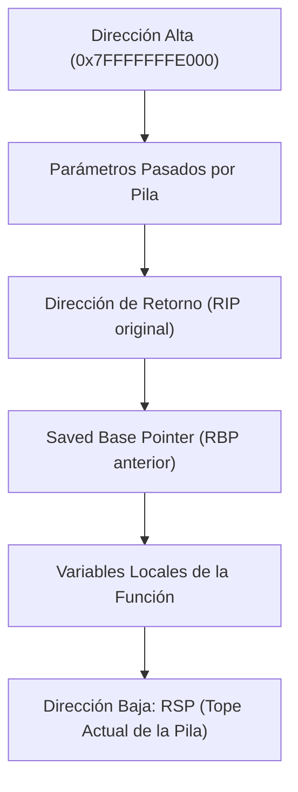
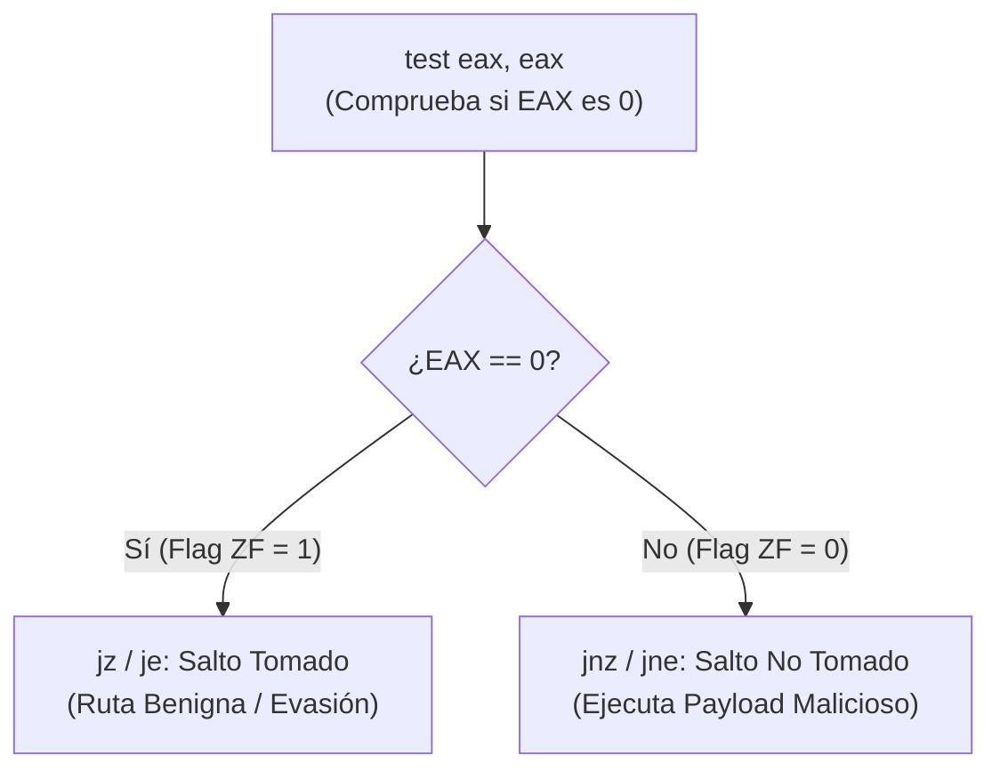
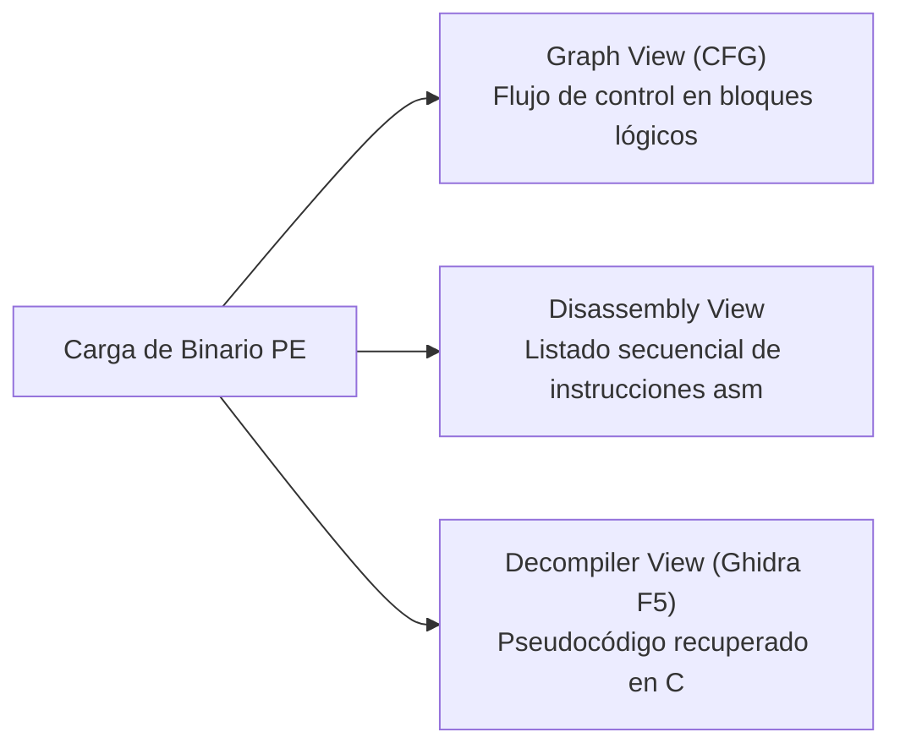
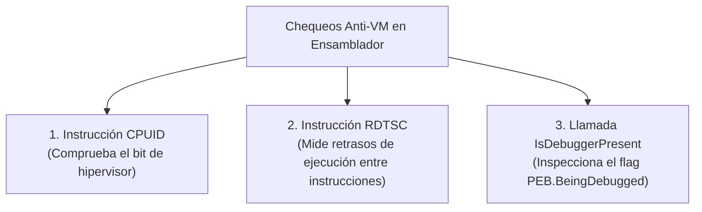

# Capítulo 10: Ensamblador x86/x64 e Ingeniería Inversa con IDA Free y Ghidra

[Inicio](../../README.md) | [Análisis de Malware](../README.md) | [Capítulo 09: Simulación de Red y Sysmon](../09-red-c2-wireshark-y-sysmon/README.md) | [Capítulo 11: Depuración Dinámica con x64dbg](../11-depuracion-x64dbg-y-parcheo-antivm/README.md)

Cuando el análisis estático y dinámico no revelan el funcionamiento interno de un malware sofisticado (debido a lógica cifrada, evasiones condicionales o APIs no documentadas), el analista recurre a la **ingeniería inversa**. Este capítulo proporciona los cimientos de la arquitectura x86/x64, la anatomía del *stack frame*, las instrucciones clave del CPU y el flujo de trabajo en desensambladores profesionales como **Ghidra** e **IDA Free**.

---

## 1. Arquitectura de Registros de CPU en x86 y x64

Los **registros** son las celdas de memoria más veloces del ordenador, ubicadas dentro del propio procesador. En arquitecturas x64 (AMD64 / Intel 64), los registros tienen un ancho de **64 bits**, pero conservan compatibilidad hacia atrás permitiendo acceder a sus partes inferiores:



### Tabla de Registros de Propósito General

| Registro x64 | Registro x86 | Rol Principal en Ejecución | Relevancia en Malware |
|---|---|---|---|
| **`RAX`** | `EAX` | Acumulador / **Valor de retorno de funciones**. | Si una API devuelve error o éxito, el malware comprueba el valor de `RAX`. |
| **`RCX`** | `ECX` | Contador en bucles / **1.º Argumento de función en x64**. | Pasa el primer parámetro a APIs como `CreateFileA`. |
| **`RDX`** | `EDX` | Datos en operaciones E/S / **2.º Argumento en x64**. | Pasa el segundo parámetro. |
| **`R8` - `R9`** | `N/A` | **3.º y 4.º Argumentos de función en x64**. | Exclusivos de la arquitectura de 64 bits. |
| **`RSP`** | `ESP` | **Stack Pointer**: Apunta al tope actual de la pila. | Cambia con cada instrucción `push` y `pop`. |
| **`RBP`** | `EBP` | **Base Pointer**: Apunta a la base del marco actual (*Stack Frame*). | Se utiliza como referencia fija para variables locales y parámetros. |
| **`RIP`** | `EIP` | **Instruction Pointer**: Dirección de la próxima instrucción a ejecutar. | El objetivo de desbordamientos de búfer y secuestros de control. |

---

## 2. La Pila de Ejecución (*Stack*) y el Stack Frame

La pila es una estructura LIFO (*Last In, First Out*) que crece hacia **direcciones de memoria descendentes** (hacia abajo).



### Prólogo y Epílogo Estándar de una Función

Cuando una función es invocada, prepara su propio marco de ejecución (*Stack Frame*):

```asm
; --- PRÓLOGO: Establece el nuevo marco ---
push rbp          ; Guarda el marco de la función anterior
mov  rbp, rsp     ; El nuevo marco inicia en el tope actual
sub  rsp, 0x20    ; Reserva 32 bytes para variables locales

; --- CUERPO: Lógica de la función ---
mov  dword ptr [rbp-4], 0x1   ; Asigna una variable local

; --- EPÍLOGO: Destruye el marco y retorna ---
mov  rsp, rbp     ; Libera el espacio de variables locales
pop  rbp          ; Restaura el marco de la función anterior
ret               ; Extrae la dirección de retorno y salta a ella
```

---

## 3. Instrucciones de Ensamblador Críticas en Análisis de Malware

### 3.1. `mov` vs. `lea`

* **`mov rax, [rbx]`**: Lee el contenido de la dirección de memoria apuntada por `rbx` y lo copia en `rax` (desreferenciación).
* **`lea rax, [rbx + 0x10]`** (*Load Effective Address*): **No accede a memoria**. Solo calcula la dirección aritmética `rbx + 16` y guarda el puntero resultante en `rax`.

### 3.2. Comparaciones y Saltos Condicionales

Las decisiones lógicas del malware (como comprobar si existe un depurador o si la fecha límite expiró) se implementan mediante pares de instrucciones de comparación y salto:



* **`cmp a, b`**: Resta `b` de `a` sin guardar el resultado, alterando las banderas del CPU (`ZF` - Zero Flag, `SF` - Sign Flag).
* **`test a, b`**: Realiza un `AND` lógico a nivel de bits. Comúnmente usado como `test eax, eax`: si `eax` es `0` (NULL), activa la bandera `ZF = 1`.
* **Saltos Frecuentes**:
  * `je` / `jz`: Salta si es igual / si es cero (`ZF == 1`).
  * `jne` / `jnz`: Salta si no es igual / si no es cero (`ZF == 0`).
  * `jmp`: Salto incondicional directo.

---

## 4. Flujo de Trabajo en Ghidra e IDA Free

Al cargar un binario PE en **Ghidra** o **IDA Free**, el desensamblador realiza un análisis automático en tres vistas complementarias:



1. **Graph View (Grafo de Flujo de Control - CFG)**:
   * Representa las decisiones del programa como bloques de código conectados por flechas:
     * **Verde**: Salto condicional tomado.
     * **Rojo**: Salto condicional no tomado.
     * **Azul**: Salto incondicional.
2. **Decompilador (Ghidra)**:
   * Transforma opcodes de ensamblador en código de alto nivel legible similar a C. Facilita enormemente comprender bucles complejos y algoritmos de descifrado.
3. **Referencias Cruzadas (*Xrefs* - Tecla `X`)**:
   * Permite situarse sobre una cadena sospechosa (ejemplo: `"cmd.exe"`) o una API (ejemplo: `VirtualAlloc`) y presionar `X` para ver **todos los lugares del programa donde esa función es llamada**.

---

## 5. Patrones de Evasión Anti-VM Comunes en Ensamblador

El malware avanzado incluye rutinas de comprobación para no desplegar su payload si detecta que está en una máquina virtual o bajo depuración:



1. **`IsDebuggerPresent`**:
   * Consulta internamente el byte `BeingDebugged` dentro de la estructura PEB del proceso. Si vale `1`, el malware se autodestruye.
2. **Instrucción `RDTSC` (*Read Time-Stamp Counter*)**:
   * Lee la cantidad de ciclos de reloj de la CPU transcurridos. El malware ejecuta `RDTSC`, luego una operación sencilla, y otro `RDTSC`. Si la diferencia de ciclos es anormalmente alta, concluye que un analista está ejecutando el código paso a paso en un depurador.

---

## 6. Comandos y Atajos Forenses en Ghidra e IDA

| Acción | Atajo en IDA Free | Atajo en Ghidra |
|---|---|---|
| Alternar entre Vista Gráfico y Vista Texto | Barra Espaciadora | `Tab` / Ventana dedicada |
| Abrir referencias cruzadas (*Xrefs*) | Tecla `X` | Tecla `Ctrl + Shift + F` |
| Ver decompilación en pseudocódigo C | `Tab` / `F5` | Ventana Decompiler automática |
| Renombrar variable o función | Tecla `N` | Tecla `L` |
| Convertir número a constante hexadecimal | Tecla `H` | Clic derecho > *Convert > Hex* |

---

## Próximos Pasos

Avanza al [Laboratorio Práctico del Capítulo 10](./lab/README.md) para analizar una muestra con chequeos de evasión en ensamblador, rastrear referencias cruzadas y desarmar la bifurcación lógica condicional.
