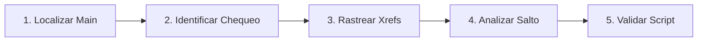

# Laboratorio Práctico: Desensamblado, Control Flow Graphs y Análisis Anti-VM

[Volver a la teoría del Capítulo 10](../README.md) | [Análisis de Malware](../../README.md)

En este laboratorio realizarás ingeniería inversa estática sobre la lógica de control de un binario que implementa evasiones anti-análisis: identificarás llamadas a APIs de comprobación, rastrearás referencias cruzadas (*Xrefs*) y auditarás bifurcaciones condicionales a nivel de opcodes.

---

## 1. Objetivos del Laboratorio

1. Navegar por el Grafo de Flujo de Control (*CFG*) identificando los bloques lógicos de decisión.
2. Reconocer el patrón de decisión `test eax, eax` seguido de saltos condicionales (`jz` / `jnz`).
3. Rastrear referencias cruzadas (*Xrefs*) hacia cadenas críticas en texto plano.
4. Identificar los opcodes binarios de saltos (`0x74`, `0x75`) y la instrucción neutra `NOP` (`0x90`).
5. Ejecutar el script automatizado `verificar_reversing_asm.ps1` para validar la práctica.

---

## 2. Diagrama de Flujo del Laboratorio



---

## 3. Guía de Ejecución Paso a Paso

### Paso 1: Generar el Entorno de Trabajo de Ingeniería Inversa

Abre una consola de **PowerShell** y crea el directorio de trabajo del laboratorio:

```powershell
New-Item -ItemType Directory -Path "C:\Purpesec_Lab\ReversingASM" -Force
```

---

### Paso 2: Análisis del Patrón Anti-VM en Ensamblador

Considera el siguiente fragmento desensamblado recuperado de una rutina de malware:

```asm
.text:00401050  call    cs:IsDebuggerPresent     ; Devuelve 1 en EAX si hay depurador, 0 si no
.text:00401056  test    eax, eax                 ; ¿EAX es cero?
.text:00401058  jnz     short loc_evasion        ; Si NO es cero (hay debugger), salta a loc_evasion
.text:0040105A  ; --- Rama Limpia: Carga y Detonación ---
.text:0040105A  push    offset aInfectionStart   ; "Ejecutando payload..."
.text:0040105F  call    sub_payload
.text:00401064  retn
.text:00401065  ; --- Rama Evasión: Salida Inmediata ---
.text:00401065 loc_evasion:
.text:00401065  xor     eax, eax
.text:00401067  retn                             ; Termina silenciosamente
```

Guarda esta estructura en un archivo de análisis documentado:

```powershell
$asmSnippet = @"
[ANÁLISIS DE RUTINA ANTI-DEBUGGING]
Dirección: 0x00401050
API Consultada: IsDebuggerPresent
Condición de Salto: JNZ short (Opcode: 0x75)
Destino Evasión: 0x00401065 (Exit)
Destino Payload: 0x0040105A (Infection)
"@

Set-Content -Path "C:\Purpesec_Lab\ReversingASM\analisis_patron_antivm.txt" -Value $asmSnippet
Write-Host "[*] Documentación de ingeniería inversa generada." -ForegroundColor Green
```

---

### Paso 3: Identificación de Opcodes y Estrategia de Neutralización

En ingeniería inversa, neutralizar este chequeo se logra alterando los opcodes del binario:

| Instrucción Asm | Código Máquina (Opcode) | Comportamiento |
|---|---|---|
| **`JZ` (Jump if Zero)** | `74 <offset>` | Salta si el resultado anterior fue 0. |
| **`JNZ` (Jump if Not Zero)** | `75 <offset>` | Salta si el resultado anterior fue distinto de 0. |
| **`JMP` (Incondicional)** | `EB <offset>` | Salta siempre sin importar las banderas. |
| **`NOP` (No Operation)** | `90` | No realiza ninguna acción; avanza al siguiente byte. |

> [!TIP]
> **Estrategia de Parcheo**: Cambiar el opcode `75` (`JNZ`) por dos bytes `90 90` (`NOP NOP`) fuerza a la CPU a ignorar el salto y caer directamente en la rutina de infección, permitiendo al analista estudiar el malware sin ser evadido.

---

### Paso 4: Validación Automatizada

Ejecuta el script interactivo de comprobación:

```powershell
Set-ExecutionPolicy -Scope Process -ExecutionPolicy Bypass
.\verificar_reversing_asm.ps1
```

---

### Paso 5: Limpieza del Entorno

Una vez validado el laboratorio, elimina los archivos generados:

```powershell
Remove-Item -Path "C:\Purpesec_Lab\ReversingASM" -Recurse -Force -ErrorAction SilentlyContinue
```
