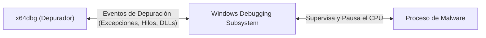
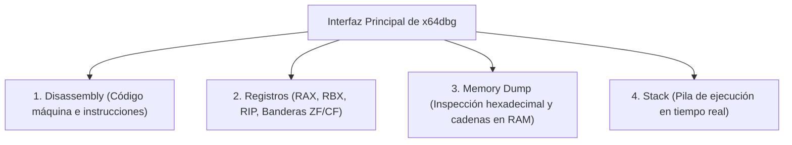
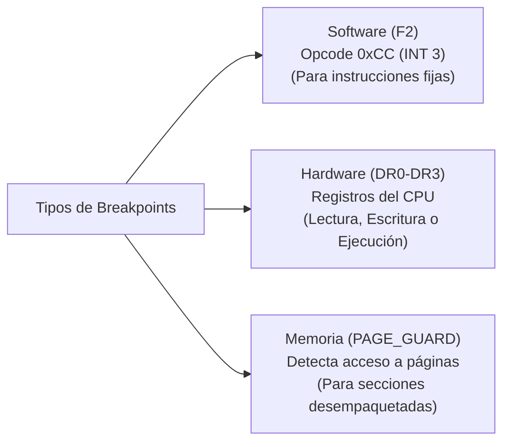
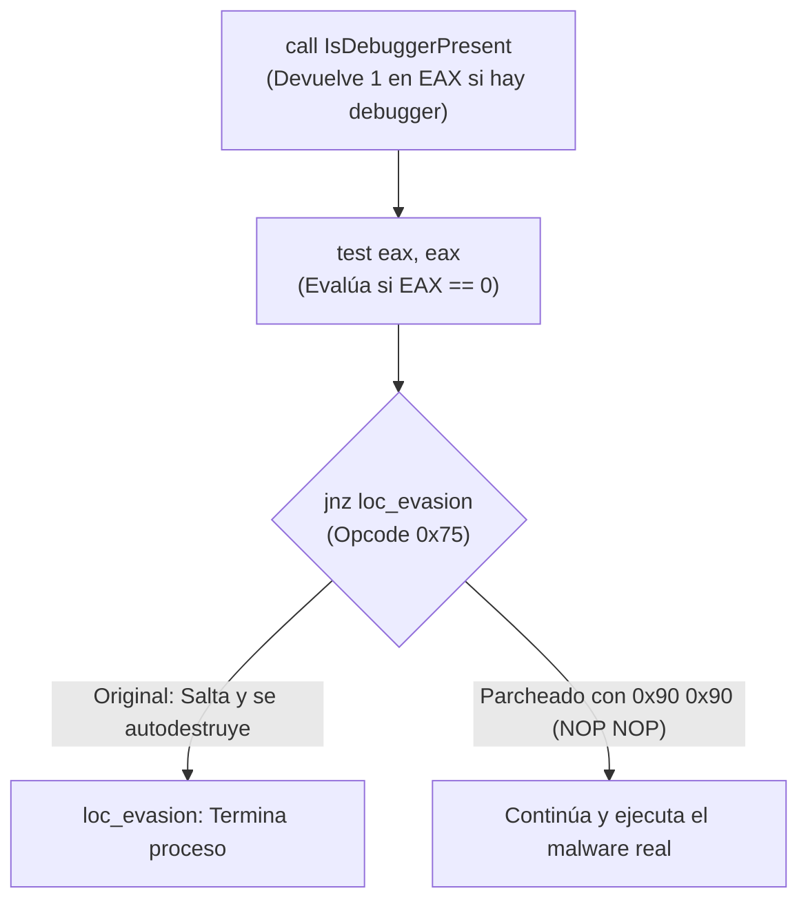

# Capítulo 11: Depuración Dinámica con x64dbg y Parcheo de Evasiones Anti-Análisis

[Inicio](../../README.md) | [Análisis de Malware](../README.md) | [Capítulo 10: Ensamblador e IDA/Ghidra](../10-ensamblador-reversing-ida-ghidra/README.md) | [Capítulo 12: Inyección de Procesos y Memoria](../12-inyeccion-procesos-y-memoria/README.md)

Cuando una muestra de malware incorpora rutinas de protección avanzadas (como detección de hipervisores, cifrado de cadenas en tiempo de ejecución o comprobaciones de depurador), el análisis estático no basta para forzar su ejecución. El analista recurre a la **depuración dinámica en caliente** con **x64dbg** para tomar el control del procesador instrucción a instrucción, alterar banderas en runtime y **parchear el binario** para neutralizar sus evasiones de forma definitiva.

---

## 1. Arquitectura de un Depurador en Modo Usuario (x64dbg)

Un **depurador** es una herramienta que se conecta a un proceso en ejecución (o lo lanza bajo su supervisión) utilizando la API de depuración nativa de Windows (`DEBUG_PROCESS`):

### Las Cuatro Vistas Esenciales de x64dbg

1. **Ventana de Desensamblado (*Disassembly*)**: Muestra las instrucciones que el CPU está a punto de ejecutar. La instrucción actual está resaltada por la flecha de `RIP`.
2. **Panel de Registros**: Muestra el valor hexadecimal contenido en cada registro de la CPU. Permite editar cualquier registro o alternar banderas (`ZF`, `CF`, `SF`) haciendo doble clic sobre ellas.
3. **Volcado de Memoria (*Memory Dump*)**: Permite examinar cualquier dirección de memoria del proceso (búferes descifrados, claves criptográficas, cabeceras PE reconstruidas).
4. **Pila (*Stack*)**: Muestra las direcciones de retorno y los argumentos que los hilos pasan a las funciones.

---

## 2. Tipos de Puntos de Interrupción (*Breakpoints*)

Un **breakpoint** indica al depurador que suspenda la ejecución del programa cuando se alcance una condición determinada:

### Comparativa Técnica de Breakpoints

| Tipo | Mecanismo Interno | Ventajas | Limitaciones |
|---|---|---|---|
| **Software (`F2`)** | Reemplaza el primer byte de la instrucción con el opcode `0xCC` (`INT 3`). Al ejecutarse, genera la excepción `STATUS_BREAKPOINT`. | Ilimitados en número. | Modifica los bytes del binario; el malware que comprueba su propio checksum (CRC32/hashes) puede detectarlo. |
| **Hardware** | Configura los registros de depuración del procesador (`DR0`, `DR1`, `DR2`, `DR3`). | **No altera ningún byte en memoria**. Es invisible para comprobaciones de integridad de código. | Límite estricto de **4 breakpoints** por procesador. |
| **Memoria** | Altera los atributos de la página de memoria asignando la bandera `PAGE_GUARD`. | Excelente para detectar el momento exacto en que un packer termina de escribir su payload en la sección de código. | Ralentiza la ejecución si la página es accedida frecuentemente. |

---

## 3. Control de Flujo y Navegación en x64dbg

| Tecla / Comando | Acción Forense | Significado Técnico |
|---|---|---|
| **`F9`** | **Run (Ejecutar)** | Continúa la ejecución a velocidad normal hasta alcanzar el siguiente breakpoint o la terminación del programa. |
| **`F8`** | **Step Over (Paso por encima)** | Ejecuta la siguiente instrucción. Si es un `CALL`, ejecuta toda la función completa sin entrar en ella. |
| **`F7`** | **Step Into (Paso a paso)** | Ejecuta la siguiente instrucción. Si es un `CALL`, desciende al interior de la función. |
| **`Ctrl + F9`** | **Execute till Return** | Ejecuta todas las instrucciones restantes de la función actual hasta alcanzar la instrucción `RET`. |
| **`F2`** | **Toggle Breakpoint** | Activa o desactiva un breakpoint de software en la línea seleccionada. |

---

## 4. Metodología de Parcheo de Evasiones Anti-Análisis

Considera un malware que detecta si está bajo análisis llamando a `IsDebuggerPresent`:

### 4.1. Las 3 Técnicas de Neutralización

1. **NOPing del Salto (Recomendado)**:
   * Reemplazar la instrucción `jnz loc_evasion` (2 bytes: `75 XX`) por dos instrucciones `NOP` (`90 90`).
   * El procesador no realiza ningún salto y continúa linealmente hacia la rutina del malware.
2. **Inversión de la Condición**:
   * Cambiar el opcode `75` (`JNZ`) por `74` (`JZ`).
   * Ahora el salto solo se tomará si **no** hay depurador, engañando la lógica del atacante.
3. **Modificación en Vivo del Flag**:
   * Sin modificar el binario, colocar un breakpoint en el `JNZ`. Cuando la ejecución pause, hacer doble clic sobre la bandera `ZF` en el panel de registros para cambiarla de `0` a `1`.

---

## 5. Exportar el Binario Parcheado a Disco

Una vez que has neutralizado las rutinas de evasión en x64dbg:

1. Presiona `Ctrl + P` para abrir el diálogo **Patches**.
2. Verifica la lista de bytes modificados (de `75` a `90 90`).
3. Haz clic en **Patch File** y guarda el archivo con un nuevo nombre (ejemplo: `sample_patched.exe`).
4. El nuevo binario ahora se puede detonar o analizar estáticamente en Ghidra sin que las comprobaciones anti-VM se activen.

---

## Próximos Pasos

Avanza al [Laboratorio Práctico del Capítulo 11](./lab/README.md) para neutralizar comprobaciones condicionales en x64dbg, alterar opcodes de saltos y exportar binarios parcheados.
