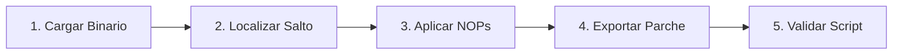

# Laboratorio Práctico: Parcheo de Opcodes y Neutralización de Evasiones

[Volver a la teoría del Capítulo 11](../README.md) | [Análisis de Malware](../../README.md)

En este laboratorio aplicarás la técnica de **parcheo binario** para neutralizar de forma permanente un salto condicional de evasión anti-depuración, modificando directamente sus códigos de operación (opcodes) y exportando un binario saneado.

---

## 1. Objetivos del Laboratorio

1. Generar una muestra binaria sintética que contenga una rutina condicional con salto `JNZ` (`0x75`).
2. Localizar la posición física del opcode de bifurcación dentro del archivo.
3. Aplicar la técnica de parcheo por *NOPing* (reemplazando el salto con instrucciones neutras `0x90 0x90`).
4. Generar y validar el binario parcheado resultante (`muestra_parcheada.bin`).
5. Ejecutar el script automatizado `verificar_depuracion_parcheo.ps1` para validar la práctica.

---

## 2. Diagrama de Flujo del Laboratorio



---

## 3. Guía de Ejecución Paso a Paso

### Paso 1: Generar la Muestra Binaria con Evasión Condicional

Abre una consola de **PowerShell** y crea el directorio de trabajo del laboratorio:

```powershell
New-Item -ItemType Directory -Path "C:\Purpesec_Lab\Parcheo" -Force

# Secuencia binaria que simula:
# 85 C0          -> test eax, eax
# 75 0A          -> jnz  offset_evasion (+10 bytes)  <-- SALTO A PARCHEAR
# B8 2A 00 00 00 -> mov  eax, 42 (Payload exitoso)
# C3             -> ret
# 31 C0          -> xor  eax, eax (Salida evasiva)
# C3             -> ret
$bytecode = [byte[]](0x85, 0xC0, 0x75, 0x0A, 0xB8, 0x2A, 0x00, 0x00, 0x00, 0xC3, 0x31, 0xC0, 0xC3)
[System.IO.File]::WriteAllBytes("C:\Purpesec_Lab\Parcheo\muestra_evasiva.bin", $bytecode)
```

---

### Paso 2: Inspeccionar el Opcode Original de Salto

Comprueba el byte situado en el offset `0x02` (donde reside el salto condicional):

```powershell
$bytes = [System.IO.File]::ReadAllBytes("C:\Purpesec_Lab\Parcheo\muestra_evasiva.bin")
Write-Host "[*] Opcode actual en offset 0x02: 0x$($bytes[2].ToString('X2')) ($([char]$bytes[2]))" -ForegroundColor Yellow
# 0x75 corresponde a la instrucción JNZ
```

---

### Paso 3: Aplicar el Parche Binario (NOPing)

Reemplaza los dos bytes del salto (`0x75 0x0A`) por dos instrucciones `NOP` (`0x90 0x90`) para forzar a la CPU a continuar hacia la rutina del payload:

```powershell
# Crear una copia de trabajo para el binario parcheado
$patchedBytes = $bytes.Clone()

# Sustituir por NOP NOP (0x90 0x90)
$patchedBytes[2] = 0x90
$patchedBytes[3] = 0x90

# Guardar el binario parcheado
[System.IO.File]::WriteAllBytes("C:\Purpesec_Lab\Parcheo\muestra_parcheada.bin", $patchedBytes)
Write-Host "[*] Parche aplicado exitosamente en C:\Purpesec_Lab\Parcheo\muestra_parcheada.bin" -ForegroundColor Green
```

---

### Paso 4: Comparación Forense de Diferencias

Comprueba que solo los bytes de salto fueron modificados:

```powershell
$origHex = ($bytes | ForEach-Object { "{0:X2}" -f $_ }) -join " "
$patchHex = ($patchedBytes | ForEach-Object { "{0:X2}" -f $_ }) -join " "

Write-Host "Original:  $origHex" -ForegroundColor Red
Write-Host "Parcheado: $patchHex" -ForegroundColor Green
```

---

### Paso 5: Validación Automatizada

Ejecuta el script interactivo de comprobación:

```powershell
Set-ExecutionPolicy -Scope Process -ExecutionPolicy Bypass
.\verificar_depuracion_parcheo.ps1
```

---

### Paso 6: Limpieza del Entorno

Una vez validado el laboratorio, elimina los archivos temporales:

```powershell
Remove-Item -Path "C:\Purpesec_Lab\Parcheo" -Recurse -Force -ErrorAction SilentlyContinue
```
