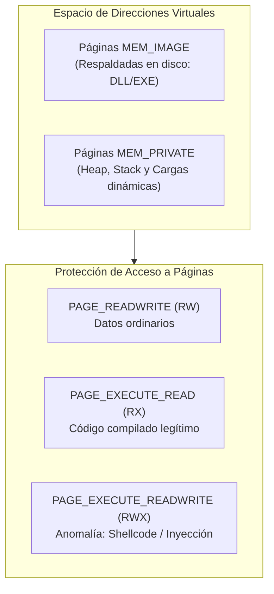
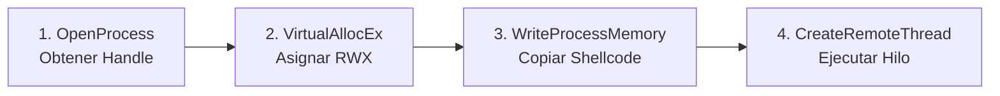
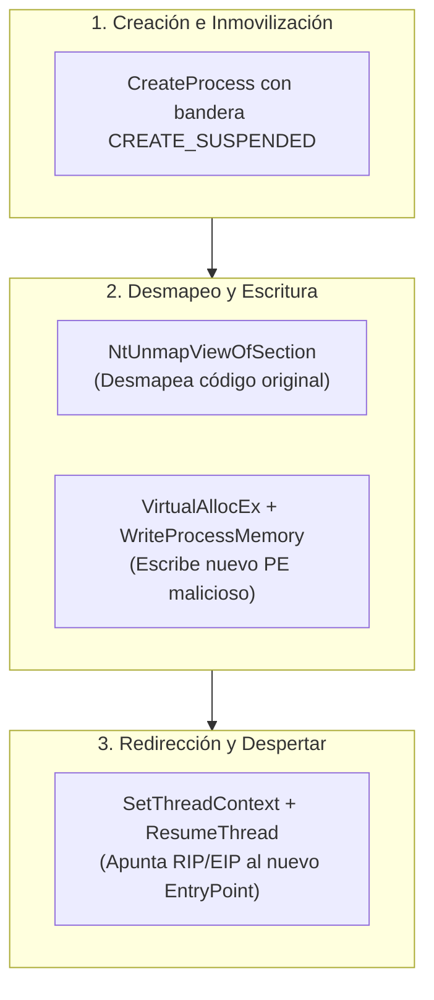

# Capítulo 12: Inyección de Procesos y Análisis Forense de Memoria en Caliente

## 1. Fundamentos de Memoria Virtual en Windows

Para comprender cómo los atacantes y el malware inyectan código en procesos legítimos, es indispensable dominar cómo el kernel de Windows gestiona el espacio de direcciones virtuales (**Virtual Address Space - VAS**).

Cada proceso en Windows de 64 bits opera con su propio espacio virtual privado (aislado de otros procesos mediante paginación y la tabla de páginas controlada por la CPU en `CR3`).



### Tipos de Memoria y Estados de Página

| Tipo / Estado | Constante Win32 | Descripción Forense |
|---|---|---|
| **MEM_IMAGE** | Respaldada por archivo PE | Código ejecutable o DLL mapeada directamente desde un archivo en disco (`C:\Windows\System32\ntdll.dll`). |
| **MEM_MAPPED** | Mapeo genérico | Sección compartida entre procesos o mapeo de archivo sin estructura PE directa. |
| **MEM_PRIVATE** | Memoria privada sin archivo | Memoria reservada exclusivamente para el proceso. El Heap y el Stack son privados. **Un ejecutable o shellcode en `MEM_PRIVATE` con permisos de ejecución es el indicador clásico de inyección.** |
| **PAGE_EXECUTE_READWRITE** | `0x40` (`RWX`) | Permite leer, modificar y ejecutar instrucciones en la misma página. Viola la política W^X (*Write XOR Execute*) y es monitoreado intensamente por EDRs. |

---

## 2. Anatomía de la Inyección Remota Clásica (DLL / Shellcode)

La técnica más documentada en la taxonomía **MITRE ATT&CK T1055** consiste en forzar a un proceso legítimo (por ejemplo, `explorer.exe`, `svchost.exe` o `notepad.exe`) a asignar memoria, escribir un payload y crear un hilo de ejecución remoto.



### Desglose de las Funciones de la API de Windows

#### Paso 1: `OpenProcess`
El proceso atacante solicita acceso al proceso objetivo mediante su identificador numérico (`dwProcessId`):
```c
HANDLE hProcess = OpenProcess(
    PROCESS_CREATE_THREAD | PROCESS_VM_OPERATION | PROCESS_VM_WRITE, // Permisos mínimos requeridos
    FALSE,
    targetPID
);
```

#### Paso 2: `VirtualAllocEx`
Asigna un bloque de memoria virtual dentro del espacio de direcciones del proceso remoto:
```c
LPVOID remoteBuffer = VirtualAllocEx(
    hProcess,
    NULL,
    payloadSize,
    MEM_COMMIT | MEM_RESERVE,
    PAGE_EXECUTE_READWRITE // RWX para ejecutar shellcode directo
);
```

#### Paso 3: `WriteProcessMemory`
Copia el buffer de bytes maliciosos (shellcode o ruta hacia una DLL maliciosa) desde el proceso inyector hacia la memoria remota recién asignada:
```c
WriteProcessMemory(
    hProcess,
    remoteBuffer,
    payloadData,
    payloadSize,
    NULL
);
```

#### Paso 4: `CreateRemoteThread`
Ordena al subsistema del kernel crear un nuevo hilo de ejecución en el proceso remoto apuntando a `remoteBuffer`:
```c
HANDLE hThread = CreateRemoteThread(
    hProcess,
    NULL,
    0,
    (LPTHREAD_START_ROUTINE)remoteBuffer,
    NULL,
    0,
    NULL
);
```

> [!NOTE]
> En la variante de **DLL Injection**, en lugar de escribir shellcode crudo, se escribe la cadena con la ruta de la DLL maliciosa (ej. `C:\Users\Public\payload.dll`) y se pasa la dirección de la función nativa `LoadLibraryA` como función de inicio del hilo.

---

## 3. Process Hollowing (RunPE - T1055.012)

A diferencia de la inyección en un proceso que ya está en ejecución, **Process Hollowing** crea un nuevo proceso legítimo y lo vacía antes de que inicie su ejecución real:



### Por qué evade herramientas tradicionales
1. Para el Administrador de Tareas y Process Explorer inicial, la línea de comandos, el ejecutable en disco y la firma digital corresponden a un binario firmado legítimo de Windows (como `svchost.exe` o `calc.exe`).
2. Sin embargo, en la memoria RAM el binario original fue descargado y reemplazado por el artefacto malicioso.

---

## 4. Detección y Análisis Forense de Memoria

Los analistas de malware y cazadores de amenazas (*threat hunters*) utilizan herramientas avanzadas para identificar anomalías en caliente:

### Comparativa de Técnicas de Detección

| Herramienta | Mecanismo de Detección | Indicador Clave de Alerta |
|---|---|---|
| **Process Hacker / System Informer** | Pestaña *Memory* con filtros de protección | Regiones de tipo `Commit` con protección `RWX` no respaldadas por ningún módulo PE en disco. |
| **Monikers de Sysmon** | Detección de telemetría de eventos | **Sysmon Event ID 8**: `CreateRemoteThread` detectado desde un proceso no confiable hacia un binario del sistema. |
| **Volatility 3 (Plugin `malfind`)** | Análisis estático del árbol VAD (*Virtual Address Descriptor*) | Descriptores de memoria marcados con ejecución que contienen cabeceras `MZ` o secuencias de instrucciones sin archivo respaldado. |
| **ProcDump (`procdump.exe`)** | Volcado de memoria de proceso completo o sección | Genera un archivo `.dmp` para extraer cadenas y artefactos mediante Ghidra o x64dbg. |

---

## 5. Detección en Telemetría con Sysmon: Evento 8

Cuando un proceso malicioso invoca `CreateRemoteThread`, Sysmon genera un registro indispensable para los centros de operaciones de seguridad (SOC):

```xml
<Event>
  <System>
    <EventID>8</EventID>
    <TimeCreated SystemTime="2026-09-13T21:45:00Z" />
  </System>
  <EventData>
    <Data Name="SourceImage">C:\Users\Analyst\Downloads\malware_loader.exe</Data>
    <Data Name="TargetImage">C:\Windows\System32\notepad.exe</Data>
    <Data Name="StartAddress">0x000001D45A200000</Data>
    <Data Name="StartFunction">Unknown (Unbacked)</Data>
  </EventData>
</Event>
```

---

## 6. Resumen del Capítulo

- La inyección de código permite al malware esconderse detrás de procesos confiables del sistema operativo y evadir firewalls perimetrales de host.
- La firma forense más clara es la presencia de memoria **`MEM_PRIVATE`** con permisos **`PAGE_EXECUTE_READWRITE`** (`RWX`) sin archivo en disco asociado.
- La combinación de telemetría de eventos (Sysmon Event ID 8) y análisis en caliente con Process Hacker permite identificar y volcar el payload para su análisis estático.

---

## 7. Próximos Pasos

Pasa al [**Laboratorio Práctico: Detección y Volcado de Memoria Inyectada**](./lab/README.md) para auditar un proceso señuelo, identificar regiones RWX anómalas y volcar la memoria para su inspección con PowerShell.
