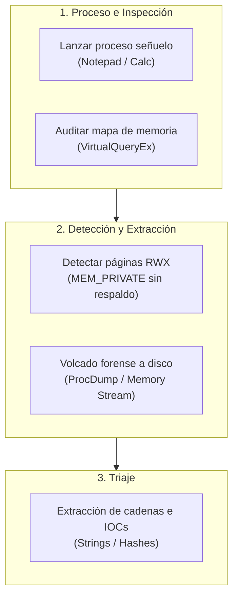

# Laboratorio 12: Detección de Inyección de Código y Volcado Forense de Memoria

## Objetivo del Laboratorio

Aprender a auditar el espacio de memoria virtual de un proceso en ejecución, identificar regiones de memoria privadas marcadas con protección de ejecución anómala (`PAGE_EXECUTE_READWRITE` o `PAGE_EXECUTE_READ`), volcar la región sospechosa a disco y realizar el triaje forense de artefactos inyectados.



---

## Estructura del Laboratorio

```plaintext
12-inyeccion-procesos-y-memoria/
├── README.md
└── lab/
    ├── README.md
    └── verificar_inyeccion_memoria.ps1
```

---

## Procedimiento Paso a Paso

### Paso 1: Lanzar un proceso señuelo para auditoría

Inicia una instancia limpia de `notepad.exe` en segundo plano y captura su identificador numérico de proceso (PID):

```powershell
# Iniciar Notepad y capturar proceso
$proc = Start-Process notepad -PassThru
Write-Host "[+] Proceso objetivo iniciado: $($proc.ProcessName) con PID: $($proc.Id)"
```

---

### Paso 2: Auditar los tipos y protecciones de memoria en caliente

En un entorno de análisis como FLARE VM, abre **Process Hacker** o **System Informer**:
1. Haz doble clic sobre el proceso `notepad.exe` (PID identificado).
2. Ve a la pestaña **Memory**.
3. Observa las columnas:
   - **Type**: Diferencia entre `Image` (código de `notepad.exe` y DLLs oficiales), `Mapped` y `Private`.
   - **Protection**: La inmensa mayoría de páginas privadas de datos deben ser `Read/Write` (`RW`). Las páginas de código deben ser `Execute/Read` (`RX`).
   - **Anomalía**: Cualquier bloque marcado como `Private: Read/Write/Execute` (`RWX`) o `Private: Execute/Read` sin archivo en disco es altamente sospechoso de contener shellcode o un ejecutable inyectado.

---

### Paso 3: Simular una región sospechosa para validación forense

Para ejercitar la capacidad de detección forense sin ejecutar malware destructivo, ejecutaremos un script que asigna una página con permisos de ejecución y escribe una firma de prueba en el espacio de trabajo del analista:

```powershell
# Crear directorio de trabajo forense
$dumpDir = "C:\Users\Public\Forensics_Lab12"
if (!(Test-Path $dumpDir)) { New-Item -ItemType Directory -Path $dumpDir -Force | Out-Null }

# Crear un artefacto simulado de inyección para análisis
$injectedSample = Join-Path $dumpDir "injected_memory_region.bin"
$simulatedPayload = [System.Text.Encoding]::ASCII.GetBytes("MZ_SIMULATED_PAYLOAD_C2_CONNECT_TO_MALICIOUS_IP_192.168.100.55")
[System.IO.File]::WriteAllBytes($injectedSample, $simulatedPayload)
Write-Host "[+] Artefacto de memoria simulado creado en: $injectedSample"
```

---

### Paso 4: Extracción y Volcado de Memoria con ProcDump

En escenarios reales, cuando identificas un proceso comprometido, utilizas `procdump.exe` de Sysinternals para generar un volcado de memoria completo:

```powershell
# Generar volcado completo con ProcDump (o Sysinternals)
# Sintaxis: procdump.exe -ma <PID> <Ruta_Salida>
$dumpFile = Join-Path $dumpDir "notepad_dump.dmp"
Write-Host "[*] Comando para volcado completo: procdump.exe -ma $($proc.Id) $dumpFile"
```

---

### Paso 5: Triaje Forense del Volcado

Una vez obtenido el archivo de volcado o la región extraída, se buscan firmas de cadenas maliciosas, direcciones IP de servidores C2 y cabeceras `MZ`:

```powershell
# Extraer cadenas legibles del artefacto volcado
$stringsOut = Join-Path $dumpDir "extracted_strings.txt"
$rawBytes = [System.IO.File]::ReadAllBytes($injectedSample)
$text = [System.Text.Encoding]::ASCII.GetString($rawBytes)

# Filtrar artefactos que coincidan con IPs o cabeceras
$matches = [regex]::Matches($text, "[A-Za-z0-9_\.\-]{5,}") | ForEach-Object { $_.Value }
$matches | Out-File -FilePath $stringsOut -Encoding utf8

Get-Content $stringsOut | Select-Object -First 10
```

---

## Validación Automatizada

Ejecuta el script de verificación automatizado para validar la configuración del laboratorio, la captura de procesos y el triaje forense de artefactos:

```powershell
powershell -ExecutionPolicy Bypass -File .\verificar_inyeccion_memoria.ps1
```

Criterio de éxito: Obtener **100% de cumplimiento** en las 5 pruebas de validación de memoria.
