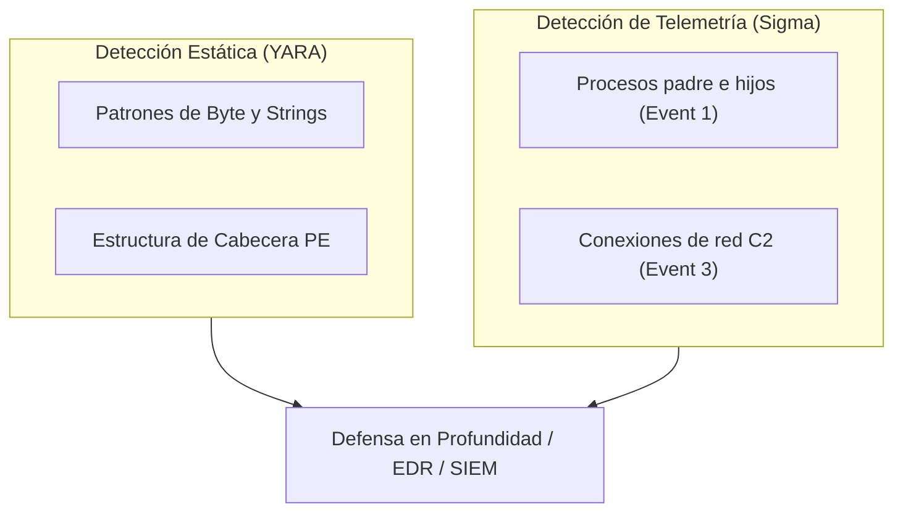
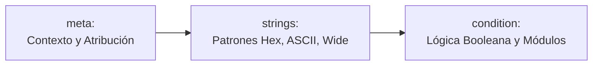
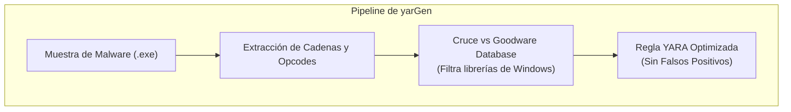
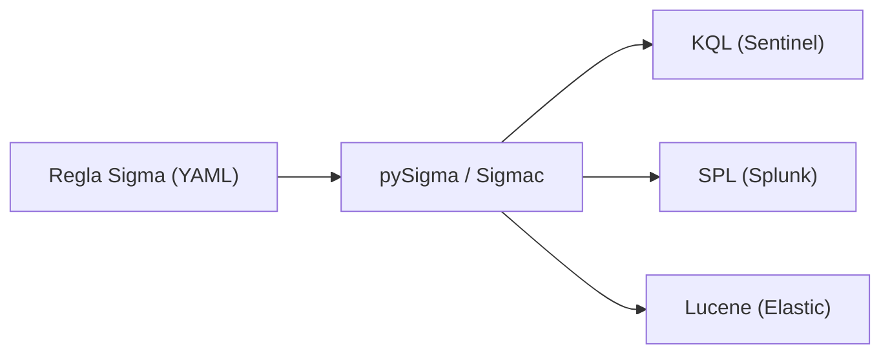

# Capítulo 13: Ingeniería de Detección: Reglas YARA (yarGen) y Reglas Sigma

## 1. La Pirámide del Dolor y la Necesidad de Firmas Robustas

En el análisis de malware y la respuesta a incidentes, los indicadores atómicos tradicionales como las direcciones IP o los hashes criptográficos (MD5, SHA-256) tienen una vida útil muy corta: los atacantes recompilan sus binarios o rotan su infraestructura en cuestión de minutos.

Para forzar al adversario a incurrir en un costo significativo de reingeniería, la **Ingeniería de Detección** se enfoca en firmar artefactos internos del código (con **YARA**) y patrones de comportamiento en el sistema operativo (con **Sigma**).



---

## 2. Anatomía Exhaustiva de una Regla YARA

Una regla YARA se compone de tres bloques obligatorios o recomendados: **meta**, **strings** y **condition**.



### Ejemplo de Regla YARA de Producción

```yara
import "pe"

rule Apt_Backdoor_MemoryInjector {
    meta:
        author = "Purpesec Academy"
        description = "Detecta inyector en memoria y beaconing de malware educativo"
        date = "2026-09-13"
        version = "1.0"
        mitre_technique = "T1055, T1071.001"
        severity = "High"

    strings:
        // Cadenas de texto plano (ASCII) y Unicode (wide)
        $s1 = "MZ_SIMULATED_PAYLOAD_C2" ascii wide
        $s2 = "C2_CONNECT_TO_MALICIOUS_IP" ascii
        $s3 = "VirtualAllocEx" ascii fullword

        // Secuencia de bytes hexadecimal con wildcards (??) y saltos
        // Representa: mov eax, 1; test eax, eax; jz <offset>
        $hex_pattern = { B8 01 00 00 00 85 C0 74 [1-4] E8 }

        // Expresión regular para localizar puertos o rutas C2
        $regex_c2 = /http:\/\/[0-9]{1,3}\.[0-9]{1,3}\.[0-9]{1,3}\.[0-9]{1,3}:[0-9]{4,5}\/gate\.php/

    condition:
        // Validación de formato Portable Executable en los primeros 2 bytes
        uint16(0) == 0x5A4D and

        // Límite de tamaño de archivo para optimizar rendimiento del escáner
        filesize < 5MB and

        // Lógica de coincidencia de cadenas
        (
            2 of ($s*) or
            $hex_pattern or
            $regex_c2
        ) and

        // Validación estructural con el módulo PE
        pe.number_of_sections >= 3
}
```

### Modificadores de Cadenas en YARA

| Modificador | Función Técnica | Ejemplo |
|---|---|---|
| `ascii` | Busca la representación de 1 byte por carácter (predeterminado). | `$"cmd.exe" ascii` |
| `wide` | Busca cadenas UTF-16LE (2 bytes por carácter, estándar en APIs de Windows). | `$"cmd.exe" wide` |
| `nocase` | Coincidencia sin distinción entre mayúsculas y minúsculas. | `$"powershell" nocase` |
| `fullword` | Coincide solo si la cadena está delimitada por caracteres no alfanuméricos. | `$"svchost" fullword` |
| `xor` | Busca automáticamente la cadena codificada con claves XOR de 1 byte (0x01 a 0xFF). | `$"http" xor(0x01-0xff)` |

---

## 3. Automatización de Reglas con yarGen

En entornos reales de laboratorio forense, escribir reglas manualmente desde cero puede ser propenso a errores o generar falsos positivos con DLLs del sistema.

**yarGen** (desarrollado por Florian Roth) automatiza este proceso comparando las cadenas extraídas de la muestra contra una base de datos de millones de cadenas benignas (*goodware*):



### Comando de Ejecución en FLARE VM

```powershell
python C:\Tools\yarGen\yarGen.py -m C:\MalwareSamples\TargetSample\ --excludegood -o C:\Rules\sample_detection.yar
```

### Parámetros Principales de yarGen

- `-m <directorio>`: Ruta hacia la muestra o conjunto de muestras maliciosas.
- `--excludegood`: Omite rigurosamente cualquier cadena presente en el repositorio de ejecutables legítimos conocidos de Microsoft.
- `-o <salida.yar>`: Archivo final que contendrá la regla generada con scores de confianza por cada string.

---

## 4. Reglas Sigma: Detección Universal de Comportamiento

Mientras que YARA analiza archivos en reposo o regiones de memoria, **Sigma** es el formato abierto y estándar de la industria (YAML) para describir eventos de telemetría en sistemas operativos.

Una regla Sigma describe una técnica maliciosa de forma independiente del motor de base de datos o SIEM utilizado.



### Ejemplo de Regla Sigma para Detección de Inyección (Sysmon Event ID 8)

```yaml
title: Inyeccion de Hilo Remoto Sospechoso en Notepad
id: 5b432a10-8f90-4c22-921a-e91823ab4912
status: experimental
description: Detecta la creacion de hilos remotos (CreateRemoteThread) dirigidos hacia procesos utilitarios legitimos desde rutas no confiables.
references:
    - https://attack.mitre.org/techniques/T1055/
author: Purpesec Academy
date: 2026-09-13
tags:
    - attack.t1055
    - attack.defense_evasion
logsource:
    category: create_remote_thread
    product: windows
detection:
    selection:
        TargetImage|endswith:
            - '\notepad.exe'
            - '\calc.exe'
        SourceImage|contains:
            - '\AppData\Local\Temp\'
            - '\Users\Public\'
            - '\Downloads\'
    condition: selection
falsepositives:
    - Herramientas de depuracion de software legitimas en entornos de desarrollo.
level: high
```

---

## 5. Resumen del Capítulo

- **YARA** proporciona detección precisa a nivel de bytes, cabeceras PE y strings en disco o memoria RAM.
- **yarGen** reduce drásticamente el tiempo de autoría de firmas eliminando el riesgo de falsos positivos contra componentes de Windows.
- **Sigma** estandariza la detección basada en comportamiento y permite exportar la misma regla hacia Splunk, Microsoft Sentinel o Elastic Security.

---

## 6. Próximos Pasos

Pasa al [**Laboratorio Práctico: Autoría y Validación de Reglas YARA y Sigma**](./lab/README.md) para escribir, verificar y compilar firmas de detección reales.
