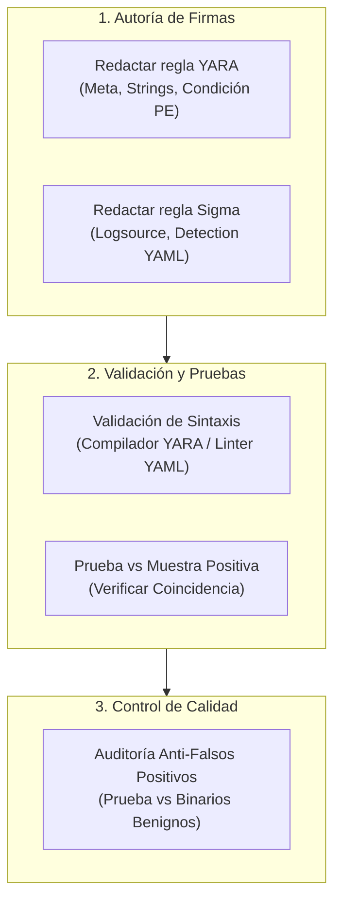

# Laboratorio 13: Creación y Validación de Reglas YARA y Reglas Sigma

## Objetivo del Laboratorio

Aprender el ciclo completo de ingeniería de detección: redactar una regla YARA estricta para identificar artefactos de inyección y balizamiento C2, crear una regla Sigma para detectar la ejecución anómala en eventos de Sysmon, verificar la sintaxis de las reglas y asegurar la ausencia de falsos positivos en binarios del sistema.



---

## Estructura del Laboratorio

```plaintext
13-deteccion-yara-yargen-y-sigma/
├── README.md
└── lab/
    ├── README.md
    └── verificar_yara_sigma.ps1
```

---

## Procedimiento Paso a Paso

### Paso 1: Preparar el Espacio de Trabajo

Crea el directorio de reglas y muestras de detección:

```powershell
$rulesDir = "C:\Users\Public\Detection_Lab13"
if (!(Test-Path $rulesDir)) { New-Item -ItemType Directory -Path $rulesDir -Force | Out-Null }
```

---

### Paso 2: Crear la Regla YARA (`detect_threat.yar`)

Escribe una regla YARA que busque la combinación de cabecera PE (`0x5A4D`) y cadenas características de inyección y comunicación C2:

```yara
rule Purpesec_Injected_Beacon_Detector {
    meta:
        description = "Detecta artefactos inyectados en memoria con IPs de comando y control"
        author = "Purpesec Academy Student"
        date = "2026-09-13"
        severity = "High"

    strings:
        $s1 = "MZ_SIMULATED_PAYLOAD_C2" ascii
        $s2 = "192.168.100.55" ascii
        $api1 = "VirtualAllocEx" ascii
        $api2 = "CreateRemoteThread" ascii

    condition:
        (uint16(0) == 0x5A4D or uint16(0) == 0x5A4D) and
        (any of ($s*) or all of ($api*))
}
```

Guarda esta regla en `$rulesDir\detect_threat.yar`.

---

### Paso 3: Crear la Regla Sigma (`detect_remote_thread.yml`)

Escribe la regla Sigma equivalente para correlación en el SIEM ante eventos de creación de hilos remotos (Sysmon Event ID 8):

```yaml
title: Inyeccion Sospechosa de Hilo Remoto
id: a1b2c3d4-e5f6-7890-abcd-ef1234567890
status: test
description: Detecta procesos que generan hilos remotos hacia utilitarios del sistema desde directorios temporales
references:
    - https://attack.mitre.org/techniques/T1055/
author: Purpesec Student
date: 2026-09-13
tags:
    - attack.t1055
    - attack.privilege_escalation
logsource:
    category: create_remote_thread
    product: windows
detection:
    selection:
        TargetImage|endswith:
            - '\notepad.exe'
            - '\explorer.exe'
        SourceImage|contains:
            - '\Temp\'
            - '\Users\Public\'
    condition: selection
falsepositives:
    - Depuradores locales ejecutados por administradores.
level: high
```

Guarda esta regla en `$rulesDir\detect_remote_thread.yml`.

---

### Paso 4: Validar Coincidencias y Probar Ausencia de Falsos Positivos

Una regla de detección de calidad profesional debe cumplir dos requisitos:
1. **Verdadero Positivo**: Detectar el artefacto malicioso creado en los laboratorios anteriores.
2. **Verdadero Negativo**: No generar ninguna alerta al escanear binarios legítimos de Windows (por ejemplo, `C:\Windows\System32\calc.exe` o `notepad.exe`).

---

## Validación Automatizada

Ejecuta el script de auditoría y validación de reglas de detección:

```powershell
powershell -ExecutionPolicy Bypass -File .\verificar_yara_sigma.ps1
```

Criterio de éxito: Obtener **100% de cumplimiento** en las 5 pruebas de sintaxis, coincidencia y validación de falsos positivos.
