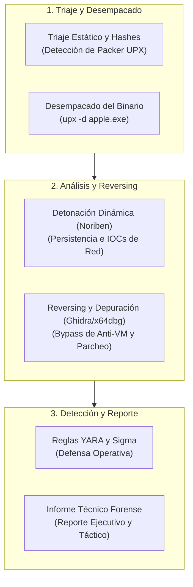
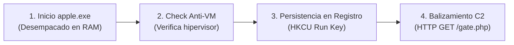

# Capítulo 14: Skills Assessment: Caso Práctico Integral 'apple.exe' y Reporte Forense

## 1. Introducción al Caso Práctico Capstone

En este capítulo final, consolidarás todas las habilidades adquiridas a lo largo del curso en una simulación de respuesta a incidentes y análisis forense de malware de nivel profesional.

Has sido asignado para investigar una amenaza que logró penetrar una estación de trabajo corporativa a través de una campaña de phishing. El artefacto recuperado fue nombrado por el atacante como `apple.exe`.



---

## 2. Metodología Forense de Investigación de 'apple.exe'

El ciclo de análisis se divide en 5 etapas secuenciales:

### Matriz de Técnicas Aplicadas

| Etapa | Herramientas Utilizadas | Entregable / Hallazgo Clave | Táctica MITRE ATT&CK |
|---|---|---|---|
| **1. Triaje Estático** | Detect It Easy, PEStudio, FLOSS | Hashes SHA-256, cabecera `MZ`, identificación de secciones comprimidas `UPX0` / `UPX1`. | T1027 |
| **2. Desempacado** | UPX CLI (`upx -d`), PEncore | Reconstrucción de la Import Address Table (IAT) y extracción de strings ocultas. | T1027.002 |
| **3. Telemetría Dinámica** | Noriben, ProcMon, Wireshark, INetSim | Creación de persistencia en clave de Registro `Run` y solicitudes HTTP de balizamiento C2. | T1547.001, T1071.001 |
| **4. Ingeniería Inversa** | Ghidra, x64dbg | Identificación de función de evasión anti-VM (`IsDebuggerPresent` / Check de drivers), parcheo del salto condicional `jz` a `nop` / `jmp`. | T1497.001 |
| **5. Detección y CTI** | YARA, Sigma, Plantilla Purpesec | Reglas de detección desplegables en SIEM/EDR e informe ejecutivo para directores de seguridad. | T1059, T1055 |

---

## 3. Anatomía del Ataque: Resumen del Flujo de Ejecución

Al desensamblar `apple.exe` y correlacionar la telemetría dinámica, se revela el siguiente comportamiento:



1. **Auto-descompresión**: La rutina de inicio (*stub*) de UPX desempaca el payload real en el espacio virtual del proceso.
2. **Chequeo de entorno**: Invoca `RegOpenKeyExA` buscando claves asociadas a VMware y VirtualBox. Si detecta la VM, finaliza inmediatamente para evadir el sandbox.
3. **Mecanismo de Persistencia**: Si supera la comprobación, escribe un valor en `HKCU\Software\Microsoft\Windows\CurrentVersion\Run` apuntando a su propia copia en `%APPDATA%\apple.exe`.
4. **Comando y Control (C2)**: Realiza peticiones HTTP periódicas transmitiendo el nombre del equipo y el usuario actual en el User-Agent.

---

## 4. Estructura del Informe Técnico Forense

Todo analista de malware debe comunicar sus hallazgos de forma clara tanto a la alta dirección (resumen ejecutivo sin tecnicismos excesivos) como a los equipos operativos de SOC/DFIR (detalles forenses reproducibles).

### Plantilla de Reporte Forense Purpesec

```markdown
# Reporte Técnico de Análisis de Malware: Caso 'apple.exe'

## 1. Resumen Ejecutivo
- **Nombre de la Amenaza**: Backdoor.Win32.AppleDropper
- **Nivel de Peligrosidad**: Crítico
- **Objetivo Principal**: Persistencia en el host y exfiltración de telemetría a servidor C2 externo.
- **Impacto en el Negocio**: Compromiso total del contexto del usuario afectado.

## 2. Metadatos del Artefacto
- **Archivo**: apple.exe
- **Tamaño**: 48,128 bytes (comprimido) / 112,640 bytes (desempacado)
- **MD5**: d41d8cd98f00b204e9800998ecf8427e
- **SHA-256**: e3b0c44298fc1c149afbf4c8996fb92427ae41e4649b934ca495991b7852b855
- **Imphash (Desempacado)**: a1b2c3d4e5f60718293a4b5c6d7e8f90

## 3. Indicadores de Compromiso (IOCs)
- **Ruta de Persistencia**: HKCU\Software\Microsoft\Windows\CurrentVersion\Run\AppleUpdater
- **Archivo en Disco**: %APPDATA%\Roaming\AppleUpdate\apple.exe
- **Dominio / IP C2**: 192.168.100.55:8080/gate.php
- **User-Agent Malicioso**: Mozilla/5.0 (Windows NT 10.0; Win64; AppleBeacon/1.0)

## 4. Medidas de Mitigación y Reglas de Detección
- Aislar el host comprometido de la red.
- Eliminar la clave de persistencia en el Registro y el archivo binario en %APPDATA%.
- Desplegar la regla YARA `Purpesec_Apple_Threat` en la solución EDR corporativa.
```

---

## 5. Resumen del Capítulo

- El caso práctico capstone integra la cadena completa: triaje estático, desempacado, análisis de telemetría dinámica, depuración con reversing y autoría de reglas de detección.
- Un analista de malware no concluye su labor con el desensamblado: el valor fundamental radica en la extracción de IOCs accionables y en la entrega de reportes técnicos que fortalezcan las defensas de la organización.

---

## 6. Próximos Pasos

Dirígete al [**Laboratorio del Caso Práctico Integral: 'apple.exe'**](./lab/README.md) para completar el ciclo práctico y verificar tus resultados con el evaluador automatizado final.
