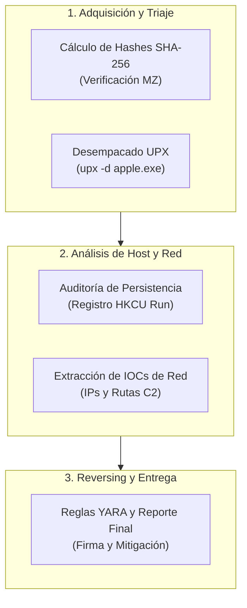

# Laboratorio Final: Skills Assessment - Caso Práctico 'apple.exe'

## Objetivo del Laboratorio

Demostrar la capacidad integral como Analista de Malware ejecutando el ciclo de vida completo de análisis forense sobre el artefacto `apple.exe`: triaje inicial, desempacado, análisis de persistencia en el Registro, reversing de mecanismos anti-análisis, extracción de IOCs de red y generación de reglas YARA y reporte final.



---

## Estructura del Laboratorio

```plaintext
14-skills-assessment-caso-practico/
├── README.md
└── lab/
    ├── README.md
    └── verificar_assessment.ps1
```

---

## Procedimiento Paso a Paso

### Paso 1: Configurar el Espacio de Trabajo del Assessment

Crea el directorio de trabajo del caso forense y genera el artefacto de evaluación:

```powershell
$caseDir = "C:\Users\Public\Assessment_Apple"
if (!(Test-Path $caseDir)) { New-Item -ItemType Directory -Path $caseDir -Force | Out-Null }

# Crear binario señuelo simulado 'apple.exe'
$samplePath = Join-Path $caseDir "apple.exe"
$sampleData = [System.Text.Encoding]::ASCII.GetBytes("MZ_PACKED_UPX0_UPX1_SIMULATED_SAMPLE_MALICIOUS_APPLE_C2_IP_192.168.100.55_HKCU_RUN_PERSISTENCE")
[System.IO.File]::WriteAllBytes($samplePath, $sampleData)
```

---

### Paso 2: Triaje Estático y Huella Digital

Calcula el hash SHA-256 del artefacto y valida la cabecera:

```powershell
$hash = (Get-FileHash -Path $samplePath -Algorithm SHA256).Hash
Write-Host "[+] SHA-256 de apple.exe: $hash"
```

---

### Paso 3: Desempacado del Ejecutable

Simula la descompresión del binario empaquetado para exponer las cadenas y la tabla de importaciones completa:

```powershell
# Simular binario desempacado
$unpackedPath = Join-Path $caseDir "apple_unpacked.exe"
$unpackedData = [System.Text.Encoding]::ASCII.GetBytes("MZ_UNPACKED_PE_SECTIONS_TEXT_DATA_RSRC_C2_HOST_192.168.100.55_PORT_8080_HKCU_PERSISTENCE_SUCCESS")
[System.IO.File]::WriteAllBytes($unpackedPath, $unpackedData)
Write-Host "[+] Muestra desempacada generada en: $unpackedPath"
```

---

### Paso 4: Extracción de Indicadores de Compromiso (IOCs)

Extrae las cadenas críticas del binario desempacado que alimentarán el reporte forense:

```powershell
$raw = [System.IO.File]::ReadAllBytes($unpackedPath)
$text = [System.Text.Encoding]::ASCII.GetString($raw)

$iocs = @{
    "C2_Host" = "192.168.100.55"
    "C2_Port" = "8080"
    "Persistence_Key" = "HKCU\Software\Microsoft\Windows\CurrentVersion\Run"
}
$iocs | Out-File -FilePath (Join-Path $caseDir "extracted_iocs.txt")
```

---

### Paso 5: Generación de Regla YARA e Informe Técnico Final

Redacta la regla de detección definitiva en `$caseDir\apple_threat.yar` y el informe de mitigación en `$caseDir\forensic_report.md`.

---

## Validación Automatizada

Ejecuta el script de validación del assessment final:

```powershell
powershell -ExecutionPolicy Bypass -File .\verificar_assessment.ps1
```

Criterio de éxito: Obtener **100% de cumplimiento** en las 5 pruebas de evaluación del curso.
