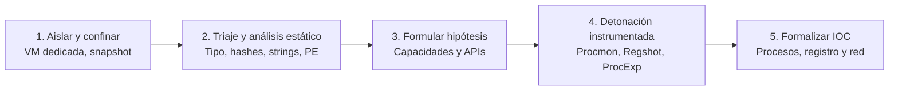

# Análisis de malware: guía práctica de ingeniería inversa y telemetría forense

[Inicio](../README.md) | [Configurar laboratorio](../setup/README.md)

Un recurso técnico abierto y estructurado como libro de aprendizaje para comprender la anatomía del software malicioso, dominar el análisis estático y dinámico en entornos confinados, diseccionar ejecutables PE y extraer indicadores de compromiso (IOC) verificados sin poner en riesgo la infraestructura anfitriona.

> [!CAUTION]
> **Alcance y seguridad operativa**: El material, código y laboratorios de este recurso tienen fines pedagógicos, defensivos y de investigación. Las técnicas deben ejecutarse exclusivamente en máquinas virtuales aisladas (red Host-Only o red interna), sin salida a redes reales y siguiendo el ciclo disciplinado de restauración de snapshots. El autor no se responsabiliza del uso indebido de los conceptos expuestos.

---

## Prólogo: observar, aislar y explicar

El análisis de malware no se basa en conjeturas ni en la ejecución desordenada de herramientas automáticas. Es una disciplina forense y científica que transforma un binario desconocido en **inteligencia técnica procesable, reproducible y fundamentada**.



---

## Roadmap de estudio

```mermaid
flowchart LR
    subgraph BASES["Bases (disponible)"]
        C1[01. Fundamentos y taxonomía]
        C2[02. Entornos seguros]
        C3[03. Análisis estático]
        C4[04. Formato PE]
        C5[05. Análisis dinámico]
    end
    subgraph AVANZADO["Avanzado (planificado)"]
        C6[06. Ensamblador e ingeniería inversa]
        C7[07. Depuración de bajo nivel]
        C8[08. Packers y desempaquetado]
        C9[09. Antianálisis y sandbox]
        C10[10. Memoria e inyección]
        C11[11. Red y C2]
        C12[12. Detección YARA y Sigma]
        C13[13. Scripts y documentos]
        C14[14. Reporting y CTI]
    end
    C1 --> C2 --> C3 --> C4 --> C5
    C5 --> C6 --> C7 --> C8 --> C9
    C9 --> C10 --> C11 --> C12 --> C13 --> C14
```



---

## Tabla de contenidos

| # | Capítulo | Descripción técnica | Duración | Nivel | Práctica / Lab | Estado |
|---|---|---|---|---|---|---|
| **01** | [**Fundamentos del malware, taxonomía y rol del analista**](./01-fundamentos-y-taxonomia/README.md) | Tríada vulnerabilidad, exploit y malware, etapas de infección, modelo multidimensional, casos históricos y método científico. | 3 - 4 h | Inicial | [Clasificación de incidentes](./01-fundamentos-y-taxonomia/lab/) | **Disponible** |
| **02** | [**Entornos de análisis seguros y manejo de muestras**](./02-entornos-seguros-y-laboratorio/README.md) | Protocolo de confinamiento, topologías de red virtual, snapshots, contenedores ZIP cifrados y OPSEC en servicios cloud. | 3 - 4 h | Inicial | [Verificación de aislamiento](./02-entornos-seguros-y-laboratorio/lab/) | **Disponible** |
| **03** | [**Análisis estático inicial y extracción de artefactos**](./03-analisis-estatico-inicial/README.md) | Magic bytes, hashes SHA-256, cadenas ASCII y UTF-16LE, FLOSS y ficha de triaje. | 3 - 4 h | Inicial - Intermedio | [Muestra ELF y PE](./03-analisis-estatico-inicial/lab/) | **Disponible** |
| **04** | [**Anatomía del formato PE e inferencia de capacidades**](./04-formato-pe-y-capacidades/README.md) | Cabeceras DOS, PE y COFF, secciones y permisos RWX, IAT, packers, entropía de Shannon y `capa`. | 4 - 5 h | Intermedio | [Inspección PE y entropía](./04-formato-pe-y-capacidades/lab/) | **Disponible** |
| **05** | [**Análisis dinámico, telemetría y extracción de IOC**](./05-analisis-dinamico-y-telemetria/README.md) | Cuatro pilares de telemetría, metodología de detonación, Procmon, ProcExp, Regshot, FakeNet-NG y ficha de IOC. | 4 - 5 h | Intermedio | [Detonación e IOC](./05-analisis-dinamico-y-telemetria/lab/) | **Disponible** |
| 06 | **Fundamentos de ensamblador x86 y x64** | Registros, pila, convenciones de llamada, flujo de control, desensamblado y decompilación. | 4 - 5 h | Intermedio | Reversing en Ghidra | *Planificado* |
| 07 | **Depuración y análisis dinámico de bajo nivel** | Puntos de ruptura, step into/over, memoria y módulos en runtime con x64dbg. | 4 - 5 h | Intermedio - Avanzado | Depuración guiada | *Planificado* |
| 08 | **Packers, desempaquetado y reconstrucción de imports** | Stub, OEP, dump de memoria, reconstrucción de IAT y comparación antes/después. | 4 - 5 h | Avanzado | Desempaquetado controlado | *Planificado* |
| 09 | **Antianálisis y detección de sandbox** | Antidebug, antivirtualización, retrasos, API hashing y control-flow flattening. | 3 - 4 h | Avanzado | Evasión en laboratorio | *Planificado* |
| 10 | **Análisis de memoria e inyección de procesos** | Volcados de proceso, DLL injection, process hollowing y regiones ejecutables anómalas. | 4 - 5 h | Avanzado | Memoria con Volatility | *Planificado* |
| 11 | **Tráfico de red y protocolos de C2** | Análisis de PCAP, DNS, HTTP y TLS, beaconing y extracción de IOC de red. | 3 - 4 h | Intermedio - Avanzado | Análisis de PCAP | *Planificado* |
| 12 | **Ingeniería de detección con YARA y Sigma** | Reglas YARA, reglas Sigma, validación, falsos positivos y mantenimiento. | 4 - 5 h | Intermedio | Detección de muestras | *Planificado* |
| 13 | **Scripts y documentos maliciosos** | PowerShell, macros de Office, OLE/OOXML y PDF malicioso sin ejecución. | 4 - 5 h | Intermedio | Análisis de documentos | *Planificado* |
| 14 | **Reporting, CTI y respuesta** | Informe técnico y ejecutivo, trazabilidad de evidencias, IOC con contexto y STIX/TAXII. | 3 - 4 h | Intermedio | Informe final | *Planificado* |

`Disponible` indica que la sesión cuenta con teoría y laboratorio reproducibles. `Planificado` indica que el tema está definido y pendiente de desarrollo. La secuencia `06` a `14` continúa la progresión `01` a `05`.

---

## Matriz de cobertura MITRE ATT&CK

| Táctica | Identificador | Técnica | Capítulos |
|---|---|---|---|
| Execution | T1059 | Command and Scripting Interpreter | 03, 05 |
| Persistence | T1547.001 | Registry Run Keys | 04, 05 |
| Defense Evasion | T1027 | Obfuscated Files or Information | 03, 04 |
| Defense Evasion | T1036 | Masquerading | 03 |
| Discovery | T1082 | System Information Discovery | 04 |
| Credential Access | T1555 | Credentials from Password Stores | 01, 03 |
| Command and Control | T1071 | Application Layer Protocol | 05, 11 |
| Impact | T1486 | Data Encrypted for Impact | 01 |

---

## Preparación del entorno de prácticas

Para seguir los laboratorios de esta ruta:

1. Consulta los requisitos de hardware y virtualización en la [guía de configuración](../setup/README.md).
2. Para el **análisis estático (capítulos 01 a 04)**: usa una VM Linux (REMnux, Kali o Ubuntu) con compilador GCC, MinGW-w64 y binutils:

   ```bash
   sudo apt update && sudo apt install -y build-essential binutils file xxd mingw-w64
   ```

3. Para el **análisis dinámico (capítulo 05)**: configura una VM Windows 10/11 en modo Host-Only con Sysinternals (Procmon y Process Explorer), Regshot y, opcionalmente, FakeNet-NG.

---

## Cómo progresar

1. Estudia los capítulos en orden secuencial comenzando por el [capítulo 01](./01-fundamentos-y-taxonomia/README.md).
2. Completa el laboratorio de cada sesión antes de avanzar a la siguiente.
3. Configura tu máquina virtual aislada con el laboratorio del [capítulo 02](./02-entornos-seguros-y-laboratorio/README.md).
4. Ejecuta el [laboratorio de análisis estático](./03-analisis-estatico-inicial/lab/) y continúa con el de [formato PE](./04-formato-pe-y-capacidades/lab/).
5. Cierra la fase inicial con el [laboratorio de análisis dinámico](./05-analisis-dinamico-y-telemetria/lab/).

[Volver al catálogo principal del repositorio](../README.md)
