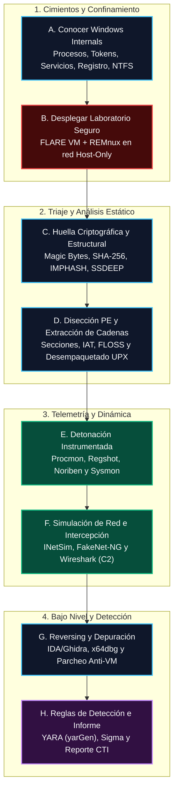

# Análisis de Malware e Ingeniería Inversa: De Cero a Especialista

[Inicio](../README.md) | [Configurar laboratorio](../setup/README.md)

Un recurso técnico abierto, riguroso y estructurado como una obra de aprendizaje integral para dominar la anatomía interna del sistema operativo Windows, el confinamiento forense en **FLARE VM**, el triaje estático, la telemetría dinámica instrumentada, la ingeniería inversa con **Ghidra/IDA**, la depuración y parcheo en tiempo real con **x64dbg**, y la ingeniería de detección con reglas **YARA** y **Sigma**.

> [!CAUTION]
> **Alcance y seguridad operativa (OPSEC)**: Todo el material, código de prueba y laboratorios de este curso tienen fines exclusivamente pedagógicos, defensivos y de investigación forense. La detonación y análisis deben realizarse estrictamente en máquinas virtuales aisladas (red *Host-Only* o red interna), sin salida a Internet, sin carpetas compartidas y siguiendo la disciplina de restauración de instantáneas (*snapshots*).

---

## Filosofía del Analista: Observar, Aislar y Explicar

El análisis de malware no se basa en conjeturas ni en la ejecución desordenada de herramientas automáticas. Es una disciplina científica que transforma un binario desconocido en **inteligencia técnica procesable, reproducible y fundamentada**. Para un analista principiante, el camino comienza entendiendo los cimientos del sistema operativo Windows antes de manipular cualquier muestra hostil.

---

## Roadmap de Estudio: 14 Sesiones Integrales

```mermaid
flowchart LR
    classDef win fill:#1e293b,stroke:#38bdf8,stroke-width:2px,color:#f8fafc;
    classDef lab fill:#1e1b4b,stroke:#818cf8,stroke-width:2px,color:#f8fafc;
    classDef static fill:#064e3b,stroke:#34d399,stroke-width:2px,color:#f8fafc;
    classDef dyn fill:#701a75,stroke:#f472b6,stroke-width:2px,color:#f8fafc;
    classDef rev fill:#7c2d12,stroke:#fb923c,stroke-width:2px,color:#f8fafc;
    classDef det fill:#831843,stroke:#f43f5e,stroke-width:2px,color:#f8fafc;

    subgraph B1["Bloque 1: Windows Fundamentals"]
        C1["01. Arquitectura y NTFS"]:::win
        C2["02. Procesos y Servicios"]:::win
        C3["03. Registro, UAC y PowerShell"]:::win
    end

    subgraph B2["Bloque 2: Entorno Seguro"]
        C4["04. FLARE VM e INetSim"]:::lab
    end

    subgraph B3["Bloque 3: Análisis Estático"]
        C5["05. Taxonomía y Hashes"]:::static
        C6["06. Formato PE e IMPHASH"]:::static
        C7["07. FLOSS y Packers (UPX)"]:::static
    end

    subgraph B4["Bloque 4: Análisis Dinámico"]
        C8["08. Procmon y Noriben"]:::dyn
        C9["09. Red, C2 y Sysmon"]:::dyn
    end

    subgraph B5["Bloque 5: Reversing y Debugging"]
        C10["10. Ensamblador e IDA/Ghidra"]:::rev
        C11["11. Depuración con x64dbg"]:::rev
        C12["12. Inyección en Memoria"]:::rev
    end

    subgraph B6["Bloque 6: Detección y Capstone"]
        C13["13. Reglas YARA y Sigma"]:::det
        C14["14. Skills Assessment"]:::det
    end

    C1 --> C2 --> C3 --> C4 --> C5 --> C6 --> C7 --> C8 --> C9 --> C10 --> C11 --> C12 --> C13 --> C14
```

---

## Tabla de Contenidos

| # | Capítulo | Descripción técnica y objetivos | Duración | Nivel | Práctica / Laboratorio | Estado |
|---|---|---|---|---|---|---|
| **01** | [**Arquitectura de Windows, Directorios y Permisos NTFS**](./01-arquitectura-windows-directorios-y-permisos/README.md) | Modos de CPU (Ring 3 vs Ring 0), estructura del sistema de arranque `C:\`, `AppData`, `System32` vs `SysWOW64`, permisos NTFS y herencia con `icacls`, acceso RDP. | 3 - 4 h | Inicial (Cero) | [Auditoría de rutas y permisos NTFS](./01-arquitectura-windows-directorios-y-permisos/lab/) | **En desarrollo** |
| **02** | [**Procesos, Servicios del Sistema y Cuentas de Acceso**](./02-procesos-servicios-y-cuentas/README.md) | Anatomía de un proceso (PID, VAS, Tokens, Handles), procesos críticos (`smss`, `csrss`, `lsass`, `services`, `svchost`), Service Control Manager, `sc.exe`, cuentas `SYSTEM` y Process Explorer. | 3 - 4 h | Inicial | [Inspección de procesos y servicios](./02-procesos-servicios-y-cuentas/lab/) | *Planificado* |
| **03** | [**El Registro de Windows, UAC, Seguridad del Host y PowerShell**](./03-registro-uac-seguridad-y-powershell/README.md) | Colmenas HKLM/HKCU, archivos físicos en `System32\Config`, tipos de valores, claves `Run`/`RunOnce`, SIDs, tokens, UAC, compartición SMB, cmdlets de PowerShell, WMI y Execution Policies. | 4 - 5 h | Inicial | [Persistencia en Registro y WMI](./03-registro-uac-seguridad-y-powershell/lab/) | *Planificado* |
| **04** | [**Despliegue del Laboratorio Confinado: FLARE VM, REMnux e INetSim**](./04-laboratorio-flarevm-remnux-inetsim/README.md) | Arquitectura de red Host-Only, mitigación de escape de VM, instalación desatendida de FLARE VM en Windows 10/11, configuración de REMnux e INetSim (DNS/HTTP) y ciclo de snapshots. | 4 - 5 h | Inicial - Intermedio | [Despliegue y validación de red aislada](./04-laboratorio-flarevm-remnux-inetsim/lab/) | *Planificado* |
| **05** | [**Fundamentos del Malware, Adquisición Forense y Hashes Criptográficos**](./05-fundamentos-malware-adquisicion-y-hashes/README.md) | Tríada vulnerabilidad-exploit-malware, taxonomía (Ransomware, Troyanos, Info-stealers), adquisición (FTK Imager, DumpIt, KAPE), Magic Bytes `MZ`, hashes SHA-256 y búsqueda CTI. | 3 - 4 h | Intermedio | [Triaje estático y adquisición forense](./05-fundamentos-malware-adquisicion-y-hashes/lab/) | *Planificado* |
| **06** | [**Formato Portable Executable (PE) y Hashing Estructural Avanzado**](./06-formato-pe-e-imphash/README.md) | Cabeceras DOS, PE y Secciones (`.text`, `.data`, `.rdata`, `.rsrc`), IAT, cálculo automatizado de IMPHASH en Python con `pefile`, SSDEEP fuzzy hashing (`ssdeep -pb *`) y Section Hashing. | 4 - 5 h | Intermedio | [Cálculo de IMPHASH y Section Hashes](./06-formato-pe-e-imphash/lab/) | *Planificado* |
| **07** | [**Análisis de Cadenas, Desofuscación con FLOSS y Packers (UPX)**](./07-strings-floss-y-packers-upx/README.md) | Cadenas ASCII vs UTF-16LE (`strings -n 15`), rutas PDB y atribución, desofuscación profunda con FLOSS (stackstrings, decoded strings), anomalías de empaquetado y desempaquetado con `upx -d`. | 4 - 5 h | Intermedio | [Extracción FLOSS y desempacado UPX](./07-strings-floss-y-packers-upx/lab/) | *Planificado* |
| **08** | [**Análisis Dinámico, Telemetría de Host y Automatización con Noriben**](./08-analisis-dinamico-procmon-noriben/README.md) | Metodología de detonación, línea base, Process Monitor (filtros PMC), Regshot (diferencial de registro) y automatización con Noriben (reportes TXT/HTML, timeline CSV). | 4 - 5 h | Intermedio | [Detonación instrumentada con Noriben](./08-analisis-dinamico-procmon-noriben/lab/) | *Planificado* |
| **09** | [**Simulación de Red, Wireshark, Protocolos C2 y Auditoría con Sysmon**](./09-red-c2-wireshark-y-sysmon/README.md) | Tráfico de balizamiento (*beaconing*), FakeNet-NG, INetSim, análisis de PCAP con Wireshark (User-Agents con hostname, descarga de payloads secundarios) y telemetría de Sysmon (Eventos 1, 3, 11, 13). | 4 - 5 h | Intermedio - Avanzado | [Análisis de tráfico C2 en Wireshark](./09-red-c2-wireshark-y-sysmon/lab/) | *Planificado* |
| **10** | [**Ensamblador x86/x64 e Ingeniería Inversa con IDA Free y Ghidra**](./10-ensamblador-reversing-ida-ghidra/README.md) | Registros CPU, stack frame, convenciones de llamada x64, instrucciones (`mov`, `lea`, `cmp`, `test`, `je`, `jnz`), Graph View vs Text View, del CRT `start` al `main`, y patrones de evasión anti-VM. | 5 - 6 h | Avanzado | [Reversing de binario con chequeos anti-VM](./10-ensamblador-reversing-ida-ghidra/lab/) | *Planificado* |
| **11** | [**Depuración Dinámica con x64dbg y Parcheo de Evasiones Anti-Análisis**](./11-depuracion-x64dbg-y-parcheo-antivm/README.md) | Interfaz de x64dbg, breakpoints (`INT 3`, hardware, memoria), single-stepping (`F7`/`F8`), inspección de memoria en runtime, inversión de saltos condicionales y guardado del ejecutable parcheado. | 5 - 6 h | Avanzado | [Parcheo en caliente de binario evasivo](./11-depuracion-x64dbg-y-parcheo-antivm/lab/) | *Planificado* |
| **12** | [**Inyección de Procesos y Análisis Forense de Memoria en Caliente**](./12-inyeccion-procesos-y-memoria/README.md) | Llamadas al sistema (Syscalls y SSDT), API pattern: `OpenProcess` -> `VirtualAllocEx` -> `WriteProcessMemory` -> `CreateRemoteThread`, depuración concurrente en `notepad.exe` y volcado de shellcode. | 5 - 6 h | Avanzado | [Intercepción y volcado de shellcode](./12-inyeccion-procesos-y-memoria/lab/) | *Planificado* |
| **13** | [**Ingeniería de Detección: Reglas YARA (yarGen) y Reglas Sigma**](./13-deteccion-yara-yargen-y-sigma/README.md) | Estructura de reglas YARA (strings, condition, cabeceras PE), automatización con `yarGen` contra bases de datos de goodware, escaneo con `yara`, y reglas Sigma basadas en eventos de Sysmon. | 4 - 5 h | Intermedio - Avanzado | [Creación de reglas YARA y Sigma](./13-deteccion-yara-yargen-y-sigma/lab/) | *Planificado* |
| **14** | [**Skills Assessment: Caso Práctico Integral 'apple.exe' y Reporte Forense**](./14-skills-assessment-caso-practico/README.md) | Simulación de incidente real: triaje, estático, desempacado, detonación en FLARE VM, reversing en Ghidra, depuración en x64dbg, extracción de IOCs, reglas YARA/Sigma e informe técnico profesional. | 6 - 8 h | Capstone | [Investigación integral de 'apple.exe'](./14-skills-assessment-caso-practico/lab/) | *Planificado* |

---

## Matriz de Cobertura MITRE ATT&CK

| Táctica | ID | Técnica / Subtécnica | Sesiones asociadas |
|---|---|---|---|
| **Initial Access** | T1566 | Phishing (Archivos adjuntos y enlaces) | 05, 14 |
| **Execution** | T1059.001 | Command and Scripting Interpreter: PowerShell | 03, 08 |
| **Execution** | T1059.003 | Command and Scripting Interpreter: Windows Command Shell | 01, 08 |
| **Persistence** | T1547.001 | Boot or Logon Autostart Execution: Registry Run Keys / Startup Folder | 03, 08, 13 |
| **Persistence** | T1543.003 | Create or Modify System Process: Windows Service | 02, 08 |
| **Privilege Escalation** | T1055.002 | Process Injection: Portable Executable Injection / Process Hollowing | 10, 11, 12 |
| **Privilege Escalation** | T1548.002 | Bypass User Account Control | 03, 14 |
| **Defense Evasion** | T1027 | Obfuscated Files or Information (Strings, Packers UPX) | 06, 07 |
| **Defense Evasion** | T1497.001 | Virtualization/Sandbox Evasion: System Checks (VMware Tools, Sockets) | 08, 10, 11 |
| **Defense Evasion** | T1036 | Masquerading (Extensiones dobles, nombres del sistema: `svchost.exe`) | 05, 08 |
| **Discovery** | T1082 | System Information Discovery (`GetComputerNameA`, WMI) | 03, 08, 10 |
| **Discovery** | T1012 | Query Registry | 03, 08, 10 |
| **Credential Access** | T1003.001 | OS Credential Dumping: LSASS Memory | 02, 07, 14 |
| **Command and Control** | T1071.001 | Application Layer Protocol: Web Protocols (HTTP GET/POST Beaconing) | 08, 09, 14 |
| **Command and Control** | T1105 | Ingress Tool Transfer (Descarga de ejecutables secundarios en `%TEMP%`) | 08, 09 |

---

## Preparación del Entorno de Laboratorio

Para completar los laboratorios de esta ruta con seguridad:

1. **Hardware recomendado**: Equipo anfitrión con al menos 16 GB de RAM y virtualización activada (VT-x / AMD-V) en BIOS/UEFI.
2. **Máquina Virtual 1 (Windows - FLARE VM)**:
   * Windows 10/11 x64 en red **Host-Only**.
   * Windows Defender, Protección en Tiempo Real y Protección contra Alteraciones (*Tamper Protection*) deshabilitados.
   * Herramientas preinstaladas: Sysinternals (Procmon, Process Explorer), Regshot, Noriben, CFF Explorer, PeStudio, UPX, FLOSS, Ghidra, IDA Free, x64dbg.
3. **Máquina Virtual 2 (Linux - REMnux / Ubuntu)**:
   * REMnux o Ubuntu Server en la misma red **Host-Only**.
   * Servicios configurados: **INetSim** (con resolución DNS ficticia y servidor HTTP) y **Wireshark** / `tcpdump`.
   * Herramientas de triaje: `file`, `hexdump`, `strings`, `pefile` en Python, `ssdeep`, `yara`, `yarGen`.

---

## Estándar Pedagógico del Curso

Cada sesión de este programa se desarrolla bajo los siguientes compromisos:
* **Explicación desde cero**: Desglose línea por línea de comandos, flags, parámetros de APIs de Windows y estructuras internas.
* **Diagramas Mermaid enriquecidos**: Modelado interactivo de flujos de control, transiciones de Ring 3 a Ring 0, estados de memoria y secuencias de red.
* **Práctica verificable**: Laboratorios seguros, reproducibles y aislados en cada capítulo, sin depender de malware real incontrolable.

[Volver al catálogo principal del repositorio](../README.md)
