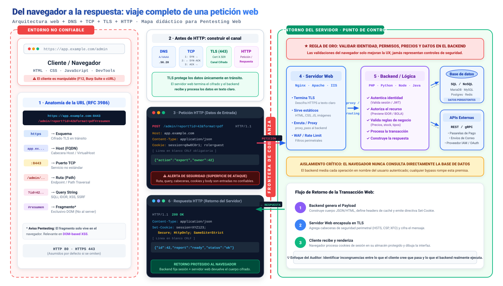
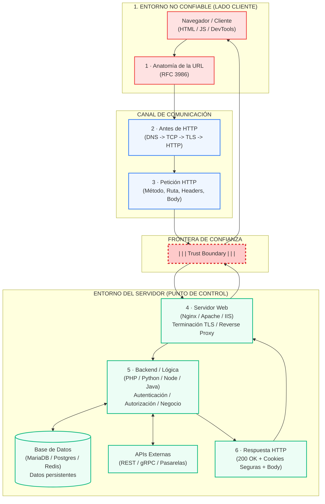
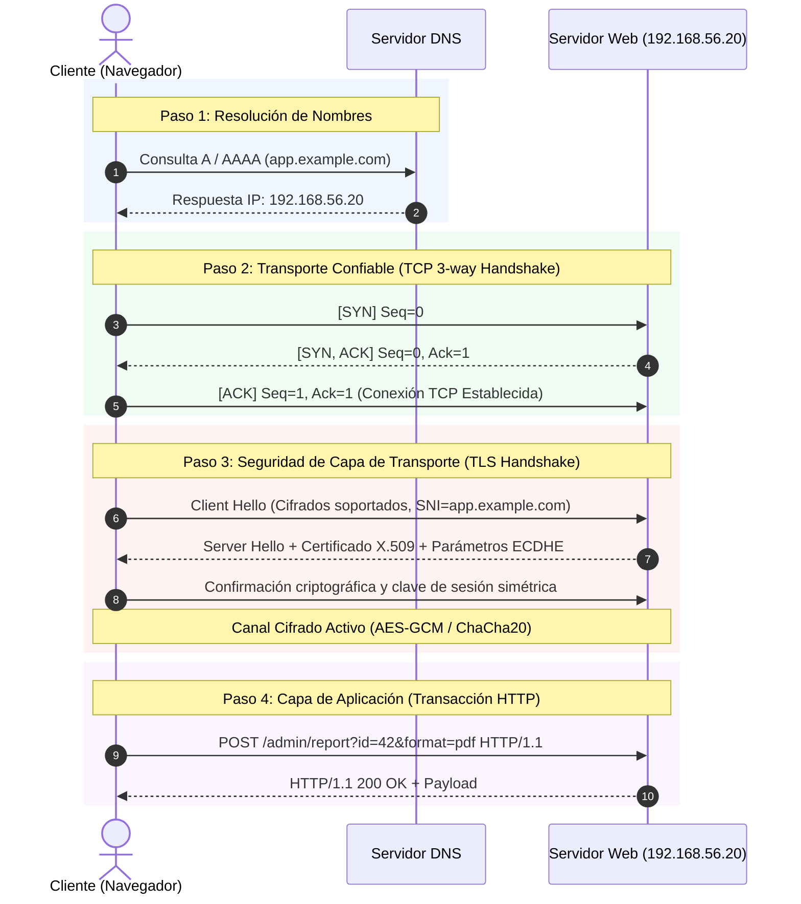
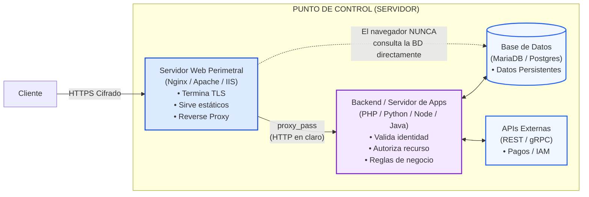
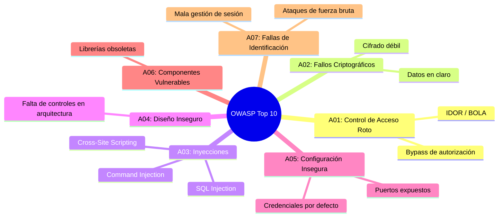

# Capítulo 01: Arquitectura Web y Protocolo HTTP

[Inicio](../../README.md) | [Pentesting Web](../README.md) | [Siguiente: Fundamentos de SQL](../02-fundamentos-sql/README.md)

| Campo | Valor |
|---|---|
| Estado | Disponible |
| Duración estimada | 3 a 4 horas |
| Nivel | Inicial |
| Modalidad | Lectura teórica exhaustiva y prácticas con terminal/DevTools |
| Prerrequisitos | Conceptos básicos de redes y manejo de terminal Linux |

---

## Objetivos de aprendizaje

Al finalizar este capítulo serás capaz de:

- Describir con rigor el modelo cliente-servidor web y justificar técnica y prácticamente por qué el navegador nunca representa una frontera de confianza (*Trust Boundary*).
- Trazar el ciclo de vida completo de una petición web a través de sus 6 estaciones didácticas: desde la resolución DNS y negociación TCP/TLS hasta la respuesta del backend.
- Desglosar los componentes de una URL según el estándar RFC 3986 e identificar vectores de ataque e inyección en cada uno de sus segmentos.
- Comprender la premisa fundamental de TLS: protege el canal en tránsito por la red, pero el backend procesa los datos en texto claro sin mitigar vulnerabilidades en capa de aplicación.
- Analizar la anatomía de mensajes de petición y respuesta HTTP, reconociendo que cada método, ruta, cabecera, cookie y cuerpo es un dato de entrada manipulable por el auditor.
- Identificar la separación de funciones entre el Servidor Web perimetral (terminación TLS, archivos estáticos, proxy inverso) y el Backend (reglas de negocio, autenticación, autorización).
- Explicar por qué el navegador jamás dialoga directamente con la base de datos y cómo el desacoplamiento previene o expone fallos de seguridad.
- Diferenciar rigurosamente entre formateo, codificación (*encoding*) y cifrado (*encryption*), evaluando su impacto real en auditorías de seguridad.
- Auditar la configuración de seguridad de las cookies de sesión (`Secure`, `HttpOnly`, `SameSite`) y cabeceras defensivas de respuesta.
- Explicar el funcionamiento de un proxy de interceptación (Burp Suite / OWASP ZAP) y el mecanismo de ruptura TLS (MitM) mediante certificados de CA local.

---

## 1. El modelo de aplicaciones web y el viaje completo de una petición

Una aplicación web moderna no es un componente de software aislado; es una arquitectura distribuida y heterogénea donde interactúan el cliente, la red pública, servidores proxy perimetrales, servicios de backend, bases de datos y microservicios externos.

Para evaluar la seguridad de una aplicación web desde la perspectiva de un pentester profesional, es imprescindible visualizar la trayectoria íntegra que recorren los datos:

### Mapa didáctico integral: Del navegador a la respuesta



> [!TIP]
> Puedes abrir el diagrama en alta resolución vectorial interactiva ([archivo SVG](./images/viaje-completo-peticion-web.svg)) o consultar la [versión rasterizada PNG](./images/viaje-completo-peticion-web.png) para descargarlo o utilizarlo como chuleta visual de consulta rápida.

---

### Las 6 estaciones del viaje de una petición web

El mapa didáctico ilustra la transacción dividida en 6 estaciones esenciales agrupadas por sus dominios de confianza:



1. **Estación 1: El Cliente y la URL**: El usuario formula su intención introduciendo una URL o haciendo clic en un enlace. El navegador descompone la URL según la RFC 3986. Al ser un entorno bajo el control total del usuario, cualquier elemento de la interfaz puede ser interceptado y alterado.
2. **Estación 2: Construcción del canal de red (DNS, TCP, TLS)**: Antes de enviar un solo byte HTTP, el sistema debe resolver la IP del dominio mediante DNS, establecer la conexión orientada a flujo TCP mediante el *3-way handshake*, y acordar un canal criptográfico mediante TLS (en HTTPS).
3. **Estación 3: La Petición HTTP**: Sobre el canal negociado viaja el mensaje HTTP estructurado (método, URI de destino, cabeceras, cookies y cuerpo). **Para el auditor, cada uno de estos campos es un vector de inyección potencial**.
4. **La Frontera de Confianza (*Trust Boundary*)**: La línea divisoria entre el entorno hostil del cliente y el entorno protegido del servidor. Todo lo que cruza esta frontera hacia la derecha debe considerarse **contaminado y potencialmente malicioso**.
5. **Estaciones 4 y 5: Servidor Web y Backend**:
   - El **Servidor Web** (Nginx, Apache, IIS) recibe la conexión, termina el cifrado TLS, sirve archivos estáticos y delega la petición dinámica al backend mediante un proxy inverso.
   - El **Backend** ejecuta la lógica de negocio, autentica al usuario, autoriza el acceso al recurso, valida que las entradas cumplan las restricciones requeridas y ejecuta transacciones contra la **Base de Datos** o **APIs Externas**.
6. **Estación 6: La Respuesta HTTP**: El backend genera los datos y el código de estado correspondiente (ej. `200 OK`), fija identificadores de sesión protegidos mediante la cabecera `Set-Cookie` y devuelve el payload a través del servidor web hacia el cliente.

---

## 2. Fronteras de confianza: El cliente no es una autoridad

Uno de los principios cardinales en la seguridad de aplicaciones web es el concepto de **frontera de confianza** (*Trust Boundary*).

```text
[ ENTORNO NO CONFIABLE ]                     [ ENTORNO CONFIABLE ]
    Navegador / Cliente                             Servidor
+--------------------------+               +--------------------------+
| - HTML / CSS             |   HTTP(S)     | - Lógica de negocio      |
| - JavaScript             | ------------> | - Autenticación          |
| - Validaciones en form   |               | - Autorización por roles |
| - Almacenamiento local   |               | - Consultas a BD         |
+--------------------------+               +--------------------------+
     (Totalmente manipulable)                     (Punto único de control)
```

> [!CAUTION]
> **Axioma de Pentesting Web (CWE-602)**: Las validaciones en el frontend existen únicamente para mejorar la experiencia de usuario (UX) reduciendo latencia ante errores tipográficos. **Nunca deben considerarse controles de seguridad**.

### Métodos de evasión de controles en el cliente

Cualquier restricción implementada en el cliente puede neutralizarse trivialmente por un atacante o auditor:

| Mecanismo en Frontend | Propósito pretendido (UX) | Técnica de bypass por el auditor |
|---|---|---|
| Atributo `maxlength="10"` | Limitar longitud de texto en `<input>` | Eliminar o editar el atributo mediante DevTools (F12) o enviar la petición vía `curl`. |
| Atributo `disabled` o `readonly` | Bloquear campos de formulario no modificables | Remover el atributo en el árbol DOM del navegador o generar la petición HTTP manualmente. |
| Validación JavaScript `checkForm()` | Verificar que el email tenga `@` o que la clave sea robusta | Desactivar JavaScript en el navegador o enviar el payload directo por Burp Suite / Repeater. |
| Campo oculto `<input type="hidden" name="price" value="100">` | Almacenar el precio del producto para enviarlo al checkout | Modificar el valor a `1` en DevTools o en el cuerpo de la petición POST interceptada. |
| Menú desplegable `<select>` con roles (`user`, `guest`) | Evitar que el usuario seleccione el rol `admin` | Inyectar `role=admin` en el cuerpo de la petición HTTP con Burp Suite. |

Por tanto: **Toda decisión crítica de seguridad (identidad, permisos sobre el recurso, precios, saldos, transacciones) debe validarse estrictamente en el backend**.

---

## 3. Anatomía de una URL (RFC 3986) y vectores de entrada

Un Localizador Uniforme de Recursos (URL) es una cadena de caracteres estructurada que define la ubicación de un recurso y el protocolo para acceder a él.

Analicemos la URL canónica presentada en nuestro mapa didáctico:

```text
https://app.example.com:8443/admin/report?id=42&format=pdf#resumen
\___/   \_____________/ \__/ \__________/ \______________/ \_____/
  |            |          |        |              |           |
Esquema       Host      Puerto    Ruta       Query String  Fragmento
```

| Componente | Ejemplo | Función técnica | Vectores de Ataque en Pentesting |
|---|---|---|---|
| **Esquema (Scheme)** | `https` | Define el protocolo de transporte (`http`, `https`, `ftp`). | Determina si el canal va cifrado con TLS (`https`) o en claro (`http`). Superficie para ataques de *SSL Stripping* y políticas de *HSTS*. |
| **Host** | `app.example.com` | FQDN o dirección IP que identifica el servidor de destino. | Determina la resolución DNS y la cabecera `Host:`. Vector de *Host Header Injection*, envenenamiento de caché web y desvío de tráfico en *Virtual Hosts*. |
| **Puerto** | `:8443` | Puerto TCP de escucha del servicio web. | Puertos no estándar (ej. 8080, 8443, 8888) suelen alojar paneles administrativos internos o APIs que eluden reglas de filtrado perimetral del WAF. |
| **Ruta (Path)** | `/admin/report` | Ubicación lógica del recurso o endpoint en el servidor. | Superficie para ataques de *Path Traversal* (`../`), enumeración de endpoints ocultos, y bypass de proxies inversos por discrepancias de normalización (`/admin/../public`). |
| **Query String** | `?id=42&format=pdf` | Conjunto de parámetros `clave=valor` separados por `&`. | **Vector primordial de inyección**: Inyección SQL (SQLi), Cross-Site Scripting (XSS), Server-Side Request Forgery (SSRF), Local File Inclusion (LFI) e IDOR. |
| **Fragmento** | `#resumen` | Marcador de posición interno procesado en el DOM; **no se envía al servidor**. | Utilizado por aplicaciones SPA para enrutamiento interno (`/#/dashboard`). Superficie para vulnerabilidades de **DOM-based XSS**. |

> [!IMPORTANT]
> **Detalle crítico sobre el fragmento (`#`)**:
> Cuando el usuario navega a `https://app.example.com/admin/report#resumen`, la petición que sale del navegador hacia el cable de red es estrictamente:
> ```http
> GET /admin/report HTTP/1.1
> Host: app.example.com
> ```
> La cadena `#resumen` es truncada por el propio navegador antes de construir el paquete HTTP. Por esta razón, una vulnerabilidad en el fragmento solo puede ser explotada en el contexto del DOM del navegador cliente (*DOM-based XSS*), jamás en el código PHP o Python del backend.

### Puertos estándar por omisión

Si una URL no especifica puerto de forma explícita:
- Para `http://`, el cliente asume por defecto el puerto **TCP 80**.
- Para `https://`, el cliente asume por defecto el puerto **TCP 443**.

---

## 4. Antes de HTTP: Construir el canal de comunicación

Antes de que un mensaje HTTP pueda transmitirse, el sistema operativo y el navegador deben establecer secuencialmente tres capas de red:



### 4.1 Resolución DNS
El sistema operativo traduce el nombre de dominio cualificado (`app.example.com`) a una dirección IP enrutable (`192.168.56.20`).
- **Riesgos de seguridad**: *DNS Spoofing*, envenenamiento de caché DNS (*DNS Cache Poisoning*) y ataques de *DNS Rebinding* para vulnerar servicios internos detrás de firewalls.

### 4.2 Establecimiento de sesión TCP (3-way Handshake)
Garantiza un flujo de bytes ordenado y fiable:
1. **`SYN`**: El cliente envía un número de secuencia inicial y solicita sincronización.
2. **`SYN-ACK`**: El servidor confirma la recepción y sincroniza su propio número de secuencia.
3. **`ACK`**: El cliente confirma. La conexión TCP queda abierta para transferir datos.

### 4.3 Negociación TLS (Transport Layer Security)
En conexiones HTTPS (puerto 443 o personalizados como 8443):
1. **Client Hello**: El cliente indica qué versiones de TLS (1.2, 1.3) y suites criptográficas soporta, además de la cabecera SNI (*Server Name Indication*).
2. **Server Hello + Certificado**: El servidor presenta su certificado digital X.509 firmado por una Autoridad de Certificación (CA) para autenticar su identidad.
3. **Establecimiento de clave**: Mediante algoritmos de curva elíptica (ECDHE), ambos extremos derivan una clave de sesión simétrica efímera (*Forward Secrecy*).

### 4.4 El gran mito de la seguridad: El rol real de TLS

> [!IMPORTANT]
> **TLS protege los datos en tránsito, pero el backend los procesa en claro**:
> El cifrado TLS impide que un atacante pasivo en la red local (cafetería Wi-Fi, proveedor de telecomunicaciones) espíe o modifique los paquetes que viajan por el cable.
> 
> Sin embargo:
> 1. El servidor web descifra el paquete al recibirlo.
> 2. El backend procesa las sentencias en texto plano.
> 3. **TLS no protege contra ninguna vulnerabilidad en capa de aplicación**: un ataque de Inyección SQL, un XSS o una falsificación de peticiones funcionará con idéntica eficacia sobre HTTPS que sobre HTTP.

---

## 5. Anatomía de los mensajes HTTP: Superficie de ataque

HTTP (Hypertext Transfer Protocol) es un protocolo de nivel de aplicación, sin estado (*stateless*). En HTTP/1.1, cada mensaje es una secuencia de texto estructurada según la RFC 9112.

### 5.1 Anatomía de una Petición HTTP

Observemos el mensaje de petición exacto extraído de nuestro mapa didáctico:

```http
POST /admin/report?id=42&format=pdf HTTP/1.1
Host: app.example.com
Content-Type: application/json
Cookie: session=q8wdC0r1; role=guest

{"action":"export","owner":42}
```

Todo mensaje de petición HTTP consta estrictamente de 4 partes:

```text
[1. LÍNEA DE PETICIÓN] -> POST /admin/report?id=42&format=pdf HTTP/1.1
                          \__/ \____________________________/ \______/
                         Método          Ruta / Query          Versión

[2. CABECERAS]         -> Host: app.example.com
                          Content-Type: application/json
                          Cookie: session=q8wdC0r1; role=guest

[3. LÍNEA EN BLANCO]   -> \r\n (CRLF obligatorio que separa cabeceras de cuerpo)

[4. CUERPO O BODY]     -> {"action":"export","owner":42}
```

> [!WARNING]
> **Aviso para el auditor**: Cada componente de este mensaje es enteramente manipulable por el usuario. **Ruta, query string, cabeceras, cookies y cuerpo son entradas no confiables**.

### 5.2 Tipos comunes de contenido en el cuerpo (`Content-Type`)

El cuerpo de una petición `POST`, `PUT` o `PATCH` puede estructurarse en múltiples formatos:

1. **`application/x-www-form-urlencoded`**:
   - Formato por defecto de los formularios HTML estándar.
   - Pares `clave=valor` delimitados por `&` con codificación de URL:
     ```http
     username=admin&password=MiClave%20Segura%21
     ```
2. **`multipart/form-data`**:
   - Empleado para la subida de archivos binarios junto con campos de texto.
   - Utiliza límites arbitrarios (*boundaries*) para separar los campos:
     ```http
     --boundary123
     Content-Disposition: form-data; name="avatar"; filename="shell.php"
     Content-Type: application/x-php

     <?php system($_GET['cmd']); ?>
     --boundary123--
     ```
3. **`application/json`**:
   - Formato estándar de APIs REST y aplicaciones web modernas:
     ```http
     {"username": "admin", "role": "operator", "id": 42}
     ```

---

## 6. Métodos HTTP y semántica REST

Los métodos HTTP definen la acción pretendida sobre el recurso:

| Método | Propósito estándar | ¿Seguro?* | ¿Idempotente?** | Relevancia en Auditorías de Pentesting |
|---|---|---|---|---|
| `GET` | Recuperar una representación del recurso. | **Sí** | **Sí** | Los parámetros viajan en la URL; quedan grabados en historiales del navegador, logs de servidores y proxies. |
| `POST` | Enviar datos para crear un recurso o procesar una transacción. | No | No | Formularios de autenticación, transacciones bancarias, subida de archivos. |
| `PUT` | Reemplazar íntegramente el recurso de destino. | No | **Sí** | Búsqueda de subida arbitraria de archivos ejecutables si los permisos están desprotegidos. |
| `PATCH` | Aplicar modificaciones parciales al recurso. | No | No | Manipulación de campos restringidos (ej. inyectar `{"is_admin": true}`). |
| `DELETE` | Eliminar el recurso identificado por la URL. | No | **Sí** | Pruebas de control de acceso roto (eliminar registros de otros usuarios sin autorización). |
| `OPTIONS` | Consultar los métodos de comunicación permitidos. | **Sí** | **Sí** | Auditoría de cabeceras de política CORS (`Access-Control-Allow-*`) y enumeración de verbos activos. |
| `HEAD` | Idéntico a `GET`, pero sin devolver cuerpo en la respuesta. | **Sí** | **Sí** | Comprobaciones rápidas de existencia de archivos sin transferir la carga útil. |

> [!NOTE]
> - **Método seguro**: Su ejecución no debe causar modificaciones colaterales en el estado de los recursos del servidor.
> - **Método idempotente**: Ejecutar la misma petición idéntica $N$ veces consecutivas deja el sistema en el mismo estado exacto que ejecutarla una sola vez.

---

## 7. Entorno del Servidor: Servidor Web vs Backend

Dentro del entorno del servidor conviven diferentes capas de software con responsabilidades estrictamente diferenciadas:



### 7.1 El Servidor Web (Nginx, Apache, IIS)
- **Termina TLS**: Descifra los paquetes entrantes utilizando el certificado X.509 y su clave privada, liberando al backend de la carga criptográfica.
- **Sirve recursos estáticos**: Entrega archivos HTML, hojas de estilo CSS, scripts JavaScript e imágenes con alto rendimiento sin invocar intérpretes dinámicos.
- **Enrutamiento y Proxy Inverso**: Inspecciona la ruta solicitada y, mediante directivas como `proxy_pass` en Nginx o `mod_proxy` en Apache, reenvía la petición al runtime de la aplicación (ej. `http://127.0.0.1:8000`).

### 7.2 Las 5 responsabilidades de seguridad del Backend

El backend (PHP, Python, Node.js, Java, Go) es el **único custodio de la seguridad**. No debe asumir nada sobre los datos que recibe. Debe cumplir rigurosamente con 5 funciones:

1. **Autenticar identidad**: Verificar que la sesión o el token criptográfico (JWT) sea auténtico, vigente y no revocado.
2. **Autorizar el recurso**: Validar si el usuario autenticado tiene derecho explícito sobre el registro solicitado (mitigación de BOLA / IDOR).
3. **Validar formato y reglas de negocio**: Comprobar tipos de datos, rangos numéricos y restricciones lógicas. Si un carrito de compras recibe `precio=0.01` desde el cliente, el backend debe rechazarlo consultando el precio real almacenado en el catálogo.
4. **Procesar la transacción**: Ejecutar las operaciones con atomicidad e integridad.
5. **Construir la respuesta**: Generar el payload resultante y fijar las cabeceras defensivas antes de retornarlo.

### 7.3 Aislamiento estricto de la Base de Datos

> [!CAUTION]
> **Premisa de Aislamiento**: **El navegador nunca dialoga directamente con la base de datos**.
> El backend actúa como intermediario obligatorio en cada operación en nombre del usuario autenticado.
> Si el backend concatena entradas del cliente directamente dentro de una consulta SQL sin utilizar sentencias preparadas (*Prepared Statements*), se produce la vulnerabilidad de **Inyección SQL (SQLi)**, permitiendo al atacante romper la mediación y tomar el control del motor de bases de datos.

### 7.4 Integración con APIs externas y microservicios
El backend frecuentemente consume servicios de terceros:
- Pasarelas de pago (Stripe, PayPal).
- Envíos de correo transaccional (SendGrid, Mailgun).
- Proveedores de identidad (IAM, OAuth2, Google, GitHub).
- **Riesgo asociado**: Si el backend realiza peticiones salientes basadas en URLs controladas por el usuario, se origina una vulnerabilidad de **Server-Side Request Forgery (SSRF)**.

---

## 8. Anatomía de una Respuesta HTTP

Cuando el servidor concluye el procesamiento de la petición, emite un mensaje de respuesta:

```http
HTTP/1.1 200 OK
Date: Fri, 04 Sep 2026 03:40:00 GMT
Server: Apache/2.4.58 (Debian)
Content-Type: application/json; charset=UTF-8
Content-Length: 38
Set-Cookie: session=XYZ123; Path=/; Secure; HttpOnly; SameSite=Strict
Connection: close

{"id":42,"report":"ready","status":"ok"}
```

Estructura de la respuesta:
1. **Línea de estado (Status Line)**: Versión del protocolo (`HTTP/1.1`), código numérico de estado (`200`) y frase descriptiva (`OK`).
2. **Cabeceras de respuesta (Response Headers)**: Metadatos técnicos, instrucciones para el navegador y directivas de seguridad.
3. **Línea en blanco (CRLF)**.
4. **Cuerpo de la respuesta (Body)**: El recurso renderizado o la carga útil serializada (HTML, JSON, imagen).

### Códigos de estado HTTP fundamentales

| Código | Significado formal | Contexto e interpretación para el Pentester |
|---|---|---|
| **`200 OK`** | Petición procesada satisfactoriamente. | Comportamiento esperado o acceso concedido. En bypasses de autenticación confirma éxito. |
| **`201 Created`** | Recurso creado exitosamente. | Típico en endpoints de registro (`POST /register`) o subidas de archivos. |
| **`301 Moved Permanently`** | Redirección permanente (`Location:`). | Utilizado comúnmente para forzar la transición de HTTP a HTTPS. |
| **`302 Found / 307 Temporary`** | Redirección temporal. | Frecuente tras un login exitoso hacia el panel de control (`/dashboard`). |
| **`400 Bad Request`** | Sintaxis mal formada en la petición. | Parámetros corruptos, payloads JSON inválidos o desincronización de cabeceras. |
| **`401 Unauthorized`** | Falta autenticación. | No se aportaron credenciales válidas; común en esquemas de autenticación HTTP Basic o Bearer. |
| **`403 Forbidden`** | Identidad conocida pero acceso denegado. | El servidor sabe quién eres pero rehúsa autorizarte. Objetivo clave en pruebas de escalada de privilegios. |
| **`404 Not Found`** | Recurso inexistente. | Guía para técnicas de fuzzing, fuerza bruta de rutas y enumeración de directorios ocultos. |
| **`500 Internal Server Error`** | Excepción no controlada en el backend. | **Señal crítica de auditoría**: Provocado con frecuencia por payloads de inyección SQL o comandos que rompen la sintaxis interna del servidor. |

---

## 9. Formato, codificación y cifrado: Distinciones críticas

Es habitual encontrar confusión entre estos tres conceptos. En pentesting, comprender con precisión su diferencia técnica es indispensable:

| Concepto | Definición técnica | ¿Garantiza confidencialidad? | ¿Requiere clave para revertirse? | Ejemplo práctico |
|---|---|---|---|---|
| **Formato** | Sintaxis para estructurar y organizar campos de datos para su intercambio entre sistemas. | No | No (es solo estructura) | `clave=valor` o `{"user": "ana"}` |
| **Codificación (Encoding)** | Representación alternativa de bytes o texto para permitir su transmisión segura por canales con restricciones de caracteres. | **No** | **No** (el algoritmo es público y reversible sin secreto) | Espacio en URL -> `%20`<br>`admin` en Base64 -> `YWRtaW4=` |
| **Cifrado (Encryption)** | Transformación matemática de un texto en claro a criptograma mediante un algoritmo y una clave criptográfica. | **Sí** | **Sí** (solo reversible si se posee la clave de descifrado) | Túnel HTTPS con TLS 1.3 (AES-GCM / ChaCha20) |

> [!IMPORTANT]
> **Regla de oro**: Codificar un dato en Base64 o en URL-encode **no oculta un secreto**. Cualquier intermediario o el propio servidor decodificará el valor instantáneamente. El cifrado TLS protege el canal en tránsito entre el cliente y el servidor, pero una vez la petición arriba al backend, el servidor procesa los datos en claro.

---

## 10. Gestión de sesiones y atributos de seguridad de cookies

Dado que el protocolo HTTP es intrínsecamente sin estado (*stateless*), el servidor no recuerda por sí mismo si una petición proviene del mismo usuario que inició sesión hace dos segundos. Para mantener la identidad a lo largo del tiempo, se emplean **cookies de sesión**.

```mermaid
sequenceDiagram
    autonumber
    actor U as Usuario (Navegador)
    participant S as Servidor Web / Backend
    U->>S: POST /login (username: ana, password: ***)
    Note over S: Valida credenciales contra BD.<br/>Genera ID de sesión criptográficamente seguro.
    S-->>U: 200 OK + Set-Cookie: session_id=A1B2C3D4; Secure; HttpOnly; SameSite=Strict
    Note over U: El navegador guarda la cookie en su almacén local protegido.
    U->>S: GET /dashboard (Cookie: session_id=A1B2C3D4)
    Note over S: Busca session_id en almacén de sesiones.<br/>Reconoce a "ana" y devuelve su panel.
```

### Atributos de seguridad de una Cookie

Cuando el servidor emite una cookie mediante la cabecera `Set-Cookie`, debe adjuntar directivas de seguridad para mitigar vectores de explotación comunes:

```http
Set-Cookie: session=XYZ123; Path=/; Domain=app.example.com; Secure; HttpOnly; SameSite=Strict
```

1. **`Secure` (CWE-614)**:
   - Instruye al navegador a transmitir la cookie **únicamente a través de conexiones cifradas mediante HTTPS**.
   - **Mitigación**: Previene la interceptación en texto claro del token de sesión por atacantes en la misma red local (ataques de *sniffing* en Wi-Fi o *SSL Stripping*).
2. **`HttpOnly` (CWE-1004)**:
   - Bloquea el acceso a la cookie desde el entorno de ejecución de scripts en el navegador (ej. `document.cookie` en JavaScript).
   - **Mitigación**: Si la aplicación sufre una vulnerabilidad de Cross-Site Scripting (XSS), el atacante podrá inyectar código JS, pero **no podrá extraer directamente la cookie de sesión**.
3. **`SameSite`**:
   - Controla si la cookie se adjunta a peticiones iniciadas desde sitios de terceros (*cross-site requests*).
   - **Valores posibles**:
     - `Strict`: La cookie jamás se envía en peticiones originadas desde un dominio externo. Máxima protección contra ataques de CSRF (*Cross-Site Request Forgery*).
     - `Lax`: La cookie se envía en navegaciones de alto nivel originadas en terceros (ej. hacer clic en un enlace externo con método `GET`), pero no en peticiones `POST` ni llamadas AJAX/`fetch`. Es el valor por defecto en navegadores modernos.
     - `None`: La cookie se envía en cualquier contexto cruzado. Requiere obligatoriamente la bandera `Secure`.
4. **`Domain` y `Path`**:
   - Restringen el alcance del navegador para enviar la cookie exclusivamente a los dominios y subrutas autorizados.

---

## 11. Proxies web e interceptación de tráfico

Un proxy es un intermediario de red que se sitúa entre el cliente y el servidor. En función de su arquitectura y propósito, se clasifican en tres modalidades:

```text
1. Forward Proxy:
   Cliente ---> [ Forward Proxy ] -------------> Internet / Servidor
   (Configurado en el cliente para salir a Internet; anonimización, filtrado corporativo)

2. Reverse Proxy:
   Cliente ---------------------------> [ Reverse Proxy ] ---> Servidor Backend
   (Situado delante de la aplicación; terminación TLS, WAF, balanceo de carga)

3. Interception Proxy (Herramienta de Pentesting):
   Navegador ---> [ Burp Suite / OWASP ZAP ] -------------> Servidor Web
   (Permite al auditor capturar, pausar, inspeccionar y modificar peticiones al vuelo)
```

### Ruptura e inspección de HTTPS: Los dos canales TLS

Bajo condiciones normales, HTTPS establece un canal cifrado de extremo a extremo que ningún intermediario puede leer ni manipular sin provocar una alerta de certificado no confiable en el navegador.

Para que un proxy de interceptación (como Burp Suite o ZAP) pueda descifrar e inspeccionar el tráfico HTTPS en un laboratorio de auditoría:

```text
CONEXIÓN NORMAL:
Navegador <=================== Un único canal TLS ===================> Servidor Web

CONEXIÓN INTERCEPTADA EN LABORATORIO:
Navegador <===== TLS 1 (Cert. CA Burp) =====> Burp Suite <===== TLS 2 (Cert. Real) =====> Servidor Web
```

1. Se genera un certificado de Autoridad de Certificación raíz local (**CA local**) en el proxy.
2. Esta CA local se instala e importa como autoridad de confianza en el almacén de certificados del navegador de pruebas.
3. Ante cada petición HTTPS:
   - El proxy negocia un túnel TLS legítimo con el servidor real (Canal TLS 2).
   - El proxy emite dinámicamente un certificado firmado por su propia CA local para el dominio solicitado y negocia un túnel TLS con el navegador (Canal TLS 1).
   - En el punto central (la suite de pruebas), el mensaje HTTP existe en texto plano, permitiendo al pentester inspeccionar cabeceras, modificar parámetros y alterar la lógica antes de retransmitirla.

> [!CAUTION]
> **Norma de seguridad operativa**: La CA local del proxy debe instalarse **únicamente en perfiles de navegador dedicados exclusivamente a pruebas de seguridad**. Jamás instales una CA de pruebas en tu navegador personal o de uso diario, ya que facultaría a cualquier proceso con acceso a esa clave privada para interceptar todo tu tráfico cifrado.

---

## 12. Mapa metodológico y mapa de riesgos (OWASP Top 10)

El proyecto **OWASP (Open Worldwide Application Security Project)** publica periódicamente el estándar de facto que categoriza los riesgos más prevalentes en aplicaciones web:



A lo largo de este recurso, abordaremos sistemáticamente cada una de estas categorías, iniciando en el siguiente capítulo con el estudio de **Bases de Datos Relacionales y SQL**, base indispensable para comprender las **Inyecciones SQL (SQLi)**.

---

## Práctica guiada: Inspección manual con cURL, OpenSSL y DevTools

Un pentester profesional debe dominar las herramientas estándar del sistema operativo antes de recurrir a suites automatizadas. En esta práctica trazaremos experimentalmente las etapas de nuestro mapa didáctico.

### Ejercicio 1: Resolución DNS manual con `dig` o `host`
Comprueba la resolución de nombres hacia el host de tu laboratorio:

```bash
dig +short app.example.com
```
O utilizando `host`:
```bash
host app.example.com
```

### Ejercicio 2: Inspección de conexión TCP y Handshake TLS con `openssl`
Verifica la negociación criptográfica y el certificado X.509 presentado por el servidor web:

```bash
openssl s_client -connect app.example.com:443 -brief
```

Observa:
- Versión de TLS acordada (`TLSv1.3` o `TLSv1.2`).
- Suite de cifrado negociada (ej. `TLS_AES_256_GCM_SHA384`).
- Validación de la cadena de confianza del certificado.

### Ejercicio 3: Inspeccionar cabeceras de respuesta con `curl -I`
El modificador `-I` (o `--head`) solicita únicamente las cabeceras HTTP emitidas por el servidor:

```bash
curl -I https://app.example.com/
```

Salida esperada (ejemplo):
```http
HTTP/1.1 200 OK
Date: Sun, 06 Sep 2026 23:30:00 GMT
Server: Apache/2.4.58 (Debian)
Content-Type: text/html; charset=UTF-8
Set-Cookie: session=XYZ123; Path=/; Secure; HttpOnly; SameSite=Strict
```

### Ejercicio 4: Observar la transacción completa en modo depuración (`curl -v`)
El modificador `-v` (*verbose*) permite visualizar el ciclo de red íntegro:

```bash
curl -v -X GET "https://app.example.com/admin/report?id=42&format=pdf"
```

Interpretación de la salida:
- Líneas con `*`: Resolución DNS, conexión TCP y apretón de manos TLS.
- Líneas con `>`: Petición HTTP transmitida por el cliente hacia el servidor.
- Líneas con `<`: Respuesta HTTP emitida por el servidor web hacia el cliente.

### Ejercicio 5: Enviar peticiones POST estructuradas en JSON con cookies
Recrea la petición HTTP de nuestro mapa didáctico directamente desde la terminal:

```bash
curl -i -X POST "https://app.example.com/admin/report?id=42&format=pdf" \
  -H "Host: app.example.com" \
  -H "Content-Type: application/json" \
  -b "session=q8wdC0r1; role=guest" \
  -d '{"action":"export","owner":42}'
```

Observa cómo `curl` te permite definir arbitrariamente cada cabecera, cookie y byte del cuerpo sin ninguna restricción del navegador.

### Ejercicio 6: Demostración del comportamiento del Fragmento (`#`) en DevTools
1. Abre tu navegador web e ingresa a las Herramientas de Desarrollador (**F12**).
2. Dirígete a la pestaña **Red (Network)** y activa la casilla **Conservar registro (Preserve log)**.
3. Navega en la barra de direcciones a:
   ```text
   https://app.example.com/admin/report?id=42&format=pdf#resumen
   ```
4. Selecciona la petición capturada en la pestaña de Red e inspecciona la pestaña **Cabeceras (Headers)**.
5. **Comprobación**: Observa que la ruta solicitada en la cabecera es estrictamente `/admin/report?id=42&format=pdf`. El fragmento `#resumen` **no aparece en la petición transmitida**.
6. Dirígete a la pestaña **Consola (Console)** y escribe:
   ```javascript
   window.location.hash
   ```
   Comprueba que el fragmento `" #resumen"` vive exclusivamente en la memoria del navegador.

### Ejercicio 7: Modificación del DOM para eludir validaciones de frontend
1. En un formulario web con un campo de texto restringido por `maxlength="5"`, haz clic derecho sobre el campo y selecciona **Inspeccionar**.
2. En la pestaña **Elementos (Elements)** de DevTools, localiza el atributo `maxlength="5"` y bórralo o cámbialo a `maxlength="500"`.
3. Introduce una cadena larga de prueba e intenta enviar el formulario.
4. **Reflexión defensiva**: Si el backend no valida la longitud en el servidor, procesará la entrada sin objeción, confirmando que las validaciones del cliente no son controles de seguridad.

---

## Preguntas de autoevaluación

1. ¿Por qué una validación implementada mediante JavaScript o atributos HTML5 en un formulario web carece de valor defensivo frente a un atacante?
2. Si un endpoint web responde con un código `401 Unauthorized`, ¿qué diferencia sustancial existe con respecto a una respuesta `403 Forbidden`?
3. ¿Por qué el fragmento de una URL (`#seccion`) no puede ser explotado para provocar una inyección SQL o una lectura de archivos en el backend?
4. Si una aplicación transmite contraseñas protegidas mediante HTTPS pero las concatena directamente en una sentencia SQL en el servidor, ¿evita el cifrado TLS la vulnerabilidad de Inyección SQL? Justifica tu respuesta.
5. Explica qué ocurriría si una aplicación web gestiona la autenticación con cookies pero omite la bandera `HttpOnly`. ¿Qué vector de ataque se ve potenciado?
6. Si un parámetro viaja en el cuerpo codificado en Base64 (`YWRtaW4=`), ¿puede afirmarse que el dato viaja seguro frente a un atacante con acceso al tráfico? Justifica tu respuesta.
7. ¿Cuál es el propósito técnico de instalar el certificado de la CA local de Burp Suite en el navegador para interceptar peticiones HTTPS?
8. ¿Qué funciones cumple el Servidor Web (Nginx/Apache) antes de que la petición alcance la lógica del Backend en una arquitectura moderna?

---

[Volver al Índice de Pentesting Web](../README.md) | [Siguiente Capítulo: Fundamentos de SQL](../02-fundamentos-sql/README.md)
